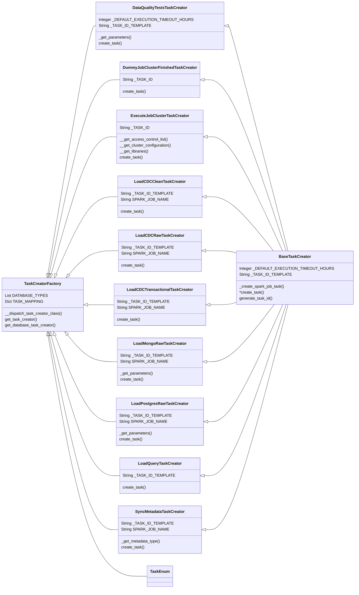
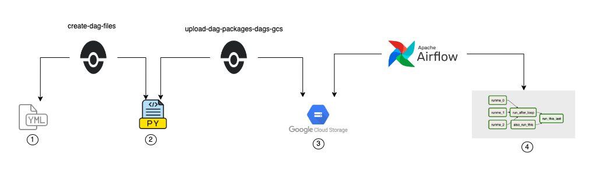

# Developer Guide Dag Builder RAW/CLEAN/ENRICH

This document aims to guide developers at any modification that the dag builder might need. In case of any doubts, please contact the [Data Ingestion team](https://groups.google.com/a/quintoandar.com.br/g/data-platform-team/members) through the  e-mail data-platform-team@quintoandar.com.br

## DAG Builder Modules

The DAG Builder is built following the factory and builder design patterns, so it's split into multiple modules, that carry single responsibilities and communicate to each other.

There are main modules - in which almost every new development or maintenance the developer will end up altering code - and auxiliary modules - with which the developer will usually interact only when deploying new settings for a specific deliver, or a whole new data lake layer.

### Main components

- `task_creator`: creates an instance of a specific Airflow Operator with the provided parameters, to be used as a task inside the DAG;
- `task_enum`: sets a list of strings to be Enums for each Task Creator;
- `task_creator_factory`: maps each TaskCreator class to its own Enum, so they can be easily retrieved and called;
- `workflow`: sets a specific combination of tasks in a DAG for a given data lake layer, defining what will be executed inside the DAG and in which order;
- `factory`: maps each Workflow class of a single layer to its own Enum, so they can be easily retrieved and called. There is only one factory for each layer;
- `dag_declaration_validator`: validates the content of the DAG declaration YAML files according to the expected content rules.

### Auxiliary components

- `factory_dispatcher`: maps each Factory class to its own Enum, so they can be easily retrieved and called. There is only one factory dispatcher in the whole DAG Builder;
- `short_circuit_functions`: sets specific switching functions to be used as the Python callable of a ShortCircuitOperator instance. These functions must have a boolean return;
- `short_circuit_function_enum`: sets a list of strings to be Enums for each ShortCircuit function;
  - `dag_yaml_parser`: returns the DAG declaration YAML file content of a specific DAG.

<details>
  <summary><strong> Task classes relationship diagram (click to view)</strong></summary>



</details>

## **Base code - main_builder/**

This folder contains the following structure:

```
bietlejuice/base/airflow/dag_builders/main_builder
├── dag_declaration
├── factories
├── short_circuit_functions
└── workflows
```

### **Dag declaration**
Is responsible for parsing [(**dag_yaml_parser.py**)](./main_builder/dag_declaration/dag_yaml_parser.py) and validating [(**dag_declaration_validator.py**)](./main_builder/dag_declaration/dag_declaration_validator.py) the dag_declaration files. The validation guarantees that mandatory parameters and datatypes will be respected in the declaration files.

In short, `DAGDeclarationValidator` defines a validation schema for the DAG declaration files and can define the following behaviors:
- Parameter data type.
- Parameter is required.
- Parameter can be empty.
- Parameter allowed values.

When creating a new parameter, ensure that it is declared in dag_declaration_validator; otherwise, it will not be accepted by the validator. Here is an example of a new parameter in the `__VALIDATION_SCHEMA`:

```
class DAGDeclarationValidator(Validator):
...

    __VALIDATION_SCHEMA = {
        ...

        "new_parameter": {
            "type": "string",
            "required": True,
            "empty": False,
            "allowed": ExampleEnum.get_available_enum_values(),
        },

        ...
    }
...
```

### **Factories**

A factory is responsible for instantiating and returning an object of a Workflow (DAG), based on parameters. Each workflow should be declared inside **`_WORKFLOW_ENUM_TO_CLASS_MAPPING`**, in order to be used in the builder.

For example, on `RawFactory`, the workflows for `Gsheets`, `DatabasePull` and `CDC` are being declared as:

```
_WORKFLOW_ENUM_TO_CLASS_MAPPING = {
    WorkflowEnum.GSHEETS_WORKFLOW: RawGsheetsWorkflow,
    WorkflowEnum.DATABASE_PULL_WORKFLOW: RawDatabasePullWorkflow,
    WorkflowEnum.CDC_WORKFLOW: RawCDCWorkflow,
}
```

Each layer has its own factory, so it will not be necessary to create new factory classes, probably. However, when creating a new workflow, you must modify the **_`WORKFLOW_ENUM_TO_CLASS_MAPPING`** variable in the layer's factory to include the new workflow.

### **Workflows**

This folder contains various types of workflows that can be used to create DAGs with the DAG builder. For now, we have implemented the following workflows: `DWQueryWorkflow`, `EnrichQueryWorkflow`, `MetricQueryWorkflow`, `RawCDCWorkflow`, `RawDatabasePullWorkflow`, `RawGsheetsWorkflow`, and `BaseWorkflow`, which is responsible for all methods that are used in multiple workflows.

The concept of Workflow is: a DAG with previously and well defined group of tasks and its dependencies. If a specific type of DAG requires a new Workflow, you can create it, add its reference on `WorkflowEnum`, and everything should work seamlessly.

### **Task Creators - [task_creators/](../task_creators/)**

The task creators represent an Airflow task instance, each with the specific purpose of creating a single task.

- **`BaseTaskCreator`**: gathers the functions that are used in other task_creators, for example "**_create_spark_job_task**", that creates a spark_job with QuintoAndarDatabricksCheckJobTaskOperator.
- **`ExecuteJobClusterTaskCreator`**: creates the execute-job-cluster task, used for all dags in the dag builder, using QuintoAndarDatabricksExecuteJobClusterOperator, based on the parameters of the dag_declaration.
- **`DummyJobClusterFinishedTaskCreator`**: creates the job-cluster-finished task, it is used to set an ending task for all dags in the dag builder

Each time a new task is needed, a task_creator should be created and its Class should be added on the `TaskCreatorFactory` and on the `TaskEnum`, so they can be referenced by the workflows.

### **DAG Execution Context**

This class is responsible for gathering all attributes that give context to the DAG execution. This includes the environment, bucket, Spark Jobs path, execution date, and the arguments received by the workflow. An instance of this class is provided to the constructor of each TaskCreator.

It includes:

- dag: default as the dag object
- environment
- bucket
- base_spark_jobs_path
- dag_args
- workflow_args
- cluster_args
- execution_date: default as the current dag execution date **{{ ds }}**


### **Table Attributes**

This class is responsible for extracting the table attributes from the dag declaration and gathering in a single class to be used in the workflows. The only parameter accepted in the TaskCreator's **create_task** method is this, specifically to avoid having too many parameters.

It includes:
- table name
- partitions
- layer
- schema
- extraction_type (full or incremental)
- table customizations


## **How to create a Workflow ?**

1. First of all, create a python file in the path:
```
bietlejuice/base/airflow/dag_builders/main_builder/workflows/<layer>_<type>_workflow.py
```

*obs: we aim to follow this name pattern for Workflows which is **\<Layer>\<Type>Workflow** (e.g. RawDatabasePullWorkflow, RawGsheetsWorkflow, EnrichQueryWorkflow)*.

2. The workflow should extend the `BaseWorkflow` class and initialize it on the init method:
```
class ExampleWorkflow(BaseWorkflow):
    def __init__(self, dag_args, workflow_args, cluster_args):
        super().__init__(dag_args, workflow_args, cluster_args)
```

**Pro-tip**: `BaseWorkflow` may contain useful methods that could be used in the Workflow. (e.g. validating the existence of Data Quality and Metadata tasks for a table, creating the DAG object, getting DAG documentation).

3. Create a **`build_dag()`** method, that will be responsible for:

    a) Creating the DAG tasks by passing the needed parameters.

    b) Setting tasks relationship and dependencies.

    c) Return the Airflow DAG object.

    This method will vary based on the workflow layer, and the following example shows how a raw/clean workflow would have implemented it:
```
 def build_dag(self):
    dag = super().dag_instance()

    bucket = self.config_service.get_config("datalake_bucket")
    dag_execution_context = self._get_dag_execution_context(dag, bucket)
    self._initialize_task_creators(dag_execution_context)

    execute_job_cluster_task = self.execute_job_cluster_task_creator.create_task()

    dummy_terminate_job_cluster_task = (
        self.dummy_job_cluster_finished_task_creator.create_task()
    )

    tables_customization = self.workflow_args["tables_customization"]
    for raw_table_name, table_parameters in tables_customization.items():
        raw_initial_task, raw_final_task = self._create_raw_tasks(
            table_name=raw_table_name,
            dummy_terminate_job_cluster_task=dummy_terminate_job_cluster_task,
        )
        execute_job_cluster_task >> raw_initial_task
        raw_final_task >> clean_initial_task
        clean_final_task >> dummy_terminate_job_cluster_task

    return dag
```

An important thing is that all dags inside the dag builder must have execute_job_cluster_task and dummy_terminate_job_cluster_task, so these first lines of code will be common to all workflows:
```
execute_job_cluster_task = self.execute_job_cluster_task_creator.create_task()

dummy_terminate_job_cluster_task = (
    self.dummy_job_cluster_finished_task_creator.create_task()
)
```

4. Initialize the task creators

Create the method **`initialize_task_creators()`**, containing the instances of execute_job_cluster and dummy_terminate_job_cluster task creators. Also, you should add the other task creators that will be used in the dag. For example:
```
def _initialize_task_creators(self, dag_execution_context: DagExecutionContext):
    task_creator_factory = TaskCreatorFactory(dag_execution_context)
    self.execute_job_cluster_task_creator = task_creator_factory.get_task_creator(
        TaskEnum.EXECUTE_JOB_CLUSTER, self.config_service
    )
    self.example_task_creator = task_creator_factory.get_task_creator(
        TaskEnum.LOAD_EXAMPLE
    )
    self.dummy_job_cluster_finished_task_creator = task_creator_factory.get_task_creator(
        TaskEnum.DUMMY_JOB_CLUSTER_FINISHED
    )
```

5. Create the method **`_create_<layer>_tasks()`** to create the tasks and set its dependencies. Altough a method of this kind is not really necessary, we have seen that this can facilitate maintainability and it helps to keep the code clean.

```
def _create_raw_tasks(self, table_name: str, dummy_terminate_job_cluster_task) -> Tuple:
    raw_table_attributes = TableAttributes(
        self.dag_args, self.workflow_args, LayerEnum.RAW, table_name
    )

    example_task_creator_task = self.example_task_creator.create_task(
        raw_table_attributes
    )

    example_task_creator_task >> dummy_terminate_job_cluster_task

    return example_task_creator_task, example_task_creator_task
```
*This is a simple example, please check the existent Workflows to see more implementations.*

**Pro-tip:** returning the first and last task from a group of tasks could be useful for set other dependencies.

**Pro-tip 2:** passing `dummy_terminate_job_cluster_task` as parameter could be useful for setting `terminate-job-task` upstream tasks.

You can do the same for any layer in the Datalake. All layers are supported in the dag builder, however, for now only `RAW`, `CLEAN` and `ENRICH` follow the guideline detailed in this README.

## How to create a Task Creator

1. Create a python file inside the directory bietlejuice/base/airflow/task_creators/ named as its resulting task. This python file will contain a Task Creator class that extends BaseTaskCreator.

2. Create e method called "create_task()" that returns an Airflow Operator that will perform the desired operation. For example:

```
from bietlejuice.base.airflow.task_creators.base_task_creator import BaseTaskCreator
from bietlejuice.base.airflow.task_creators.table_attributes import TableAttributes
from databricks_plugin import QuintoAndarDatabricksCheckJobTaskOperator


class LoadCDCRawTaskCreator(BaseTaskCreator):
    """Creates the task that loads data from the transactional layer of a Change Data Capture (CDC) pipeline into the raw layer."""

    _TASK_ID_TEMPLATE = "load-{layer}-{table_name}"
    SPARK_JOB_NAME = "load_cdc_raw"

    def create_task(
        self, table_attributes: TableAttributes
    ) -> QuintoAndarDatabricksCheckJobTaskOperator:
        task_id = self.generate_task_id(table_attributes)
        parameters = [
            self.dag_execution_context.environment,
            self.dag_execution_context.bucket,
            table_attributes.schema,
            table_attributes.table_name,
        ]

        return self._create_spark_job_task(self.SPARK_JOB_NAME, task_id, parameters)

```
This example demonstrates the creation of a QuintoAndarDatabricksCheckJobTaskOperator for loading data through a Spark job during a CDC workflow. An important aspect is that the Task Creator should always have a main function called create_task() that takes only table_attributes as a parameter. The create_task() method will override its abstract method from the BaseTaskCreator class.
The Task Creator class might include some auxiliary methods to generate the parameters that the Airflow Operator will use.

## DAG Builder deploy pipeline
In order to understand how the DAG goes from a YAML file into a DAG object, we must understand the DAG Builder deploy pipeline. The following image shows the step-by-step about the DAG Builder lifecycle:


### 1. The DAG declaration file
The DAG declaration file will be the YAML file that will contains all the informations that DAG Builder will use to construct the DAG. This file will look something like this:

```
dag:
  name: crm_test
  schedule_start_date: 2021, 2, 18
  schedule_interval: 0 0 * * *
  owner: Data Engineering
workflow:
  type: database_pull
  layer: raw
  custom_schema: crm_test
  database_type: mongo
  dbutils_secret_key: CRM_DB
  tables_customization:
    tasks:
      clean_table_name: tasks
      date_filter_column: actions.date
      partitions: [year, month, day]
      extraction_type: incremental
    taskstatushistories:
      clean_table_name: task_status_histories
      date_filter_column: history.date
      partitions: [year, month, day]
      extraction_type: incremental
    tasktitles:
      clean_table_name: task_titles
    workflows:
      clean_table_name: workflows
      date_filter_column: updated
      partitions: [year, month, day]
      extraction_type: incremental
    workgroups: {}
cluster:
  type: custom_cluster
  custom_configurations:
    driver_node_type_id: c5a.4xlarge
    node_type_id: c5a.2xlarge
    autoscale:
      max_workers: 4
      min_workers: 1
    aws_attributes:
      ebs_volume_size: 200
```

### 2. The python file
For each YML file from the previous step, there will be a Python file generated by the `create-dag-file` step on Woodpecker. It is important to highlight that all the Python files look the same, however when they are executed by Airflow, they will read the YML file based on their paths, which will be different for each DAG and will consequently generate different DAGs. The Python file will have the following responsibilities:

1. Parse the DAG Declaration YML file.
2. Call the `DAG Declaration Validator` module to validate the DAG Declaration parameters.
3. Initialize the `Factory` based on the parameters from DAG Declaration file.
4. Get the DAG `Workflow` based on the parameters from DAG Declaration file.
5. Call the `Workflow` method to build the DAG object.

The file will look like this:
```
"""
    airflow parsing enforcement

    Note: this line above forces Airflow to parse this file for implemented DAGs
"""

from os.path import basename, dirname

from bietlejuice.base.airflow.dag_builders.main_builder.dag_declaration.dag_yaml_parser import (
    DAGYamlParser,
)
from bietlejuice.base.airflow.dag_builders.main_builder.factories.factory_dispatcher import (
    FactoryDispatcher,
)
from bietlejuice.base.pipeline import LayerEnum

dag_name = basename(dirname(__file__))

# Step 1 and 2
dag_declaration = DAGYamlParser(dag_name=dag_name).dag_declaration()

# Step 3
factory = FactoryDispatcher(layer=LayerEnum(dag_declaration["workflow"]["layer"])).get_factory(
    dag_args=dag_declaration["dag"],
    workflow_args=dag_declaration["workflow"],
    cluster_args=dag_declaration["cluster"],
)

# Step 4 and 5
dag = factory.get_workflow().build_dag()

```

### 3. Google Cloud Storage
Since we are running Airflow in the Cloud Composer, which is a managed Airflow service provided by Google, our DAGs files such as dag declaration file, python file, dag artifacts (queries, data_quality, metadata), must be stored in Google Cloud Storage, in order for Airflow to access those files.

This process is done automatically by Woodpecker, in the step `upload-bi-etl-ejuice-modules-gcs-<env>`.

### 4. The DAG
The way that Airflow parses a DAG, is executing those Python files that are stored in the GCS, which in turn will be responsible for executing the steps described in `2. The Python file` and after that, Airflow recognizes the DAG object returned by the `Workflow.build_dag()` method and then parses the DAG.
