# Developer Guide - Cross-DAG orchestration with Datasets on bietlejuice

This document aims to explain how cross-DAG orchestration works at QuintoAndar, in enough detail to allow for maintenance and extension of the current implementation. If all you want is to understand how to use the feature, please refer to the [user guide](https://docs.google.com/document/d/1dfTMqxDFV00uElPONo8a85m5dhpqnfHeBKNn48Kdcb8/edit?tab=t.0#heading=h.k9vjz0xllm7w).

## Problem Statement

At QuintoAndar, we have a large number of DAGs that are interdependent. For example, DAG C may depend on the output of DAG A and B. This means that DAG C should only run after both DAG A and B have completed successfully. In order to manage these dependencies, we use [Airflow 2's Datasets feature](https://airflow.apache.org/docs/apache-airflow/2.10.4/authoring-and-scheduling/datasets.html).

Our particular usage of Datasets evolved from a previous implementation that used a custom solution made by QuintoAndar called "Mediator". Many of the concepts and patterns used in the current implementation are inspired by Mediator, but we have adapted them to use Airflow's native Datasets feature. Check out the RFC for more details on the transition from Mediator to Datasets: [RFC: Cross-DAG dependencies with Datasets](https://docs.google.com/document/d/1XLi_fbl-_NndIn7ATZPlXGajU8UOOJiyMHRgcuN8eCs/edit?tab=t.0#heading=h.20gk8wb7m9e1).

In summary, what does the solution need to do?
- Allow tasks to emit datasets (i.e., produce events) when they complete successfully.
- Allow DAGs to listen to a combination of datasets (i.e., consume events) and trigger their execution based on the availability of those datasets. On bietlejuice, the dependencies are declared in a centralized [dependencies.yaml file](../../../../dags/dependencies.yaml).
- Provide a way for a DAG to be executed without triggering datasets when necessary (e.g., for testing purposes).
- Provide a way for a DAG to forcefully and recursively update every dependent, even if the other datasets are not updated (e.g., for reprocessing purposes).
- Provide a way to trigger datasets manually (e.g., for when a task fails and we want to unblock dependent DAGs).


## What are Datasets, and how do they work?

Essentially, datasets can be thought of as events. We have a set of tasks that produce datasets (i.e., emit events), and a set of DAGs that consume those datasets (i.e., listen to a combination of events). This allows us to orchestrate the execution of DAGs based on the availability of datasets. Please refer to Airflow's documentation for more details on how Datasets work: [Airflow 2 Datasets](https://airflow.apache.org/docs/apache-airflow/2.10.4/authoring-and-scheduling/datasets.html). That entire page is worth reading, but we'll go over the most important points in the rest of this section.

We can configure tasks to produce dataset events when they complete successfully. We do this by defining their `outlets` in the task definition. For example, if we define the `outlets` parameter like this:

```python
with DAG(...):
    MyOperator(
        outlets=[Dataset("example_dataset_1")],
        ...,
    )
```

This means that when the task completes successfully, it will produce the "example_dataset_1" event. By the way, the Dataset name accepts any string that is a [valid URI](https://airflow.apache.org/docs/apache-airflow/2.10.4/authoring-and-scheduling/datasets.html#what-is-valid-uri). Airflow doesn't actually care about the URI, it just uses it as a unique identifier for the dataset.

If we use datasets directly as outlets like this, we have no way to control when the dataset event is produced. It will be produced whenever the task completes successfully, which is not always what we want. Alternatively, if we want to control which (if any) datasets will be triggered dynamically, we can pass a `DatasetAlias` to the `outlets` parameter, and use a callback function. For example:

```python
def update_datasets(*, outlet_events):
    if condition(): 
        outlet_events["example_dataset_alias_1"].add(
            Dataset("example_dataset_1"),
            extra={"key": "value"}
        )

with DAG(...):
    MyOperator(
        outlets=[DatasetAlias("example_dataset_alias_1")],
        on_success_callback=update_datasets
        ...,
    )
```

In this case, the `update_datasets` function will be called when the task completes successfully, and it will produce the "example_dataset_1" event only if the `condition()` function returns `True`. The `extra` parameter is optional and can be used to pass additional metadata about the dataset event.

The latter approach is the one we use in bietlejuice, as it allows us to control when (and which) dataset events are produced. This is particularly useful for testing purposes, where we may want to run a DAG without triggering any datasets, or for reprocessing purposes, where we want to forcefully update all dependent DAGs.

Once that is done, we can declare which datasets are dependencies of a DAG, by passing them as part of the schedule:

```python
with DAG(
    schedule=[Dataset("example_dataset_1")],
    ...,
):
```

This means that the DAG will only be triggered when the "example_dataset_1" event is produced. If we want to listen to multiple datasets, we can pass them as a list:

```python
with DAG(
    schedule=[Dataset("example_dataset_1"), Dataset("example_dataset_2"), Dataset("example_dataset_3")],
    ...,
):
```

If you do that, Airflow will only trigger the DAG when ALL of the dataset events are produced at least once since the last time the DAG was triggered. This is important to understand, as it means that if one of the datasets is not produced, the DAG will not be triggered, even if the other datasets are produced.
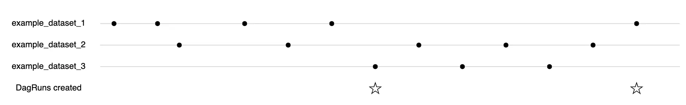

However, this behavior can be customized. Instead of passing the datasets as a list, we can also use the conditional operators "|" (OR) and "&" (AND) to create more complex logical expressions. We are essentially treating the datasets as boolean variables, which are True if the dataset has been updated since the last run, and False otherwise:

```python
with DAG(
    schedule=(Dataset("example_dataset_1") | (Dataset("example_dataset_2") & Dataset("example_dataset_3"))),
   ...,
):
```

The above example means that the DAG will be triggered if "example_dataset_1" is produced, or if both "example_dataset_2" and "example_dataset_3" are produced.

## How does bietlejuice implement Datasets?

As mentioned previously, a dataset can be named anything that is a valid URI. However, we have a convention at QuintoAndar to use the following format for dataset names:

`<dag_name>:<task_id>` or `<dag_name>:<task_id>:<optional_suffix_with_additional_context>`

Where `dag_name` is the name of the DAG that produces the dataset, and `task_id` is the ID of the task that produces the dataset. The optional suffix can be used to provide additional context about the dataset. For example, there is the suffix "first-run-of-day", which is used to indicate that the dataset was produced by the first run of the DAG on that day.

We have a [dependencies.yaml file](../../../../dags/dependencies.yaml), where we declare the dependencies between DAGs and datasets. For example:

```yaml
bietlejuice.dag_c:
  - bietlejuice.dag_a:task_1
  - bietlejuice.dag_b:task_2:first-run-of-day
```

This means that `dag_c` depends on the dataset produced by `task_1` of `dag_a`, and the dataset produced by `task_2` of `dag_b` with the suffix "first-run-of-day". When both datasets are produced, `dag_c` will be triggered. We also support more complex dependencies with logical operators, described in [this section](#declaring-dependencies-with-logical-operators-in-the-dependenciesyaml-file).

In order for these declared dependencies to work, two things need to happen:
- The tasks must produce the datasets.
- The DAGs must be configured to listen to the datasets.
Let's see how this is done in practice.

### Producing datasets in tasks

We have a class called [DatasetAdder](./dataset_adder.py), which has a static method called `attach_dataset_to_task`. This method receives an instance of an operator, and configures it to produce the dataset correctly by:
- Adding a DatasetAlias to the `outlets` parameter of the operator. The alias is named `<dag_id>:<task_id>:alias`.
- Adding a callback function to the `on_success_callback` parameter of the operator, which will produce the dataset event when the task completes successfully. The callback function is defined in the `update_datasets` method of the [DatasetService](../../../services/dataset_service.py) class.
- Adding a button to trigger the dataset manually. This is further detailed in the [Triggering datasets manually](#triggering-datasets-manually) section.

Therefore, in order to produce a dataset in a task, we need to call the `DatasetAdder.attach_dataset_to_task` method, passing the operator instance as an argument. This needs to be done for every task that can be used as a dependency.

Luckily, on bietlejuice all DAGs that use the [DAG Builder](https://docs.google.com/document/d/1zq5_S0M9FuExHKsujpow6HqZxkzgSubQlDLaSOiwXCQ/edit?tab=t.0#heading=h.1evgk02ab0bb) use an implementation of [BaseTaskCreator](../task_creators/base_task_creator.py). In one of its methods (_create_spark_job_task), we have the following code:

```python
        if task_id.startswith("load-"):
            dataset_adder.DatasetAdder.attach_dataset_to_task(operator)
```
Which means that all load tasks in the DAG Builder will automatically produce datasets when they complete successfully. This solves most of our use cases, except:
- Gsheet ingestions, which have "done-" tasks instead of "load-" tasks. The [RawGsheetsWorkflow class](../dag_builders/main_builder/workflows/raw_gsheets_workflow.py) was modified to call `DatasetAdder.attach_dataset_to_task` for the "done-" tasks.
- DAGs that do not use the DAG Builder. If they at least use DatalakeTaskGroup, DwTaskGroup or ReverseTaskGroup, those have also been modified to call `DatasetAdder.attach_dataset_to_task`.

If your DAG does not use any of these, you will need to call `DatasetAdder.attach_dataset_to_task` manually for each task that should produce a dataset.

#### And what does the `update_datasets` callback method do?
- First, it checks if the current task has already produced a dataset event in a previous run. If it has, it does nothing. This means that if someone clears a task instance that has already finished successfully, the dataset will not be produced again.
- Then, it checks the type of DAG run. This will be explained in more detail in the [Types of DAG run](#types-of-dag-run) section, but in summary, there are three types of DAG runs: Test Run, Impact Downstream Dependents, and Reprocessing Run. The callback will behave differently depending on the type of run.
    - If the run is a Test Run, it will not produce any dataset events, and will simply return. This is useful for testing purposes, where we want to run a DAG without triggering any datasets.
    - If the run is an Impact Downstream Dependents run, it will produce the dataset event corresponding to the task that just finished. For example, the task `task_1` of `dag_a` will produce the dataset `dag_a:task_1`. Additionally, it will check the XCOMs to determine if it is the first time this task is running today. If it is, it will also produce the dataset with the suffix "first-run-of-day" (e.g., `dag_a:task1:first-run-of-day`). This is useful for DAGs that are scheduled to run multiple times a day, but we want to trigger dependent DAGs only once per day.
    - If the run is a Reprocessing Run, it will only produce a dataset event with the suffix "reprocessing" (e.g., `dag_a:task_1:reprocessing`). This is useful for reprocessing purposes, where we want to forcefully update all dependent DAGs immediately and recursively, regardless of whether the other datasets are updated or not. This will be explained in more detail in the [Reprocessing Run](#reprocessing-run---this-will-trigger-the-entire-downstream-pipeline-from-this-dag) section.
- Finally, it will update the XCOMs informing the start date, which will allow future runs to determine if it is the ":first-run-of-day" or not.

### Configuring DAGs to listen to datasets

As mentioned previously, all of our dependencies are declared in a centralized [dependencies.yaml file](../../../../dags/dependencies.yaml). Let's say we have the following entry in the file:

```yaml
bietlejuice.dag_c:
  - bietlejuice.dag_a:task_1
  - bietlejuice.dag_b:task_2:first-run-of-day
```

The schedule of bietlejuice.dag_c needs to receive an object that represents the combination of the dependencies. The simplest thing to do would have been to read the dependencies.yaml file while the DAG is being parsed and convert this entry to a list of datasets, like this:

```python
with DAG(
    schedule=[Dataset("bietlejuice.dag_a:task_1"), Dataset("bietlejuice.dag_b:task_2:first-run-of-day")],
   ...,
):
```

However, this has three problems:
1. What if we need to reprocess dag_a and trigger all of its dependents, even if dag_b is not updated? We would trigger dag_a with a [reprocessing run](#reprocessing-run---this-will-trigger-the-entire-downstream-pipeline-from-this-dag), which will produce the dataset `bietlejuice.dag_a:task_1:reprocessing`. We can acommodate that using logical expressions, like this:
```python
with DAG(
    schedule=(
        (
            Dataset("bietlejuice.dag_a:task_1") &
            Dataset("bietlejuice.dag_b:task_2:first-run-of-day")
        ) |
        (
            Dataset("bietlejuice.dag_a:task_1:reprocessing") |
            Dataset("bietlejuice.dag_b:task_2:reprocessing")
        )
    ),
   ...,
):
```
This DAG will be triggered if both datasets are produced, or if either of them is produced with the "reprocessing" suffix.

2. We wouldn't be able to use logical operators in the dependencies.yaml file. What if we want to have a complex dependency like this?

```yaml
bietlejuice.dag_c:
  any:
    - bietlejuice.dag_a:task_1
    - bietlejuice.dag_b:task_2:first-run-of-day
    - all:
      - bietlejuice.dag_d:task_3
      - bietlejuice.dag_e:task_4
```

We need something that parses this YAML and converts it to this dataset expression:

```python
with DAG(
    schedule=(
        (
            Dataset("bietlejuice.dag_a:task_1") |
            Dataset("bietlejuice.dag_b:task_2:first-run-of-day") |
            (
                Dataset("bietlejuice.dag_d:task_3") &
                Dataset("bietlejuice.dag_e:task_4")
            )
        ) |
        (
            Dataset("bietlejuice.dag_a:task_1:reprocessing") |
            Dataset("bietlejuice.dag_b:task_2:reprocessing") |
            Dataset("bietlejuice.dag_d:task_3:reprocessing") |
            Dataset("bietlejuice.dag_e:task_4:reprocessing")
        )
    ),
   ...,
):
```
This DAG would be triggered if the logical expression provided in the dependencies.yaml file evaluates to True, or if any of them is produced with the "reprocessing" suffix. These logical expressions are more detailed in the [next section](#declaring-dependencies-with-logical-operators-in-the-dependenciesyaml-file).

3. The dependencies.yaml file is huge. It takes several seconds to read it and parse it into a dataset object. If we were to do this while the DAG is being parsed, for each DAG, it would be terribly inefficient for the scheduler, since we have hundreds of DAGs with dependencies.

Instead, we take advantage of the DAG Builder to use a different approach. The DAG Builder is essentially a [script](../../../../scripts/ci_cd/airflow_dag_builder/create_dag_files.py) that executes on the CI/CD to generate Python files for each DAG based on a [template](../../../../scripts/ci_cd/airflow_dag_builder/__dags_template__.py) and configuration files. We can use this script to read the dependencies.yaml file a single time and generate the DAG files with the correct schedule, without having to read the file while the DAG is being parsed.

This is what the template looks like (without imports):

```python
datasets = {datasets}
dag_name = basename(dirname(__file__))
dag_declaration = DAGYamlParser(dag_name=dag_name).dag_declaration()
factory = FactoryDispatcher(layer=LayerEnum(dag_declaration["workflow"]["layer"])).get_factory(
    dag_args=dag_declaration["dag"],
    workflow_args=dag_declaration["workflow"],
    cluster_args=dag_declaration["cluster"],
    dataset_dependencies=datasets,
)
dag = factory.get_workflow().build_dag()
```

Notice how we have a placeholder `{datasets}` that will be replaced by the dataset expression generated from the dependencies.yaml file. Let's see an example. These are the dependencies of bietlejuice.enrich_chatbot:
```yaml
bietlejuice.enrich_chatbot:
  - bietlejuice.amplitude_new:load-clean-events
  - bietlejuice.chat_fup:load-clean-rating
  - bietlejuice.copilot_service:load-clean-message:first-run-of-day
  - bietlejuice.copilot_service:load-clean-session:first-run-of-day
  - bietlejuice.enrich_customer_support:load-enrich-tickets
  - bietlejuice.sauron:load-clean-session
```

And this is the Python file generated by the DAG Builder for this DAG:

```python
datasets = (
  (
    Dataset("bietlejuice.amplitude_new:load-clean-events") &
    Dataset("bietlejuice.chat_fup:load-clean-rating") &
    Dataset("bietlejuice.copilot_service:load-clean-message:first-run-of-day") &
    Dataset("bietlejuice.copilot_service:load-clean-session:first-run-of-day") &
    Dataset("bietlejuice.enrich_customer_support:load-enrich-tickets") &
    Dataset("bietlejuice.sauron:load-clean-session")
  ) |
  (
    Dataset("bietlejuice.amplitude_new:load-clean-events:reprocessing") |
    Dataset("bietlejuice.chat_fup:load-clean-rating:reprocessing") |
    Dataset("bietlejuice.copilot_service:load-clean-session:reprocessing") |
    Dataset("bietlejuice.copilot_service:load-clean-message:reprocessing") |
    Dataset("bietlejuice.enrich_customer_support:load-enrich-tickets:reprocessing")
  )
)
dag_name = basename(dirname(__file__))
dag_declaration = DAGYamlParser(dag_name=dag_name).dag_declaration()
factory = FactoryDispatcher(layer=LayerEnum(dag_declaration["workflow"]["layer"])).get_factory(
    dag_args=dag_declaration["dag"],
    workflow_args=dag_declaration["workflow"],
    cluster_args=dag_declaration["cluster"],
    dataset_dependencies=datasets,
)
dag = factory.get_workflow().build_dag()
```

Let's break down what happens here:
- The [create_dag_files.py script](../../../../scripts/ci_cd/airflow_dag_builder/create_dag_files.py) reads the dependencies.yaml file.
- For each DAG that is being generated, it will:
    1. Retrieve the declared dependencies.
    2. Identify which dependencies are redundant, using [RedundantDependencyFinder](../../dependencies/bietlejuice_redundant_dependency_finder.py). A dependency is considered redundant if it is already covered by another dependency. For example, if `bietlejuice.sauron:load-clean-session` is already covered by `bietlejuice.enrich_customer_support:load-enrich-tickets`, then the former is redundant. It is useful to remove redundant dependencies from the section with the ":reprocessing" suffix, otherwise a reprocessing run would trigger the DAG multiple times unnecessarily.
    3. Call the method `get_dag_datasets_from_dependencies` of the [DatasetService](../../../services/dataset_service.py) class, passing the dependencies and the redundant dependencies. This method will parse the dependencies and convert them into a dataset expression, using the [DatasetParser class](./dataset_parser.py).
    4. At this point, the dataset expression is an object. In order to insert it into the template, we need to convert it to a string. This is done by using the [DatasetEncoder class](./dataset_encoder.py), which receives the object and generates Python code that represents the dataset expression. This is what the `{datasets}` placeholder will be replaced with in the template.

The datasets object on the template is passed all the way to [BaseWorkflow](../dag_builders/main_builder/workflows/base_workflow.py), where it is used to set the `schedule` parameter of the DAG (as long as the DAG does not have a cron schedule).

Attention: this mechanism only applies for DAGs in the DAG Builder. If you are creating a DAG manually, you will need to set the `schedule` parameter of the DAG to the dataset expression explicitly. This is how you can do it:
```python
with DAG(
    dag_id=DAG_ID,
    schedule=DatasetService.get_dag_datasets(DAG_ID),
    ...,
):
```

### Declaring dependencies with logical operators in the dependencies.yaml file
As mentioned previously, if you define a list of dependencies in the dependencies.yaml file:
```yaml
bietlejuice.dag_c:
  - bietlejuice.dag_a:task_1
  - bietlejuice.dag_b:task_2:first-run-of-day
```
Airflow will only trigger the DAG when ALL of the datasets have been updated. It's equivalent to using the AND operator (&) between the datasets. However, our parser also supports more complex logical expressions, using the `any` and `all` keywords. The `any` keyword means that at least one of the dependencies must be updated, while the `all` keyword means that all of the dependencies must be updated. The parser will convert these keywords into the corresponding logical operators in the dataset expression.

They can be nested, and used in combination with each other. For example, the following dependencies.yaml entry:

```yaml
bietlejuice.dag_c:
  any:
    - bietlejuice.dag_a:task_1
    - bietlejuice.dag_b:task_2:first-run-of-day
    - all:
      - bietlejuice.dag_d:task_3
      - bietlejuice.dag_e:task_4
```
Will be converted to the following dataset expression:
```python
(
    Dataset("bietlejuice.dag_a:task_1") |
    Dataset("bietlejuice.dag_b:task_2:first-run-of-day") |
    (
        Dataset("bietlejuice.dag_d:task_3") &
        Dataset("bietlejuice.dag_e:task_4")
    )
)
```
The DAG will run if this expression evaluates to True, meaning that at least one of the datasets `bietlejuice.dag_a:task_1` or `bietlejuice.dag_b:task_2:first-run-of-day` is updated, or both `bietlejuice.dag_d:task_3` and `bietlejuice.dag_e:task_4` are updated. It will also run if any of the datasets is updated with the "reprocessing" suffix, as explained in the [Reprocessing Run](#reprocessing-run---this-will-trigger-the-entire-downstream-pipeline-from-this-dag) section.

## How datasets deal with dates - execution date, logical date, data interval start, data interval end, load_start_date, load_end_date?
At QuintoAndar, many of our DAGs are incremental, meaning that they only process data for a specific date or date range. Here are some typical filters you might find in our queries:

```sql
WHERE
    year = {year}
    AND month = {month}
    AND day = {day}
```
Or, for date ranges:

```sql
WHERE
    date BETWEEN '{load_start_date}' AND '{load_end_date}'
```

`{year}`, `{month}`, `{day}`, `{load_start_date}` and `{load_end_date}` are templates replaced by our Pyspark jobs with the correct values. And these values come from Airflow. Specifically, they come from the DAG run's **data_interval_start**. Here is how `{load_start_date}` and `{load_end_date}` are defined in [BaseWorkflow](../dag_builders/main_builder/workflows/base_workflow.py):

```python
load_start_date = "{{ get_date_param(dag_run, data_interval_start | ds, 'load_start_date') }}"
load_end_date = "{{ get_date_param(dag_run, data_interval_start | ds, 'load_end_date') }}"
```

This means that, unless someone manually sets `load_start_date` and `load_end_date` in the DAG run configuration (check the [DAG Trigger form](#dag-trigger-form) section), they will be set to `data_interval_start | ds`, which is the data_interval_start in the format `YYYY-MM-DD`. And `{year}`, `{month}`, and `{day}` are derived from the same place.

But why data_interval_start? Why not logical_date (a.k.a., execution_date from Airflow 1)? Well, before we migrated from Mediator to Datasets, we used to use logical_date as the date for incremental loads. And it made a lot of sense, because in scheduled DAGs the logical date is the start of the interval that the DAG is processing. For example, if a DAG runs daily, the logical date is D-1. If the DAG runs weekly, the logical date is D-7, and so on. So it was natural to use logical_date as the date for incremental loads.

However, when migrating to Datasets, the logical date stops making sense. When a DAG is triggered by a dataset, Airflow sets the logical date to the current timestamp. Even if the dataset had a D-1 logical date, the dependent will have D0 as its logical date. This would cause the DAG to apply the incorrect filter. Therefore, we should not use logical_date or any of its variations (like `{{ execution_date }}`, `{{ ds }}`, `{{ next_ds }}` or `{{ prev_ds}}`) anymore.

Instead, data_interval_start makes a lot more sense, because Airflow propagates it forward when triggering DAGs based on datasets. This means that if a DAG is triggered by a dataset event that originated in a DAG with a D-1 data_interval_start, the dependent's data_interval_start will also be D-1, and the filters will work as expected.

What if there are multiple datasets? In that case, Airflow will use the earliest data_interval_start among all datasets. For example, if the data_interval_start of dataset A is D-1 and the data_interval_start of dataset B is D-2, the dependent DAG will have a data_interval_start of D-2. This means that the filters will still work as expected, because the earliest date will be used.

Notice, however, that we are not using data_interval_end. data_interval_end makes a lot of sense too, since Airflow chooses the latest data_interval_end among all datasets. The reason we're not using it is because it was easier to migrate from Mediator like this. Since we just had to replace logical_date with data_interval_start. We still need to take some time to consider the consequences of using data_interval_end, and whether it would make sense to use it in some cases. For now, we are not using it.

## How the dataset event queue works
There is one more internal mechanism of datasets that is very important to understand: the dataset event queue. To simplify, we can say that every DAG that consumes datasets has its own queue.

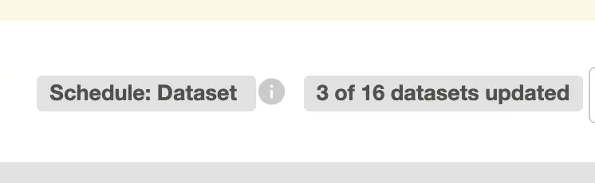

When a dataset event happens, **AND** the DAG is configured to listen to that dataset, the event is added to the queue. The scheduler will then check the queue to see if the dataset expression is satisfied, which would mean that the DAG can be triggered. If it is, the scheduler will trigger the DAG run.

Notice the emphasis on "AND". This means that an event only enters the queue if the DAG was already configured to listen to that dataset when the event happened. For example, if an event is emitted at 9AM, and then at 10AM the DAG is configured to listen to that dataset, the event will not be added to the queue retroactively. Only events from that point on will be added to the queue. Similarly, if we create a new DAG that listens to datasets, it will only start receiving events from the moment it is created.

**HOWEVER**, the queue is only used to determine when the DAG can be triggered. On the previous section, we explained how Airflow uses the dataset events to determine the data_interval_start, right? Well, it DOES NOT USE THE QUEUE for that. Apologies for the uppercase, but this is very important to understand. Airflow uses a different logic to query the dataset events and eventually determine the data_interval_start: it will select all dataset events that happened since the last time the DAG was triggered via datasets.

Let's review our example:

- Day 1:
    - 8AM: DAG B is triggered via datasets.
    - 9AM: "dag_a:task_1" dataset is emitted by a DAG run with data_interval_start = "2025-01-01".
    - 10AM: DAG B is configured to listen to "dag_a:task_1". The event from 9AM will not enter the queue, because the DAG was not listening to the dataset when the event happened. It does not mean there are no consequences, as we will see in the next day.
- Day 2:
    - 9AM: "dag_a:task_1" dataset is emitted by a DAG run with data_interval_start = "2025-01-02".
    - 9AM: the event enters the queue, and causes DAG B to be triggered.

Q: What is the data_interval_start of the DAG B run on day 2?

A: It is "2025-01-01"!!! The event from day 1 actually had an impact on day 2. Even though it was not in the queue, the event happened (at 9AM on day 1) since the last time B ran (which was 8 AM on day 1), and therefore it is considered when determining the data_interval_start of the DAG B run on day 2.

This can have severe consequences. For example, many of our DAGs at QuintoAndar are D-1, and configured to process a single day. If an event from a previous day leads to a wrong data_interval_start, the DAG will process the wrong day, and propagate the error downstream. This actually happened when datasets were first introduced:

- On July 1st 2025:
    1. Several DAGs executed normally, triggered by datasets.
    2. A DAG called "bietlejuice.amplitude_new" executed, emitting its datasets with data_interval_start = "2025-06-30".
    3. Those datasets were configured to be dependencies of all of those DAGs. The previous events didn't enter the queue, so they won't affect the trigger time of the DAGs.
- On July 2nd 2025:
    1. The DAG "bietlejuice.amplitude_new" executed again, emitting its datasets with data_interval_start = "2025-07-01".
    2. The dependent DAGs listened to the event, and were triggered at the correct time. However, since the event from the previous day was taken into account, the data_interval_start of the DAG runs was set to "2025-06-30" (D-2), instead of what we expected, which was "2025-07-01" (D-1). This date propagated to the entire pipeline, causing several DAGs to process the wrong day, and leading to a lot of confusion and errors.

In order to avoid this, we had to quickly submit a [solution](https://github.com/quintoandar/bi-etl-ejuice/pull/19525): a DAG called `reset_datasets`, which erases all dataset events from the database right before midnight UTC. Of course, this is not great, since we're losing the history, and making it impossible to create DAGs that depend on events from previous day. But since our prevailing use cases are daily or intraday, it helps ensure that events from one day don't affect following days.

## Mechanisms to operate the solution

### Types of DAG run
[Previously](#and-what-does-the-update_datasets-callback-method-do), we mentioned that there are three types of DAG runs: Test Run, Impact Downstream Dependents, and Reprocessing Run. Each of them affects the callback function differently as to which (if any) datasets will be produced. Let's go over them in detail.

#### DAG Trigger form
First of all, how do users choose which type of run they want?

They do it using the DAG Trigger form, which is a form that appears when the user clicks on the "Trigger DAG w/ config" button in the Airflow UI.

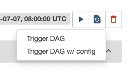

This is what it looks like:

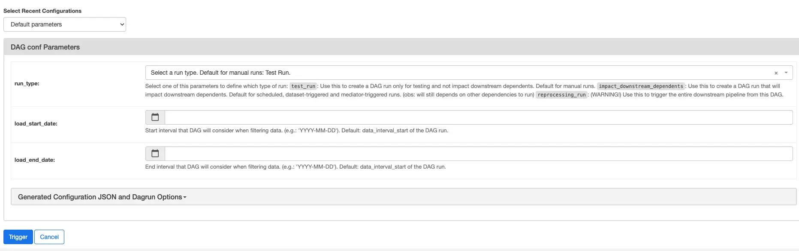

The form has a dropdown to choose the type of run. The options are:
- "Test Run - choose this to avoid impacting any dependents."
- "Impact Downstream Dependents"
- "Reprocessing Run - this will trigger the entire downstream pipeline from this DAG!"

Additionally, it has two date fields: "load_start_date" and "load_end_date". These fields are optional, and if they are not filled, the values will be set to the data_interval_start of the DAG run. This means that if the DAG is scheduled to run daily, the load start date will be set to D-1, and the load end date will be set to D-1 as well.

The trigger form is implemented in [BaseDAG.get_default_trigger_form_params](../../airflow/base_dag.py). DAGs in the DAG Builder were configured to use the trigger form on [BaseWorkflow](../dag_builders/main_builder/workflows/base_workflow.py), and DAGs that were not in the Builder at the time of the migration to datasets were also manually configured to do so.

Now, let's explain the purpose and mechanisms of each type of run.

#### Test Run - choose this to avoid impacting any dependents.
As the name suggests, this is the type of run that has zero impact downstream. It is useful to test something without worrying about dependents. This is the default option when someone triggers the DAG manually.

Its mechanism is pretty simple: the `update_datasets` callback function will not produce any dataset events, and will simply return. This means that no datasets will be emitted, and no dependent DAGs will be triggered.

#### Impact Downstream Dependents
This is the default type for scheduled or dataset-triggered DAGs. It is also the type of run that is triggered when the user selects "Impact Downstream Dependents" in the trigger form.

It does what you would expect: if the task is named `task_1` of `dag_a`, it will produce the dataset `dag_a:task_1` when the task completes successfully. If it is the first run of the day, it will also produce the dataset with the suffix "first-run-of-day" (e.g., `dag_a:task_1:first-run-of-day`).

If there is a DAG that depends on this dataset, the event will enter the queue. If it still needs to wait for other dependencies, it will keep waiting. Otherwise, the dependent DAG will be triggered.

#### Reprocessing Run - this will trigger the entire downstream pipeline from this DAG!
This is the most complicated one. You would choose this to forcefully update all dependent DAGs immediately and recursively.

Let's say the entire pipeline executed successfully. However, you later notice that the data is off. Maybe some of it is duplicated or missing. You want to fix the problem and reprocess everyone that depends on this DAG, directly or indirectly. This is what the reprocessing run is for.

When you trigger a DAG with this type of run, the `update_datasets` callback function will only produce a dataset event with the suffix "reprocessing" (e.g., `dag_a:task_1:reprocessing`). This means that it will not produce the regular dataset events, and it will not check if it is the first run of the day. It will simply produce the reprocessing event, which will trigger all dependent DAGs immediately and recursively. How?

In a [previous section](#configuring-dags-to-listen-to-datasets), we explained that the following entry on the dependencies.yaml file:

```yaml
bietlejuice.dag_c:
  - bietlejuice.dag_a:task_1
  - bietlejuice.dag_b:task_2:first-run-of-day
```

Would be converted to the following dataset expression:

```python
(
    (
        Dataset("bietlejuice.dag_a:task_1") &
        Dataset("bietlejuice.dag_b:task_2:first-run-of-day")
    ) |
    (
        Dataset("bietlejuice.dag_a:task_1:reprocessing") |
        Dataset("bietlejuice.dag_b:task_2:reprocessing")
    )
)
```

It's enough for any dataset to be produced with the "reprocessing" suffix, and the DAG will be triggered. This means that if `dag_a:task_1:reprocessing` is produced, the DAG will be triggered, regardless of whether `dag_b:task_2:first-run-of-day` is produced or not. This is how we can forcefully update all dependent DAGs immediately.

But we also want to do it recursively. If someone depends on dag_c, we also want it to run. And so on, affecting all direct and indirect dependents. In order to do that, the `update_datasets` callback function will check if the current DAG run was triggered by a ":reprocessing" dataset. If it was, the current run will also be considered a reprocessing run, even if it wasn't manually marked as such.
```python
    @classmethod
    def is_reprocessing_run(cls, context: Context) -> bool:
        """Check if the DAG run is a reprocessing or if the event that triggered the DAG was a reprocessing."""
        
        # Manually marked as reprocessing when the DAG was triggered
        run_type = cls._get_run_type(context)
        if run_type == DagRunTypeEnum.REPROCESSING_RUN:
            return True

        for triggering_event_name in context.get("triggering_dataset_events", {}):
            # If a reprocessing event caused this DAG to trigger, this DAG should also be marked as reprocessing
            if triggering_event_name.endswith(":reprocessing"):
                return True
        return False
```

One more thing worth explaining: if you check the code of the callback function, you will see that we use the **extra** argument when producing the ":reprocessing" dataset. The extra receives two arguments: "reprocessing_source" and "reprocessing_date". The former is useful to identify where the reprocessing originated from, and to prevent unnecessary retriggers (explained further in the section [Reprocessing guard](#reprocessing-guard-how-we-make-sure-reprocessings-dont-retrigger-dags-multiple-times)). The latter is used to make sure that a reprocessing that originated today won't continue until tomorrow. The ":reprocessing" datasets will only be triggered if the reprocessing date is today.

```python
context["outlet_events"][dataset_alias].add(
    Dataset(f"{dataset_name}:reprocessing"),
    extra={
        "reprocessing_source": DatasetService.find_reprocessing_source(
            context
        ),
        "reprocessing_date": reprocessing_date,
    },
)
```


### Triggering datasets manually
Let's say a DAG is taking too long to run. Or maybe it failed, and we want to allow the dependent DAGs to run anyway. Simply marking the task as success doesn't work, because Airflow won't run the success callback function. Instead, we can do that by triggering a dataset event manually.

Airflow actually provides a way to do that in the UI, by accessing "/datasets?uri=<dataset_uri>"
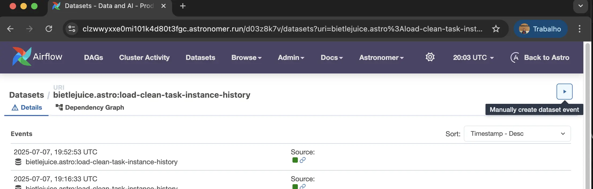

However, if you do that, the data_interval_start will be set to the current timestamp. It provides no way to change that. Since for most of our DAGs the data_interval_start is crucial for the filters to work, we needed a way to trigger datasets manually with a custom data_interval_start.

Because of that, we implemented a DAG called `bietlejuice.trigger_datasets`. The trigger form of this DAG allows you to inform a dag_id, task_id, and run_id.

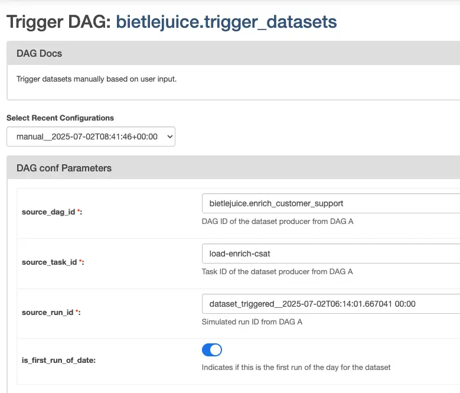

Once you do that and trigger it, this DAG will create a dataset event as if it had been emitted by that task instance. Therefore, it will use the data_interval_start of the DAG run that you specified.

In order to do that, the DAG calls this function:
```python
dataset_manager.register_dataset_change(
    task_instance=TaskInstanceKey(
        dag_id=source_dag_id,
        task_id=source_task_id,
        run_id=source_run_id,
    ),
    dataset=Dataset(uri),
    extra=extra,
    session=session,
    source_alias_names={alias_uri},
)
```
That's exactly what Airflow itself does when a task produces a dataset.

Additionally, we implemented a [plugin on Beethoven](https://github.com/quintoandar/beethoven/blob/main/airflow/plugins/extra_link_plugin/dataset_trigger_link_plugin/dataset_trigger_link.py) that adds a button to the task instance view called "Trigger Dataset Event". If you click the button, it will open `bietlejuice.trigger_datasets` with the dag_id, task_id, and run_id pre-filled.

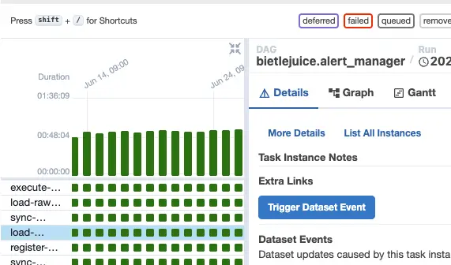

This button is added to every task that produces datasets by the `DatasetAdder.attach_dataset_to_task` method, which we explained in the [Producing datasets in tasks](#producing-datasets-in-tasks) section.

## Additional information worth mentioning

### Reprocessing guard (how we make sure reprocessings don't retrigger DAGs multiple times)
Let's imagine a scenario where we have five DAGs: `dag_a`, `dag_b`, `dag_c`, `dag_d`, and `dag_e`. And let's say `dag_b` and `dag_c` both depend on `dag_a`, and `dag_e` depends on `dag_b`, `dag_c` and `dag_d`.

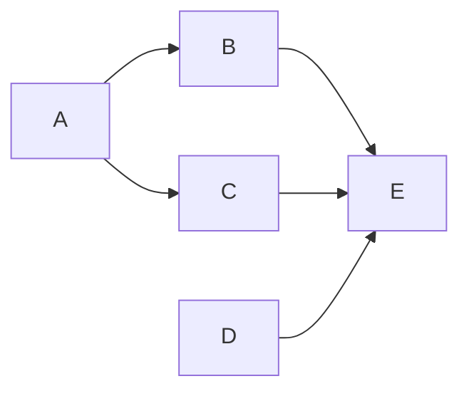

The dependencies are as follows:

```yaml
dag_b:
  - dag_a:task_1
dag_c:
  - dag_a:task_1
dag_e:
  - dag_b:task_1
  - dag_c:task_1
  - dag_d:task_1
```

What happens when we trigger `dag_a` with a reprocessing_run?
- `dag_a` will produce the dataset `dag_a:task_1:reprocessing`.
- both `dag_b` and `dag_c` will be triggered, because they listen to `dag_a:task_1:reprocessing`.
- one of them will finish first, let's say `dag_b`. It will produce the dataset `dag_b:task_1:reprocessing`.
- `dag_d` will be triggered, because it listens to `dag_b:task_1:reprocessing`.
- then `dag_c` will finish, producing the dataset `dag_c:task_1:reprocessing`.
- `dag_d` will be triggered again, because it listens to `dag_c:task_1:reprocessing`.

Therefore, it's possible for a DAG to be triggered multiple times due to a single reprocessing run. This effect can be multiplied over and over, leading to an explosion of triggers. To prevent this, we implemented something we call the **reprocessing guard**.

Every DAG with dataset dependencies has a task at the beginning called `reprocessing-guard`, whose logic is implemented [here](../task_creators/reprocessing_guard_task_creator.py). This task is an instance of the ShortCircuitOperator (i.e., a task that decides whether to continue the DAG run or skip everything else). Its goal is to skip runs that would be unnecessary, avoiding retriggers caused by a single reprocessing run.

More accurately, this task identifies the source of the reprocessing (in that example, it would be `dag_a`). Then, it calculates which dependencies of the current DAG would be triggered as a result of that source (in that example, `dag_b` and `dag_c` depend on `dag_a`, so both will run). If one of them still hasn't finished, it will skip the current DAG run. Only when all of the dependencies have finished, it will allow the DAG run to continue.

Notice that, in the example, `dag_d` is not a dependency of `dag_a`, directly or indirectly. Therefore, the reprocessing-guard won't wait for `dag_d`. It will only wait for `dag_b` and `dag_c`.

Here's how it works:
1. First of all, check if the run is a reprocessing run. If it is not, just let the DAG run normally. Also, if the reprocessing originated in the current DAG (i.e., it was manually triggered), we also let the DAG run normally.
2. Find the source of the reprocessing, by accessing the “extra" parameter of the dataset event.
3. Identify all dependencies of the current DAG that depend on the source, directly or indirectly.
4. Check XCOMs, which will list all reprocessing datasets that had already finished for that source.
5. Check if all dependencies identified on step 3 have already finished – that is, they either triggered this run or they were listed in the XCOMs.
 - If all dependencies that should have finished have already finished, let the DAG run continue. We can also clear the XCOMs.
 - If we still need to wait for any dependencies, update the XCOMs with the dataset that triggered this run.

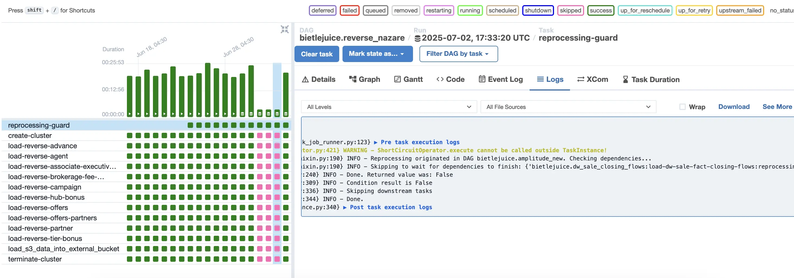

On the image above, we can see that `reverse_nazare` would have been triggered four times unnecessarily. Instead, the reprocessing guard identified that it should skip the first 3 times (to wait for the dependencies).

Here is what the XCOM of the third skipped run looks like:

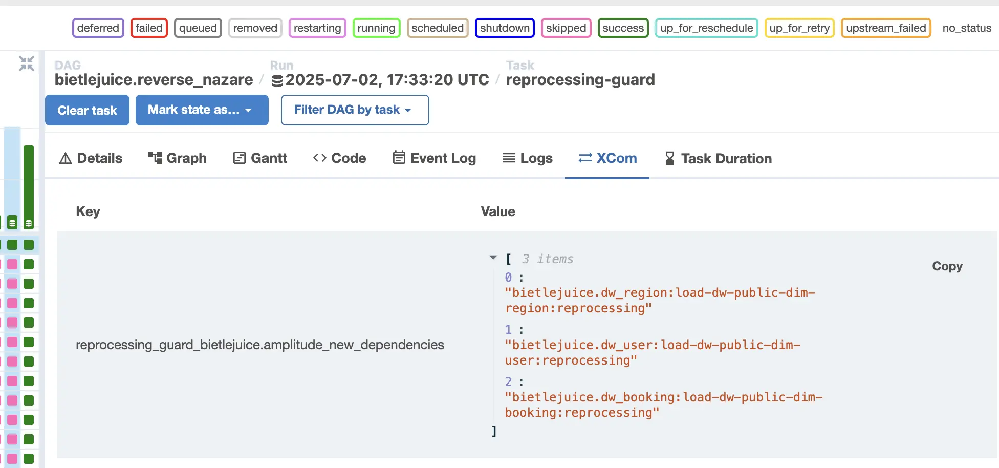

- It is named `reprocessing_guard_<source_dag_id>_dependencies`. In this case, since the reprocessing originated in `bietlejuice.amplitude_new`, the XCOM is named `reprocessing_guard_bietlejuice.amplitude_new_dependencies`. The XCOM includes the source DAG ID to make it possible to deal with multiple reprocessings simultaneously.
- The value is a list of all dataset dependencies of `reverse_nazare` that depend on `bietlejuice.amplitude_new`, directly or indirectly, and had already finished. On the next run, it will check if the dataset that triggered it + all of these datasets on the XCOMs are enough to let the DAG run continue.

The reprocessing guard can be added before the first task of the DAG by calling `DatasetAdder.attach_reprocessing_guard`. On the DAG Builder, this is done in every workflow except the raw/clean layer (which doesn't have dependencies). We also added it to the DAGs that were not in the DAG Builder at the time of the migration to datasets, so that they can benefit from the reprocessing guard as well. For new DAGs outside of the DAG Builder, you must call `DatasetAdder.attach_reprocessing_guard` manually in order to add the reprocessing guard task.

### Behavior of the data_interval_start when you trigger a DAG manually
When you manually trigger a DAG that is not scheduled by time, the data_interval_start will be the same as the logical date of the DAG run. Therefore, if you want to reprocess data with data_interval_start = D-1, you need to set the logical date to D-1 as well. You can do this on the DAG trigger form:
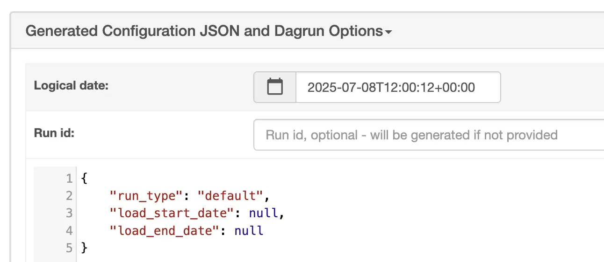

This is especially important for reprocessing runs, because the data_interval_start is the value that will be propagated to the dependent DAGs. NOT the load_start_date.

However, something different happens if you manually trigger a DAG that is scheduled by time. It's important to understand that scheduled DAGs work with data intervals, which are defined by the schedule. For example, if a DAG runs daily at 3AM. The interval will be from 3AM of the previous day to 3AM of the current day, because it has to process the last 24h since the last time the DAG ran. If a DAG runs weekly on Monday at 10AM, the data interval starts on the previous Monday at 10AM, and ends on the current Monday at 10AM.

When you manually trigger a scheduled DAG, Airflow will set the data_interval_start to the start of the last completed data interval before the logical date. Let's go through some examples to clarify this:

**Example 1:**

We have a DAG that runs daily at 3AM. And we trigger a DAG run manually on 2025-01-02 at 10AM. The logical date of the DAG run will be 2025-01-02 10:00:00, and the data_interval_start will be set to 2025-01-01 03:00:00 (the start of the last completed data interval).

**Example 2:**

We have a DAG that runs daily at 3AM. And we trigger a DAG run manually on 2025-01-02 at 1AM. The logical date of the DAG run will be 2025-01-02 01:00:00, and the data_interval_start will be set to 2024-12-31 03:00:00 (the start of the last completed data interval).

### Alerts of events that should not be in the dataset event queue, and how to clear them

Most of our DAGs are supposed to be D-1. And usually, we don't want an event older than D-1 to enter the dataset event queue. If it does, the DAG might trigger at the wrong time, and with an incorrect data_interval_start.

This can happen for several reasons, such as:
- A DAG has multiple dependencies, but one of them did not run. On the next day, the events from the DAGs that did finish will persist on the queue.
- One of the dependencies executed after the DAG had already been triggered. The event from that dependency will persist on the queue until the following day.

For now, this is not a problem, because of the `reset_datasets` DAG explained in the [How the dataset event queue works](#how-the-dataset-event-queue-works) section. That DAG erases all dataset events from the database right before midnight UTC, preventing the queue from being filled with old events. However, we don't want to rely on that forever, since it would be useful in some cases to have the history of dataset events, and to be able to create DAGs that depend on events from previous days.

Before we created `reset_datasets`, we had thought of this problem. And to deal with it, we created a DAG called `airflow.check_dags_dataset_queue`, which used to run a few times at the end of the day. This DAG would check if there were any dataset events in the queue, and if so, it would send an alert to GChat on a private channel.

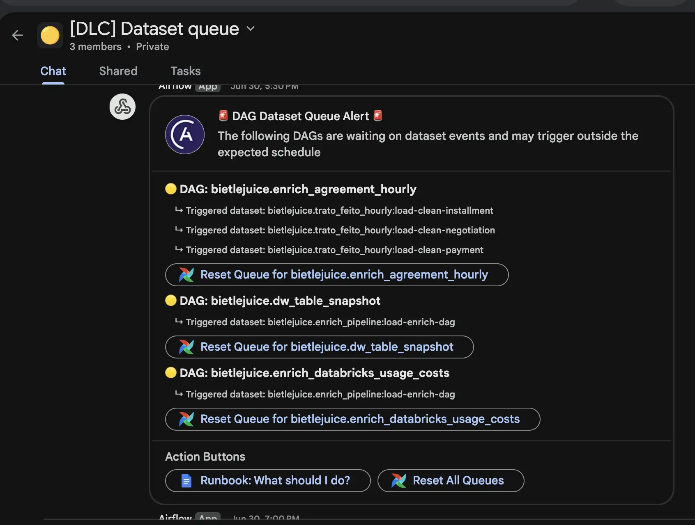

By clicking the "Reset Queue" button, the user would be redirected to the trigger form of the DAG `airflow.clear_dataset_queue`, pre-filled with the DAG ID. The user could then trigger the DAG, which would clear the dataset event queue for that DAG. Additionally, it would create a dataset-triggered DAG run marked as success, so that Airflow would only take into account events from that point on to determine the data_interval_start of the next DAG run (explained previously [here](#how-the-dataset-event-queue-works)).

If we had this mechanism, why did we have to implement `reset_datasets`? Because the `airflow.check_dags_dataset_queue` DAG only alerting about events in the queue, which is not enough to prevent an event from one day to impact the data_interval_start of the next day. As mentioned previously, Airflow doesn't use the queue to determine the data_interval_start, but rather the dataset events that happened since the last time the DAG was triggered.

**Next steps**

We want to stop using `reset_datasets`, in order to avoid deleting dataset events from the database. In order to do that, we will need to improve the alerts from `airflow.check_dags_dataset_queue`, so that they can detect dataset events that were triggered since the last time the DAG was triggered, and not just the ones in the queue. This way, we can alert about events that should not be there, and allow users to clear them manually using `airflow.clear_dataset_queue`.