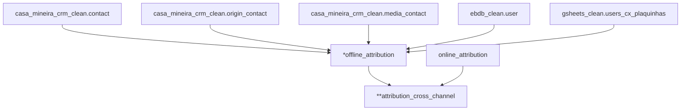

## Enrich Tracked Events

### Purpose
Prepare and make available event data with the correct attribution of touch-points.

[Here](https://docs.google.com/presentation/d/1hMn14Zbgp4ntAcpBDtXX97zWixefCpFBo5SdpH_234g/edit#slide=id.g124fe06d010_0_0) you can find more context about the project to reduce lost tracking metrics.

​

<strong> > DAG details (click to expand)</strong>

### Atention Points

* The current Casa Mineira's system will be deprecated and replaced by a new system under construction. It will be necessary to store the historical data and consume from the new tables.

### Execution Interval

Daily. More information about run time [here]({chart_url}{dag_id}).

### Outputs

Currently, there is the following output table in our enrich layer:

-`datalake_tracked_events.offline_attribution`
-`datalake_tracked_events.attribution_cross_channel`

### Additional Information

- Offline Attribution Table
The offline assignment table aims to record the events that happen through Secretaria and CX offline touch-points and perform Booking assignment to the last offline touch-point.

It's basically composed of events from the old Casa Mineira CRM system, events from gsheets with historical data from plaquinhas `datalake_gsheets_clean.users_cx_plaquinhas`  and events from the CX team considering the filter by exclusive CX phones numbers for plaquinhas contacts.

- Attribution Cross Channel Table
The Attribution Cross table contains the correct attribution of the event (Booking and Offer) considering the 3 sources (amplitude (web), app and Offline).

It consolidates events from all channels by joining the online_attribution and offline_attribution tables. The final output is all of a user's touchpoints over time specifying the last touchpoints before conversion

