# Union CDC — UnionDB (DMS/CDC Ingestion)

## About Union

**Union (UnionDB)** is a legacy real-estate management CRM/ERP used by real-estate agencies and
brokers to manage their property portfolio, clients, and lead intake. It covers property listings
(sale/rent), the client registry (landlords, tenants, guarantors, buyers), lead capture from the
company's own website and from classified-ad portals (VivaReal, ZAP, ImovelWeb, Casa Mineira, and
others), portal syndication configuration, and a listing quality-assurance (QA) subsystem.

This DAG (`union_cdc`) ingests Union's operational database into the datalake via **AWS DMS
change-data-capture (CDC)**: DMS streams row-level changes as Parquet files into
`s3://ingestao-dados-union/union/<table>/`, one prefix per source table. The DAG's `raw` layer loads
these files 1:1 (deduped by primary key, keeping the latest `event_timestamp` per key), and the
`clean` layer applies the transformations documented per table below (column renaming to repository
naming conventions and to English, FK resolution to `id_*`, dropping DMS control columns from the
final shape).

Two categories of source columns are deliberately **not** propagated to the clean layer:

- **Credentials** — passwords, API tokens, and refresh tokens (e.g. `clientes.senha`,
  `pool_flex.senha`, `pool_flex.unionsenha`, `pool_flex.token`, `pool_flex.refresh_token`). Secrets
  must not be persisted in the datalake. Read them from the source system if an integration ever
  needs them.
- **Columns with unconfirmed semantics** — e.g. `clientes.conjuge`, a numeric column whose meaning
  could not be confirmed with the product owners and which has no analytical use case today.

## DAG overview

| | |
|---|---|
| **DAG name** | `union_cdc` |
| **Owner** | Data Atlas DB |
| **Workflow type** | `dms_cdc` |
| **Schedule** | `0 11 * * *` (daily, 11:00 UTC) |
| **Source bucket** | `s3://ingestao-dados-union/union/` (`union_bucket`) |
| **Raw database** | `datalake_union_cdc_raw` |
| **Clean database** | `datalake_union_cdc_clean` |

## Entity-relationship diagram

Column names use the **clean layer** naming (`datalake_union_cdc_clean`). `company`, `house`, and
`client` are wide legacy tables (300+ columns) — only PKs, FKs, and a handful of representative
attributes are shown here; see the [Tables](#tables) section and the per-table `metadata/clean/*.yml`
for the full column list.

The `qa_*` tables identify the property in **two key spaces that are not interchangeable**, so the clean
layer keeps them under distinct names to make an accidental cross-space join impossible to write by
mistake:

| Column | Key space | Source columns | Present in |
|---|---|---|---|
| `id_house` | Legacy UnionDB house key — joins to `house.id_house` | `fkimovel` | `qa_house`, `qa_listing_clients` |
| `id_house_api` | House key as exposed by the UnionDB API — **not** QuintoAndar's house id and **not** `house.id_house` | `houseId`, `id_imovel_qa` | `qa_house`, `qa_listing`, `qa_listing_images`, `qa_listing_clients` |

> **Do not join `id_house_api` against `house.id_house` (or against any `id_house` column).** The two
> spaces overlap numerically but mean different things, so the join silently returns wrong matches
> instead of failing. `qa_house` and `qa_listing_clients` carry both keys, so use either one to
> translate from `house` to `qa_listing` / `qa_listing_images`, which expose only the API key.

```mermaid
erDiagram
    company ||--o{ house : "id_company"
    company ||--o{ client : "id_company"
    company ||--o{ photos : "id_company"
    company ||--o{ site_leads : "id_company"
    company ||--o{ imovelweb_leads : "id_company"
    company ||--o{ casamineira_leads : "id_company"
    company ||--o{ portal_leads : "id_company"
    company ||--o{ pool_flex : "id_company"
    company ||--o{ qa_house : "id_company"
    company ||--o{ qa_listing_clients : "id_company"
    company ||--o{ site_messages : "id_company"
    company ||--o{ portal_messages : "id_company"
    house ||--o| house_2 : "id_house"
    house ||--o{ photos : "id_house"
    house ||--o{ site_leads : "id_house"
    house ||--o{ imovelweb_leads : "id_house"
    house ||--o{ casamineira_leads : "id_house"
    house ||--o{ qa_house : "id_house"
    house ||--o{ qa_listing_clients : "id_house"
    house ||--o{ site_messages : "id_house"
    house ||--o{ portal_messages : "id_house"
    qa_listing ||--o{ qa_listing_images : "id_house_api"
    qa_listing ||--o{ qa_listing_clients : "id_house_api"
    qa_listing ||--o{ qa_house : "id_house_api"
    client ||--o{ site_leads : "id_client"
    client ||--o{ site_messages : "id_client"
    client ||--o{ portal_messages : "id_client"
    portal ||--o{ vivareal_zap_leads : "id_portal"
    portal ||--o{ portal_leads : "id_portal"
    portal ||--o{ portal_messages : "id_portal"
    pool_flex ||--o{ portal : "id_pool_flex"

    company {
        bigint id_company PK
        string nome
        string nome_fantasia
        bigint id_onboarding FK
        boolean ativo
    }

    house {
        bigint id_house PK
        bigint id_company FK
        bigint id_codcli "FK to client.id_client (legacy name)"
        bigint id_captador
        string cap_anoconstru
    }

    house_2 {
        bigint id_house_2 PK
        bigint id_house FK
        string bloco
        string apto
        string andar
    }

    photos {
        bigint id_photo PK
        bigint id_company FK
        bigint id_house FK
        string arqfoto
        int ordem
        boolean fotosel
    }

    client {
        bigint id_client PK "codcli"
        bigint id_company FK
        bigint id_broker FK
        string name
        string tax_id
        boolean is_landlord
        boolean is_tenant
        boolean is_guarantor
    }

    portal {
        bigint id_portal PK
        bigint id_network FK
        bigint id_pool_flex FK
        string name
        string website
        string email
        timestamp dt_paratime
    }

    site_leads {
        bigint id_site_lead PK "codigo"
        bigint id_company FK
        bigint id_house FK
        bigint id_client FK
        string name
        string email
        string phone
        string status
    }

    vivareal_zap_leads {
        bigint id_vivareal_zap_lead PK
        bigint id_portal FK
        string origin_lead_id
        string name
        string email
        string phone
        string status
    }

    imovelweb_leads {
        bigint id_imovelweb_lead PK "codigo"
        bigint id_company FK
        bigint id_house FK
        string name
        string email
        string phone
        string status
    }

    casamineira_leads {
        bigint id_casamineira_lead PK "codigo"
        bigint id_company FK
        bigint id_house FK
        string name
        string email
        string phone
    }

    portal_leads {
        bigint id_portal_lead PK "codigo"
        bigint id_company FK
        bigint id_portal FK
        string name
        string email
        string phone
        string status
    }

    pool_flex {
        bigint id_pool_flex PK "codigo"
        bigint id_company FK
        string pool_code
        string ftp_host
        boolean is_active
        boolean is_suspended
    }

    qa_house {
        bigint id_qa_house PK "codigo"
        bigint id_company FK
        bigint id_house FK
        bigint id_house_api FK "id_imovel_qa"
        string uuid_qa_house
        string status
    }

    qa_listing {
        bigint id_qa_listing PK "id"
        bigint id_house_api FK "houseId"
        string house_type
        string house_finality
        decimal sale_price
        decimal rent_price
        int bedrooms
    }

    qa_listing_images {
        bigint id_qa_listing_image PK "id"
        bigint id_house_api FK "houseId"
        string url
        string url_thumb
        int display_order
        boolean is_main
    }

    qa_listing_clients {
        bigint id_qa_listing_client PK "id"
        bigint id_company FK
        bigint id_house FK "legacy fkimovel"
        bigint id_house_api FK "houseId"
        boolean is_active_db
    }

    site_messages {
        bigint id_site_message PK
        bigint id_house FK
        bigint id_company FK
        bigint id_client FK
        bigint id_user FK
        bigint id_broker FK
        string name
        string message
    }

    portal_messages {
        bigint id_portal_message PK
        bigint id_house FK
        bigint id_company FK
        bigint id_portal FK
        bigint id_client FK
        bigint id_lead FK
        string name
        string message
    }
```

## Tables

### `company`

Real-estate agencies and individual brokers/agents registered in UnionDB. Key dimension table
referenced by nearly every other table in the pipeline (`id_company`). Pre-existing table, not part
of this ingestion expansion — see `metadata/clean/company.yml` for the full ~360-column list.

| Column | Notes |
|---|---|
| `id_company` | **PK** |
| `id_onboarding` | FK — onboarding process/stage |
| `nome` | Company/broker display name |
| `ativo` | Active flag |

---

### `house`

Main fact table for property listings (sale/rent) in UnionDB — location, characteristics, pricing,
amenities, and operational details. Pre-existing table, not part of this ingestion expansion — see
`metadata/clean/house.yml` for the full ~330-column list.

| Column | Notes |
|---|---|
| `id_house` | **PK** |
| `id_company` | FK → `company` |
| `id_codcli` | FK → `client.id_client` (legacy source name `fk_codcli`, not renamed to avoid touching pre-existing files) |
| `id_captador` | FK — acquiring/capturing agent |
| `id_increase_group` | FK — price-increase adjustment category |
| `id_currency` | FK — pricing currency |

---

### `house_2`

Supplementary property attributes extending `house` 1:1 (building specs, guarantee/security info,
negotiation details). Pre-existing table — see `metadata/clean/house_2.yml` for the full column list.

| Column | Notes |
|---|---|
| `id_house_2` | **PK** |
| `id_house` | FK → `house`, 1:1 |

---

### `photos`

Property photo metadata — file paths, ordering, and links back to the property and company.
Pre-existing table — see `metadata/clean/photos.yml` for the full column list.

| Column | Type | Notes |
|---|---|---|
| `id_photo` | bigint | **PK** |
| `id_company` | bigint | FK → `company` |
| `id_house` | bigint | FK → `house` |
| `referencia_imovel` | string | Property reference code |
| `descricao` | string | Photo description |
| `arqfoto` | string | Photo file name |
| `fotosel` | boolean | Selected flag |
| `ordem` | int | Display order |
| `minia` | string | Thumbnail file name |
| `tipo` | string | Photo type |
| `flagdesk` | boolean | Desktop-use flag |
| `dt_paratime` | timestamp | Source CDC control timestamp |
| `codigo_importacao` | string | Import tracking code |

---

### `portal`

Catalog of real-estate classified-ad portals (VivaReal, ZAP, ImovelWeb, etc.) integrated with
UnionDB — small dimension table used to resolve portal FKs on lead/message tables.

| Column | Type | Notes |
|---|---|---|
| `id_portal` | bigint | **PK** |
| `id_network` | bigint | FK — real-estate network (rede) grouping |
| `id_pool_flex` | bigint | FK → `pool_flex` — publishing configuration |
| `name` | string | Portal name (e.g. VivaReal, ZAP, ImovelWeb) |
| `website` | string | Portal website URL |
| `email` | string | Contact email |
| `account_owner` | string | Relationship owner |
| `dt_paratime` | timestamp | Source CDC control timestamp |

---

### `client`

Customer/contact registry — individuals and legal entities acting as landlords, tenants,
guarantors, buyers, sellers, or suppliers. Main dimension referenced by houses, leads, and message
tables. **Primary key** is `codcli`.

| Column | Notes |
|---|---|
| `id_client` | **PK** (`codcli`) |
| `id_company` | FK → `company` |
| `id_broker` | FK — assigned broker/agent |
| `name`, `normalized_name`, `nickname` | Name, normalized name, nickname |
| `address`, `neighborhood`, `city`, `state`, `zip_code` | Residential address |
| `tax_id`, `person_type` | Tax ID, individual/legal-entity flag |
| `phone_1`, `phone_2`, `mobile_phone`, `email` | Contact channels |
| `is_landlord`, `is_tenant`, `is_guarantor`, `is_beneficiary`, `is_supplier`, `is_seller` | Role flags |
| `income_1`, `income_2` | Declared income |
| `bank_code`, `branch_number`, `account_number` | Banking details |
| `dt_registered`, `dt_updated`, `dt_birth`, `dt_last_contact` | Key dates |

Full ~110-column list (address, banking, Uniloc role flags, etc.) is in `metadata/clean/client.yml`.

---

### `site_leads`

Contact-form submissions on the company's own website about a specific property (as opposed to a
classified-ad portal). One row per inquiry. **Primary key** is `codigo`, confirmed with the product owners
as the identifying column of the source table — `pkmensagem` is unpopulated here and does not identify
the row.

| Column | Type | Notes |
|---|---|---|
| `id_site_lead` | bigint | **PK** (`codigo`) |
| `id_company` | bigint | FK → `company` |
| `id_house` | bigint | FK → `house` |
| `id_client` | bigint | FK → `client` |
| `message_template_id` | bigint | Legacy template column (`pkmensagem`), constant/unpopulated |
| `property_reference` | string | Property reference code |
| `name`, `email`, `phone_area_code`, `phone` | Contact details of the inquirer |
| `message`, `reply` | Message and reply text |
| `ip_address` | string | Submission IP |
| `is_seasonal_rental`, `guest_count`, `dt_check_in`, `dt_check_out` | Seasonal-rental inquiry fields |
| `status` | tinyint | Processing status |
| `dt_registered` | date | Lead capture date |

---

### `vivareal_zap_leads`

Leads from the VivaReal/ZAP Imóveis classified-ad portal integration API. One row per lead event.
`pklead` was verified unique in the sampled partition (auto-detected primary key).

| Column | Type | Notes |
|---|---|---|
| `id_vivareal_zap_lead` | bigint | **PK** (`pklead`) |
| `id_portal` | bigint | FK → `portal` |
| `id_portal_client` | bigint | Client code on the portal side |
| `client_listing_id`, `origin_listing_id` | string | Listing IDs on the client/portal side |
| `origin_lead_id` | string | Lead ID assigned by the portal |
| `lead_origin` | string | Sub-channel/campaign origin |
| `name`, `email`, `phone_area_code`, `phone`, `phone_number` | Contact details of the inquirer |
| `message` | string | Free-text message |
| `status` | tinyint | Processing status |
| `ts_lead_received` | timestamp | Portal-reported submission time |
| `dt_paratime` | timestamp | Source CDC control timestamp |

---

### `imovelweb_leads`

Leads from the ImovelWeb classified-ad portal integration. One row per inquiry/contact event.
**Primary key** is `codigo`.

| Column | Type | Notes |
|---|---|---|
| `id_imovelweb_lead` | bigint | **PK** (`codigo`) |
| `id_company` | bigint | FK → `company` |
| `id_house` | bigint | FK → `house` |
| `id_portal_client`, `id_portal_lead` | bigint | Portal-side identifiers |
| `property_description` | string | Free-text property reference |
| `name`, `email`, `phone_area_code`, `phone`, `message` | Contact details (translated from the Spanish-language source fields) |
| `event_type` | string | Contact-event type |
| `json_payload` | string | Raw lead payload from the portal API |
| `status` | tinyint | Processing status |
| `dt_lead` | date | Lead received date |

---

### `casamineira_leads`

Leads from the Casa Mineira classified-ad portal integration. Same structure as
`imovelweb_leads`. **Primary key** is `codigo`.

| Column | Type | Notes |
|---|---|---|
| `id_casamineira_lead` | bigint | **PK** (`codigo`) |
| `id_company` | bigint | FK → `company` |
| `id_house` | bigint | FK → `house` |
| `id_portal_client`, `id_portal_lead` | bigint | Portal-side identifiers |
| `property_description` | string | Free-text property reference |
| `name`, `email`, `phone_area_code`, `phone`, `message` | Contact details (translated from the Spanish-language source fields) |
| `event_type` | string | Contact-event type |
| `json_payload` | string | Raw lead payload from the portal API |
| `dt_lead` | date | Lead received date |

---

### `portal_leads`

Leads from generic/aggregated classified-ad portal integrations (excluding VivaReal/ZAP, ImovelWeb,
and Casa Mineira, which have dedicated tables above). **Primary key** is `codigo` — the two
`pk`-prefixed columns on this table (`pk_portal_mensagem`, `pk_emails_leads_portais2`) were both
constant/unpopulated in the sampled partition.

| Column | Type | Notes |
|---|---|---|
| `id_portal_lead` | bigint | **PK** (`codigo`) |
| `id_company` | bigint | FK → `company` |
| `id_portal` | bigint | FK → `portal` |
| `portal_message_template_id`, `portal_leads_email_template_id` | bigint | Legacy template columns, constant/unpopulated |
| `name`, `email`, `phone_area_code`, `phone` | Contact details of the inquirer |
| `message` | string | Free-text message |
| `import_code` | int | Import tracking code |
| `reference_info` | string | Reference info supplied with the lead |
| `status` | tinyint | Processing status |
| `dt_lead`, `dt_registered` | date | Lead and record dates |

---

### `pool_flex`

Per-company, per-portal publishing/integration configuration ("pool flex") used to syndicate
listings to classified-ad portals — FTP/API credentials, portal-side client codes, feature flags,
and inventory counters. Grain: one row per company/portal integration setup. **Primary key** is
`codigo`.

| Column | Notes |
|---|---|
| `id_pool_flex` | **PK** (`codigo`) |
| `id_company` | FK → `company` |
| `id_user` | Portal-side user/account identifier (not an internal QuintoAndar user) |
| `pool_code`, `ftp_host`, `ftp_username` | FTP feed connection details |
| `union_api_username` | UnionDB-side integration account |
| `id_portal_client`, `id_portal_client_2`, `id_portal_client_3` | Portal-side client codes |
| `is_active`, `is_suspended` | Active/suspended flags |
| `inventory_count`, `featured_count`, `published_count` | Inventory counters |
| `address_type_rule`, `property_type_filter`, `listing_purpose_filter` | Feed eligibility filters |
| `dt_status`, `dt_suspended`, `dt_promoted`, `dt_updated` | Key dates |

Full ~75-column list (feature flags, ImovelWeb-specific flags, etc.) is in
`metadata/clean/pool_flex.yml`.

---

### `qa_house`

Quality-assurance (QA) validation results for property listings — automated/manual review status of
each property's ad content. **Primary key** is `codigo`. The table carries the property in both
key spaces (see [Entity-relationship diagram](#entity-relationship-diagram)), so it can be used to
translate from `house` to `qa_listing` / `qa_listing_images`.

| Column | Type | Notes |
|---|---|---|
| `id_qa_house` | bigint | **PK** (`codigo`) |
| `id_company` | bigint | FK → `company` |
| `id_house` | bigint | FK → `house` (legacy `fkimovel`) |
| `id_house_api` | bigint | FK → `qa_listing` — house key as exposed by the UnionDB API (`id_imovel_qa`). **Never join against `id_house`** |
| `uuid_qa_house` | string | Source-assigned UUID-style identifier |
| `status`, `qa_status_sale`, `qa_status_rent` | Overall / sale / rent review status |
| `json_payload` | string | Detailed QA checklist payload |
| `feedback_message` | string | QA feedback message |
| `dt_registered`, `dt_updated` | date | Key dates |

---

### `qa_listing`

Denormalized, English-language snapshot of listing content used by the QA subsystem — one row per
property listing, with location, pricing, and physical-characteristics attributes as published to
portals. Complements `qa_house` (review status) with the actual listing content reviewed.
**Primary key** is `id`.

| Column | Type | Notes |
|---|---|---|
| `id_qa_listing` | bigint | **PK** (`id`) |
| `id_house_api` | bigint | Only house key on this table — house key as exposed by the UnionDB API (`houseId`). **Not** `house.id_house`; translate via `qa_house` or `qa_listing_clients` |
| `house_type`, `house_finality` | string | Property type / listing purpose |
| `location_address`, `location_number`, `location_complement`, `location_neighborhood`, `location_city`, `location_state_name`, `location_state_acronym`, `location_zip_code`, `location_lat`, `location_lng`, `location_country_name`, `location_country_code` | Location attributes as published |
| `location_floor_min`, `location_floor_max` | int | Floor range |
| `title`, `description`, `features`, `video_url` | Listing content |
| `sale_price`, `rent_price`, `condominium_price`, `iptu_price` | decimal | Published pricing |
| `bedrooms`, `suites`, `bathrooms`, `garages`, `util_area`, `total_area` | int/decimal | Physical characteristics |
| `condominium_name`, `zone` | string | Building/zoning info |
| `is_business_context_sale`, `is_business_context_rent`, `is_condominium`, `is_active_db` | boolean | Flags |
| `dt_created`, `dt_updated`, `ts_created_db`, `ts_updated_db`, `ts_active_db` | date/timestamp | Key dates |

---

### `qa_listing_images`

Photos associated with each property listing snapshot tracked by the QA subsystem (see
`qa_listing`) — image/thumbnail URLs, display order, and main-photo flag. Grain: one row per photo
per listing. **Primary key** is `id`.

| Column | Type | Notes |
|---|---|---|
| `id_qa_listing_image` | bigint | **PK** (`id`) |
| `id_house_api` | bigint | FK → `qa_listing` — house key as exposed by the UnionDB API (`houseId`). **Not** `house.id_house` |
| `description` | string | Photo caption |
| `url`, `url_thumb` | string | Full-resolution and thumbnail URLs |
| `display_order` | int | Position in the photo gallery |
| `is_main` | boolean | Main/cover photo flag |
| `ts_created_db`, `ts_updated_db` | timestamp | Key timestamps |

---

### `qa_listing_clients`

Tracks, per client company, which property listings are enrolled in the QA subsystem and whether
each enrollment is active. Grain: one row per company/property QA enrollment. **Primary key** is
`id`. The table carries the property in both key spaces, so it can be used to translate from `house`
to `qa_listing` / `qa_listing_images`.

| Column | Type | Notes |
|---|---|---|
| `id_qa_listing_client` | bigint | **PK** (`id`) |
| `id_company` | bigint | FK → `company` |
| `id_house` | bigint | FK → `house` (legacy `fkimovel`) |
| `id_house_api` | bigint | FK → `qa_listing` — house key as exposed by the UnionDB API (`houseId`). **Never join against `id_house`** |
| `detail_view_url` | string | Listing detail page URL |
| `is_active_db` | boolean | Enrollment active flag |
| `dt_updated` | date | Business update date |
| `ts_created_db`, `ts_updated_db` | timestamp | Key timestamps |

---

### `site_messages`

Contact-form messages submitted on the company's own website about a specific property, together
with the handling workflow (assigned user/broker, read/distribution status, optional Tokko CRM
export). Grain: one row per message (`pkmensagem`); duplicate values in a CDC sample reflect
insert+update event versions of the same message, handled by the raw dedup step.

| Column | Type | Notes |
|---|---|---|
| `id_site_message` | bigint | **PK** (`pkmensagem`) |
| `id_house` | bigint | FK → `house` |
| `id_company` | bigint | FK → `company` |
| `id_user`, `id_broker` | bigint | Assigned internal user / broker |
| `id_client` | bigint | FK → `client` |
| `id_attendance` | bigint | Attendance/service record |
| `property_reference` | string | Property reference code |
| `name`, `email`, `phone_area_code`, `phone` | Sender contact details |
| `message`, `reply` | Message and reply text |
| `ip_address` | string | Submission IP |
| `is_seasonal_rental`, `guest_count`, `dt_check_in`, `dt_check_out` | Seasonal-rental inquiry fields |
| `is_read`, `is_auto_distributed`, `is_sent_tokko` | boolean | Handling-workflow flags |
| `dt_message`, `dt_user_action`, `dt_broker_action`, `dt_sent_tokko` | date | Handling-workflow dates |

---

### `portal_messages`

Contact messages received through classified-ad portal integrations about a specific property,
with the same handling workflow as `site_messages` plus a link back to the originating portal and
lead. Grain: one row per message (`pkmensagem`); duplicate values reflect insert+update event
versions of the same message, handled by the raw dedup step.

| Column | Type | Notes |
|---|---|---|
| `id_portal_message` | bigint | **PK** (`pkmensagem`) |
| `id_house` | bigint | FK → `house` |
| `id_company` | bigint | FK → `company` |
| `id_portal` | bigint | FK → `portal` |
| `id_user`, `id_broker` | bigint | Assigned internal user / broker |
| `id_client` | bigint | FK → `client` (matched customer) |
| `id_consumer` | bigint | Raw portal-side contact, pre client-matching |
| `id_lead` | bigint | Associated lead record |
| `id_attendance` | bigint | Attendance/service record |
| `property_reference` | string | Property reference code |
| `name`, `email`, `phone_area_code`, `phone` | Sender contact details |
| `message`, `reply` | Message and reply text |
| `is_read`, `is_distributed`, `is_auto_distributed`, `is_sent_tokko` | boolean | Handling-workflow flags |
| `dt_message`, `dt_user_action`, `dt_broker_action`, `dt_sent_tokko` | date | Handling-workflow dates |

---

## Not ingested table

| Table | Status | Notes |
|---|---|---|
| `portais` | ⚠️ Not ingested | `s3://ingestao-dados-union/union/portais/` returns `FileNotFoundException` — the S3 prefix does not exist / has no data. Distinct from `portal` (ingested — see above), which was previously listed twice under slightly different exploration passes. |

## DMS control columns

Every raw table carries two framework-injected CDC control columns, dropped from the clean-layer
column list above but present on every clean table's metadata (`op`, `event_timestamp`):

| Column | Description |
|---|---|
| `op` | DMS change-data-capture operation code for the row version (insert/update/delete), injected by the raw-to-clean CDC load process. Lineage: raw `Op`. |
| `event_timestamp` | Timestamp at which the CDC event was captured at the source, injected by the raw-to-clean CDC load process. |

## Datalake outputs

| Layer | Schema | Tables |
|---|---|---|
| Raw | `datalake_union_cdc_raw` | 18 source tables (CDC) |
| Clean | `datalake_union_cdc_clean` | 18 normalized tables (4 pre-existing: `company`, `house`, `house_2`, `photos`; 14 added: `portal`, `client`, `site_leads`, `vivareal_zap_leads`, `imovelweb_leads`, `casamineira_leads`, `portal_leads`, `pool_flex`, `qa_house`, `qa_listing`, `qa_listing_images`, `qa_listing_clients`, `site_messages`, `portal_messages`) |
