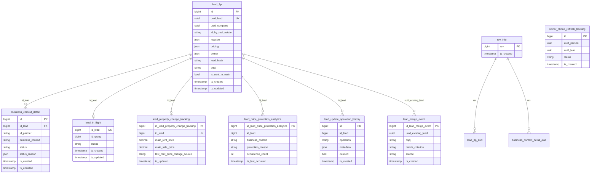

# Brokers Supply Processor — PostgreSQL Database (Production)

## About Brokers Supply Processor

**Brokers Supply Processor** (BSP) is QuintoAndar's platform for ingesting, validating, and publishing **third-party (3P) property leads** submitted by partner real-estate agencies in the Rede QuintoAndar ecosystem. It processes large volumes of partner inventory via bulk file imports, CRM/XML integrations (Vista, Kenlo, VR_SYNC), broker integration feeds, and direct API calls — applying eligibility and quality rules before forwarding eligible listings to Main (QuintoAndar's core property system).

Each lead (`lead3p` in OLTP → `lead_3p` in clean) carries a rich JSON payload (location, pricing, owner, photos, blueprint). **Processing status lives on `business_context_detail`**, not on the lead row itself — one lead can be evaluated independently per business context (`SALE`, `RENT`). Supporting tables track Kodak photo-analysis concurrency (`lead_in_flight`), identity merges (`lead_merge_event`), price protection (`lead_property_change_tracking`, `lead_price_protection_analytics`), owner phone sync to Person (`owner_phone_refresh_tracking`), and mutation audit (`lead_update_operation_history`, Envers `*_aud`).

**Service repository:** [`backend-services/applications/brokers-supply-processor`](https://github.com/quintoandar/backend-services/tree/master/applications/brokers-supply-processor)  
**Lead status machine (reference):** [`openspec/.../lead-status-machine.md`](https://github.com/quintoandar/backend-services/blob/master/applications/brokers-supply-processor/openspec/changes/magic-link-supply-importer-mvp/references/lead-status-machine.md)  
**TechDocs:** [Backstage — Brokers Supply Processor API](https://backstage.apps.core-prd.habitat.zone/catalog/default/api/brokers-supply-processor-api/definition)

---

## Lead status lifecycle

Status is tracked **per business context** on `business_context_detail.status`. The `status_reason` JSONB holds validation flags; the status is derived from them — any active flag → `NOT_CONVERTED`; no active flags → `WAITING` (partial validation) or `CONVERTED` (full validation).

```
RECEIVED (intake from partner)
       │
       ├── partial validation ──► WAITING  or  NOT_CONVERTED
       │
       └── full validation ──────► CONVERTED  or  NOT_CONVERTED
                                       │
                       ┌───────────────┴───────────────┐
                       ▼                               ▼
                 PROCESSING                      REGISTERED
              (Kodak photo analysis)           (photos already OK)
                       │
           ┌───────────┴───────────┐
           ▼                       ▼
      REGISTERED            NOT_CONVERTED

REGISTERED ──(offline in partner CRM)──► UNPUBLISHED

Any stage ──(partner deletion / Rede exit)──► DISCARDED / SUSPENDED
```

### Step 1 — Intake
Partner payload creates a `lead3p` row plus one or more `business_context_detail` rows in `RECEIVED`. Identity key: `(cnpj, id_by_real_estate)` and/or `lead_hash`.

### Step 2 — Validation
Filters populate `status_reason` (JSONB camelCase keys). Pending reasons are partner-fixable; not-eligible reasons block `eligible = false` in OLTP (see enum section). Status transitions to `WAITING`, `NOT_CONVERTED`, or `CONVERTED`.

### Step 3 — Kodak concurrency (in-flight dedup)
Before Kodak photo analysis, `LeadInFlightService` groups near-duplicates via Vespucio. The first lead in a group enters `PROCESSING`; others wait as `QUEUED` or `APPROVED_WAITING`.

### Step 4 — Publication
`CONVERTED` is **ephemeral** — the lead immediately moves to `PROCESSING` (photos need analysis) or `REGISTERED` (already analyzed). `sent_to_main = true` on `lead3p` marks at least one successful publish to Main.

### Step 5 — Merge, price protection, audit
Identity matches on create write `lead_merge_event` instead of a new lead. `HOUSE_CHANGE` events update `lead_property_change_tracking`; blocked price syncs increment `lead_price_protection_analytics`. Significant mutations append to `lead_update_operation_history`. Envers writes `lead3p_aud` / `business_context_detail_aud` keyed by `revinfo`.

---

## Connection (production)

| Parameter | Value |
|---|---|
| Engine | PostgreSQL |
| Host | `brokers-supply-processor.db.core-prd.habitat.zone` |
| Port | `5432` |
| Database | `brokers_supply_processor` |
| Schema | `public` |
| JDBC URL | `jdbc:postgresql://brokers-supply-processor.db.core-prd.habitat.zone:5432/brokers_supply_processor` |
| Driver | `org.postgresql.Driver` |
| Databricks secret | `BROKERS_SUPPLY_PROCESSOR_DB` (DAG `dbutils_secret_key`) |

**Forno (shared):** `db.pgsqlshared.forno.quintoandar.com.br:5432/brokers_supply_processor`  
**Staging (shared):** `db.pgsqlshared.staging.quintoandar.com.br:5432/brokers_supply_processor`

**Pipeline schedule:** daily at 00:00 UTC (`0 0 * * *`), ~24h CDC latency.

**OLTP naming note:** source tables use `lead3p` and `revinfo`; clean layer normalizes to `lead_3p` and `rev_info`.

---

## Entity-relationship diagram

Column names use the **clean layer** naming (`datalake_brokers_supply_processor_clean`).



---

## PostgreSQL / application enum types

All enums below are stored as **VARCHAR** in PostgreSQL (no PG enum constraint). Values match Java enum `.name()` unless noted.

### `LeadStatus` → `business_context_detail.status`

Source: `core/partners/enums/LeadStatus.java`

| Value | Description |
|---|---|
| `RECEIVED` | Initial status when the partner payload is first mapped |
| `WAITING` | Passed partial validation with no active reasons — partner may proceed to enrichment |
| `NOT_CONVERTED` | Has pending or not-eligible reasons — needs correction or business decision |
| `CONVERTED` | Passed all validations — **ephemeral**; immediately becomes `PROCESSING` or `REGISTERED` |
| `PROCESSING` | Photos submitted to **Kodak** for image analysis |
| `REGISTERED` | Property published on QuintoAndar |
| `UNPUBLISHED` | Was converted/registered but went offline in the partner CRM |
| `DISCARDED` | Lead discarded (e.g. deleted in CRM before conversion) |
| `SUSPENDED` | Exceptional manual case (e.g. agency left Rede) |

Allowed transitions are enforced in code (`canChangeTo()`). See the [lead status machine doc](https://github.com/quintoandar/backend-services/blob/master/applications/brokers-supply-processor/openspec/changes/magic-link-supply-importer-mvp/references/lead-status-machine.md) for the full transition matrix.

---

### `BusinessContext` → `business_context_detail.business_context`, `lead_price_protection_analytics.business_context`

Source: `core/partners/enums/BusinessContext.java`

| Value | Business segment | Notes |
|---|---|---|
| `SALE` | `REDE_SALE` | Active in `acceptedContexts()` |
| `RENT` | `REDE_RENT` | Active in `acceptedContexts()` |
| `SALE_PRIMARY_MARKET` | — | Defined in enum; **not** in `acceptedContexts()` — reserved |

---

### `LeadInFlightStatus` → `lead_in_flight.status`

Source: `core/partners/enums/LeadInFlightStatus.java`

| Value | Description |
|---|---|
| `QUEUED` | Another lead in the same Vespucio duplicate group is already in `PROCESSING` — waiting |
| `PROCESSING` | First (or promoted) lead in the group — allowed to proceed to Kodak |
| `APPROVED_WAITING` | Lead passed validation but an earlier lead in the group has priority (race-condition corner case) |

---

### `LeadMergeMatchCriterion` → `lead_merge_event.match_criterion`

Source: `core/partners/enums/LeadMergeMatchCriterion.java`

| Value | Description |
|---|---|
| `ID_BY_REAL_ESTATE` | Matched on `cnpj + id_by_real_estate` (hash may differ) |
| `LEAD_HASH` | Matched on `cnpj + lead_hash` (id_by_real_estate may differ) |
| `BOTH` | Both criteria matched simultaneously |

---

### `SourceOfProcessing` → `lead_merge_event.source`

Source: `core/partners/enums/SourceOfProcessing.java`

| Value | Description |
|---|---|
| `HOUSE_CREATE` | Incoming create merged during house creation flow |
| `HOUSE_UPDATE` | Merge triggered during house update |
| `UPSERT_ONE` | Merge during deduplicate/upsert flow |
| `REPROCESS_AND_REANALYZE_LEAD_IMAGES` | Reprocess with Kodak re-analysis |
| `REPROCESS_LEAD_IGNORING_STATUS_REASONS` | Reprocess clearing selected status reasons |

---

### `LeadOperation` → `lead_update_operation_history.operation`

Source: `core/ports/data/enums/LeadOperation.java` — stored via `.getName()`, not enum constant name.

| Stored value | Enum constant | Description |
|---|---|---|
| `MERGE_UPDATE` | `MERGE_UPDATE_OPERATION` | Lead updated as result of identity merge |
| `HOUSE_ENRICHMENT` | `HOUSE_ENRICHMENT_OPERATION` | Enrichment applied to lead payload |
| `ADDRESS_REGION_NORMALIZATION` | `ADDRESS_REGION_NORMALIZATION` | Address region normalized |
| `LEAD_DISCARDED` | `DISCARD_OPERATION` | Lead discarded |

---

### `PriceChangeSource` → `lead_property_change_tracking.last_*_price_change_source`

Source: `core/partners/enums/PriceChangeSource.java`

| Value | Description |
|---|---|
| `BSP` | Price change originated from Brokers Supply Processor sync |
| `EXTERNAL` | Price change detected from Main/external source (`HOUSE_CHANGE` events) |

---

### `PriceProtectionReason` → `lead_price_protection_analytics.protection_reason`

Source: `core/partners/enums/PriceProtectionReason.java`

| Value | Description |
|---|---|
| `SYNC_SAME_PRICE` | Sync to Main blocked because BSP and Main prices are identical (no-op protection) |
| `EXTERNAL_CHANGE_WITHIN_WINDOW` | External price change within the protection window blocked BSP from overwriting |

---

### `owner_phone_refresh_tracking.status`

No Java enum — string literals only.

| Value | Description |
|---|---|
| `SUCCESS` | Owner phone successfully refreshed in Person service |
| `FAILURE` | Refresh attempt failed |

---

### `status_reason` JSONB keys → `business_context_detail.status_reason`

Source: `core/partners/domain/StatusReason.Reason`. JSON keys are **camelCase** (`text` field). Boolean flags default to absent/false.

#### Pending reasons (partner can fix — `pendingReason = true`)

| JSON key | Enum constant |
|---|---|
| `lessThanFourPhotos` | `LESS_THAN_FOUR_PHOTOS` |
| `incompleteLocationStreet` | `INCOMPLETE_LOCATION_STREET` |
| `incompleteLocationNumber` | `INCOMPLETE_LOCATION_NUMBER` |
| `incompleteLocationComplement` | `INCOMPLETE_LOCATION_COMPLEMENT` |
| `incompleteLocationZipcode` | `INCOMPLETE_LOCATION_ZIPCODE` |
| `outHouseMinSize` | `OUT_HOUSE_MIN_SIZE` |
| `idByRealEstateInformationMissing` | `ID_BY_REAL_ESTATE_INFORMATION_MISSING` |
| `brokersInformationMissing` | `BROKERS_INFORMATION_MISSING` |
| `locationInformationMissing` | `LOCATION_INFORMATION_MISSING` |
| `pricingInformationMissing` | `PRICING_INFORMATION_MISSING` |
| `ownerInformationMissing` | `OWNER_INFORMATION_MISSING` |
| `blueprintInformationMissing` | `BLUEPRINT_INFORMATION_MISSING` |
| `accessInformationMissing` | `ACCESS_INFORMATION_MISSING` |
| `administratorsInformationMissing` | `ADMINISTRATORS_INFORMATION_MISSING` |
| `photosInformationMissing` | `PHOTOS_INFORMATION_MISSING` |
| `businessContextDetailsInformationMissing` | `BUSINESS_CONTEXT_DETAILS_INFORMATION_MISSING` |
| `noOwnerPhone` | `NO_OWNER_PHONE` |
| `noOwnerName` | `NO_OWNER_NAME` |
| `invalidPhoneType` | `INVALID_PHONE_TYPE` |
| `unparseableAddressComplement` | `UNPARSEABLE_ADDRESS_COMPLEMENT` |
| `addressComplementStructMismatch` | `ADDRESS_COMPLEMENT_STRUCT_MISMATCH` |
| `numberOfSuitesGreaterThanBedroomsOrBathrooms` | `NUMBER_OF_SUITES_GREATER_THAN_BEDROOMS_OR_BATHROOMS` |
| `notAcceptedAuthorizationType` | `NOT_ACCEPTED_AUTHORIZATION_TYPE` |
| `wrongIptuValue` | `WRONG_IPTU_VALUE` |
| `numberOfRoomsNotValid` | `NUMBER_OF_ROOMS_NOT_VALID` |
| `poorImageQuality` | `POOR_IMAGE_QUALITY` |
| `noSufficientOwnerData` | `NO_SUFFICIENT_OWNER_DATA` |
| `photoUrlRequiresHttps` | `PHOTO_URL_REQUIRES_HTTPS` |
| `photoAnalysisFlowFailure` | `PHOTO_ANALYSIS_FLOW_FAILURE` |
| `imageAnalysisRejected` | `IMAGE_ANALYSIS_REJECTED` |

#### Not-eligible reasons (business block — `notEligibleReason = true`, sets OLTP `eligible = false`)

| JSON key | Enum constant |
|---|---|
| `notAcceptedHouseType` | `NOT_ACCEPTED_HOUSE_TYPE` |
| `outOfPriceRange` | `OUT_OF_PRICE_RANGE` |
| `primaryHouse` | `PRIMARY_HOUSE` |
| `otherThirdPartner` | `OTHER_THIRD_PARTNER` |
| `duplicateHouse` | `DUPLICATE_HOUSE` |
| `outsidePolygon` | `OUTSIDE_POLYGON` |
| `ownerBlocked` | `OWNER_BLOCKED` |
| `invalidCompany` | `INVALID_COMPANY` (deprecated, still backfilled in `eligible`) |

#### Other keys (non-boolean or informational)

| JSON key | Type | Enum constant |
|---|---|---|
| `duplicateId` | long | `DUPLICATED_ID` |
| `duplicateLeadUuid` | UUID string | `DUPLICATED_LEAD_UUID` |
| `photoAnalysisFlowFailureReason` | string | `PHOTO_ANALYSIS_FLOW_FAILURE_REASON` |
| `imageAnalysisGroupInvalidReasons` | JSON array | `IMAGE_ANALYSIS_GROUP_INVALID_REASONS` |
| `incompleteLocation` | boolean | `INCOMPLETE_LOCATION` (**deprecated** — use granular location keys) |

**Eligibility rule (OLTP):** `eligible = true` when none of the 9 not-eligible boolean flags are set. Column exists in OLTP since `V2026_04_28` but is **not yet mapped in the clean SQL** — derive from `status_reason` in analytics queries.

---

## Tables (ingested via CDC)

### `lead_3p`

Core 3P property lead aggregate. Grain: one row per partner-submitted property identity. Status was removed from this table in `V2023_03_30` — join `business_context_detail` for lifecycle state.

| Column (clean) | OLTP column | Type | Nullable | Notes |
|---|---|---|---|---|
| `id` | `id` | BIGINT | NOT NULL | **PK** (IDENTITY) |
| `uuid_lead` | `lead_uuid` | UUID | NULL | Stable external id; **UNIQUE** (`uk_lead3p_lead_uuid`) |
| `uuid_company` | `company_uuid` | UUID | NULL | Partner company UUID (Company service) |
| `id_by_real_estate` | `id_by_real_estate` | STRING | NULL | Partner's native listing ID |
| `cnpj` | `cnpj` | STRING | NULL | Agency CNPJ (digits only in domain) |
| `brokers` | `brokers` | JSON | NULL | Broker contact list |
| `location` | `location` | JSON | NULL | Address, coordinates, neighborhood |
| `pricing` | `pricing` | JSON | NULL | Rent, sale, condo, IPTU |
| `owner` | `owner` | JSON | NULL | Owner contact — **PII** |
| `owner_agent` | `owner_agent` | JSON | NULL | Owner-agent relationship |
| `blueprint` | `blueprint` | JSON | NULL | Rooms, area, house type |
| `details` | `details` | JSON | NULL | Amenities, description |
| `access` | `access` | JSON | NULL | Visit access / authorization |
| `photos` | `photos` | JSON | NULL | Photo URL list |
| `lead_hash` | `lead_hash` | STRING | NULL | Dedup fingerprint (MD5, max 32 chars) |
| `is_sent_to_main` | `sent_to_main` | BOOLEAN | NULL | Published to Main at least once |
| `has_3p_access_control` | — | BOOLEAN | NOT NULL | Always `TRUE` (governance flag) |
| `ts_created` | `created_at` | TIMESTAMP | NOT NULL | |
| `ts_updated` | `updated_at` | TIMESTAMP | NOT NULL | |

---

### `business_context_detail`

Per-context processing state. Grain: one row per `(id_lead, business_context)` — unique in OLTP. Type-1 SCD; use `business_context_detail_aud` for history.

| Column (clean) | OLTP column | Type | Nullable | Notes |
|---|---|---|---|---|
| `id` | `id` | BIGINT | NOT NULL | **PK** |
| `id_lead` | `lead_id` | BIGINT | NULL | **FK → lead3p.id** |
| `id_file` | `file_id` | BIGINT | NULL | **Legacy** — dropped from OLTP (`V2026_01_05`); expect NULL on new rows |
| `id_listing` | `listing_id` | BIGINT | NULL | **Deprecated** — always NULL |
| `id_partner` | `partner_id` | STRING | NOT NULL | Integration partner identifier |
| `business_context` | `business_context` | STRING | NULL | `BusinessContext` enum |
| `status` | `status` | STRING | NULL | `LeadStatus` enum |
| `status_reason` | `status_reason` | JSON | NULL | Validation flags (see enum section) |
| `version` | `version` | BIGINT | NULL | Optimistic locking |
| `has_3p_access_control` | — | BOOLEAN | NOT NULL | Always `TRUE` |
| `ts_created` | `created_at` | TIMESTAMP | NOT NULL | |
| `ts_updated` | `updated_at` | TIMESTAMP | NOT NULL | |

**OLTP-only column (not in clean yet):** `eligible BOOLEAN` — maintained by `syncEligible()` on insert/update.

---

### `lead_in_flight`

Concurrency gate for Kodak photo-analysis deduplication. Grain: one row per lead (`lead_id` UNIQUE in OLTP). OLTP also has surrogate `id` PK (since `V2025_11_13`) — clean layer keys on `id_lead`.

| Column (clean) | OLTP column | Type | Nullable | Notes |
|---|---|---|---|---|
| `id_lead` | `lead_id` | BIGINT | NOT NULL | **FK → lead3p.id**, UNIQUE |
| `id_group` | `group_id` | BIGINT | NOT NULL | Vespucio duplicate group id |
| `status` | `status` | STRING | NOT NULL | `LeadInFlightStatus` |
| `has_3p_access_control` | — | BOOLEAN | NOT NULL | Always `TRUE` |
| `ts_created` | `created_at` | TIMESTAMP | NOT NULL | |
| `ts_updated` | `updated_at` | TIMESTAMP | NOT NULL | |

---

### `lead_merge_event`

Audit log when an incoming create is **merged into an existing lead** instead of creating a new row. Incremental CDC extraction. Written by `HouseCreateUseCase` and `HouseDeduplicateUseCase`.

| Column (clean) | OLTP column | Type | Nullable | Notes |
|---|---|---|---|---|
| `id_lead_merge_event` | `id` | BIGINT | NOT NULL | **PK** |
| `uuid_existing_lead` | `existing_lead_uuid` | UUID | NOT NULL | Surviving lead |
| `cnpj` | `cnpj` | STRING | NOT NULL | Agency CNPJ (14 chars) |
| `id_by_real_estate_existing` | `existing_id_by_real_estate` | STRING | NULL | Existing lead's partner id |
| `id_by_real_estate_payload` | `payload_id_by_real_estate` | STRING | NULL | Incoming payload partner id |
| `lead_hash_existing` | `existing_lead_hash` | STRING | NULL | |
| `lead_hash_payload` | `payload_lead_hash` | STRING | NULL | |
| `match_criterion` | `match_criterion` | STRING | NOT NULL | `LeadMergeMatchCriterion` |
| `existing_contexts` | `existing_contexts` | STRING | NOT NULL | Comma-sorted context names before merge |
| `incoming_contexts` | `incoming_contexts` | STRING | NOT NULL | Contexts in incoming payload |
| `new_contexts` | `new_contexts` | STRING | NOT NULL | Contexts added by the merge |
| `source` | `source` | STRING | NOT NULL | `SourceOfProcessing` |
| `ts_created` | `created_at` | TIMESTAMPTZ | NOT NULL | |

---

### `lead_property_change_tracking`

Tracks **Main vs BSP price state** per lead for price-protection policy. One row per lead (UNIQUE on `lead_id`). Updated by `LeadPriceTrackingUseCase` on `HOUSE_CHANGE` events.

| Column (clean) | OLTP column | Type | Nullable | Notes |
|---|---|---|---|---|
| `id_lead_property_change_tracking` | `id` | BIGINT | NOT NULL | **PK** |
| `id_lead` | `lead_id` | BIGINT | NOT NULL | **FK → lead3p.id**, UNIQUE |
| `main_rent_price` | `main_rent_price` | DECIMAL | NULL | Latest Main rent price |
| `main_sale_price` | `main_sale_price` | DECIMAL | NULL | Latest Main sale price |
| `main_condo_price` | `main_condo_price` | DECIMAL | NULL | Latest Main condo fee |
| `last_bsp_rent_price` | `last_bsp_rent_price` | DECIMAL | NULL | Last rent price sent by BSP |
| `last_bsp_sale_price` | `last_bsp_sale_price` | DECIMAL | NULL | Last sale price sent by BSP |
| `last_sale_price_change_source` | `last_sale_price_change_source` | STRING | NULL | `PriceChangeSource` |
| `last_rent_price_change_source` | `last_rent_price_change_source` | STRING | NULL | `PriceChangeSource` |
| `ts_sale_price_external_change` | `sale_price_external_change_at` | TIMESTAMPTZ | NULL | Last external sale price change |
| `ts_rent_price_external_change` | `rent_price_external_change_at` | TIMESTAMPTZ | NULL | Last external rent price change |
| `ts_created` | `created_at` | TIMESTAMPTZ | NOT NULL | |
| `ts_updated` | `updated_at` | TIMESTAMPTZ | NOT NULL | |

---

### `lead_price_protection_analytics`

**Analytics counter** when price sync to Main is blocked by price-protection rules. Upsert grain: `(id_lead, business_context, main_price, brokerage_price, protection_reason)` — increments `occurrence_count` on repeat blocks.

| Column (clean) | OLTP column | Type | Nullable | Notes |
|---|---|---|---|---|
| `id_lead_price_protection_analytics` | `id` | BIGINT | NOT NULL | **PK** |
| `id_lead` | `lead_id` | BIGINT | NOT NULL | No FK in DDL |
| `business_context` | `business_context` | STRING | NOT NULL | `BusinessContext.name()` |
| `main_price` | `main_price` | DECIMAL | NOT NULL | Main price at block time |
| `brokerage_price` | `brokerage_price` | DECIMAL | NOT NULL | BSP/brokerage price |
| `protection_reason` | `protection_reason` | STRING | NOT NULL | `PriceProtectionReason` |
| `occurrence_count` | `occurrence_count` | INTEGER | NOT NULL | Repeat counter (default 1) |
| `ts_first_occurred` | `first_occurred_at` | TIMESTAMPTZ | NOT NULL | |
| `ts_last_occurred` | `last_occurred_at` | TIMESTAMPTZ | NOT NULL | |

---

### `lead_update_operation_history`

Immutable audit log of significant lead mutations. Soft-deleted via `deleted = true` (`@SQLDelete` in entity).

| Column (clean) | OLTP column | Type | Nullable | Notes |
|---|---|---|---|---|
| `id` | `id` | BIGINT | NOT NULL | **PK** |
| `id_lead` | `lead_id` | BIGINT | NOT NULL | |
| `operation` | `operation` | STRING | NOT NULL | `LeadOperation.getName()` |
| `metadata` | `metadata` | JSON | NOT NULL | Operation-specific payload |
| `user_identification` | `user_identification` | STRING | NOT NULL | Actor or system identifier |
| `reason` | `reason` | STRING | NOT NULL | Human-readable reason |
| `deleted` | `deleted` | BOOLEAN | NOT NULL | Soft-delete flag |
| `ts_created` | `created_at` | TIMESTAMP | NOT NULL | |
| `ts_updated` | `updated_at` | TIMESTAMP | NOT NULL | |

---

### `owner_phone_refresh_tracking`

Append-only log of **owner phone refresh** attempts when BSP syncs owner data to the Person service (`LeadOwnershipService`).

| Column (clean) | OLTP column | Type | Nullable | Notes |
|---|---|---|---|---|
| `id` | `id` | BIGINT | NOT NULL | **PK** |
| `uuid_person` | `person_uuid` | UUID | NOT NULL | Person entity UUID |
| `uuid_lead` | `lead_uuid` | UUID | NOT NULL | Lead UUID (not `lead3p.id`) |
| `status` | `status` | STRING | NOT NULL | `SUCCESS` or `FAILURE` |
| `ts_created` | `created_at` | TIMESTAMPTZ | NOT NULL | |

---

### `lead_3p_aud`

Hibernate Envers audit of `Lead` entity changes. Composite identity `(id, rev)` in raw. Includes historical columns removed from main table (`status`, `status_reason`, `listing_id`, `file_id`, `real_estate_id`) — useful for pre-2023 migration analysis.

Key clean columns: all audited `lead_3p` fields plus `rev`, `rev_end`, `rev_type`, and `mod_*` change flags per field.

---

### `business_context_detail_aud`

Envers audit of `BusinessContextDetail`. Composite identity `(id, rev)`. Note: `lead_id` was removed from `_aud` (`V2023_04_05`) — parent link tracked via join table `lead_entity_business_context_detail_entity_aud` (not ingested).

Key clean columns: `business_context`, `status`, `status_reason`, `id_partner`, `mod_*` flags, `rev`, `rev_end`, `rev_type`.

---

### `rev_info`

Hibernate Envers revision metadata for all `_aud` tables.

| Column (clean) | OLTP column | Type | Nullable | Notes |
|---|---|---|---|---|
| `rev` | `rev` | BIGINT | NOT NULL | **PK** (BIGSERIAL) |
| `ts_created` | `revtstmp` | TIMESTAMP | NULL | Converted from epoch ms (`revtstmp/1000`) |
| `has_3p_access_control` | — | BOOLEAN | NOT NULL | Always `TRUE` |

---

## Not ingested (present in OLTP, excluded from CDC DAG)

| Table / area | Notes |
|---|---|
| `file`, `file_aud` | Bulk import batch metadata |
| `broker_integration*`, `integration_preset`, `broker_integration_ingestion*` | CRM/XML feed engine (scheduled sync, reconcile) |
| `crm_integrator_process*` | CRM integrator orchestration |
| `analytic_event` | Internal analytics events |
| `lead_blocklist` | Blocked lead identifiers |
| `lead_entity_business_context_detail_entity_aud` | Envers join audit for lead ↔ context link |
| `message` (outbox) | Transactional outbox for Kafka |
| `QRTZ_*` | Quartz scheduler tables |
| `pre_lead3p*`, `listing*`, `posting*`, `publisher*` | Legacy supply pipeline tables |

---

## Sensitive columns summary

| Table | Columns | Handling |
|---|---|---|
| `lead_3p` | `owner`, `brokers`, `owner_agent` (JSON) | PII (phone, email, name) — restrict clean-layer access |
| `lead_3p` | `location` (JSON) | Address PII |
| `lead_3p_aud` | same JSON fields | Historical PII in audit snapshots |
| `lead_update_operation_history` | `metadata` (JSON) | May contain PII depending on operation |

Downstream enrich/DW models should **not** propagate raw owner contact fields — use `sk_person` / `dim_person` joins where person identity is needed.

---

## Datalake outputs

| Layer | Schema | Tables |
|---|---|---|
| Raw | `datalake_brokers_supply_processor_raw` | 11 source tables (CDC) |
| Clean | `datalake_brokers_supply_processor_clean` | 11 normalized tables (see `queries/clean/`) |

**Downstream DAGs:** `enrich_3p_supply`, `dw_3p_supply`, `dw_brokers`, `enrich_brokers`.