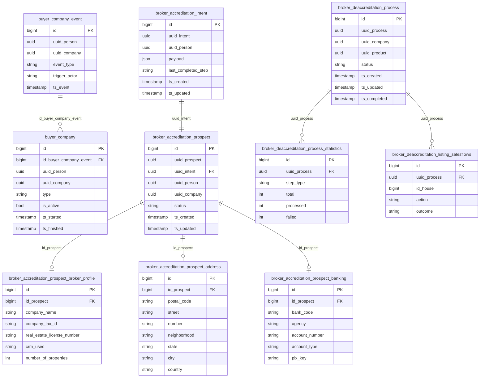

# Rede Platform — PostgreSQL Database (Production)

## About Rede Platform

**Rede Platform** is the backend service for QuintoAndar's **third-party (Rede) broker ecosystem**. It orchestrates three major capability areas:

1. **Mão Dupla (Demand)** — classifies and persists **buyer–company relations** (`buyer_company`) based on visit, offer, and referral events, distinguishing first-party (`1P`) from third-party (`3P`) demand attribution.
2. **Broker accreditation (SSBA)** — self-service broker onboarding: intent capture, prospect profile/address/banking, and handoff to Ops for company activation and Magic Link provisioning.
3. **Broker deaccreditation** — when a broker's company product is deactivated, coordinates listing churn, lead suspension, and user disenrollment (via Signup API) through parallel Kafka pipelines.

The service consumes company events, visit/offer events, and exposes REST APIs for accreditation flows. Legacy real-estate partner registration flows are being phased out (H2.25).

**Service repository:** [`backend-services/applications/rede-platform`](https://github.com/quintoandar/backend-services/tree/master/applications/rede-platform)  
**Domain docs:** [`docs/broker-deaccreditation.md`](https://github.com/quintoandar/backend-services/blob/master/applications/rede-platform/docs/broker-deaccreditation.md), [`docs/listing-churn.md`](https://github.com/quintoandar/backend-services/blob/master/applications/rede-platform/docs/listing-churn.md)  
**TechDocs:** [Backstage — rede-platform](https://backstage.apps.core-prd.habitat.zone/docs/default/system/backend-services/applications/rede-platform)

---

## Buyer–company classification (Mão Dupla)

```
Domain event (visit / offer / referral)
       │
       ▼
buyer_company_event
  person_uuid, company_uuid, event_type, trigger_actor
       │
       ▼
BuyerCompanyClassificationService
  maps event → BuyerRelationType (1P / 3P)
       │
       ▼
buyer_company
  active relation with ts_started / ts_finished
```

Each `buyer_company` row represents a period during which a person (`uuid_person`) is attributed to a brokerage company (`uuid_company`) as either first-party or third-party demand. Relations are opened and closed via `buyer_company_event` triggers; `is_active` and `ts_finished` mark the current state.

---

## Broker accreditation flow (SSBA)

```
1. Create intent (POST accreditation API)
   → broker_accreditation_intent (payload JSONB, last_completed_step)

2. User completes self-service form
   → Privacy Hub consent + Terms acceptance

3. Prospect persisted
   → broker_accreditation_prospect (1:1 with intent_uuid)
   → broker_accreditation_prospect_broker_profile (CRECI, CRM, portfolio size)
   → broker_accreditation_prospect_address
   → broker_accreditation_prospect_banking

4. Manual Ops activation (outside POC)
   → company_uuid populated on prospect
   → Magic Link / contract provisioning
```

---

## Broker deaccreditation flow

```
CompanyProductUpdatedEvent (product → INACTIVE)
       │
       ├── Listing pipeline ──► unpublish/delete listings per business rules
       ├── Lead pipeline ─────► suspend partner leads
       └── User pipeline ─────► Signup API disenroll per company member
       │
       ▼
broker_deaccreditation_process (orchestrator)
  status: IN_PROGRESS → COMPLETED / COMPLETED_WITH_PENDING / FAILED
       │
       ▼
broker_deaccreditation_process_statistics (per-step counters)
broker_deaccreditation_listing_salesflows (per-listing outcomes)
```

See [`docs/broker-deaccreditation.md`](https://github.com/quintoandar/backend-services/blob/master/applications/rede-platform/docs/broker-deaccreditation.md) for Kafka topics, step types, and DLT handling.

---

## Connection (production)

| Parameter | Value |
|---|---|
| Engine | PostgreSQL |
| Host | `rede-platform.db.core-prd.habitat.zone` |
| Port | `5432` |
| Database | `rede_platform` |
| Schema | `public` |
| JDBC URL | `jdbc:postgresql://rede-platform.db.core-prd.habitat.zone:5432/rede_platform` |
| Driver | `org.postgresql.Driver` |

**Forno (shared):** `db.pgsqlshared.forno.quintoandar.com.br:5432/rede_platform`  
**Staging (shared):** `db.pgsqlshared.staging.quintoandar.com.br:5432/rede_platform`

**Pipeline schedule:** 3× daily at 08:00, 12:00, 21:00 UTC (`0 21,8,12 * * *`).

---

## Entity-relationship diagram

Column names use the **clean layer** naming (`datalake_rede_platform_clean`).



---

## Enum types

### `buyer_company.type` — `BuyerRelationType`

| Value (stored) | Enum | Description |
|---|---|---|
| `1P` | `FIRST_PARTY` | Demand attributed directly to QuintoAndar |
| `3P` | `THIRD_PARTY` | Demand attributed to a Rede brokerage partner |
| `` | `UNKNOWN` | Unclassified |

### `broker_accreditation_prospect.status`

| Value | Description |
|---|---|
| `CREATED` | Prospect row persisted after self-service flow |
| `CONVERTED` | Company activated in core systems |
| `ABANDONED` | Disqualified or abandoned application |

### `broker_deaccreditation_process.status`

| Value | Description |
|---|---|
| `IN_PROGRESS` | Workers processing async steps |
| `COMPLETED` | All expected operations finished |
| `COMPLETED_WITH_PENDING` | Most done, some items failed |
| `FAILED` | Critical failure prevented completion |

### `buyer_company_event.trigger_actor`

| Value | Description |
|---|---|
| `DEMAND` | Event originated from buyer/demand side |
| `SUPPLY` | Event originated from listing/supply side |

---

## Tables (ingested via CDC)

### `buyer_company_event`

Immutable event log driving buyer–company relation changes. Grain: one row per classification trigger (visit confirmed, offer sent, agent referral, etc.).

| Column (clean) | Type | Notes |
|---|---|---|
| `id` | BIGINT | **PK** |
| `uuid_person` | UUID | Person in Person service |
| `uuid_company` | UUID | Brokerage in Company service |
| `event_type` | STRING | Domain event type (e.g. visit, offer) |
| `trigger_actor` | STRING | `DEMAND` or `SUPPLY` |
| `id_event_entity` | STRING | Source entity identifier |
| `ts_event` | TIMESTAMP | When the domain event occurred |

---

### `buyer_company`

Active and historical buyer–brokerage attribution periods. Join to `buyer_company_event` via `id_buyer_company_event` for the triggering event.

| Column (clean) | Type | Notes |
|---|---|---|
| `id` | BIGINT | **PK** |
| `id_buyer_company_event` | BIGINT | **FK → buyer_company_event** |
| `uuid_person` | UUID | |
| `uuid_company` | UUID | |
| `type` | STRING | `1P` or `3P` |
| `is_active` | BOOLEAN | Current relation flag |
| `ts_started` | TIMESTAMP | Relation open |
| `ts_finished` | TIMESTAMP | Relation close (NULL if active) |

---

### `broker_accreditation_intent`

In-progress or completed accreditation wizard state. `payload` (JSONB) stores form progress; `last_completed_step` tracks the SSBA step machine.

---

### `broker_accreditation_prospect`

Durable prospect created after mandatory fields, Privacy Hub consent, and Terms acceptance. Exactly one prospect per `uuid_intent`.

---

### `broker_accreditation_prospect_broker_profile`

Agency profile: legal name, CNPJ/tax ID, CRECI license, CRM used, portfolio size.

---

### `broker_accreditation_prospect_address`

Normalized agency address (postal code, street, city, state, country).

---

### `broker_accreditation_prospect_banking`

Bank account details for partner payments (bank code, agency, account, PIX key).

---

### `broker_deaccreditation_process`

Orchestrator row for a deaccreditation run triggered when a company product goes inactive.

---

### `broker_deaccreditation_process_statistics`

Per-step counters (`LISTING_DELETION`, `SUSPEND_LEAD`, `USER_DISENROLLMENT`): total, processed, failed.

---

### `broker_deaccreditation_listing_salesflows`

Per-listing outcome during deaccreditation listing churn (house ID, action taken, result).

---

## Not ingested (present in OLTP, excluded from CDC DAG)

| Table | Notes |
|---|---|
| `message` (outbox) | Transactional outbox for Kafka |
| `processed_messages` | Kafka consumer idempotency |
| `company_cache` | Legacy company cache |
| `mao_dupla_processed_event` | Legacy Mão Dupla processing state |

---

## Sensitive columns summary

| Table | Columns | Handling |
|---|---|---|
| `broker_accreditation_prospect_broker_profile` | `company_tax_id` | CNPJ — restricted access recommended |
| `broker_accreditation_prospect_banking` | `account_number`, `pix_key` | Financial PII — restricted access recommended |
| `broker_accreditation_prospect_address` | full address | Location PII |

---

## Datalake outputs

| Layer | Schema | Tables |
|---|---|---|
| Raw | `datalake_rede_platform_raw` | 10 source tables (CDC) |
| Clean | `datalake_rede_platform_clean` | 10 normalized tables (see `queries/clean/`) |

**Downstream DAGs:** `dw_brokers`, `enrich_brokers`, `enrich_company`.