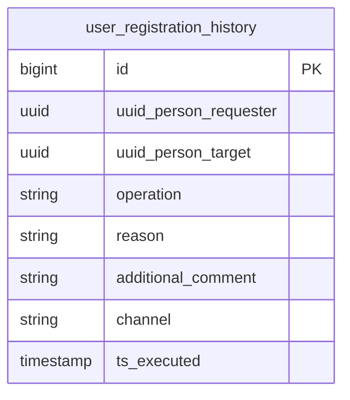

# Signup — PostgreSQL Database (Production)

## About Signup

**Signup** is QuintoAndar's orchestration service for **all user registration flows** across the platform — broker agents (Rede 3P, CIQ, PP Multi), inspectors, photographers, demand first-party agents, and third-party disenrollment triggered by partner lifecycle events (e.g. broker deaccreditation in Rede Platform).

Rather than storing user profiles directly, Signup coordinates multi-step sagas across Person, Company, Hubs, Agent Domain, Jaiminho (notifications), and other downstream services. The `user_registration_history` table ingested here is an **audit trail** of enrollment, disenrollment, registration completeness, and user-draft operations — who did what, to whom, why, and through which channel.

**Service repository:** [`backend-services/applications/signup`](https://github.com/quintoandar/backend-services/tree/master/applications/signup)  
**Signup flows doc:** [Google Doc — Signup flows](https://docs.google.com/document/d/1bNG7eABjErT925v5xwwA8SfEWb3YkG8YTEauPjVodX4/edit?usp=sharing)

---

## Registration audit lifecycle

```
Signup API / Worker saga step
  (enrollment, disenrollment, completeness, draft)
       │
       ▼
user_registration_history
  uuid_person_requester (who triggered)
  uuid_person_target     (who is affected)
  operation + reason + channel
  ts_executed
```

### Typical flows that write history

| Flow | Operation | Example reasons |
|---|---|---|
| Third-party agent enrollment | `ENROLLMENT` | `INVITATION`, `FIRST_LOGIN`, `INTEGRATION_DATA` |
| Third-party agent disenrollment | `DISENROLLMENT` | `INACTIVITY`, `CHANGED_COMPANY`, `REQUESTED_DE_ACCREDITATION`, `FRAUD` |
| Broker deaccreditation (via Rede Platform) | `DISENROLLMENT` | `REQUESTED_DE_ACCREDITATION`, `NOT_ELIGIBLE` |
| Profile completion | `REGISTRATION_COMPLETENESS` | `COMPLETE_PERSON_DATA` |
| CRM integration draft user | `USER_DRAFT` | `EXTERNAL_CRM_INTEGRATION` |

Each row is append-only — there is no update/delete in normal operation. Analysts use this table to reconstruct enrollment/disenrollment timelines per person and to audit Ops-triggered changes.

---

## Connection (production)

| Parameter | Value |
|---|---|
| Engine | PostgreSQL |
| Host | `signup.db.core-prd.habitat.zone` |
| Port | `5432` |
| Database | `signup` |
| Schema | `public` |
| JDBC URL | `jdbc:postgresql://signup.db.core-prd.habitat.zone:5432/signup` |
| Driver | `org.postgresql.Driver` |

**Forno (shared):** `db.pgsqlshared.forno.quintoandar.com.br:5432/signup`  
**Staging (shared):** `db.pgsqlshared.staging.quintoandar.com.br:5432/signup`

**Pipeline schedule:** 3× daily at 08:00, 12:00, 21:00 UTC (`0 21,8,12 * * *`).

---

## Entity-relationship diagram

The Signup CDC DAG ingests a single analytical table. Person identity lives in the **Person** service; Signup references persons by UUID only.



---

## Application-level enums (VARCHAR, no PG constraint)

### `user_registration_history.operation` — `UserRegistrationOperation`

| Value | Description |
|---|---|
| `ENROLLMENT` | User enrolled in a platform role/product |
| `DISENROLLMENT` | User removed from a platform role/product |
| `REGISTRATION_COMPLETENESS` | Profile data completion step |
| `USER_DRAFT` | Draft user created (e.g. external CRM integration) |

### `user_registration_history.reason` — `UserRegistrationReason`

Each reason maps to exactly one operation:

| Reason | Operation | Description |
|---|---|---|
| `INVITATION` | ENROLLMENT | Invited to join a partner program |
| `FIRST_LOGIN` | ENROLLMENT | First successful login after signup |
| `INTEGRATION_DATA` | ENROLLMENT | Enrolled via integration data sync |
| `COMPLETE_PERSON_DATA` | REGISTRATION_COMPLETENESS | Person profile completed |
| `EXTERNAL_CRM_INTEGRATION` | USER_DRAFT | Draft created from CRM |
| `INACTIVITY` | DISENROLLMENT | Removed due to inactivity |
| `CHANGED_COMPANY` | DISENROLLMENT | Left or switched brokerage |
| `REQUESTED_DE_ACCREDITATION` | DISENROLLMENT | Broker deaccreditation requested/completed |
| `FRAUD` | DISENROLLMENT | Fraud detection |
| `INAPPROPRIATE_BEHAVIOR` | DISENROLLMENT | Policy violation |
| `PERFORMANCE` | DISENROLLMENT | Performance-based removal |
| `ACCREDITATION_ERROR` | DISENROLLMENT | Accreditation process error |
| `NOT_ELIGIBLE` | DISENROLLMENT | Failed eligibility criteria |
| `UNSPECIFIED` | DISENROLLMENT | Reason not specified |

---

## Tables (ingested via CDC)

### `user_registration_history`

Append-only audit log of signup orchestration actions. Grain: one row per recorded operation.

| Column (clean) | Type | Nullable | Constraints |
|---|---|---|---|
| `id` | BIGINT | NOT NULL | **PK** (BIGSERIAL) |
| `uuid_person_requester` | UUID | NULL | Person who triggered the action (nullable since migration V2025_07_08) |
| `uuid_person_target` | UUID | NOT NULL | Person affected by the action |
| `operation` | STRING | NOT NULL | `UserRegistrationOperation` enum name |
| `reason` | STRING | NOT NULL | `UserRegistrationReason` enum name |
| `additional_comment` | STRING | NOT NULL | Free-text context (max 250 chars in OLTP) |
| `channel` | STRING | NOT NULL | Originating channel (API, worker, backoffice, etc.) |
| `ts_executed` | TIMESTAMP | NOT NULL | When the operation was recorded |

**Index usage:** filter by `uuid_person_target` and `ts_executed` for person timelines; join to `datalake_person` via `uuid_person` for identity enrichment (never store raw PII in downstream enrich/DW derived from this table alone).

---

## Not ingested (present in OLTP, excluded from CDC DAG)

| Table | Notes |
|---|---|
| Legacy `user_sample` | Template/demo table from initial schema |
| Outbox / SQS message tables | Async messaging infrastructure |

Signup's primary OLTP footprint for analytics is `user_registration_history`. User profile data resides in **Person** and **Agent Domain** services.

---

## Sensitive columns summary

| Table | Columns | Handling |
|---|---|---|
| `user_registration_history` | `uuid_person_requester`, `uuid_person_target` | UUID references only — join `dim_person` for contact details |
| `user_registration_history` | `additional_comment` | May contain free-text PII entered by operators — treat as restricted |

---

## Datalake outputs

| Layer | Schema | Tables |
|---|---|---|
| Raw | `datalake_signup_raw` | 1 source table (CDC) |
| Clean | `datalake_signup_clean` | 1 normalized table (see `queries/clean/user_registration_history.sql`) |

**Downstream usage:** broker enrollment/disenrollment analysis in `dw_brokers`, cross-referenced with Rede Platform deaccreditation and Company product history.