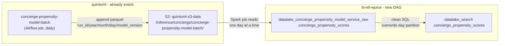

# Concierge Propensity Model Service DAG — Plan

Create a new `concierge_propensity_model_service` DAG in `dags/conversational_xp/` that reads the daily propensity scores written by the quintoml batch job from S3 parquet and lands them in the clean datalake layer. Structurally identical to `demand_balancer_service`, with overwrite-partition semantics.

## Architecture



## Source data

- **S3 path (confirmed):** `s3://quintoml-s3-data-quintoandar-com-br/inference/concierge/concierge-propensity-model-batch/`
- **Forno bucket:** `s3://quintoml-s3-forno-data-quintoandar-com-br/inference/concierge/concierge-propensity-model-batch/`
- **Structure:** Each run writes under a unique `run_id` folder, then Hive-partitioned `year=.../month=.../day=.../model_version=.../`
- **Example run path:** `.../concierge-propensity-model-batch/06eeb7414596418dbff1c36008ea0cec/year=2026/month=6/day=15/model_version=.../`
- **Ingestion pattern:** Spark job globs `{source_root}/*/year={y}/month={m}/day={d}/` to read all runs for the target day
- **Write mode from source:** `append` — ingestion must use **overwrite** to ensure idempotency
- **Columns:** `id_user`, `scoring_date`, `score`, `effective_score`, `suppression_threshold`, `is_eligibility_bypass`, `is_suppressed`, `model_version`

## Files to create

New folder: `dags/conversational_xp/concierge_propensity_model_service/`

### 1. Declaration — `concierge_propensity_model_service_declaration.yml`

Mirrors [`demand_balancer_service_declaration.yml`](../demand_balancer_service/demand_balancer_service_declaration.yml) exactly, with updated DAG name, Spark job name, S3 path, and table name:

```yaml
dag:
  name: concierge_propensity_model_service
  schedule_start_date: 2025, 1, 1
  owner: Data Conversational XP

workflow:
  layer: raw
  type: custom_ingestion
  load_spark_job: load_concierge_propensity_inference_scores_raw
  default_partitions: [year, month, day, model_version]

  spark_job_arguments:
    - "{environment}"
    - "{bucket}"
    - "{dag_name}"
    - s3://quintoml-s3-data-quintoandar-com-br/inference/concierge/concierge-propensity-model-batch/
    - "{{ macros.ds_add(data_interval_start | ds, 1) }}"
    - "{table_name}"
    - "{partitions}"
    - parquet

  default_extraction_type: incremental

  tables_customization:
    concierge_propensity_scores:
      partitions: [year, month, day, model_version]
```

### 2. Cluster — `concierge_propensity_model_service_cluster.yml`

Copy of [`demand_balancer_service_cluster.yml`](../demand_balancer_service/demand_balancer_service_cluster.yml) with updated namespace:

```yaml
cluster:
  type: consolidation_s_memory_single_node_cluster
  access_control_list:
    group_name: data-products
    permission_level: CAN_MANAGE
  custom_configurations:
    spark_conf:
      spark.metrics.namespace: data_products.conversational_xp
  databricks_conn_id: databricks_new
```

### 3. Spark job — `spark_jobs/load_concierge_propensity_inference_scores_raw.py`

Modeled on [`load_parquet_batch_inference_into_datalake.py`](../demand_balancer_service/spark_jobs/load_parquet_batch_inference_into_datalake.py). Key differences:

- Reads `year/month/day/model_version` Hive path (4-level vs 3-level in maestro)
- Uses `SparkTableStorageFormat.PARQUET` and the same `S3Loader` / `SparkMetastoreLoader` pattern
- Partition derivation uses the `date_to_ingest` argument (same as demand_balancer)

```python
path = f"{source_root_path}/year={dt.year}/month={dt.month}/day={dt.day}/"
df = s3_consumer.get_data_from_file(path, format)
# add year/month/day columns from date_to_ingest, keep model_version from parquet
s3_loader.load_df(df, s3_path=..., format_options=PARQUET, partitions=raw_partition_cols)
spark_metastore_loader.update_metastore(...)
spark_metastore_service.create_new_partitions_from_df(...)
```

### 4. Clean SQL — `queries/clean/concierge_propensity_scores.sql`

Reads from the raw table for the execution day partition, filtering on `{year}`, `{month}`, `{day}` (same pattern as [`demand_balancer.sql`](../demand_balancer_service/queries/clean/demand_balancer.sql)):

```sql
SELECT
  id_user,
  scoring_date AS dt_scored,
  score,
  effective_score,
  suppression_threshold,
  is_eligibility_bypass,
  is_suppressed,
  model_version,
  year,
  month,
  day
FROM
  datalake_concierge_propensity_model_service_raw.concierge_propensity_scores
WHERE
  MAKE_DATE(year, month, day) = MAKE_DATE({year}, {month}, {day})
```

Note: `scoring_date` is renamed to `dt_scored` to follow the `dt_*` naming convention.

### 5. Metadata — `metadata/clean/concierge_propensity_scores.yml`

```yaml
database_name: datalake_search
table_name: concierge_propensity_scores
owner: francisco.cristovao@quintoandar.com
domain: Conversational XP
description: >
  Daily propensity scores for eligible concierge users, produced by the
  concierge-propensity-model-batch quintoml job. Each row is one user scored
  on a given day. Used to drive concierge outbound communication targeting.
columns:
  id_user:
    description: Identifier of the user scored by the propensity model.
    lineage:
      - datalake_concierge_propensity_model_service_raw.concierge_propensity_scores.id_user
  dt_scored:
    description: Calendar date on which the propensity score was computed.
    lineage:
      - datalake_concierge_propensity_model_service_raw.concierge_propensity_scores.scoring_date
  score:
    description: Raw model probability of the user returning to the platform within 7 days of the scoring date.
    lineage:
      - datalake_concierge_propensity_model_service_raw.concierge_propensity_scores.score
  effective_score:
    description: Calibrated score after applying null-rate correction and eligibility bypass logic.
    lineage:
      - datalake_concierge_propensity_model_service_raw.concierge_propensity_scores.effective_score
  suppression_threshold:
    description: Minimum effective_score required to send a concierge message; users below this are suppressed.
    lineage:
      - datalake_concierge_propensity_model_service_raw.concierge_propensity_scores.suppression_threshold
  is_eligibility_bypass:
    description: True when the user was force-included regardless of predicted score.
    lineage:
      - datalake_concierge_propensity_model_service_raw.concierge_propensity_scores.is_eligibility_bypass
  is_suppressed:
    description: True when the user's effective score is below the suppression threshold and will not receive a message.
    lineage:
      - datalake_concierge_propensity_model_service_raw.concierge_propensity_scores.is_suppressed
  model_version:
    description: Identifier of the model version that produced this score (e.g. concierge-propensity-model-V1).
    lineage:
      - datalake_concierge_propensity_model_service_raw.concierge_propensity_scores.model_version
  year:
    description: Year partition.
    lineage:
      - datalake_concierge_propensity_model_service_raw.concierge_propensity_scores.year
  month:
    description: Month partition.
    lineage:
      - datalake_concierge_propensity_model_service_raw.concierge_propensity_scores.month
  day:
    description: Day partition.
    lineage:
      - datalake_concierge_propensity_model_service_raw.concierge_propensity_scores.day
```

## Post-creation commands (mandatory before PR)

```bash
make create-dag-files
CI_COMMIT_BRANCH=$(git branch --show-current) make validate-metadata-files-exist
CI_COMMIT_BRANCH=$(git branch --show-current) make validate-metadata-files-content
CI_COMMIT_BRANCH=$(git branch --show-current) make validate-lineage-consistency
CI_COMMIT_BRANCH=$(git branch --show-current) make validate-fair-metadata
make dependencies-file && git add dags/dependencies.yaml
CI_COMMIT_BRANCH=$(git branch --show-current) make validate-dependency-file-correctness
```

## Open item

- None — S3 path confirmed from a production inference run.

---

## Stories

### PR 1: Confirm S3 output path with Concierge ML team

**Status:** Done — confirmed path: `s3://quintoml-s3-data-quintoandar-com-br/inference/concierge/concierge-propensity-model-batch/{run_id}/year=.../month=.../day=.../model_version=.../`

---

### PR 2: Scaffold `concierge_propensity_model_service` DAG (raw + clean ingestion)

**Type:** AFK
**TDD:** No, because the Spark job pattern is a direct port of `load_parquet_batch_inference_into_datalake.py` with no novel logic; correctness is validated end-to-end via a Forno run rather than unit tests.
**Status:** Ready (S3 path confirmed)
**Goal:** A new daily Airflow DAG reads the concierge propensity model's S3 parquet output and lands it as a queryable clean table at `datalake_search.concierge_propensity_scores`, overwriting each day's partition on re-run.
**Scope:**
- New folder `dags/conversational_xp/concierge_propensity_model_service/` containing all 5 files defined in the plan:
  - `concierge_propensity_model_service_declaration.yml`
  - `concierge_propensity_model_service_cluster.yml`
  - `spark_jobs/load_concierge_propensity_inference_scores_raw.py`
  - `queries/clean/concierge_propensity_scores.sql`
  - `metadata/clean/concierge_propensity_scores.yml`
- `make create-dag-files` to regenerate `_dag.py`
- All CI validation commands (metadata, lineage-consistency, fair-metadata, dependency file)
- A successful Forno run

**Out of scope:** Backfilling historical data; downstream consumers of `datalake_search.concierge_propensity_scores`; any changes to the quintoml batch job.
**Implementation notes:**
- Spark job reads `year=.../month=.../day=.../` from S3 (one day per run, using `date_to_ingest`), iterates over `model_version` sub-partitions, writes with overwrite semantics via `S3Loader` + `SparkMetastoreLoader`.
- Clean SQL filters on `MAKE_DATE(year, month, day) = MAKE_DATE({year}, {month}, {day})` — same pattern as `demand_balancer.sql`.
- The source appends daily; the ingestion overwrites the partition to guarantee idempotency on reruns.
**Dependencies:** PR 1 (confirmed S3 path).
**Verification:**
- `make validate-metadata-files-exist` passes.
- `make validate-metadata-files-content` passes.
- `make validate-lineage-consistency` passes.
- `make validate-fair-metadata` passes.
- Forno Airflow run completes without errors; `datalake_search.concierge_propensity_scores` is queryable with today's data.
**Definition of Done:**
- All 5 files are created and pass local CI validation commands.
- `_dag.py` is regenerated via `make create-dag-files`.
- `dags/dependencies.yaml` is updated and committed.
- A successful Forno run is recorded (mandatory before merge per repo rules).
- PR is open and passing Woodpecker CI.

---

## Dependency Map

- PR 1 can start now.
- PR 2 is blocked by PR 1 (needs confirmed S3 path before Forno run; code can be written in parallel, but the Forno run cannot proceed without it).

## Coverage Check

- Covered: DAG declaration, cluster config, Spark ingestion job, clean SQL, governance metadata, CI validation, Forno run.
- Out of scope: Historical backfill, downstream consumer DAGs, changes to the quintoml batch job.
- Open questions: None.
