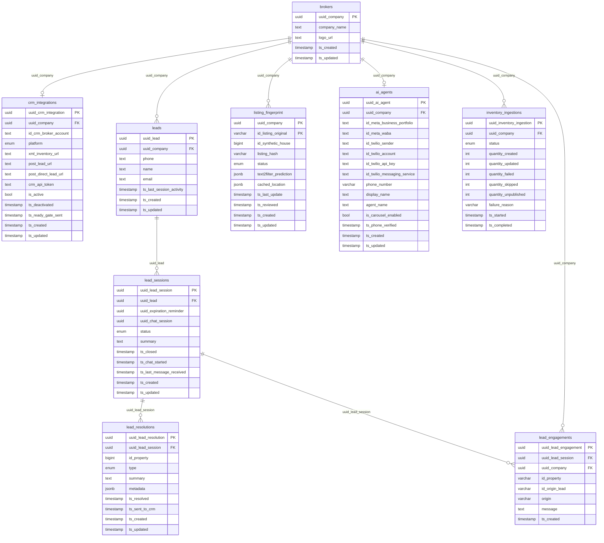

# Alias — PostgreSQL Database (Production)

## About Alias

**Alias** is QuintoAndar's B2B product for **partner real-estate brokerages**: a WhatsApp AI agent
that qualifies leads, answers questions about the brokerage's property portfolio, and forwards
outcomes back to the partner's CRM — without human intervention for the most common flows.

The brokerage registers, configures its WhatsApp number via Twilio/Meta WABA, and Alias starts
automatically attending all leads that arrive through WhatsApp and classified-ad portals
(ImovelWeb, Zap, etc.). When the AI agent completes qualification, the lead and its outcome are
posted to the partner's CRM (Univen, Kenlo, Vista, Universal).

**Service repository:** [`backend-services/applications/alias`](https://github.com/quintoandar/backend-services/tree/master/applications/alias)  
**Interactive architecture:** [`alias/docs/architecture.html`](https://github.com/quintoandar/backend-services/blob/master/applications/alias/docs/architecture.html)  
**TechDocs:** [Backstage — Alias](https://backstage.apps.core-prd.habitat.zone/docs/default/system/backend-services/applications/alias)

---

## Lead lifecycle

```
Portal / CRM               WhatsApp (Copilot)             Resolution              Session close
(intake)                   (AI conversation)              (qualification)         (expiration)
     │                           │                              │                       │
     ▼                           ▼                              ▼                       ▼
 Lead created             Session IN_PROGRESS          lead_resolution         Session CLOSED
 Session OPEN             chat_session_id set          type: VISIT_INTENTION   (expiration reminder)
 lead_engagement          Messages via Copilot         type: ESCALATION        If no resolution →
 (origin, message)        ts_last_message_received     sent_to_crm_at set      INACTIVE generated
```

### Step 1 — Intake (portal or CRM)
A lead arrives via a portal webhook (`/imovelweb`, `/grupozap`) or direct API call.
`LeadIntakeService`:
1. Finds or creates the **lead** by key `(company_uuid, phone)`
2. Opens or reuses an **OPEN session** for that lead
3. Records a **lead_engagement** with channel (`origin`), message, and property reference
4. Schedules an **expiration reminder** (reminder service job)

### Step 2 — WhatsApp conversation (Copilot)
When the lead messages the brokerage's WhatsApp number, the **chat orchestrator (Copilot)** emits
Kafka events (`SESSION_CREATED`, `MESSAGE_RECEIVED`). Alias:
1. Identifies the **ai_agent** from `senderId` (= `uuid_ai_agent`)
2. Finds or creates the lead by phone
3. Moves the session to **IN_PROGRESS** and stores the `chat_session_id` (Copilot session UUID)
4. Updates `ts_last_message_received` and re-schedules the expiration reminder

Message history is **not stored in Alias** — it lives in Copilot. The `uuid_chat_session`
(`chat_session_id`) is the key to retrieve conversation history via `CopilotPort`.

### Step 3 — AI resolution
Copilot (or the AI pipeline) calls `POST /v1/brokers/{companyUuid}/leads/resolve`. The
`LeadResolutionService`:
1. Locates the lead's active session
2. Persists the **lead_resolution** with type and structured metadata (temperature, intent, property)
3. Publishes `LeadResolutionEvent` → SQS → CRM sender

The session is **not closed** on resolution; multiple resolutions per session are allowed.

### Step 4 — CRM export
`LeadResolutionCRMSenderService` maps lead + resolution + first engagement into a platform-specific
payload and POSTs to `post_lead_url` (or `post_direct_lead_url`). On success, `sent_to_crm_at` is set.

### Step 5 — Session closure by expiration
The expiration reminder fires when a session has been inactive for too long:
- If resolutions exist → session closed (`CLOSED`), no new resolution created
- If no resolutions → `INACTIVE` resolution created, CRM notified, session closed

---

## Inventory flow: ingestion and listing_fingerprint

```
Trigger (API / Kafka)
       │
       ▼
IngestionEventConsumer
  reads XML feed (xml_inventory_url)
  publishes per-listing events
       │
       ▼
ListingIngestEventConsumer
  ┌─────────────────────────┐
  │ hash == listing_hash?   │──YES──► skip (quantity_skipped++)
  └───────────┬─────────────┘
              │ NO
              ▼
  Enrich (Vespucio geocoding, Text2Filter)
  Publish → Listing Gate / OpenSearch
  Commit listing_fingerprint (hash, synthetic_house_id, status=PUBLISHED)
       │
       ▼
BATCH_END → inventory_ingestions.status = COMPLETED
  → SQS alias-inventory-ingestion-completed
  → CRM ready gate (POST to CRM notifying that inventory is ready)
```

**Listings removed from feed** → `status = UNPUBLISHED` (soft delete), `quantity_unpublished++`.  
The **synthetic_house_id** is stable: reused if the listing is republished after soft-unpublish.

---

## Broker onboarding

```
1. Register broker (POST /v1/brokers)
   → creates shell ai_agent (no credentials yet)

2. Configure CRM (POST /v1/integrations)
   → crm_integrations created with platform, xml_inventory_url, post_lead_url, token

3. WhatsApp setup (UI → Alias backoffice)
   → Meta WABA ID configured
   → Twilio sub-account provisioned (twilio_account_sid)
   → BR phone number acquired (phone_number)
   → WhatsApp sender registered (twilio_sender_sid)
   → OTP verification → phone_verified_at set
   → Agent status: ONLINE (ready for traffic)

4. First ingestion run
   → inventory_ingestions row created (IN_PROGRESS → COMPLETED)
   → ready_gate_sent_at set (CRM notified)
   → Alias ready to receive leads

5. Leads start arriving and the cycle begins
```

---

## Connection (production)

| Parameter | Value |
|---|---|
| Engine | PostgreSQL 15 |
| Host | `alias.db.core-prd.habitat.zone` |
| Port | `5432` |
| Database | `alias` |
| Schema | `public` |
| JDBC URL | `jdbc:postgresql://alias.db.core-prd.habitat.zone:5432/alias` |
| Driver | `org.postgresql.Driver` |
| Vault credentials | `database/creds/prod-crud-alias#username` / `#password` |

**Forno (shared):** `db.pgsqlshared.forno.quintoandar.com.br:5432/alias`  
**Staging (shared):** `db.pgsqlshared.staging.quintoandar.com.br:5432/alias`

---

## Entity-relationship diagram

Column names use the **clean layer** naming (`datalake_alias_clean`).



---

## Removed table (not ingested)

| Table | Removed in migration | Notes |
|---|---|---|
| `lead_interactions` | `V2026_05_28_10_00_00__drop_lead_interactions_table.sql` | Replaced by `lead_sessions`, `lead_resolutions`, `lead_engagements`. Data migrated in `V2026_05_25_10_00_00__migrate_lead_interactions_to_v2_tables.sql`. |

Dropped PostgreSQL types: `lead_interaction_status`, `lead_interaction_resolution`, `lead_interaction_origin`.

---

## PostgreSQL enum types

### `crm_integration_platform`

Used by: `crm_integrations.platform`

| Value | Description |
|---|---|
| `UNIVEN` | Univen CRM — requires OAuth setup and ready-gate notification; `origin_lead_id` from the first engagement links to the CRM lead record |
| `UNIVEN_PRO` | Univen Pro variant |
| `KENLO` | Kenlo CRM |
| `VISTA` | Vista CRM |
| `UNIVERSAL` | Generic adapter for other CRMs; ready gate is a no-op |

### `inventory_ingestion_status`

Used by: `inventory_ingestions.status`

| Value | Description |
|---|---|
| `IN_PROGRESS` | Run in progress — batch processing listings |
| `COMPLETED` | Run finished successfully — CRM ready gate triggered |
| `FAILED` | Run aborted due to unrecoverable error |
| `TIMED_OUT` | Run exceeded TTL without receiving BATCH_END (auto-recovery) |

### `lead_session_status`

Used by: `lead_sessions.status`

| Value | Description |
|---|---|
| `OPEN` | Session created (portal intake received), WhatsApp chat not yet started |
| `IN_PROGRESS` | Chat active in Copilot — `uuid_chat_session` is set |
| `CLOSED` | Session closed by the expiration reminder (with or without a resolution) |

### `lead_resolution_type`

Used by: `lead_resolutions.type`

| Value | Description | Required metadata |
|---|---|---|
| `VISIT_INTENTION` | Lead expressed intent to **schedule a property visit** — hot lead qualified by the AI | `propertyId`, `INTENT`, `DATE`, `DAY_PERIOD` |
| `ESCALATION` | Conversation must be handed off to a **human broker** — complex question, complaint, or out-of-scope case | `USER_QUESTION` |
| `INACTIVE` | Lead **went cold** — session expired without a prior resolution. Generated automatically by the expiration reminder, not by the AI | system-generated summary |

### Application-level enum (VARCHAR, no PG constraint)

**`listing_fingerprint.status`:** `PUBLISHED`, `UNPUBLISHED` (default `PUBLISHED`)

**`lead_engagements.origin`:** free-text VARCHAR(100). Common values include `WhatsApp`, `UNIVEN`, `IMOVELWEB`, `ZAP`, `OTHER` (historical enum values before migration to VARCHAR).

---

## Tables

### `brokers`

Partner brokerage companies registered on the Alias platform. Root entity of the domain model —
all configuration (CRM, agent, inventory) and all lead traffic depend on a `uuid_company`. On
registration (`POST /v1/brokers`), a shell `ai_agent` is automatically created to allow
WhatsApp configuration by backoffice without an extra step.

| Column | Type | Nullable | Constraints |
|---|---|---|---|
| `company_uuid` | UUID | NOT NULL | **PK** |
| `company_name` | TEXT | NOT NULL | |
| `logo_url` | TEXT | NULL | Used on the WhatsApp profile and white-label classified surfaces |
| `created_at` | TIMESTAMP | NOT NULL | DEFAULT `now()` |
| `updated_at` | TIMESTAMP | NOT NULL | DEFAULT `now()` |

---

### `crm_integrations`

CRM/XML integration configuration per brokerage (1:1 with `brokers`). Serves three functions:
- **Inventory ingestion**: `xml_inventory_url` is the brokerage's VR_SYNC feed
- **Lead forwarding**: `post_lead_url` (portal leads) and `post_direct_lead_url` (direct WhatsApp leads)
- **Ready gate**: `ready_gate_sent_at` marks when the CRM was notified that Alias inventory is ready
- **Deactivation**: `active = false` suspends ingestion and forwarding without deleting the record

| Column | Type | Nullable | Constraints |
|---|---|---|---|
| `uuid` | UUID | NOT NULL | **PK**, DEFAULT `gen_random_uuid()` |
| `company_uuid` | UUID | NOT NULL | **FK → brokers**, **UNIQUE** |
| `platform` | `crm_integration_platform` | NOT NULL | enum |
| `crm_broker_account_id` | TEXT | NULL | Broker account ID in the external CRM |
| `xml_inventory_url` | TEXT | NOT NULL | XML inventory feed URL (VR_SYNC) |
| `post_lead_url` | TEXT | NOT NULL | CRM endpoint to receive portal leads |
| `post_direct_lead_url` | TEXT | NULL | Alternative endpoint for direct WhatsApp leads |
| `crm_api_token` | TEXT | NOT NULL | **encrypted at rest** |
| `active` | BOOLEAN | NOT NULL | |
| `created_at` | TIMESTAMP | NOT NULL | DEFAULT `now()` |
| `updated_at` | TIMESTAMP | NOT NULL | DEFAULT `now()` |
| `deactivated_at` | TIMESTAMP | NULL | |
| `test_mode_enabled` | BOOLEAN | NOT NULL | DEFAULT `false` |
| `ready_gate_sent_at` | TIMESTAMP | NULL | |

---

### `leads`

Buyer/renter contacts per brokerage. Grain: one lead per `(company_uuid, phone)` — the same
person can be a lead at multiple brokerages, but each company+phone pair is unique. PII fields
(`phone`, `name`, `email`) have restricted access on the clean layer. `last_session_activity_at`
is updated on every inbound message in the active session and drives admin list ordering.

| Column | Type | Nullable | Constraints |
|---|---|---|---|
| `uuid` | UUID | NOT NULL | **PK**, DEFAULT `gen_random_uuid()` |
| `company_uuid` | UUID | NOT NULL | **FK → brokers** |
| `phone` | TEXT | NOT NULL | **PII** |
| `name` | TEXT | NOT NULL | **PII** |
| `email` | TEXT | NOT NULL | **PII** |
| `created_at` | TIMESTAMP | NOT NULL | DEFAULT `now()` |
| `updated_at` | TIMESTAMP | NOT NULL | DEFAULT `now()` |
| `last_session_activity_at` | TIMESTAMPTZ | NOT NULL | DEFAULT `now()` |

**Unique:** `(company_uuid, phone)`

**Index:** `idx_leads_company_uuid_last_session_activity_at` on `(company_uuid, last_session_activity_at DESC NULLS LAST)`

---

### `lead_sessions`

Conversation thread for a lead. States: `OPEN` (intake received, chat not yet started) →
`IN_PROGRESS` (chat active in Copilot, `chat_session_id` set) → `CLOSED` (closed by the
expiration reminder). At any given time, a lead can have at most one `OPEN` or `IN_PROGRESS`
session. `expiration_reminder_id` references the job in the reminder service that closes the
session when inactive for too long.

| Column | Type | Nullable | Constraints |
|---|---|---|---|
| `uuid` | UUID | NOT NULL | **PK**, DEFAULT `gen_random_uuid()` |
| `lead_uuid` | UUID | NOT NULL | **FK → leads** |
| `status` | `lead_session_status` | NOT NULL | enum |
| `chat_session_id` | VARCHAR(255) | NULL | Copilot session UUID; key to retrieve message history |
| `closed_at` | TIMESTAMPTZ | NULL | |
| `summary` | TEXT | NULL | AI-generated or human-provided conversation summary |
| `chat_started_at` | TIMESTAMPTZ | NULL | |
| `expiration_reminder_id` | UUID | NULL | Reference to the expiration job in the reminder service |
| `created_at` | TIMESTAMPTZ | NOT NULL | DEFAULT `now()` |
| `updated_at` | TIMESTAMPTZ | NOT NULL | DEFAULT `now()` |
| `last_message_received_at` | TIMESTAMPTZ | NULL | |

**Index:** `idx_lead_sessions_lead_uuid_status_updated_at` on `(lead_uuid, status, updated_at DESC)`

---

### `lead_resolutions`

Qualification outcome recorded by the AI during or at the end of a session. Multiple resolutions
per session are allowed. Each resolution asynchronously triggers a CRM export. The `metadata`
(JSONB) field stores AI-extracted signals: intent, temperature, budget, visit date, user question
— structure varies by resolution type.

| Column | Type | Nullable | Constraints |
|---|---|---|---|
| `uuid` | UUID | NOT NULL | **PK**, DEFAULT `gen_random_uuid()` |
| `lead_session_uuid` | UUID | NOT NULL | **FK → lead_sessions** |
| `type` | `lead_resolution_type` | NOT NULL | enum |
| `metadata` | JSONB | NOT NULL | AI signals: temperature, intent, visit date, user question, etc. |
| `resolved_at` | TIMESTAMPTZ | NOT NULL | |
| `property_id` | BIGINT | NULL | `synthetic_house_id` of the property of interest (null for ESCALATION/INACTIVE) |
| `sent_to_crm_at` | TIMESTAMPTZ | NULL | Set after a successful POST to the CRM |
| `summary` | TEXT | NULL | Text summary of the resolution (forwarded to the CRM) |
| `created_at` | TIMESTAMPTZ | NOT NULL | DEFAULT `now()` |
| `updated_at` | TIMESTAMPTZ | NOT NULL | DEFAULT `now()` |

**Index:** `idx_lead_resolutions_lead_session_uuid_type_resolved_at` on `(lead_session_uuid, type, resolved_at DESC)`

---

### `lead_engagements`

Inbound touchpoints of a lead linked to a session. An engagement represents the moment the lead
reached Alias through a specific channel (classified portal, CRM, direct WhatsApp). Multiple
engagements per session are allowed — e.g. the same lead arrives from ImovelWeb and then from
Zap within the same active session. The `origin_lead_id` of the **first** engagement is used by
Univen to link the lead back to the original portal record, avoiding duplicate CRM entries.

| Column | Type | Nullable | Constraints |
|---|---|---|---|
| `uuid` | UUID | NOT NULL | **PK**, DEFAULT `gen_random_uuid()` |
| `lead_session_uuid` | UUID | NOT NULL | **FK → lead_sessions** |
| `company_uuid` | UUID | NOT NULL | **FK → brokers** |
| `origin_lead_id` | VARCHAR(50) | NULL | External lead ID from the origin portal/CRM (Univen dedup key) |
| `origin` | VARCHAR(100) | NOT NULL | Source channel (e.g. `WhatsApp`, `IMOVELWEB`, `ZAP`, `UNIVEN`) |
| `message` | TEXT | NULL | Initial message body from the lead at intake time |
| `origin_property_id` | VARCHAR(50) | NULL | Property ID referenced in the origin portal |
| `created_at` | TIMESTAMPTZ | NOT NULL | DEFAULT `now()` |

**Indexes:**
- `idx_lead_engagements_lead_session_uuid_origin_created_at`
- `idx_lead_engagements_company_uuid_origin`

---

### `listing_fingerprint`

Sync state for each listing in a brokerage's XML feed. Composite grain:
`(company_uuid, listing_original_id)` where `listing_original_id` is the listing's native ID in
the partner system (VR_SYNC). The content hash (`listing_hash`) prevents reprocessing of unchanged
listings. `synthetic_house_id` is the stable OpenSearch identity — reused when a listing is
republished after a soft-unpublish, preserving ID continuity downstream. The geocoding cache
(`cached_location`) and Text2Filter predictions (`text2filter_prediction`) are persisted to avoid
repeated calls to external services.

| Column | Type | Nullable | Constraints |
|---|---|---|---|
| `company_uuid` | UUID | NOT NULL | **PK (composite)**, **FK → brokers** |
| `listing_original_id` | VARCHAR(255) | NOT NULL | **PK (composite)** |
| `synthetic_house_id` | BIGINT | NOT NULL | Sequence-backed, stable OpenSearch ID |
| `last_update_date` | TIMESTAMP | NULL | Last update timestamp from the XML feed payload |
| `listing_hash` | VARCHAR(64) | NOT NULL | SHA-256 of the normalized listing content |
| `reviewed_at` | TIMESTAMP | NOT NULL | Timestamp of the last processing by the ingestion job |
| `created_at` | TIMESTAMP | NOT NULL | DEFAULT `now()` |
| `updated_at` | TIMESTAMP | NOT NULL | DEFAULT `now()` |
| `text2filter_prediction` | JSONB | NULL | Text2Filter model output (property type, amenity filters) |
| `cached_location` | JSONB | NULL | Cached geocoding result (Vespucio/Google) |
| `status` | VARCHAR(32) | NOT NULL | DEFAULT `'PUBLISHED'` — `PUBLISHED` / `UNPUBLISHED` |

**Sequence:** `listing_fingerprint_synthetic_house_id_seq`

**Index:** `idx_listing_fingerprint_company_status` on `(company_uuid, status)`

---

### `ai_agents`

WhatsApp AI agent configuration per brokerage. **Not the language model itself**: it is the
WhatsApp channel identity — phone number, Twilio credentials, Meta WABA bindings — that routes
traffic to Copilot (chat orchestrator). `uuid_ai_agent` is used as `senderId` in Kafka events
from the chat orchestrator. Agent readiness (`ONLINE`) requires an active Twilio sender **and**
at least one completed inventory ingestion run.

Setup: Meta WABA configured → Twilio sub-account provisioned → BR phone number acquired →
WhatsApp sender registered → OTP verification → `phone_verified_at` set → `ONLINE`.

| Column | Type | Nullable | Constraints |
|---|---|---|---|
| `uuid` | UUID | NOT NULL | **PK** |
| `phone_number` | VARCHAR(20) | NULL | **UNIQUE**, **PII** — E.164 WhatsApp number |
| `company_uuid` | UUID | NOT NULL | **FK → brokers** |
| `display_name` | TEXT | NULL | Name shown to end users in WhatsApp conversations |
| `agent_name` | TEXT | NULL | Internal agent persona name used by Copilot prompts |
| `meta_business_portfolio_id` | TEXT | NULL | Meta Business Portfolio owning the WABA |
| `meta_waba_id` | TEXT | NULL | WhatsApp Business Account ID — configured in UI before sender setup |
| `twilio_sender_sid` | TEXT | NULL | Twilio WhatsApp sender (`XE…`) registered with Meta |
| `twilio_account_sid` | TEXT | NULL | SID of the Twilio sub-account dedicated to this agent |
| `twilio_auth_token` | TEXT | NULL | **encrypted at rest** |
| `twilio_api_key` | TEXT | NULL | API key SID for the sub-account |
| `twilio_api_secret` | TEXT | NULL | **encrypted at rest** |
| `twilio_messaging_service_sid` | TEXT | NULL | Twilio Messaging Service (`MG…`) pooling the sender |
| `is_carousel_enabled` | BOOLEAN | NOT NULL | DEFAULT `false` — property carousel in WhatsApp conversations |
| `twilio_auth_token_plain` | TEXT | NULL | Legacy plaintext fallback |
| `twilio_api_secret_plain` | TEXT | NULL | Legacy plaintext fallback |
| `phone_verified_at` | TIMESTAMPTZ | NULL | Set when Twilio reports sender `ONLINE` |
| `created_at` | TIMESTAMP | NOT NULL | DEFAULT `now()` |
| `updated_at` | TIMESTAMP | NOT NULL | DEFAULT `now()` |

**Index:** `idx_ai_agents_company_uuid` on `(company_uuid)`

---

### `inventory_ingestions`

One row per inventory sync job execution for a brokerage. The job reads the XML feed
(`xml_inventory_url`), processes each listing (hash diff, geocoding, Text2Filter, publish to
Listing Gate / OpenSearch), and records outcome counters. On `COMPLETED`, triggers the **CRM
ready gate** — a notification to the partner CRM that Alias inventory is indexed and ready to
receive leads. The counters allow computing onboarding SLAs, per-broker failure rates, and
published portfolio growth over time.

| Column | Type | Nullable | Constraints |
|---|---|---|---|
| `uuid` | UUID | NOT NULL | **PK**, DEFAULT `gen_random_uuid()` |
| `company_uuid` | UUID | NOT NULL | **FK → brokers** |
| `status` | `inventory_ingestion_status` | NOT NULL | enum |
| `created` | INTEGER | NOT NULL | DEFAULT `0` — listings published for the first time |
| `updated` | INTEGER | NOT NULL | DEFAULT `0` — listings content-updated (hash changed) |
| `failed` | INTEGER | NOT NULL | DEFAULT `0` |
| `skipped` | INTEGER | NOT NULL | DEFAULT `0` — listings with unchanged hash |
| `unpublished` | INTEGER | NOT NULL | DEFAULT `0` — listings removed from feed (soft delete) |
| `started_at` | TIMESTAMP | NOT NULL | |
| `completed_at` | TIMESTAMP | NULL | |
| `failure_reason` | VARCHAR(200) | NULL | Short error description for FAILED/TIMED_OUT runs |

**Index:** `idx_inventory_ingestions_company_uuid_status_started_at` on `(company_uuid, status, started_at DESC)`

---

## Sensitive columns summary

| Table | Columns | Handling |
|---|---|---|
| `leads` | `phone`, `name`, `email` | PII — restricted `table_privileges` on clean layer |
| `crm_integrations` | `crm_api_token` | Encrypted in OLTP — restricted access |
| `ai_agents` | Twilio/Meta credential columns | Encrypted in OLTP — restricted access on clean layer |

---

## Datalake outputs

| Layer | Schema | Tables |
|---|---|---|
| Raw | `datalake_alias_raw` | 9 source tables (CDC) |
| Clean | `datalake_alias_clean` | 9 normalized tables (see `queries/clean/`) |