# Company — PostgreSQL Database (Production)

## About Company

**Company** is QuintoAndar's B2B **company registry** service — the system of record for legal entities in the partner ecosystem. QuintoAndar itself is one company among many on the platform.

The service manages:

- **Company hierarchy** — headquarters and branches (`HEADQUARTERS` → `BRANCH` via self-reference)
- **Legal documents** — CNPJ, CRECI, CPF, RFC with validation workflow
- **Products & membership** — which platform products a company uses (`REDE_RENT`, `REDE_SALE`, `ALIAS`, etc.) and who belongs (`member_profile` links Person UUID + profile role)
- **Commercial configuration** — banking information, revenue share, tiers, operational regions
- **Contacts** — phone and email per company

Downstream consumers include Rede B2B platforms, rental guarantee, authZ (Policy Information Point), and this CDC pipeline.

**Service repository:** [`backend-services/applications/company`](https://github.com/quintoandar/backend-services/tree/master/applications/company)  
**Domain ADR:** [Company Original ADR](https://github.com/quintoandar/architecture-decisions/blob/master/decisions/domain-definition/company/0001-company-domain.md)  
**API (prod):** `https://apigw.prod.quintoandar.com.br/company-api`

---

## Partner onboarding lifecycle

```
Register company (POST /companies)
  → company row (HEADQUARTERS or BRANCH under parent_id)
  → documents (CNPJ/CRECI) via company_document M:N
  → addresses via company_address M:N
       │
       ▼
Associate products (company_product)
  → product_settings JSONB (banking/revenue-share refs)
  → tier (company_product_tier) + regions (company_product_region)
       │
       ▼
Invite members (member_profile)
  → person_uuid (Person service) + profile_id (role)
  → status: PENDING_INVITATION → ACTIVE
       │
       ▼
Configure banking + revenue_share (payout / commission)
```

Kafka worker consumes banking and user-profile events; Hibernate Envers audits most entities (`*_aud` — not ingested by this DAG).

---

## Connection (production)

| Parameter | Value |
|---|---|
| Engine | PostgreSQL 13+ |
| Host | `company.db.core-prd.habitat.zone` |
| Port | `5432` |
| Database | `company` |
| Schema | `public` |
| JDBC URL | `jdbc:postgresql://company.db.core-prd.habitat.zone:5432/company` |
| Driver | `org.postgresql.Driver` |
| Vault credentials | `database/creds/prod-crud-company` |

**Forno / Staging:** shared Postgres hosts per environment (see `data/src/main/resources/flyway-*.config`).

**Pipeline schedule:** 3× daily at 08:00, 12:00, 21:00 UTC (`0 21,8,12 * * *`).

---

## Entity-relationship diagram

### Core domain tables

This diagram shows **all 18 core domain tables** of the production `company` database. Ingested tables use **clean layer** naming (`datalake_company_clean`); non-ingested domain tables (`external_reference`, `company_product_contract`) use OLTP names. The Envers audit shadows (`*_aud`) and infrastructure tables are in the second diagram below.

```mermaid
erDiagram
    company ||--o{ company : "parent_id (HQ→branch)"
    company ||--o{ company_document : "company_id"
    document ||--o{ company_document : "document_id"
    company ||--o{ company_address : "company_id"
    address ||--o{ company_address : "address_id"
    company ||--o{ company_product : "company_id"
    product ||--o{ company_product : "product_id"
    company_product ||--o{ member_profile : "company_id+product_id"
    profile ||--o{ member_profile : "profile_id"
    product ||--o{ profile_hierarchy : "product_id"
    profile ||--o{ profile_hierarchy : "profile_id"
    company ||--o{ banking_information : "company_id"
    company ||--o{ revenue_share : "company_id"
    company ||--o{ contact : "company_id"
    company ||--o{ external_reference : "company_id"
    company_product ||--o| company_product_tier : "company_id+product_id"
    tier ||--o{ company_product_tier : "tier_id"
    company_product ||--o{ company_product_region : "company_id+product_id"
    company_product ||--o{ company_product_contract : "company_id+product_id"

    company {
        bigint id PK
        uuid company_uuid UK
        bigint parent_id FK
        varchar company_name
        varchar trade_name
        varchar status
        varchar company_type
        varchar deactivation_reason
        varchar deactivation_additional_comment
        jsonb extra_info
        timestamp created_at
        timestamp updated_at
        bigint version
    }

    document {
        bigint id PK
        uuid document_uuid UK
        uuid company_uuid
        varchar identification_number UK
        varchar document_type
        varchar document_name
        varchar status
        varchar attachment_path
        varchar document_validation_status
        jsonb extra_info
        timestamp created_at
        timestamp updated_at
        bigint version
    }

    address {
        bigint id PK
        uuid company_uuid
        varchar zip_code
        varchar public_area
        varchar number
        varchar complement
        varchar neighborhood
        varchar city
        varchar state
        varchar country
        timestamp created_at
        timestamp updated_at
        bigint version
    }

    product {
        bigint id PK
        uuid product_uuid UK
        varchar name
        varchar status
        varchar business_segment UK
        timestamp created_at
        timestamp updated_at
        bigint version
    }

    profile {
        bigint id PK
        varchar profile_name
        timestamp created_at
        timestamp updated_at
        bigint version
    }

    tier {
        bigint id PK
        uuid tier_uuid
        varchar tier_name
        timestamp created_at
        timestamp updated_at
        bigint version
    }

    banking_information {
        bigint id PK
        bigint company_id FK
        uuid banking_information_uuid
        varchar bank
        varchar agency_number
        varchar account_number
        varchar type
        boolean other_account_owner
        varchar account_owner_document
        timestamp created_at
        timestamp updated_at
        bigint version
    }

    revenue_share {
        bigint id PK
        bigint company_id FK
        uuid revenue_share_uuid
        numeric commission
        numeric demand_fee
        numeric supply_fee
        numeric platform_fee
        timestamp created_at
        timestamp updated_at
        bigint version
    }

    contact {
        bigint id PK
        bigint company_id FK
        uuid contact_uuid
        varchar type
        varchar name
        varchar value
        timestamp created_at
        timestamp updated_at
        bigint version
    }

    external_reference {
        bigint id PK
        bigint company_id FK
        uuid external_reference_uuid
        varchar type
        varchar value
        timestamp created_at
        timestamp updated_at
        bigint version
    }

    company_document {
        bigint company_id PK
        bigint document_id PK
        timestamp created_at
        timestamp updated_at
        bigint version
    }

    company_address {
        bigint company_id PK
        bigint address_id PK
        timestamp created_at
        timestamp updated_at
        bigint version
    }

    company_product {
        bigint company_id PK
        bigint product_id PK
        jsonb product_settings
        varchar status
        varchar deactivation_reason
        varchar deactivation_additional_comment
    }

    member_profile {
        bigint id PK
        bigint profile_id FK
        bigint company_product_company_id FK
        bigint company_product_product_id FK
        uuid person_uuid
        varchar status
        timestamp created_at
        timestamp updated_at
        bigint version
    }

    profile_hierarchy {
        bigint id PK
        bigint product_id FK
        bigint profile_id FK
        integer position_number
        timestamp created_at
        timestamp updated_at
        bigint version
    }

    company_product_tier {
        bigint id PK
        bigint company_id FK
        bigint product_id FK
        bigint tier_id FK
        timestamp created_at
        timestamp updated_at
        bigint version
    }

    company_product_region {
        bigint id PK
        bigint company_id FK
        bigint product_id FK
        bigint region_external_id
        varchar purpose
        timestamp created_at
        timestamp updated_at
        bigint version
    }

    company_product_contract {
        bigint id PK
        bigint company_id FK
        bigint product_id FK
        varchar provider_type
        jsonb provider_settings
        varchar external_id
        timestamp created_at
        timestamp updated_at
    }
```



### Audit & infrastructure tables

Every core domain table has a Hibernate Envers shadow (`*_aud`) that records change history. All `*_aud` tables reference `revinfo` via `rev`/`revend` (domain FKs on `*_aud` were dropped in `V2023_05_03`). The remaining tables support Eventuate messaging and Debezium CDC.

```mermaid
erDiagram
    revinfo ||--o{ company_aud : "rev"
    revinfo ||--o{ document_aud : "rev"
    revinfo ||--o{ address_aud : "rev"
    revinfo ||--o{ product_aud : "rev"
    revinfo ||--o{ profile_aud : "rev"
    revinfo ||--o{ tier_aud : "rev"
    revinfo ||--o{ banking_information_aud : "rev"
    revinfo ||--o{ revenue_share_aud : "rev"
    revinfo ||--o{ contact_aud : "rev"
    revinfo ||--o{ external_reference_aud : "rev"
    revinfo ||--o{ member_profile_aud : "rev"
    revinfo ||--o{ profile_hierarchy_aud : "rev"
    revinfo ||--o{ company_product_aud : "rev"
    revinfo ||--o{ company_document_aud : "rev"
    revinfo ||--o{ company_address_aud : "rev"
    revinfo ||--o{ company_product_tier_aud : "rev"
    revinfo ||--o{ company_product_region_aud : "rev"
    revinfo ||--o{ company_product_contract_aud : "rev"

    revinfo {
        bigint rev PK
        bigint revtstmp
        uuid person_uuid
        varchar user_type
        varchar user_id
    }

    message {
        varchar id PK
        bigint incremental_id UK
        varchar destination
        text headers
        text payload
        smallint published
        bigint creation_time
        smallint message_partition
    }

    processed_message {
        varchar message_id PK
        varchar subscriber_id PK
        timestamp created_at
    }

    debezium_signal {
        varchar id PK
        varchar type
        varchar data
    }

    debezium_heartbeat {
        bigint id PK
        timestamp created_at
        varchar heartbeat
    }
```



---

## Tables not ingested

These tables exist in production but are **not** materialized by this DAG.

### Domain tables (not ingested)

| Table | Description | PK | Key column types |
|---|---|---|---|
| `external_reference` | External-system identifier linked to a company (CRM, portal IDs) | `id` | `company_id` BIGINT, `type` VARCHAR(255) (`ExternalReferenceType`), `value` VARCHAR(255), `external_reference_uuid` UUID |
| `company_product_contract` | External contract/integration record for a company–product (e.g. Signatures) | `id` | `company_id`/`product_id` BIGINT, `provider_type` VARCHAR(255) (`CompanyProductContractProviderType`), `provider_settings` JSONB, `external_id` VARCHAR(255) |

### Audit tables (Hibernate Envers, `*_aud`)

Each mirrors its base table's columns plus Envers columns: `rev` BIGINT (**PK part**, → `revinfo.rev`), `revend` BIGINT (→ `revinfo.rev`), `revtype` SMALLINT (0=ADD, 1=MOD, 2=DEL), and per-field `*_mod` BOOLEAN flags. PK is `(<entity id columns>, rev)`.

| Table | Base table | PK |
|---|---|---|
| `company_aud` | `company` | `(id, rev)` |
| `document_aud` | `document` | `(id, rev)` |
| `address_aud` | `address` | `(id, rev)` |
| `product_aud` | `product` | `(id, rev)` |
| `profile_aud` | `profile` | `(id, rev)` |
| `tier_aud` | `tier` | `(id, rev)` |
| `banking_information_aud` | `banking_information` | `(id, rev)` |
| `revenue_share_aud` | `revenue_share` | `(id, rev)` |
| `contact_aud` | `contact` | `(id, rev)` |
| `external_reference_aud` | `external_reference` | `(id, rev)` |
| `member_profile_aud` | `member_profile` | `(id, rev)` |
| `profile_hierarchy_aud` | `profile_hierarchy` | `(id, rev)` |
| `company_product_aud` | `company_product` | `(company_id, product_id, rev)` |
| `company_document_aud` | `company_document` | `(document_id, company_id, rev)` |
| `company_address_aud` | `company_address` | `(address_id, company_id, rev)` |
| `company_product_tier_aud` | `company_product_tier` | `(id, rev)` |
| `company_product_region_aud` | `company_product_region` | `(id, rev)` |
| `company_product_contract_aud` | `company_product_contract` | `(id, rev)` |

### Infrastructure tables

| Table | Description | PK | Key column types |
|---|---|---|---|
| `revinfo` | Envers revision metadata (who/when changed audited entities) | `rev` | `rev` BIGSERIAL, `revtstmp` BIGINT, `user_type` VARCHAR(255) (`RevUserType`), `user_id` VARCHAR(255), `person_uuid` UUID (legacy) |
| `message` | Eventuate Tram outbox of unpublished domain events | `id` | `id` VARCHAR(767), `destination` VARCHAR(1000), `headers`/`payload` TEXT, `published` SMALLINT |
| `processed_message` | Idempotency ledger of consumed messages | `(message_id, subscriber_id)` | `message_id`/`subscriber_id` VARCHAR(255) (`SubscriberId`), `created_at` TIMESTAMP |
| `debezium_signal` | Debezium CDC control/incremental-snapshot signaling | `id` | `id` VARCHAR(42), `type` VARCHAR(32), `data` VARCHAR(2048) |
| `debezium_heartbeat` | Debezium heartbeat keeping the replication slot alive | `id` | `id` BIGSERIAL, `created_at` TIMESTAMP, `heartbeat` VARCHAR |
| `hibernate_sequence` | Legacy Hibernate ID sequence (sequence object, not a table) | — | `START 1 INCREMENT 1` |

> **Dropped/legacy tables** (no longer in production): `test`, `business_unit(_aud)`, `subsidiary(_aud)`, `user_requirements(_aud)`. The `revinfo.person_uuid` column persists but is unmapped (replaced by `user_id`/`user_type`).

---

## Application enum types (VARCHAR in PostgreSQL)

### `Status`

Used by: `company.status`, `product.status`, `document.status`

| Value | Description |
|---|---|
| `ACTIVE` | Entity is currently active and usable |
| `INACTIVE` | Entity is deactivated or disabled |

### `CompanyType`

Used by: `company.company_type`

| Value | Description |
|---|---|
| `HEADQUARTERS` | Top-level company; can have branches |
| `BRANCH` | Subordinate company linked to a headquarters |

### `BusinessSegment`

Used by: `product.business_segment`

| Value | Description |
|---|---|
| `REDE_RENT` | Rede network rental business line |
| `REDE_SALE` | Rede network sale business line (legacy `REDE` renamed in V2023_08_09) |
| `QUINTOANDAR` | Core QuintoAndar marketplace segment |
| `RENTALGUARANTEE` | Rental guarantee / fiança product |
| `LEGAL_PERSON_RENTAL_GUARANTEE` | Legal-entity rental guarantee segment |
| `PP_MULTI` | PP Multi product segment |
| `CIQ` | CIQ partner segment |
| `ASP` | ASP partner segment |
| `AUTONOMOUS_BROKERAGE_AGENT` | Independent brokerage agent segment |
| `PRO_ACQUIRER_AGENT` | Pro acquirer agent segment |
| `PRO_ACQUIRER_MANAGER_AGENT` | Pro acquirer manager agent segment |
| `INTEGRATION_PARTNER` | External integration partner segment |
| `INSPECTOR` | Property inspector segment |
| `PHOTOGRAPHER` | Photographer service segment |
| `ALIAS` | Alias product segment |

### `DocumentType`

Used by: `document.document_type`

| Value | Description |
|---|---|
| `CNPJ` | Brazilian company tax identifier |
| `CRECI` | Real-estate broker council registration |
| `CPF` | Brazilian individual tax identifier |
| `RFC` | Mexican tax identifier |

### `DocumentValidationStatus`

Used by: `document.document_validation_status`

| Value | Description |
|---|---|
| `PENDING` | Document submitted, validation not finished |
| `VALID` | Document passed validation |
| `INVALID` | Document failed validation |

### `CompanyProductRelationshipStatus`

Used by: `company_product.status`

| Value | Description |
|---|---|
| `ACTIVE` | Company–product link is fully active |
| `PENDING_COMPLETION` | Link exists but setup is incomplete |
| `INACTIVE` | Company–product link is deactivated |

### `MemberProfileStatus`

Used by: `member_profile.status`

| Value | Description |
|---|---|
| `ACTIVE` | Member profile is active and effective |
| `PENDING_CONFIRMATION` | Awaiting member confirmation to activate |
| `PENDING_INVITATION` | Invitation sent, not yet accepted |
| `INACTIVE` | Member profile is deactivated |

### `DeactivationReason`

Used by: `company.deactivation_reason`, `company_product.deactivation_reason`

| Value | Description |
|---|---|
| `PERSISTENT_POOR_PERFORMANCE` | Deactivated due to ongoing poor performance |
| `VIOLATION_OF_COMMERCIAL_RULES` | Deactivated for commercial rule violations |
| `CONTRACTUAL_ISSUES` | Deactivated due to contract problems |
| `RECURRING_CUSTOMER_COMPLAINTS` | Deactivated after repeated customer complaints |
| `CHRONIC_INTEGRATION_ISSUES` | Deactivated due to persistent integration failures |
| `EXCESSIVE_SUPPORT_DEPENDENCY` | Deactivated for requiring too much support |
| `LACK_OF_PROFILE_BUSINESS_ALIGNMENT` | Deactivated for business profile mismatch |
| `COMPANY_REQUEST` | Deactivated at the company's own request |
| `OTHER` | Deactivated for another documented reason |

### `ContactType`

Used by: `contact.type`

| Value | Description |
|---|---|
| `PHONE` | Phone number contact |
| `EMAIL` | Email address contact |

### `BankingInformationEnum`

Used by: `banking_information.type`

| Value | Description |
|---|---|
| `CONTA_CORRENTE` | Checking account (conta corrente) |
| `CONTA_POUPANCA` | Savings account (conta poupança) |

### `Purpose`

Used by: `company_product_region.purpose`

| Value | Description |
|---|---|
| `GENERAL_OPERATION_AREA` | Region enabled for general operations |
| `AGENT_OPERATION_AREA` | Region enabled for agent-specific operations |

### `ExternalReferenceType`

Used by: `external_reference.type` (not ingested table)

| Value | Description |
|---|---|
| `NAVENT_ROOT_PUBLISHER_ID` | Navent portal root publisher identifier |
| `INTEGRATION_CRM` | External CRM system reference |
| `TOKKO_ID` | Tokko CRM/listing platform identifier |
| `IMOVEL_WEB_PUBLISHER_ID` | ImovelWeb publisher identifier |

### `CompanyProductContractProviderType`

Used by: `company_product_contract.provider_type` (not ingested table)

| Value | Description |
|---|---|
| `SIGNATURES` | Signatures contract-integration provider |

### `RevUserType`

Used by: `revinfo.user_type` (audit metadata)

| Value | Description |
|---|---|
| `PERSON` | Change made by a person/user principal |
| `MAIN` | Change made by the Main monolith principal |
| `SERVICE` | Change made by a service/machine principal |

### `ProfileEnum` (stored in `profile.profile_name`)

`@Enumerated` stores the **DB string** (snake_case), not the Java constant name.

| Constant | DB value (`profile_name`) | Description |
|---|---|---|
| `REALTOR` | `realtor` | Real-estate agent/broker profile |
| `CIQ` | `ciq` | CIQ partner profile |
| `PROPERTY_INSPECTOR` | `property_inspector` | Property inspection role |
| `PHOTOGRAPHER` | `photographer` | Property photography role |
| `AFFILIATED_MEMBER` | `affiliated_member` | Affiliated network member |
| `COMPANY_OWNER` | `company_owner` | Owner of the company entity |
| `COMPANY_ADMIN` | `company_admin` | Company administrator role |
| `PROPERTY_OWNER` | `property_owner` | Property owner role |
| `PROPERTY_OWNER_PROSPECT` | `property_owner_prospect` | Prospective property owner |
| `CUSTOMER` | `customer` | End customer role |
| `TENANT` | `tenant` | Rental tenant role |
| `TENANT_PROSPECT` | `tenant_prospect` | Prospective rental tenant |
| `BUYER_PROSPECT` | `buyer_prospect` | Prospective property buyer |
| `CONTRACT_PERSON` | `contract_person` | Person linked to a contract |
| `LEGAL_PERSON_TENANT` | `legal_person_tenant` | Legal-entity tenant role |
| `PHOTOGRAPHER_AGENT` | `photographer_agent` | Agent acting as photographer |
| `THIRD_PARTY_AGENT` | `third_party_agent` | Third-party agent role |
| `PARTNER_AGENT` | `partner_agent` | Partner network agent role |
| `COMPANY_MEMBER` | `company_member` | Generic company member role |
| `BENEFICIAL_OWNER` | `beneficial_owner` | Ultimate beneficial owner role |

---

## Tables

### `company`

Legal entity root. Branches reference headquarters via `parent_id`. `company_uuid` is the ecosystem-wide business key.

| Column (OLTP) | Clean alias | Type | Nullable | Constraints |
|---|---|---|---|---|
| `id` | `id` | BIGSERIAL | NOT NULL | **PK** |
| `company_uuid` | `uuid_company` | UUID | NOT NULL | Unique, auto-generated |
| `parent_id` | `id_parent` | BIGINT | NULL | **FK → company.id** (HQ) |
| `company_name` | `company_name` | VARCHAR(255) | NOT NULL | Legal name |
| `trade_name` | `trade_name` | VARCHAR(255) | NOT NULL | Trade name |
| `status` | `status` | VARCHAR(255) | NOT NULL | enum `Status` |
| `company_type` | `company_type` | VARCHAR(255) | NOT NULL | enum `CompanyType` |
| `deactivation_reason` | — | VARCHAR(50) | NULL | enum `DeactivationReason` — **not in clean SQL** |
| `deactivation_additional_comment` | — | VARCHAR(500) | NULL | **Not in clean SQL** |
| `extra_info` | — | JSONB | NULL | **Not in clean SQL** |
| `version` | `version` | INTEGER | NOT NULL | Optimistic lock |
| `created_at` | `ts_created` | TIMESTAMP | NOT NULL | |
| `updated_at` | `ts_updated` | TIMESTAMP | NOT NULL | |

---

### `document`

Legal document record (CNPJ, CRECI, etc.). Linked to companies via `company_document`.

| Column (OLTP) | Clean alias | Type | Nullable | Constraints |
|---|---|---|---|---|
| `id` | `id` | BIGSERIAL | NOT NULL | **PK** |
| `document_uuid` | `uuid_document` | UUID | NOT NULL | Unique |
| `company_uuid` | `uuid_company` | UUID | NULL | Legacy denormalized ref |
| `identification_number` | `identification_number` | VARCHAR(255) | NOT NULL | Unique per type |
| `document_type` | `document_type` | VARCHAR(20) | NOT NULL | enum `DocumentType` |
| `document_validation_status` | `document_validation_status` | VARCHAR(255) | NULL | enum `DocumentValidationStatus` |
| `document_name` | `document_name` | VARCHAR(255) | NULL | |
| `attachment_path` | `attachment_path` | VARCHAR(255) | NULL | |
| `status` | `status` | VARCHAR(30) | NULL | enum `Status` |
| `extra_info` | `extra_info` | JSONB | NULL | |
| `version` | `version` | INTEGER | NOT NULL | |
| `created_at` | `ts_created` | TIMESTAMP | NOT NULL | |
| `updated_at` | `ts_updated` | TIMESTAMP | NOT NULL | |

---

### `company_document`

M:N join between `company` and `document`. Composite PK.

| Column (OLTP) | Clean alias | Type | Constraints |
|---|---|---|---|
| `company_id` | `id_company` | BIGINT | **PK**, **FK → company.id** |
| `document_id` | `id_document` | BIGINT | **PK**, **FK → document.id** |
| `created_at` | `ts_created` | TIMESTAMP | |
| `updated_at` | `ts_updated` | TIMESTAMP | |

---

### `address`

Physical address record. Linked to companies via `company_address`.

| Column (OLTP) | Clean alias | Type | Nullable | Constraints |
|---|---|---|---|---|
| `id` | `id` | BIGSERIAL | NOT NULL | **PK** |
| `company_uuid` | `uuid_company` | UUID | NULL | Legacy denormalized ref |
| `zip_code` | `zip_code` | VARCHAR(10) | NULL | |
| `public_area` | `public_area` | VARCHAR(50) | NULL | Street name |
| `number` | `number` | VARCHAR/BIGINT | NULL | |
| `complement` | `complement` | VARCHAR(100) | NULL | |
| `neighborhood` | `neighborhood` | VARCHAR(50) | NULL | |
| `city` | `city` | VARCHAR(50) | NULL | |
| `state` | `state` | VARCHAR(50) | NULL | |
| `country` | `country` | VARCHAR(50) | NULL | |
| `version` | `version` | INTEGER | NOT NULL | |
| `created_at` | `ts_created` | TIMESTAMP | NOT NULL | |
| `updated_at` | `ts_updated` | TIMESTAMP | NOT NULL | |

---

### `company_address`

M:N join between `company` and `address`. Composite PK.

| Column (OLTP) | Clean alias | Type | Constraints |
|---|---|---|---|
| `company_id` | `id_company` | BIGINT | **PK**, **FK → company.id** |
| `address_id` | `id_address` | BIGINT | **PK**, **FK → address.id** |
| `created_at` | `ts_created` | TIMESTAMP | |
| `updated_at` | `ts_updated` | TIMESTAMP | |

---

### `product`

Platform product catalog entry by business segment.

| Column (OLTP) | Clean alias | Type | Nullable | Constraints |
|---|---|---|---|---|
| `id` | `id` | BIGSERIAL | NOT NULL | **PK** |
| `product_uuid` | `uuid_product` | UUID | NOT NULL | Unique |
| `name` | `name` | VARCHAR(255) | NULL | |
| `status` | `status` | VARCHAR(255) | NULL | enum `Status` |
| `business_segment` | `business_segment` | VARCHAR(255) | NULL | enum `BusinessSegment` |
| `version` | `version` | INTEGER | NOT NULL | |
| `created_at` | `ts_created` | TIMESTAMP | NOT NULL | |
| `updated_at` | `ts_updated` | TIMESTAMP | NOT NULL | |

---

### `company_product`

Which products a company uses. Composite PK `(company_id, product_id)`.

| Column (OLTP) | Clean alias | Type | Nullable | Constraints |
|---|---|---|---|---|
| `company_id` | `id_company` | BIGINT | NOT NULL | **PK**, **FK → company.id** |
| `product_id` | `id_product` | BIGINT | NOT NULL | **PK**, **FK → product.id** |
| `status` | `status` | VARCHAR | NULL | enum `CompanyProductRelationshipStatus` |
| `product_settings` | `product_settings` | JSONB | NULL | Banking/revenue-share UUID refs |
| `deactivation_reason` | — | VARCHAR(50) | NULL | **Not in clean SQL** |
| `deactivation_additional_comment` | — | VARCHAR(500) | NULL | **Not in clean SQL** |

---

### `profile`

Role catalog (realtor, company_admin, beneficial_owner, etc.). `profile_name` stores `ProfileEnum` DB values.

| Column (OLTP) | Clean alias | Type | Constraints |
|---|---|---|---|
| `id` | `id` | BIGSERIAL | **PK** |
| `profile_name` | `profile_name` | VARCHAR(255) | enum `ProfileEnum` name |
| `version` | `version` | INTEGER | |
| `created_at` | `ts_created` | TIMESTAMP | |
| `updated_at` | `ts_updated` | TIMESTAMP | |

---

### `member_profile`

Person membership: links **Person** (`person_uuid`) to a **company_product** with a **profile** role.

| Column (OLTP) | Clean alias | Type | Nullable | Constraints |
|---|---|---|---|---|
| `id` | `id` | BIGSERIAL | NOT NULL | **PK** |
| `profile_id` | `id_profile` | BIGINT | NOT NULL | **FK → profile.id** |
| `company_product_company_id` | `id_company` | BIGINT | NOT NULL | **FK → company_product** |
| `company_product_product_id` | `id_product` | BIGINT | NOT NULL | **FK → company_product** |
| `person_uuid` | `uuid_person` | UUID | NOT NULL | External Person service |
| `status` | `status` | VARCHAR(50) | NOT NULL | enum `MemberProfileStatus` |
| `version` | `version` | INTEGER | NOT NULL | |
| `created_at` | `ts_created` | TIMESTAMP | NOT NULL | |
| `updated_at` | `ts_updated` | TIMESTAMP | NOT NULL | |

**Unique:** `(profile_id, person_uuid, company_product_company_id, company_product_product_id)`

---

### `profile_hierarchy`

Ordering of profiles within a product (position_number).

| Column (OLTP) | Clean alias | Type | Constraints |
|---|---|---|---|
| `id` | `id` | BIGSERIAL | **PK** |
| `product_id` | `id_product` | BIGINT | **FK → product.id** |
| `profile_id` | `id_profile` | BIGINT | **FK → profile.id** |
| `position_number` | `position_number` | INTEGER | Sort order |
| `created_at` | `ts_created` | TIMESTAMP | |
| `updated_at` | `ts_updated` | TIMESTAMP | |

---

### `banking_information`

Payout bank account per company.

| Column (OLTP) | Clean alias | Type | Nullable | Constraints |
|---|---|---|---|---|
| `id` | `id` | BIGSERIAL | NOT NULL | **PK** |
| `company_id` | `id_company` | BIGINT | NOT NULL | **FK → company.id** |
| `banking_information_uuid` | `uuid_banking_information` | UUID | NULL | |
| `bank` | `bank` | VARCHAR(5) | NULL | |
| `agency_number` | `agency_number` | VARCHAR(15) | NULL | |
| `account_number` | `account_number` | VARCHAR(15) | NULL | |
| `type` | `type` | VARCHAR(30) | NULL | enum `BankingInformationEnum` |
| `other_account_owner` | `is_other_account_owner` | BOOLEAN | NULL | Default false |
| `account_owner_document` | `account_owner_document` | VARCHAR(255) | NULL | |
| `version` | `version` | INTEGER | NOT NULL | |
| `created_at` | `ts_created` | TIMESTAMP | NOT NULL | |
| `updated_at` | `ts_updated` | TIMESTAMP | NOT NULL | |

---

### `revenue_share`

Commission / fee split configuration per company.

| Column (OLTP) | Clean alias | Type | Constraints |
|---|---|---|---|
| `id` | `id` | BIGSERIAL | **PK** |
| `company_id` | `id_company` | BIGINT | **FK → company.id** |
| `revenue_share_uuid` | `uuid_revenue_share` | UUID | |
| `commission` | `commission` | NUMERIC | |
| `demand_fee` | `demand_fee` | NUMERIC | |
| `supply_fee` | `supply_fee` | NUMERIC | |
| `platform_fee` | `platform_fee` | NUMERIC | |
| `version` | `version` | INTEGER | |
| `created_at` | `ts_created` | TIMESTAMP | |
| `updated_at` | `ts_updated` | TIMESTAMP | |

---

### `contact`

Company phone or email contact.

| Column (OLTP) | Clean alias | Type | Constraints |
|---|---|---|---|
| `id` | `id` | BIGSERIAL | **PK** |
| `company_id` | `id_company` | BIGINT | **FK → company.id** |
| `contact_uuid` | `uuid_contact` | UUID | |
| `type` | `type` | VARCHAR(255) | enum `ContactType` |
| `name` | `name` | VARCHAR(255) | |
| `value` | `value` | VARCHAR(255) | Phone or email |
| `version` | `version` | INTEGER | |
| `created_at` | `ts_created` | TIMESTAMP | |
| `updated_at` | `ts_updated` | TIMESTAMP | |

---

### `tier`

Named service tier (unique `tier_name`).

| Column (OLTP) | Clean alias | Type | Constraints |
|---|---|---|---|
| `id` | `id` | BIGSERIAL | **PK** |
| `tier_uuid` | `uuid_tier` | UUID | Unique |
| `tier_name` | `tier_name` | VARCHAR(255) | Unique |
| `version` | `version` | INTEGER | |
| `created_at` | `ts_created` | TIMESTAMP | |
| `updated_at` | `ts_updated` | TIMESTAMP | |

---

### `company_product_tier`

At most one tier per `(company_id, product_id)`.

| Column (OLTP) | Clean alias | Type | Constraints |
|---|---|---|---|
| `id` | `id` | BIGSERIAL | **PK** |
| `company_id` | `id_company` | BIGINT | **FK → company_product** |
| `product_id` | `id_product` | BIGINT | **FK → company_product** |
| `tier_id` | `id_tier` | BIGINT | **FK → tier.id** |
| `version` | `version` | INTEGER | |
| `created_at` | `ts_created` | TIMESTAMP | |
| `updated_at` | `ts_updated` | TIMESTAMP | |

**Unique:** `(company_id, product_id)`

---

### `company_product_region`

Operational region assignment per company/product.

| Column (OLTP) | Clean alias | Type | Constraints |
|---|---|---|---|
| `id` | `id` | BIGSERIAL | **PK** |
| `company_id` | `id_company` | BIGINT | **FK → company_product** |
| `product_id` | `id_product` | BIGINT | **FK → company_product** |
| `region_external_id` | `id_region` | BIGINT | External region ID |
| `purpose` | `purpose` | VARCHAR(255) | enum `Purpose` |
| `version` | `version` | INTEGER | |
| `created_at` | `ts_created` | TIMESTAMP | |
| `updated_at` | `ts_updated` | TIMESTAMP | |

---

## Sensitive columns summary

| Table | Columns | Handling |
|---|---|---|
| `document` | `identification_number` | CNPJ/CPF — PII |
| `banking_information` | `account_number`, `account_owner_document` | Financial PII |
| `contact` | `value` | Phone/email PII |
| `member_profile` | `uuid_person` | Links to Person golden record |

---

## Datalake outputs

| Layer | Schema | Tables |
|---|---|---|
| Raw | `datalake_company_raw` | 17 source tables (CDC) |
| Clean | `datalake_company_clean` | 17 normalized tables (see `queries/clean/`) |