# Kodak — PostgreSQL Database (Production)

## About Kodak

**Kodak** is QuintoAndar's centralized **media microservice**: it stores and serves photos, videos, and photosphere (360°) assets in **S3**, with metadata and analysis results in **PostgreSQL**. Media is keyed by an **external domain** (`HOUSE`, `LEAD3P`, `BUILDING_VENTURE`, `ATLAS`) plus an external entity ID.

Beyond storage, Kodak runs an **automated image inspection pipeline** for 3P (Rede) property publishing. Partners supply their own photos; Kodak validates quality asynchronously — per image and as a property-level group — using external APIs (Image Quality Analyzer, RestB, Vanish/PixelBin for watermark removal). The flow is triggered after a 3P lead passes basic validation in **brokers-supply-processor** (`PHOTO_ANALYSIS` / `Lead3PEvent`).

**Service repository:** [`backend-services/applications/kodak`](https://github.com/quintoandar/backend-services/tree/master/applications/kodak)  
**Schema reference:** [SchemaSpy — Kodak](https://dbschema.quintoandar.com.br/kodak/anomalies.html)

---

## 3P image inspection lifecycle

```
BSP Lead3PEvent (PHOTO_ANALYSIS)
       │
       ▼
ImageInspectionConsumer (SQS / Kafka)
       │
       ▼
Create image_inspection_group + image_inspection rows
       │
       ▼
Download images ──► dedup (dhash) ──► per-image analysis
  (IQA, RestB vision/property, red flags)
       │
       ▼
Group analysis (RestB multi-analyze → group_analysis JSON)
  Scoring → image_inspection_group_result (RENT / SALE)
       │
       ▼
Upload approved images to S3
       │
       ▼
Watermark removal (Vanish async / PixelBin fallback)
  → watermark_removal rows + noise detection
       │
       ▼
Optional IQA refinement → image_inspection_refine_history
       │
       ▼
Publish result (SNS ImageInspectionResponse)
```

Individual images progress through `ImageInspectionStatus` (`DOWNLOAD_PENDING` → … → `COMPLETED`). Groups progress through `ImageGroupStatus` (`PENDING` → `GROUP_ANALYSIS` → `UPLOAD` / `WATERMARK_REMOVAL` → `COMPLETED`).

---

## Connection (production)

| Parameter | Value |
|---|---|
| Engine | PostgreSQL |
| Host | `kodak.db.core-prd.habitat.zone` |
| Port | `5432` |
| Database | `kodak` |
| Schema | `public` |
| JDBC URL | `jdbc:postgresql://kodak.db.core-prd.habitat.zone:5432/kodak` |
| Driver | `org.postgresql.Driver` |
| RDS identifier | `kodak-prod` |

**Forno (shared):** `db.pgsqlshared.forno.quintoandar.com.br:5432/kodak`  
**Staging (shared):** `db.pgsqlshared.staging.quintoandar.com.br:5432/kodak`

**Pipeline schedule:** daily at 00:00 UTC (`0 0 * * *`).

**OLTP naming note:** source table `photosphere` → clean `photo_sphere`; `userrevisionentity` → clean `user_revision_entity`.

---

## Entity-relationship diagram

The diagram shows **all tables in the production `kodak` database**. Ingested tables use **clean layer** naming (`datalake_kodak_clean`); non-ingested tables (`photo_aud`, `photosphere_aud`, `revinfo`, `image_inspection_group_bkp`) use their OLTP names. Several relationships are logical (JPA / application) with no DB FK constraint.

```mermaid
erDiagram
    photo ||--o| image_inspection : "id_photo"
    image_inspection_group ||--o{ image_inspection : "id_group"
    image_inspection_group ||--o{ image_inspection_group_result : "id_group"
    image_inspection_group ||--o| group_analysis : "id_inspection_group"
    image_inspection ||--o| image_analysis : "id_inspection"
    image_inspection ||--o{ watermark_removal : "id_image_inspection"
    image_inspection ||--o{ image_inspection_refine_history : "id_image_inspection"
    image_inspection_group ||--o{ image_inspection_refine_history : "id_image_inspection_group"
    image_inspection ||--o| image_inspection : "duplicate_id (self)"
    image_inspection_group ||--o| image_inspection_group : "duplicated_id (self)"
    user_revision_entity ||--o{ video_aud : "rev"
    user_revision_entity ||--o{ photo_aud : "rev"
    user_revision_entity ||--o{ photosphere_aud : "rev"

    photo {
        bigint id PK
        varchar id_external_domain
        varchar external_domain
        varchar path
        jsonb metadata
    }

    photo_aud {
        bigint id PK
        integer rev PK
        smallint revtype
        integer revend
        varchar externaldomain
        bigint externaldomainid
        jsonb metadata
        varchar path
    }

    video {
        bigint id PK
        varchar id_external_domain
        varchar external_domain
        varchar id_source
        varchar video_source
        varchar status
        jsonb metadata
        jsonb backup
    }

    video_aud {
        bigint id PK
        integer rev PK
        smallint revtype
        integer revend
        varchar external_domain
        bigint id_external_domain
        varchar id_source
        varchar video_source
        varchar status
        jsonb metadata
    }

    photo_sphere {
        bigint id PK
        varchar id_external_domain
        varchar external_domain
        varchar path
        varchar path_preview
        integer position
        jsonb metadata
    }

    photosphere_aud {
        bigint id PK
        integer rev PK
        smallint revtype
        integer revend
        varchar externaldomain
        bigint externaldomainid
        varchar path
        varchar pathpreview
        integer position
        jsonb metadata
    }

    image_inspection_group {
        bigint id PK
        varchar id_external_domain
        varchar external_domain
        varchar status
        varchar deduplication_hash
        bigint id_duplicate
        integer bathrooms
        integer bedrooms
        numeric property_condition
        timestamp ts_created
        timestamp ts_updated
    }

    image_inspection_group_bkp {
        bigint id PK
        varchar externaldomain
        varchar externaldomainid
        varchar status
        numeric score
        boolean approved
    }

    image_inspection {
        bigint id PK
        bigint id_photo FK
        bigint id_group FK
        varchar url
        varchar status
        varchar house_place
        varchar room_type
        boolean is_approved
        bigint id_duplicate
        timestamp ts_created
    }

    image_analysis {
        bigint id PK
        bigint id_inspection FK
        jsonb result
    }

    image_inspection_group_result {
        bigint id PK
        bigint id_group FK
        varchar business_context
        numeric score
        boolean is_approved
        jsonb invalid_reasons
        timestamp ts_created
    }

    group_analysis {
        bigint id PK
        bigint id_inspection_group FK
        jsonb result
    }

    watermark_removal {
        bigint id PK
        bigint id_image_inspection FK
        varchar provider
        text url
        varchar path
        boolean is_successful
        boolean is_chosen
        varchar failure_reason
        timestamp ts_created
    }

    photo_invalid_source {
        bigint id PK
        varchar id_external_domain
        varchar external_domain
        text source_url
        varchar reason
        timestamp ts_created
    }

    image_inspection_refine_history {
        bigint id PK
        bigint id_image_inspection FK
        bigint id_image_inspection_group FK
        varchar uuid_lead
        jsonb image_attributes
        jsonb urls
        timestamp ts_created
    }

    user_revision_entity {
        integer id PK
        bigint ts_revised
        bigint id_user
    }

    revinfo {
        integer rev PK
        bigint revtstmp
    }
```



---

## Tables not ingested

These tables exist in production but are **not** materialized by this DAG.

### `photo_aud`

Hibernate Envers audit history of `photo` (table present from the initial migration; `PhotoEntity` is no longer `@Audited`). **PK:** `(id, rev)`. Columns: `id` `BIGINT`, `rev` `INTEGER`, `revtype` `SMALLINT`, `revend` `INTEGER`, `externaldomain` `VARCHAR(255)`, `externaldomainid` `BIGINT` (audit snapshot predates the `varchar` migration), `metadata` `JSONB`, `metadata_mod` `BOOLEAN`, `path` `VARCHAR(255)`, `path_mod` `BOOLEAN`. **FK:** `rev`/`revend → userrevisionentity.id`.

### `photosphere_aud`

Envers audit history of `photosphere` (validity strategy with `revend`). **PK:** `(id, rev)`. Mirrors `photosphere` plus `rev` `INTEGER`, `revtype` `SMALLINT`, `revend` `INTEGER`, and per-field `*_mod` `BOOLEAN` flags. **FK:** `rev`/`revend → userrevisionentity.id`.

### `revinfo`

Legacy Hibernate Envers revision table from the initial migration; active Envers config uses `userrevisionentity` instead. **PK:** `rev`. Columns: `rev` `INTEGER`, `revtstmp` `BIGINT`.

### `image_inspection_group_bkp`

Prod-only one-time backup snapshot of `image_inspection_group`, taken before the RENT/SALE result migration (April 2023). **PK:** `id`. Structure matches `image_inspection_group` at snapshot time (no `owner`, `hash`, `duplicated_id` columns).

---

## Application enum types (VARCHAR in PostgreSQL)

### `ExternalDomain`

Used by: `photo`, `video`, `photo_sphere`, `image_inspection_group`, `photo_invalid_source` (`external_domain` / `externaldomain`). Stored as `EnumType.STRING` (constant name).

| Value | Description |
|---|---|
| `HOUSE` | QuintoAndar house/property listing domain |
| `BUILDING_VENTURE` | Building/venture (empreendimento) domain |
| `LEAD3P` | Third-party lead / supply partner domain |
| `ATLAS` | Atlas property data domain |

### `VideoSource`

Used by: `video.videosource` → clean `video_source`

| Value | Description |
|---|---|
| `YOUTUBE` | Video hosted on YouTube |
| `VIMEO` | Video hosted on Vimeo |
| `S3` | Video stored in QuintoAndar S3 |

### `ImageInspectionStatus`

Used by: `image_inspection.status`

| Value | Description |
|---|---|
| `DOWNLOAD_PENDING` | Waiting to download image from source URL |
| `INITIAL_PROCESS_PENDING` | Awaiting initial processing step |
| `CASA_MINEIRA_PENDING` | @Deprecated legacy Casa Mineira step |
| `IMAGE_QUALITY_ANALYZER_PENDING` | Waiting for IQA refinement/analysis |
| `RESTB_VISION_PENDING` | Waiting for RestB vision single-image API |
| `RESTB_PROPERTY_PENDING` | Waiting for RestB property-level API |
| `UPLOAD_PENDING` | Waiting to upload processed image to S3 |
| `WATERMARK_REMOVAL_PENDING` | Waiting for watermark removal pipeline |
| `NOISE_DETECTION_PENDING` | Waiting for post-removal noise detection |
| `COMPLETED` | All inspection steps finished |

### `ImageGroupStatus`

Used by: `image_inspection_group.status`

| Value | Description |
|---|---|
| `PENDING` | Group created; pipeline not started |
| `GROUP_ANALYSIS` | Running group-level RestB analysis |
| `UPLOAD` | Uploading processed images |
| `WATERMARK_REMOVAL` | Group in watermark removal phase |
| `COMPLETED` | Group inspection pipeline finished |

### `HousePlace`

Used by: `image_inspection.house_place`

| Value | Description |
|---|---|
| `INTERNAL` | Interior room/area of the property |
| `EXTERNAL` | Exterior/facade area of the property |
| `VIEW` | View/balcony/window outlook photo |
| `NOT_PROPERTY` | Image is not of the listed property |
| `UNDEFINED` | Place classification not yet determined |

### `BusinessContext`

Used by: `image_inspection_group_result.business_context`

| Value | Description |
|---|---|
| `RENT` | Rental listing business context |
| `SALE` | Sale listing business context |

### `GroupInvalidReason`

Used by: `image_inspection_group_result.invalid_reasons` (JSONB set)

| Value | Description |
|---|---|
| `WATERMARK_REMOVAL_UNSUCCESSFUL` | Watermark could not be removed successfully |
| `WATERMARK_REMOVAL_PROCESS_ERROR` | Watermark removal pipeline threw an error |
| `EXTERNAL_IMAGE_URL_NOT_ACCESSIBLE` | Source image URL blocked or unreachable |
| `EXTERNAL_API_NOT_ACCESSIBLE` | External analysis/removal API unreachable |
| `POOR_IMAGE_QUALITY` | Images fail the quality thresholds |
| `IMAGE_ANALYSIS_FLOW_FAILURE` | Generic image download/processing failure |
| `INSUFFICIENT_PHOTOS_PER_ROOM` | Not enough photos per room for approval |

### `PhotoInvalidSourceReason`

Used by: `photo_invalid_source.reason`, `image_inspection.photo_invalid_source_reason`

| Value | Description |
|---|---|
| `INVALID_URL` | Source URL is malformed or invalid |
| `EMPTY_BODY` | HTTP response body was empty |
| `IMAGE_NOT_FOUND` | Image not found at source URL |
| `READER_NOT_FOUND` | No image reader for the response format |
| `EXTENSION_NOT_SUPPORTED` | File extension not supported |
| `EMPTY_IMAGE` | Decoded image has no content |
| `IMPROPER_ENCODING` | Image encoding is corrupt or invalid |
| `BODY_TOO_LARGE` | Downloaded image exceeds the size limit |
| `UNABLE_TO_ACCESS_EXTERNAL_URL` | External URL blocked (e.g. by Hercules) |

### `Provider`

Used by: `watermark_removal.provider`

| Value | Description |
|---|---|
| `VANISH` | Primary watermark removal provider (async) |
| `PIXELBIN` | Fallback watermark removal provider (sync) |

### `WatermarkInvalidReason`

Used by: `watermark_removal.failure_reason`

| Value | Description |
|---|---|
| `REMOVAL_UNSUCCESSFUL` | Provider returned an unsuccessful removal result |
| `PROCESS_ERROR` | Error during watermark removal processing |
| `EXTERNAL_API_NOT_ACCESSIBLE` | Watermark removal API was unreachable |

### `video.status` (application-level, free VARCHAR)

Not a Java enum — a free `VARCHAR` (default `'created'` in OLTP). Not projected in clean SQL. Known application values:

| Value | Description |
|---|---|
| `created` | Default state on creation |
| `deleted` | Soft-deleted video |
| `uploaded` | Uploaded to the video platform |
| `transcode_in_progress` | Transcoding in progress |
| `transcode_complete` | Transcoding finished successfully |
| `transcode_error` | Transcoding failed |

---

## Tables

### `photo`

Core photo metadata with S3 path and external domain reference. Grain: one row per stored photo.

| Column (OLTP) | Clean alias | Type | Nullable | Constraints |
|---|---|---|---|---|
| `id` | `id` | BIGSERIAL | NOT NULL | **PK** |
| `externaldomainid` | `id_external_domain` | VARCHAR | NOT NULL | |
| `externaldomain` | `external_domain` | VARCHAR | NOT NULL | enum `ExternalDomain` |
| `path` | `path` | VARCHAR | NOT NULL | S3 path |
| `metadata` | `metadata` | JSONB | NOT NULL | `Map<String,String>` |

**Index:** `(externaldomainid, externaldomain)`

---

### `video`

Video metadata with source tracking. `@Audited` — history in `video_aud`.

| Column (OLTP) | Clean alias | Type | Nullable | Constraints |
|---|---|---|---|---|
| `id` | `id` | BIGSERIAL | NOT NULL | **PK** |
| `externaldomain` | `external_domain` | VARCHAR | NOT NULL | enum `ExternalDomain` |
| `externaldomainid` | `id_external_domain` | BIGINT | NOT NULL | |
| `sourceid` | `id_source` | VARCHAR | NOT NULL | Platform-specific source ID |
| `videosource` | `video_source` | VARCHAR | NOT NULL | enum `VideoSource` |
| `metadata` | `metadata` | JSONB | NOT NULL | |
| `status` | — | VARCHAR | NOT NULL | **Not in clean SQL** (default `'created'`) |
| `backup` | — | JSONB | NULL | **Not in clean SQL** |

---

### `photo_sphere` (OLTP: `photosphere`)

360° image metadata with preview path and display order.

| Column (OLTP) | Clean alias | Type | Nullable | Constraints |
|---|---|---|---|---|
| `id` | `id` | BIGSERIAL | NOT NULL | **PK** |
| `externaldomain` | `external_domain` | VARCHAR | NOT NULL | enum `ExternalDomain` |
| `externaldomainid` | `id_external_domain` | BIGINT | NOT NULL | |
| `path` | `path` | VARCHAR | NOT NULL | |
| `pathpreview` | `path_preview` | VARCHAR | NULL | |
| `position` | `position` | INTEGER | NULL | |
| `metadata` | `metadata` | JSONB | NOT NULL | |

---

### `image_inspection_group`

Property-level aggregated inspection run for a lead/listing. Groups individual `image_inspection` rows and holds per-context results in `image_inspection_group_result`.

| Column (OLTP) | Clean alias | Type | Nullable | Constraints |
|---|---|---|---|---|
| `id` | `id` | BIGSERIAL | NOT NULL | **PK** |
| `externaldomainid` | `id_external_domain` | VARCHAR | NOT NULL | |
| `externaldomain` | `external_domain` | VARCHAR | NOT NULL | enum `ExternalDomain` |
| `status` | `status` | VARCHAR | NOT NULL | enum `ImageGroupStatus` |
| `hash` | `deduplication_hash` | VARCHAR(32) | NULL | Group dedup hash |
| `duplicated_id` | `id_duplicate` | BIGINT | NULL | Reused duplicate group ID |
| `bathrooms` | `bathrooms` | INTEGER | NULL | |
| `bedrooms` | `bedrooms` | INTEGER | NULL | |
| `property_condition` | `property_condition` | NUMERIC(2,1) | NULL | |
| `framing_score` | `framing_score` | NUMERIC(5,4) | NULL | |
| `num_internal_photos` | `num_internal_photos` | INTEGER | NULL | |
| `images_per_room` | `images_per_room` | NUMERIC(5,2) | NULL | |
| `owner` | — | VARCHAR(200) | NULL | **Not in clean SQL** |
| `created_at` | `ts_created` | TIMESTAMP | NOT NULL | |
| `updated_at` | `ts_updated` | TIMESTAMP | NOT NULL | |

**OLTP vs clean:** clean SQL still projects legacy group-level score columns (`score`, `approved`, bonus/red_flag flags) that were moved to `image_inspection_group_result` in the domain model; they may be NULL in newer rows.

---

### `image_inspection`

Per-image AI analysis with quality metrics, room classification, compliance flags, and pipeline status.

| Column (OLTP) | Clean alias | Type | Nullable | Constraints |
|---|---|---|---|---|
| `id` | `id` | BIGSERIAL | NOT NULL | **PK** |
| `id_group` | `id_group` | BIGINT | NULL | **FK → image_inspection_group.id** |
| `id_photo` | `id_photo` | BIGINT | NULL | **FK → photo.id** (OneToOne) |
| `url` | `url` | VARCHAR(512) | NOT NULL | Source image URL |
| `status` | `status` | VARCHAR | NOT NULL | enum `ImageInspectionStatus` |
| `house_place` | `house_place` | VARCHAR(12) | NULL | enum `HousePlace` |
| `room_type` | `room_type` | VARCHAR(255) | NULL | |
| `description` | `description` | VARCHAR(200) | NULL | |
| `approved` | `is_approved` | BOOLEAN | NULL | |
| `width` | `width` | INTEGER | NULL | |
| `height` | `height` | INTEGER | NULL | |
| `ratio` | `ratio` | NUMERIC(5,2) | NULL | |
| `sharpness` | `sharpness` | NUMERIC(7,2) | NULL | |
| `brightness` | `brightness` | NUMERIC(5,2) | NULL | |
| `framing` | `framing` | NUMERIC(5,2) | NULL | |
| `condition` | `condition` | NUMERIC(2,1) | NULL | |
| `ordination` | `ordination` | INTEGER | NULL | |
| `dhash` | `deduplication_hash` | VARCHAR(36) | NULL | Per-image dedup hash |
| `duplicate_id` | `id_duplicate` | BIGINT | NULL | |
| `photo_invalid_source_reason` | `photo_invalid_source_reason` | VARCHAR(255) | NULL | enum `PhotoInvalidSourceReason` |
| `iqa_refined` | `is_iqa_refined` | BOOLEAN | NULL | IQA refinement applied |
| `red_flag_*` / `fault_*` / `bonus_sharpness` | `has_*` | BOOLEAN each | NULL | See clean SQL for full list |
| `size_kb` | — | INTEGER | NULL | **Not in clean SQL** |
| `watermark_coordinates` | — | JSONB | NULL | **Not in clean SQL** |
| `fault_size` | — | BOOLEAN | NULL | **Not in clean SQL** |
| `created_at` | `ts_created` | TIMESTAMP | NOT NULL | |
| `updated_at` | `ts_updated` | TIMESTAMP | NOT NULL | |

---

### `image_inspection_group_result`

Business-context-specific group scoring (`RENT` / `SALE`). Replaces legacy score columns on `image_inspection_group`.

| Column (OLTP) | Clean alias | Type | Nullable | Constraints |
|---|---|---|---|---|
| `id` | `id` | BIGSERIAL | NOT NULL | **PK** |
| `id_group` | `id_group` | BIGINT | NOT NULL | **FK → image_inspection_group.id** |
| `business_context` | `business_context` | VARCHAR(10) | NOT NULL | enum `BusinessContext` |
| `score` | `score` | NUMERIC(5,2) | NULL | |
| `score_without_penalty` | — | DECIMAL | NULL | **Not in clean SQL** |
| `approved` | `is_approved` | BOOLEAN | NULL | |
| `approval_score_threshold` | `approval_score_threshold` | NUMERIC(5,2) | NULL | |
| `red_flags` | `has_red_flags` | BOOLEAN | NULL | |
| `total_faults` | `total_faults` | INTEGER | NULL | |
| `invalid_reasons` | `invalid_reasons` | JSONB | NULL | Set of `GroupInvalidReason` |
| `bonus_*` / `red_flag_*` / `fault_images_per_room` | `has_*` | BOOLEAN | NULL | See clean SQL |
| `created_at` | `ts_created` | TIMESTAMP | NOT NULL | |
| `updated_at` | `ts_updated` | TIMESTAMP | NOT NULL | |

---

### `image_analysis`

Legacy per-image raw JSON results (renamed from `image_inspection_raw`). Grain: one row per inspection analysis payload.

| Column (OLTP) | Clean alias | Type | Nullable | Constraints |
|---|---|---|---|---|
| `id` | `id` | BIGSERIAL | NOT NULL | **PK** |
| `id_inspection` | `id_inspection` | BIGINT | NULL | Logical FK → `image_inspection.id` |
| `result` | `result` | JSONB | NULL | Raw analyzer output |

---

### `group_analysis`

RestB multi-analyze raw result for a group. Logical FK to `image_inspection_group`.

| Column (OLTP) | Clean alias | Type | Nullable | Constraints |
|---|---|---|---|---|
| `id` | `id` | BIGSERIAL | NOT NULL | **PK** |
| `id_inspection_group` | `id_inspection_group` | BIGINT | NULL | → `image_inspection_group.id` |
| `result` | `result` | JSONB | NULL | `MultianalyzeResultDTO` |

---

### `watermark_removal`

Watermark detection/removal attempts per image inspection. Clean SQL deduplicates to latest row per `id` via `QUALIFY ROW_NUMBER()`.

| Column (OLTP) | Clean alias | Type | Nullable | Constraints |
|---|---|---|---|---|
| `id` | `id` | BIGSERIAL | NOT NULL | **PK** |
| `image_inspection_id` | `id_image_inspection` | BIGINT | NOT NULL | **FK → image_inspection.id** |
| `provider` | `provider` | VARCHAR(20) | NOT NULL | enum `Provider` |
| `url` | `url` | TEXT | NOT NULL | |
| `path` | `path` | VARCHAR | NULL | S3 path after removal |
| `successful` | `is_successful` | BOOLEAN | NULL | |
| `chosen` | `is_chosen` | BOOLEAN | NULL | Selected result for publish |
| `mask_active_pixels_ratio` | `mask_active_pixels_ratio` | NUMERIC(5,4) | NULL | |
| `noise_detected` | `is_noise_detected` | BOOLEAN | NULL | |
| `failure_reason` | `failure_reason` | VARCHAR(255) | NULL | enum `WatermarkInvalidReason` |
| `created_at` | `ts_created` | TIMESTAMP | NOT NULL | |
| `updated_at` | `ts_updated` | TIMESTAMP | NOT NULL | |

---

### `photo_invalid_source`

Audit log of photo URLs that failed download or validation before inspection.

| Column (OLTP) | Clean alias | Type | Nullable | Constraints |
|---|---|---|---|---|
| `id` | `id` | BIGSERIAL | NOT NULL | **PK** |
| `externaldomainid` | `id_external_domain` | VARCHAR | NOT NULL | |
| `externaldomain` | `external_domain` | VARCHAR | NOT NULL | enum `ExternalDomain` |
| `source_url` | `source_url` | TEXT | NOT NULL | |
| `reason` | `reason` | VARCHAR | NOT NULL | enum `PhotoInvalidSourceReason` |
| `created_at` | `ts_created` | TIMESTAMP | NOT NULL | DEFAULT `now()` |

**Clean filter:** incremental by partition date (`load_start_date` / `load_end_date`).

---

### `image_inspection_refine_history`

Audit log of Refine / Photo Lever IQA refinement runs (before/after attributes and URLs).

| Column (OLTP) | Clean alias | Type | Nullable | Constraints |
|---|---|---|---|---|
| `id` | `id` | BIGSERIAL | NOT NULL | **PK** |
| `image_inspection_id` | `id_image_inspection` | BIGINT | NOT NULL | → `image_inspection.id` |
| `image_inspection_group_id` | `id_image_inspection_group` | BIGINT | NOT NULL | → `image_inspection_group.id` |
| `lead_uuid` | `uuid_lead` | VARCHAR | NOT NULL | BSP lead UUID |
| `image_attributes` | `image_attributes` | JSONB | NOT NULL | `RefineImageAttributes` |
| `urls` | `urls` | JSONB | NOT NULL | `ImageQualityAnalyzerUrls` |
| `error` | `error_message` | VARCHAR | NULL | |
| `created_at` | `ts_created` | TIMESTAMP | NOT NULL | |

---

### `user_revision_entity` (OLTP: `userrevisionentity`)

Hibernate Envers custom revision entity (`@RevisionEntity`). Drives audit for `@Audited` entities (`video`, `photosphere`).

| Column (OLTP) | Clean alias | Type | Nullable | Constraints |
|---|---|---|---|---|
| `id` | `id` | SERIAL | NOT NULL | **PK** |
| `timestamp` | `ts_revised` | BIGINT | NOT NULL | Milliseconds since epoch |
| `userid` | `id_user` | BIGINT | NULL | |

---

### `video_aud`

Envers audit shadow of `video`. Composite identity `(id, rev)`.

| Column (OLTP) | Clean alias | Type | Nullable | Constraints |
|---|---|---|---|---|
| `id` | `id` | BIGINT | NOT NULL | **PK (part 1)** |
| `rev` | `rev` | INTEGER | NOT NULL | **PK (part 2)** → `userrevisionentity.id` |
| `revtype` | `rev_type` | SMALLINT | NULL | Envers change type |
| `revend` | `rev_end` | INTEGER | NULL | Validity end revision |
| `externaldomain` | `external_domain` | VARCHAR | NULL | |
| `externaldomainid` | `id_external_domain` | BIGINT | NULL | |
| `metadata` | `metadata` | JSONB | NULL | |
| `metadata_mod` | `mod_metadata` | BOOLEAN | NULL | |
| `sourceid` | `id_source` | VARCHAR | NULL | |
| `sourceid_mod` | `mod_id_source` | BOOLEAN | NULL | |
| `videosource` | `video_source` | VARCHAR | NULL | |
| `videosource_mod` | `mod_video_source` | BOOLEAN | NULL | |

---

## Sensitive columns summary

| Table | Columns | Handling |
|---|---|---|
| `image_inspection` | `url` | May contain signed/temporary URLs |
| `watermark_removal` | `url`, `path` | Media URLs / S3 paths |
| `photo_invalid_source` | `source_url` | Partner photo URLs |

---

## Datalake outputs

| Layer | Schema | Tables |
|---|---|---|
| Raw | `datalake_kodak_raw` | 13 source tables (CDC) |
| Clean | `datalake_kodak_clean` | 13 normalized tables (see `queries/clean/`) |