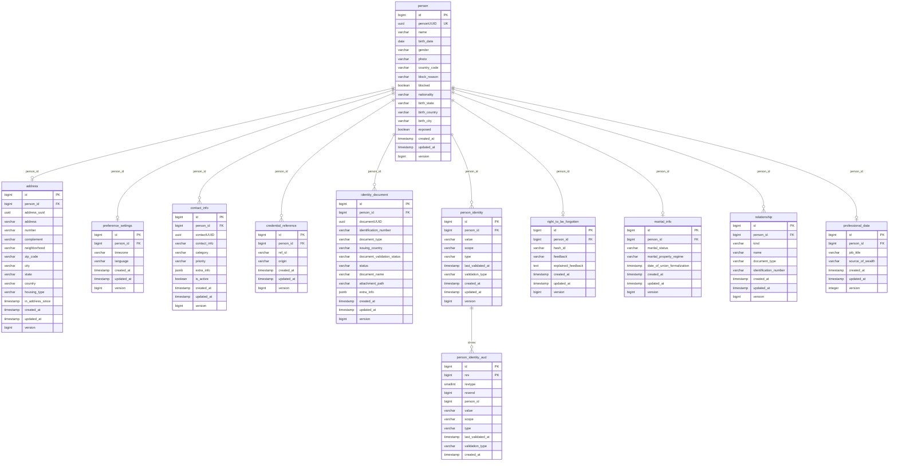
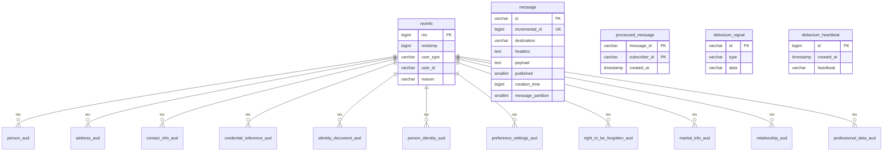

# Person — PostgreSQL Database (Production)

## About Person

**Person** is QuintoAndar's canonical **identity microservice** — the golden record for natural persons across Brazil, Mexico, and related products. It centralizes profile data, government documents, contact channels, authentication credentials, cross-system identities, and GDPR/LGPD compliance (right to be forgotten).

Key responsibilities:

- **Person profile** — name, birth info, gender, nationality, photo, PEP flag, block status
- **Identity resolution** — `person_identity` links email, phone, CPF, RFC, passport, and social logins with validation state
- **Credentials** — maps person to external auth systems (`main` user id, Cognito, Gandalf, Navent Rela)
- **Contacts** — email, phone, push notification with priority and channel preferences
- **Documents** — government-issued identity documents with validation status
- **Privacy** — RTBF flow with hash validation, anonymization, and `PRIVACY_DELETION` block reason
- **Merge** — consolidate duplicate persons (winner/loser pattern)

The legacy **user id** in Main is resolved via `credential_reference` where `origin = 'main'` → `ref_id`.

**Service repository:** [`backend-services/applications/person`](https://github.com/quintoandar/backend-services/tree/master/applications/person)

---

## Identity lifecycle

```
Signup / create person (API or Cognito SQS consumer)
  → person row + contact_info + credential_reference + person_identity
       │
       ▼
Login sync (UserLoggedInEventsConsumer)
  → refresh validation timestamps; idempotent via processed_message
       │
       ▼
Person merge (S2S API)
  → consolidate contacts, documents, credentials, identities
  → publish PersonMerged; delete loser
       │
       ▼
LGPD / GDPR / RTBF
  1. startAnonymization → right_to_be_forgotten (hash_id)
  2. User validates hash via GET /users/me/rtbf/{hashId}
  3. anonymize → scrub PII, block_reason = PRIVACY_DELETION
```

Hibernate Envers audits most entities (`*_aud`). This DAG ingests **`person_identity_aud`** only (not other audit tables).

---

## Connection (production)

| Parameter | Value |
|---|---|
| Engine | PostgreSQL 13 |
| Host (write / CDC source) | `person.db.core-prd.habitat.zone` |
| Host (read replica, API) | `person-ro1.db.core-prd.habitat.zone` |
| Port | `5432` |
| Database | `person` |
| Schema | `public` |
| JDBC URL | `jdbc:postgresql://person.db.core-prd.habitat.zone:5432/person` |
| Driver | `org.postgresql.Driver` |
| Vault credentials | `database/creds/prod-crud-person#username` / `#password` |

**Pipeline schedule:** 3× daily at 08:00, 12:00, 21:00 UTC (`0 21,8,12 * * *`).

**Note:** CDC reads the **primary** writer; the read replica is API routing only.

---

## Entity-relationship diagram

### Core domain tables

This diagram shows **all 11 core domain tables** of the production `person` database, plus the ingested `person_identity_aud`. Ingested tables use **clean layer** naming (`datalake_person_clean`); non-ingested domain tables (`marital_info`, `relationship`, `professional_data`) use OLTP names. All domain tables reference `person` via `person_id`.



### Audit & infrastructure tables

Every core domain table has a Hibernate Envers shadow (`*_aud`) using the ValidityAuditStrategy (`revend` end-revision). All `*_aud` PKs are `(id, rev)`; `rev`/`revend` reference `revinfo`. The `person_id → person.id` FKs on `*_aud` tables were dropped in `V2022_07_06`. Only `person_identity_aud` is ingested by this DAG (shown above). The remaining tables support Eventuate messaging and Debezium CDC.



---

## Tables not ingested

These tables exist in production but are **not** materialized by this DAG.

### Domain tables (not ingested)

| Table | Description | PK | Key column types |
|---|---|---|---|
| `marital_info` | Marital status and property regime (1:1 with person) | `id` | `person_id` BIGINT, `marital_status` VARCHAR(50) (`MaritalStatus`), `marital_property_regime` VARCHAR(100) (`MaritalPropertyRegime`), `date_of_union_formalization` TIMESTAMP |
| `relationship` | Related persons (mother/father/spouse) with optional document | `id` | `person_id` BIGINT, `kind` VARCHAR(50) (`RelationshipKind`), `name` VARCHAR(255), `document_type` VARCHAR(50) (`DocumentType`), `identification_number` VARCHAR(100) |
| `professional_data` | Employment/professional profile (1:1 with person) | `id` | `person_id` BIGINT, `job_title` VARCHAR(255), `source_of_wealth` VARCHAR(64) (`SourceOfWealth`), `version` INTEGER |

### Audit tables (Hibernate Envers, `*_aud`)

Each mirrors its base table's columns plus Envers columns: `rev` BIGINT (**PK part**, → `revinfo.rev`), `revend` BIGINT (→ `revinfo.rev`), `revtype` SMALLINT (0=ADD, 1=MOD, 2=DEL), and per-field `*_mod` BOOLEAN flags. PK is `(id, rev)`. Only `person_identity_aud` is ingested.

| Table | Base table |
|---|---|
| `person_aud` | `person` |
| `address_aud` | `address` |
| `contact_info_aud` | `contact_info` |
| `credential_reference_aud` | `credential_reference` |
| `identity_document_aud` | `identity_document` |
| `person_identity_aud` *(ingested)* | `person_identity` |
| `preference_settings_aud` | `preference_settings` |
| `right_to_be_forgotten_aud` | `right_to_be_forgotten` |
| `marital_info_aud` | `marital_info` |
| `relationship_aud` | `relationship` |
| `professional_data_aud` | `professional_data` |

### Infrastructure tables

| Table | Description | PK | Key column types |
|---|---|---|---|
| `revinfo` | Envers revision metadata (who/when/why changed) | `rev` | `rev` BIGSERIAL, `revtstmp` BIGINT, `user_type` VARCHAR(255) (`RevUserType`), `user_id` VARCHAR(255), `reason` VARCHAR(2048) |
| `message` | Eventuate transactional outbox | `id` | `id` VARCHAR(767), `destination` VARCHAR(1000), `headers`/`payload` TEXT, `published` SMALLINT |
| `processed_message` | Idempotency tracker for consumed messages | `(message_id, subscriber_id)` | `message_id`/`subscriber_id` VARCHAR(255) (`SubscriberId`), `created_at` TIMESTAMP |
| `debezium_signal` | Debezium incremental-snapshot / signaling table | `id` | `id` VARCHAR(42), `type` VARCHAR(32), `data` VARCHAR(2048) |
| `debezium_heartbeat` | Debezium CDC heartbeat keeping the replication slot alive | `id` | `id` BIGSERIAL, `created_at` TIMESTAMP, `heartbeat` VARCHAR |
| `hibernate_sequence` | Legacy Hibernate ID sequence (sequence object, not a table) | — | `START 1 INCREMENT 1` |

---

## Application enum types (VARCHAR in PostgreSQL)

### `BlockReason`

Used by: `person.block_reason` (stored as enum name; default `NOT_BLOCKED`)

| Value | Blocks person | Description |
|---|---|---|
| `NOT_BLOCKED` | false | Person is not blocked |
| `UNBLOCKED` | false | Person explicitly unblocked |
| `CONFIDENTIAL` | true | Blocked for confidentiality |
| `GENERAL` | true | General-purpose block |
| `PRIVACY_DELETION` | true | Blocked due to privacy (RTBF) deletion |
| `PRIVACY_BLOCKED` | true | Blocked for privacy compliance |
| `BYPASS` | true | Bypass / special block state |

### `Gender`

Used by: `person.gender` — entity field is a `String`; the app writes the **lowercase** enum name, and a DB CHECK allows only `male`/`female`.

| Constant | DB value | Description |
|---|---|---|
| `MALE` | `male` | Male gender |
| `FEMALE` | `female` | Female gender |

### `CountryCode`

Used by: `person.country_code` — ISO 3166-1 alpha-2 enum name from the AWS `CountryCode` enum (e.g. `BR`, `MX`, `US`), stored `EnumType.STRING`, length 2.

### `ContactType`

Used by: `contact_info.category` (stored as enum name)

| Value | Description |
|---|---|
| `EMAIL` | Email address contact channel |
| `PHONE` | Phone number contact channel |
| `PUSH_NOTIFICATION` | Mobile push notification token |

> Legacy `Category` enum stored lowercase (`email`, `phone`, `push_notification`); superseded by `ContactType` (the lowercase CHECK was dropped).

### `ContactPriority`

Used by: `contact_info.priority`

| Value | Description |
|---|---|
| `PRIMARY` | Main contact of its type |
| `SECONDARY` | Alternate contact of its type |
| `BUSINESS` | Business-purpose contact channel |

### `CredentialOrigin`

Used by: `credential_reference.origin` (stored as **lowercase string** via `CredentialOriginConverter`; the CHECK constraint was dropped in `V2024_07_16`)

| Constant | Stored `origin` value | Description |
|---|---|---|
| `GANDALF` | `gandalf` | Gandalf authentication system |
| `COGNITO` | `cognito_user_pool` | Cognito Brazil user pool |
| `COGNITO_REDE` | `cognito_rede_user_pool` | Cognito Rede user pool |
| `MAIN` | `main` | Main monolith user id |
| `NAVENT_RELA` | `navent_rela` | Navent Rela integration |

### `DocumentType`

Used by: `identity_document.document_type`, `relationship.document_type` (stored as enum name)

| Value | Description |
|---|---|
| `RG` | Brazilian general identity registry card |
| `CPF` | Brazilian individual taxpayer registry |
| `RNE` | Brazilian foreign national registry |
| `PASSPORT` | International travel passport |
| `CURP` | Mexican unique population registry code |
| `RFC` | Mexican federal taxpayer registry |
| `CRM` | Medical professional council registration |
| `CREA` | Engineering professional council registration |
| `OAB` | Brazilian bar association registration |
| `INSS_BENEFIT_ID` | Brazilian social security benefit identifier |
| `CNH` | Brazilian national driver's license |
| `EMANCIPATION_CERTIFICATE` | Legal minor emancipation certificate |
| `CRECI` | Real-estate professional council registration |
| `SELFIE` | Selfie-based identity verification image |

### `Status`

Used by: `identity_document.status`

| Value | Description |
|---|---|
| `ACTIVE` | Document is active / not logically deleted |
| `INACTIVE` | Document logically deleted |

### `DocumentStatus` (identity document validation)

Used by: `identity_document.document_validation_status` — stored as **lowercase** string, not the constant name.

| Constant | DB value | Description |
|---|---|---|
| `NOT_VALIDATED` | `not_validated` | Validation not yet performed |
| `VALIDATED` | `validated` | Validation confirmed |

### `PersonIdentityType`

Used by: `person_identity.type`, `person_identity_aud.type`. Code groups: `CONTACTS`={EMAIL,PHONE}, `DOCUMENTS`={CPF,RFC,PASSPORT}, `SOCIAL`={APPLE,COGNITO,GOOGLE}.

| Value | Description |
|---|---|
| `EMAIL` | Email identity value |
| `PHONE` | Phone identity value |
| `CPF` | Brazilian CPF identity |
| `RFC` | Mexican RFC identity |
| `PASSPORT` | Passport identity |
| `COGNITO` | Cognito social-login identity |
| `GOOGLE` | Google social-login identity |
| `APPLE` | Apple social-login identity |

### `PersonIdentityScope`

Used by: `person_identity.scope`

| Value | Description |
|---|---|
| `BR` | Brazil-scoped identity |
| `MX` | Mexico-scoped identity |
| `WW` | Worldwide / global scope |
| `COGNITO_USER_POOL_BR` | Cognito user pool Brazil |
| `COGNITO_USER_POOL_MX` | Cognito user pool Mexico |

### `PersonIdentityValidationType`

Used by: `person_identity.validation_type`

| Value | Description |
|---|---|
| `SELF` | Self-validated by the user |
| `INTERNAL` | Validated by internal systems |
| `EXPIRED` | Validation explicitly marked expired |

### `HousingType`

Used by: `address.housing_type` (OLTP — **not in clean SQL**)

| Value | Description |
|---|---|
| `RENTED` | Person rents current residence |
| `OWNED` | Person owns current residence |
| `LIVE_WITH_PARENTS` | Person lives with parents |

### `AnonymizationFeedback`

Used by: `right_to_be_forgotten.feedback`

| Value | Description |
|---|---|
| `DONT_USE_ANYMORE` | No longer uses the platform |
| `ANOTHER_ACCOUNT` | Has another account |
| `TECHNICAL_PROBLEMS` | Experienced technical issues |
| `BETTER_ALTERNATIVE` | Found a better alternative |
| `CUSTOMER_SERVICE` | Customer-service-related reason |
| `COSTS_PROBLEMS` | Cost-related concerns |
| `OTHER` | Other reason (see `explained_feedback`) |

### `MaritalStatus`

Used by: `marital_info.marital_status` (not ingested table)

| Value | Description |
|---|---|
| `SINGLE` | Never married |
| `MARRIED` | Legally married |
| `WIDOWED` | Spouse deceased |
| `DIVORCED` | Legally divorced |
| `SINGLE_IN_STABLE_UNION` | Single in a stable union (Brazil) |

### `MaritalPropertyRegime`

Used by: `marital_info.marital_property_regime` (not ingested table)

| Value | Description |
|---|---|
| `COMMUNITY_OF_ACQUIRED_ASSETS` | Community of acquired assets regime |
| `UNIVERSAL_COMMUNITY_OF_PROPERTY` | Universal community of property |
| `SEPARATION_OF_ASSETS` | Complete separation of assets |
| `PARTICIPATION_IN_ACQUIRED_ASSETS` | Participation in acquired assets |

### `RelationshipKind`

Used by: `relationship.kind` (not ingested table)

| Value | Description |
|---|---|
| `MOTHER` | Person's mother |
| `FATHER` | Person's father |
| `SPOUSE` | Person's spouse |

### `SourceOfWealth`

Used by: `professional_data.source_of_wealth` (not ingested table)

| Value | Description |
|---|---|
| `CLT` | Formal CLT employment (Brazil) |
| `PUBLIC_EMPLOYEE` | Public-sector employee |
| `STUDENT_OR_SCHOLARSHIP` | Student or scholarship holder |
| `RENT_INCOME` | Income from rent |
| `BUSINESS_PERSON` | Business owner / entrepreneur |
| `AUTONOMOUS` | Self-employed / autonomous worker |
| `RETIRED` | Retired person |
| `COMPANY_DIRECTOR` | Company director |
| `LIBERAL_PROFESSIONAL` | Liberal professional (lawyer, doctor, etc.) |

### `Channel` (nested in `contact_info.extra_info` JSONB)

Stored inside `ExtraInfo.preferences[].channel`, not as a column.

| Value | Description |
|---|---|
| `SMS` | SMS communication channel preference |
| `WHATSAPP` | WhatsApp channel preference |
| `EMAIL` | Email channel preference |

### `RevUserType`

Used by: `revinfo.user_type` (audit metadata)

| Value | Description |
|---|---|
| `PERSON` | Change made by a person-service user |
| `MAIN` | Change made by the Main monolith |
| `SERVICE` | Change made by an internal service |

---

## Tables

### `person`

Aggregate root — one row per natural person. `personUUID` is the ecosystem business key.

| Column (OLTP) | Clean alias | Type | Nullable | Constraints |
|---|---|---|---|---|
| `id` | `id` | BIGSERIAL | NOT NULL | **PK** |
| `personUUID` | `uuid_person` | UUID | NOT NULL | Unique, auto-generated |
| `name` | `person_name` | VARCHAR(255) | NULL | **PII** — sanitized on persist |
| `birth_date` | `dt_birth` | DATE | NULL | |
| `gender` | `gender` | VARCHAR(6) | NULL | enum `Gender` |
| `photo` | `photo` | VARCHAR(255) | NULL | |
| `nationality` | — | VARCHAR(255) | NULL | **Not in clean SQL** |
| `birth_city` | — | VARCHAR(255) | NULL | **Not in clean SQL** |
| `birth_state` | — | VARCHAR(255) | NULL | **Not in clean SQL** |
| `birth_country` | — | VARCHAR(255) | NULL | **Not in clean SQL** |
| `exposed` | — | BOOLEAN | NULL | PEP flag — **Not in clean SQL** |
| `country_code` | `country_code` | VARCHAR(2) | NULL | ISO country |
| `block_reason` | `block_reason` | VARCHAR(255) | NULL | enum `BlockReason` |
| `blocked` | `is_blocked` | BOOLEAN | NULL | Legacy flag |
| `version` | `version` | INTEGER | NOT NULL | Optimistic lock |
| `created_at` | `ts_created` | TIMESTAMP | NOT NULL | |
| `updated_at` | `ts_updated` | TIMESTAMP | NOT NULL | |

---

### `address`

Residential address (1:1 with person in practice).

| Column (OLTP) | Clean alias | Type | Nullable | Constraints |
|---|---|---|---|---|
| `id` | `id` | BIGSERIAL | NOT NULL | **PK** |
| `person_id` | `id_person` | BIGINT | NOT NULL | **FK → person.id** |
| `address_uuid` | `uuid_address` | UUID | NOT NULL | Unique |
| `address` | `address` | VARCHAR(255) | NULL | Street — **PII** |
| `number` | `number` | VARCHAR(255) | NULL | |
| `complement` | `complement` | VARCHAR(255) | NULL | |
| `neighborhood` | `neighborhood` | VARCHAR(255) | NULL | |
| `zip_code` | `zip_code` | VARCHAR(255) | NULL | |
| `city` | `city` | VARCHAR(255) | NULL | |
| `state` | `state` | VARCHAR(255) | NULL | |
| `country` | `country` | VARCHAR(255) | NULL | |
| `housing_type` | — | VARCHAR(50) | NULL | enum `HousingType` — **Not in clean SQL** |
| `in_address_since` | — | TIMESTAMP | NULL | **Not in clean SQL** |
| `version` | `version` | INTEGER | NOT NULL | |
| `created_at` | `ts_created` | TIMESTAMP | NOT NULL | |
| `updated_at` | `ts_updated` | TIMESTAMP | NOT NULL | |

---

### `contact_info`

Email, phone, or push notification channel (1:N with person).

| Column (OLTP) | Clean alias | Type | Nullable | Constraints |
|---|---|---|---|---|
| `id` | `id` | BIGSERIAL | NOT NULL | **PK** |
| `person_id` | `id_person` | BIGINT | NOT NULL | **FK → person.id** |
| `contactUUID` | `uuid_contact` | UUID | NOT NULL | Unique |
| `contact_info` | `contact_info` | VARCHAR(255) | NULL | Email/phone value — **PII** |
| `category` | `category` | VARCHAR | NULL | enum `ContactType` |
| `priority` | `priority` | VARCHAR(255) | NULL | enum `ContactPriority` |
| `extra_info` | `extra_info` | JSONB | NULL | Channel preferences |
| `is_active` | `is_active` | BOOLEAN | NULL | |
| `version` | `version` | INTEGER | NOT NULL | |
| `created_at` | `ts_created` | TIMESTAMP | NOT NULL | |
| `updated_at` | `ts_updated` | TIMESTAMP | NOT NULL | |

---

### `credential_reference`

Link to external authentication systems. **`origin = 'main'`** → `ref_id` is the legacy user id.

| Column (OLTP) | Clean alias | Type | Nullable | Constraints |
|---|---|---|---|---|
| `id` | `id` | BIGSERIAL | NOT NULL | **PK** |
| `person_id` | `id_person` | BIGINT | NOT NULL | **FK → person.id** |
| `ref_id` | `id_reference` | VARCHAR(128) | NOT NULL | External user id |
| `origin` | `origin` | VARCHAR(128) | NOT NULL | enum `CredentialOrigin` value |
| `version` | `version` | INTEGER | NOT NULL | |
| `created_at` | `ts_created` | TIMESTAMP | NOT NULL | |
| `updated_at` | `ts_updated` | TIMESTAMP | NOT NULL | |

---

### `identity_document`

Government-issued document (1:N with person).

| Column (OLTP) | Clean alias | Type | Nullable | Constraints |
|---|---|---|---|---|
| `id` | `id` | BIGSERIAL | NOT NULL | **PK** |
| `person_id` | `id_person` | BIGINT | NOT NULL | **FK → person.id** |
| `documentUUID` | `uuid_document` | UUID | NOT NULL | Unique |
| `identification_number` | `identification_number` | VARCHAR(255) | NULL | **PII** — unique (partial indexes) |
| `document_type` | `document_type` | VARCHAR(255) | NULL | enum `DocumentType` |
| `issuing_country` | `issuing_country` | VARCHAR(255) | NULL | |
| `document_validation_status` | `document_validation_status` | VARCHAR(50) | NULL | enum `DocumentStatus` (lowercase) |
| `document_name` | `document_name` | VARCHAR(255) | NULL | |
| `attachment_path` | `attachment_path` | VARCHAR(255) | NULL | |
| `status` | `status` | VARCHAR | NULL | enum `Status` |
| `extra_info` | `extra_info` | JSONB | NULL | |
| `version` | `version` | INTEGER | NOT NULL | |
| `created_at` | `ts_created` | TIMESTAMP | NOT NULL | |
| `updated_at` | `ts_updated` | TIMESTAMP | NOT NULL | |

---

### `person_identity`

Cross-system identity resolution (email, phone, CPF, social login). Uses `person_id` without JPA `@ManyToOne` object.

| Column (OLTP) | Clean alias | Type | Nullable | Constraints |
|---|---|---|---|---|
| `id` | `id` | BIGSERIAL | NOT NULL | **PK** |
| `person_id` | `id_person` | BIGINT | NOT NULL | **FK → person.id** |
| `value` | `value` | VARCHAR(255) | NULL | Identity value — **PII** |
| `scope` | `scope` | VARCHAR(255) | NULL | enum `PersonIdentityScope` |
| `type` | `type` | VARCHAR(255) | NULL | enum `PersonIdentityType` |
| `validation_type` | `validation_type` | VARCHAR(255) | NULL | enum `PersonIdentityValidationType` |
| `last_validated_at` | `ts_last_validated` | TIMESTAMP | NULL | Phone revalidation (180-day rule) |
| `version` | `version` | INTEGER | NOT NULL | |
| `created_at` | `ts_created` | TIMESTAMP | NOT NULL | |
| `updated_at` | `ts_updated` | TIMESTAMP | NOT NULL | |

---

### `person_identity_aud`

Envers audit history for `person_identity`. Composite identity `(id, rev)`.

| Column (OLTP) | Clean alias | Type | Notes |
|---|---|---|---|
| `id` | `id` | BIGINT | **PK (part 1)** |
| `rev` | `rev` | INTEGER | **PK (part 2)** → `revinfo.rev` |
| `revtype` | `rev_type` | SMALLINT | Envers change type |
| `revend` | `rev_end` | INTEGER | Validity end |
| `person_id` | `id_person` | BIGINT | |
| `value` | `value` | VARCHAR(255) | |
| `scope` | `scope` | VARCHAR(255) | |
| `type` | `type` | VARCHAR(255) | |
| `validation_type` | `validation_type` | VARCHAR(255) | |
| `last_validated_at` | `ts_last_validated` | TIMESTAMP | |
| `*_mod` columns | `mod_*` | BOOLEAN | Modified flags |
| `created_at` | `ts_created` | TIMESTAMP | |
| `updated_at` | `ts_updated` | TIMESTAMP | |

---

### `preference_settings`

User preferences (1:1 with person).

| Column (OLTP) | Clean alias | Type | Constraints |
|---|---|---|---|
| `id` | `id` | BIGSERIAL | **PK** |
| `person_id` | `id_person` | BIGINT | **FK → person.id** |
| `timezone` | `timezone` | VARCHAR(255) | |
| `language` | `language` | VARCHAR(255) | |
| `version` | `version` | INTEGER | |
| `created_at` | `ts_created` | TIMESTAMP | |
| `updated_at` | `ts_updated` | TIMESTAMP | |

---

### `right_to_be_forgotten`

GDPR/LGPD deletion request tracking (1:N with person after unique constraint dropped).

| Column (OLTP) | Clean alias | Type | Nullable | Constraints |
|---|---|---|---|---|
| `id` | `id` | BIGSERIAL | NOT NULL | **PK** |
| `person_id` | `id_person` | BIGINT | NOT NULL | **FK → person.id** |
| `hash_id` | `id_anonymization` | VARCHAR(255) | NULL | Validation token (2-day expiry) |
| `feedback` | `feedback` | VARCHAR(255) | NULL | enum `AnonymizationFeedback` |
| `explained_feedback` | `explained_feedback` | TEXT | NULL | Free-text when `OTHER` |
| `version` | `version` | INTEGER | NOT NULL | |
| `created_at` | `ts_created` | TIMESTAMP | NOT NULL | |
| `updated_at` | `ts_updated` | TIMESTAMP | NOT NULL | |

---

## Sensitive columns summary

| Table | Columns | Handling |
|---|---|---|
| `person` | `person_name`, `dt_birth`, `photo` | PII |
| `address` | full address fields | Location PII |
| `contact_info` | `contact_info` | Email/phone PII |
| `identity_document` | `identification_number`, `attachment_path` | Document PII |
| `person_identity` | `value` | Email/phone/CPF PII |
| `credential_reference` | `ref_id` | Auth linkage |
| `right_to_be_forgotten` | `hash_id`, `explained_feedback` | Privacy workflow |

---

## Datalake outputs

| Layer | Schema | Tables |
|---|---|---|
| Raw | `datalake_person_raw` | 9 source tables (CDC) |
| Clean | `datalake_person_clean` | 9 normalized tables (see `queries/clean/`) |