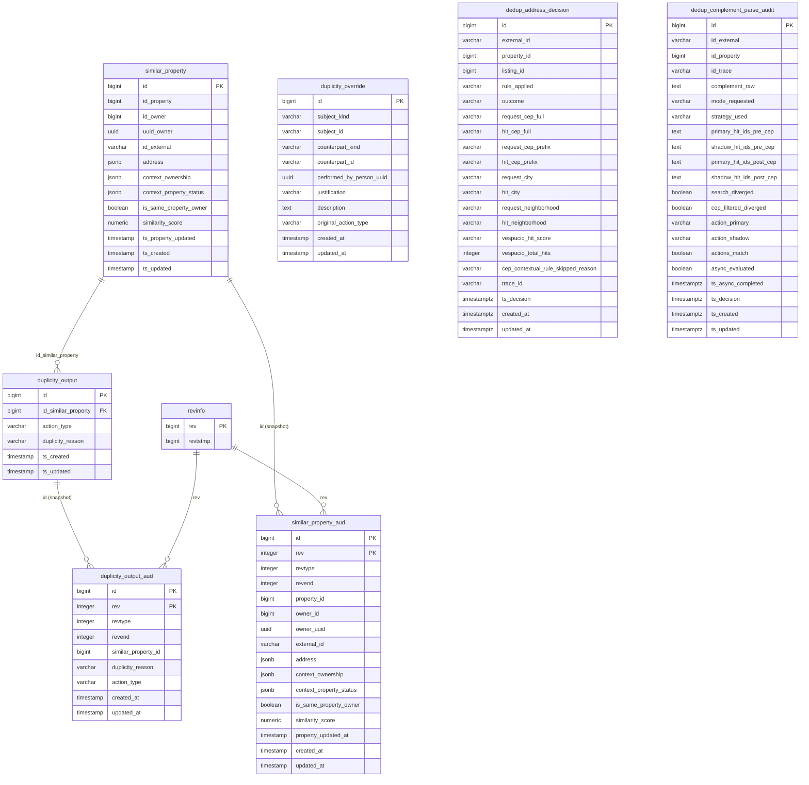

# Property Dedup — PostgreSQL Database (Production)

## About Property Dedup

**Property Dedup** is QuintoAndar's microservice for **detecting duplicate property listings by address** during supply and registration flows. When a partner or internal system submits a new property, the service searches for address-matched candidates (via **Vespucio** in current v2/v3 APIs, or **Yellow-Pages** in legacy v1), enriches each candidate with listing data from **Main**, and runs a **JEasy Rules** engine to classify the match as **BLOCK**, **ALERT**, or **ALLOW**.

Each evaluation persists a candidate row (`similar_property`) and its rules outcome (`duplicity_output`). Analysts can register directed bypasses in `duplicity_override` (not ingested by this DAG) to coerce BLOCK/ALERT into ALLOW for specific subject–counterpart pairs.

Primary consumers: **brokers-supply-processor**, **portfolio-manager**, **backoffice-bff**, **backend-for-bots**, **bob-o-construtor**.

**Service repository:** [`backend-services/applications/property-dedup`](https://github.com/quintoandar/backend-services/tree/master/applications/property-dedup)  
**Rules engine:** [`docs/applications/property-dedup/rules.md`](https://github.com/quintoandar/backend-services/blob/master/docs/applications/property-dedup/rules.md)  
**Architecture:** [`applications/property-dedup/docs/polaris-property-dedup.md`](https://github.com/quintoandar/backend-services/blob/master/applications/property-dedup/docs/polaris-property-dedup.md)

---

## Dedup check lifecycle

```
HTTP API (v2/v3 check-property-duplicity)
       │
       ▼
Address search (Vespucio) ──► CEP filter (strict 8-digit or contextual 5-digit prefix)
       │
       ▼
Main enrichment (house summary + listing context per candidate)
       │
       ▼
For each candidate (skip self-match):
  build SimilarProperty snapshot
  run rules engine (unified / thirdParty / standard)
       │
       ▼
Persist similar_property + duplicity_output (BLOCK/ALERT only)
       │
       ▼
Apply duplicity_override bypass if eligible (runtime only; table not CDC'd)
       │
       ▼
Return duplicate list to caller
```

**Modern flow (v2/v3):** candidates with `action_type = ALLOW` are filtered out before the API response; only BLOCK and ALERT hits are returned (v3 returns all matches; v2 third-party returns first match).

---

## Connection (production)

| Parameter | Value |
|---|---|
| Engine | PostgreSQL |
| Host | `propertydedup.db.core-prd.habitat.zone` |
| Port | `5432` |
| Database | `propertydedup` |
| Schema | `public` |
| JDBC URL | `jdbc:postgresql://propertydedup.db.core-prd.habitat.zone:5432/propertydedup` |
| Driver | `org.postgresql.Driver` |
| Databricks secret | `PROPERTY_DEDUP_DB` (DAG `dbutils_secret_key`) |

**Forno (shared):** `pgsqlshared.db.core-frn.habitat.zone:5432/propertydedup`  
**Staging:** `sharedpsql11.db.core-stg.habitat.zone:5432/propertydedup`

**Pipeline schedule:** daily at 00:00 UTC (`0 0 * * *`).

---

## Entity-relationship diagram

The diagram shows **all tables in the production `propertydedup` database**. Ingested tables (`similar_property`, `duplicity_output`, `dedup_complement_parse_audit`) use **clean layer** naming (`datalake_property_dedup_clean`); non-ingested tables use their OLTP column names. Only `duplicity_output → similar_property` is a real DB foreign key; audit/`rev` links and cross-system IDs are logical references.



---

## Tables not ingested

These tables exist in the production database but are **not** materialized by this DAG. Each row shows the table's grain/purpose, primary key, and key column types.

### `duplicity_override`

Directed analyst bypass — a persistent "not a duplicate" edge between a subject and a counterpart listing. Grain: one row per subject–counterpart pair. **PK:** `id` (`BIGSERIAL`). **Unique:** `(subject_kind, subject_id, counterpart_kind, counterpart_id)`.

| Column | Type | Notes |
|---|---|---|
| `id` | BIGSERIAL | **PK** |
| `subject_kind` | VARCHAR(50) | enum `DuplicityOverrideEntityKind` |
| `subject_id` | VARCHAR(255) | UUID (3P) or numeric Main property id |
| `counterpart_kind` | VARCHAR(50) | enum `DuplicityOverrideEntityKind` |
| `counterpart_id` | VARCHAR(255) | UUID (3P) or numeric Main property id |
| `performed_by_person_uuid` | UUID | Analyst Person UUID |
| `justification` | VARCHAR(100) | enum `DuplicityOverrideJustification` |
| `description` | TEXT | Free-text analyst note |
| `original_action_type` | VARCHAR(20) | enum `ActionType` overridden |
| `created_at` / `updated_at` | TIMESTAMP | DEFAULT `now()` |

### `dedup_address_decision`

Durable CEP/address-filter audit trail (one row per hit decision or per request-level skip). **PK:** `id` (`BIGSERIAL`). Indexed on `external_id`, `property_id`, `created_at`.

| Column | Type | Notes |
|---|---|---|
| `id` | BIGSERIAL | **PK** |
| `external_id` | VARCHAR(255) | 3P external listing id |
| `property_id` | BIGINT | Main property id |
| `listing_id` | BIGINT | Main listing id |
| `rule_applied` | VARCHAR(64) | enum `DedupAddressRuleApplied` (wire value) |
| `outcome` | VARCHAR(32) | enum `DedupAddressFilterOutcome` (wire value) |
| `request_cep_full` / `hit_cep_full` | VARCHAR(8) | Full 8-digit CEP |
| `request_cep_prefix` / `hit_cep_prefix` | VARCHAR(5) | 5-digit CEP prefix |
| `request_city` / `hit_city` | VARCHAR(255) | City names compared |
| `request_neighborhood` / `hit_neighborhood` | VARCHAR(255) | Neighborhood names compared |
| `vespucio_hit_score` | VARCHAR(32) | Vespucio match score (string) |
| `vespucio_total_hits` | INTEGER | Number of Vespucio candidates |
| `cep_contextual_rule_skipped_reason` | VARCHAR(64) | enum `DedupAddressCepSkipReason` (wire value) |
| `trace_id` | VARCHAR(128) | Request trace id |
| `ts_decision` | TIMESTAMPTZ | When decision was made |
| `created_at` / `updated_at` | TIMESTAMPTZ | DEFAULT `now()` |

### `similar_property_aud`

Hibernate Envers row-level history of `similar_property` (validity strategy with `revend`). **PK:** `(id, rev)`. Columns mirror `similar_property` plus `rev` `INTEGER`, `revtype` `INTEGER` (0=ADD, 1=MOD, 2=DEL), `revend` `INTEGER`, and per-field `*_mod` `BOOLEAN` flags. **FK:** `rev → revinfo.rev`.

### `duplicity_output_aud`

Hibernate Envers row-level history of `duplicity_output`. **PK:** `(id, rev)`. Columns mirror `duplicity_output` plus `rev` `INTEGER`, `revtype` `INTEGER`, `revend` `INTEGER`. **FK:** `rev → revinfo.rev`.

### `revinfo`

Envers revision header — one row per audit revision. **PK:** `rev`.

| Column | Type | Notes |
|---|---|---|
| `rev` | BIGSERIAL | **PK** |
| `revtstmp` | BIGINT | Revision epoch (ms) |

---

## Application enum types (VARCHAR in PostgreSQL)

Enums are stored as **VARCHAR** with the Java enum constant name (e.g. `BLOCK`, `RENT`).

### `duplicity_reason`

Used by: `duplicity_output.duplicity_reason`, `duplicity_output_aud.duplicity_reason`

**Unified rules (current):**

| Value | Action | Description |
|---|---|---|
| `DUPLICATE_PUBLISHED_HOUSE_DIFFERENT_CONTEXT_SAME_OWNER` | ALERT | Published duplicate, same owner, different RENT/SALE context |
| `DUPLICATE_THIRD_PARTY_PUBLISHED` | BLOCK | Third-party (3P) similar property is published |
| `DUPLICATE_FIRST_PARTY_PUBLISHED` | BLOCK | First-party (1P) similar property is published |
| `DUPLICATE_THIRD_PARTY_SUSPENDED` | BLOCK | Third-party similar property is suspended |
| `DUPLICATE_FIRST_PARTY_SUSPENDED` | BLOCK | First-party similar property is suspended |
| `DUPLICATE_UNPUBLISHED_HOUSE` | ALLOW | Similar property is unpublished (legacy/generic rule) |
| `DUPLICATE_UNPUBLISHED_HOUSE_UNSAFE_REASONS` | ALLOW | Unpublished for an unsafe reason; republish allowed |
| `DUPLICATE_UNPUBLISHED_HOUSE_SAFE_REASONS_AVAILABLE_AFTER_UNPUBLISHED` | ALLOW | Safe unpublish reason; cooldown elapsed, allow again |
| `DUPLICATE_UNPUBLISHED_HOUSE_SAFE_REASONS_AVAILABLE_BEFORE_UNPUBLISHED` | ALERT | Safe unpublish reason; still inside cooling period |
| `DUPLICATE_HOUSE_NOT_RECENT_EDITING_STATUS` | ALLOW | In EDITING but not recently updated |
| `DUPLICATE_HOUSE_RECENT_EDITING_STATUS` | ALERT | In EDITING and recently updated |

**Legacy rules (still in enum):**

| Value | Action | Description |
|---|---|---|
| `DUPLICATE_3P_HYBRID_CONTEXT_AFTER_PUBLISH_STATUS` | BLOCK | 3P with hybrid rent/sale post-publish status mix |
| `DUPLICATE_3P_RENT_AFTER_PUBLISH_STATUS` | BLOCK | 3P RENT context after publish threshold |
| `DUPLICATE_3P_SALE_AFTER_PUBLISH_STATUS` | BLOCK | 3P SALE context after publish threshold |
| `DUPLICATE_DIFFERENT_OWNER_AFTER_PUBLISH_STATUS` | BLOCK | Different owner, post-publish status |
| `DUPLICATE_SAME_OWNER_AFTER_PUBLISH_STATUS` | BLOCK | Same owner, post-publish status |
| `DUPLICATE_3P_BEFORE_PUBLISH_STATUS` | ALERT | 3P unpublished/editing before publish |
| `DUPLICATE_DIFFERENT_OWNER_BEFORE_PUBLISH_STATUS` | ALERT | Different owner before publish |
| `DUPLICATE_SAME_OWNER_BEFORE_PUBLISH_STATUS` | ALERT | Same owner before publish |
| `DUPLICATE_FIRST_PARTY_RECENT_EDITING_UPDATE` | BLOCK | 1P with recent editing-status update |
| `DUPLICATE_FIRST_PARTY_RECENT_UNPUBLISHED_UPDATE` | BLOCK | 1P with recent unpublished-status update |
| `DUPLICATE_THIRD_PARTY_RECENT_EDITING_UPDATE` | BLOCK | 3P with recent editing-status update |
| `DUPLICATE_THIRD_PARTY_RECENT_UNPUBLISHED_UPDATE` | BLOCK | 3P with recent unpublished-status update |

**Default / override:**

| Value | Action | Description |
|---|---|---|
| `PROPERTY_NOT_DUPLICATED` | ALLOW | Default when no duplicate rule matched |
| `DUPLICITY_OVERRIDDEN` | ALLOW | Persisted analyst override allows this subject–counterpart pair |

### `action_type` (`ActionType`)

Used by: `duplicity_output.action_type`, `duplicity_output_aud.action_type`, `duplicity_override.original_action_type`

| Value | Description |
|---|---|
| `BLOCK` | Duplicate detected; caller must block listing/publication |
| `ALERT` | Duplicate detected; warn caller but do not hard-block |
| `ALLOW` | Duplicate found (or override applied) but publication is permitted |

### `BusinessContext` (JSONB map keys)

Used by: `similar_property.context_ownership`, `similar_property.context_property_status`

| Value | Description |
|---|---|
| `RENT` | Rental listing business context |
| `SALE` | Sale listing business context |

### `Ownership` (JSONB map values in `context_ownership`)

| Value | Description |
|---|---|
| `STANDARD` | @Deprecated legacy standard ownership — use `FIRST_PARTY` |
| `THIRD_PARTY` | 3P / Rede listing not owned by 5A |
| `FIRST_PARTY` | 1P listing owned by 5A and related entities |

### `PropertyStatus` (JSONB map values in `context_property_status`)

| Value | Description |
|---|---|
| `EDITING` | Property/listing in editing / pre-publish workflow |
| `PUBLISHED` | Published / live listing |
| `UNPUBLISHED` | Listing taken offline |
| `SUSPENDED` | Suspended listing |
| `OPTED_OUT` | @Deprecated legacy opted-out status |
| `EXCLUDED` | Maps Main `ListingStatus.OPTED_OUT`; replaces `OPTED_OUT` long-term |

### `DuplicityOverrideEntityKind`

Used by: `duplicity_override.subject_kind`, `duplicity_override.counterpart_kind`

| Value | Description |
|---|---|
| `THIRD_PARTY` | Third-party listing side; id is the UUID external id |
| `MAIN_PROPERTY` | Main property side; id is the numeric property id |

### `DuplicityOverrideJustification`

Used by: `duplicity_override.justification`

| Value | Description |
|---|---|
| `PROPERTY_DUPLICATION_DISMISS_BY_ANALYSTS` | Analysts dismissed the property as a non-duplicate |

### `DedupAddressRuleApplied`

Used by: `dedup_address_decision.rule_applied` (stores the **wire value**, not the constant name).

| Value (wire) | Constant | Description |
|---|---|---|
| `strict_full_cep` | `STRICT_FULL_CEP` | Full 8-digit CEP strict match rule |
| `contextual_prefix_cep` | `CONTEXTUAL_PREFIX_CEP` | 5-digit CEP prefix + city/neighborhood contextual rule |
| `strict_fallback` | `STRICT_FALLBACK` | Fallback path when contextual CEP cannot run |

### `DedupAddressFilterOutcome`

Used by: `dedup_address_decision.outcome` (stores the **wire value**).

| Value (wire) | Constant | Description |
|---|---|---|
| `kept` | `KEPT` | Similar hit kept after CEP filter |
| `dropped` | `DROPPED` | Similar hit removed by CEP filter |
| `filter_unchanged` | `FILTER_UNCHANGED` | Filter did not change candidates (e.g. request-level skip) |

### `DedupAddressCepSkipReason`

Used by: `dedup_address_decision.cep_contextual_rule_skipped_reason` (stores the **wire value**).

| Value (wire) | Constant | Description |
|---|---|---|
| `INVALID_OR_MISSING_CEP` | `INVALID_OR_MISSING_CEP` | Contextual CEP rule skipped due to invalid/missing CEP |

### `UnpublishedReasons` (used by rules engine via Main enrichment, not stored as column)

Values consumed when evaluating unpublished duplicates (`safeReason = true` allows re-publish after a cooldown; `false` always allows retry):

| Value | Safe | Description |
|---|---|---|
| `OWNER_DOESNT_AGREE` | false | Owner disagrees with terms/process |
| `HOUSE_NOT_REACHABLE` | false | Property could not be reached |
| `OWNER_OTHER` | false | Other owner-related reason |
| `HOUSE_NOT_AVAILABLE_REPORTED_BY_AGENT` | false | Agent reported house unavailable |
| `HOUSE_NOT_AVAILABLE_REPORTED_BY_PORTFOLIO_MANAGER` | false | Portfolio manager reported unavailable |
| `OWNER_RENTING_FOR_SHORT_PERIOD` | true | Owner renting short-term elsewhere |
| `OWNER_REQUESTED_TERMINATION` | true | Owner requested contract/listing termination |
| `OWNER_GAVE_UP_RENTING` | true | Owner gave up renting |
| `OWNER_RENTING_DIRECT_WITH_TENANT` | true | Owner renting directly to tenant |
| `OWNER_RENTING_WITH_OTHER_COMPANY` | true | Owner renting via another company |
| `OWNER_SELLING_HOUSE` | true | Owner is selling the house |
| `OWNER_ALREADY_SOLD_HOUSE` | true | Owner already sold the house |
| `OWNER_GAVE_UP_SALE` | true | Owner gave up selling |
| `OWNER_RENTED_HOUSE` | true | Owner already rented the house |
| `HOUSE_NOT_AVAILABLE` | true | House not available |
| `OWNER_MISSED_NEGOTIATIONS_LIMIT_REACHED` | true | Owner missed the negotiation limit |
| `DUPLICATED_HOUSE` | true | Unpublished because it was a duplicate |
| `REMOVED_FROM_CONTEXT_BEFORE_PUBLISHING` | true | Removed from context before publishing |
| `OWNER_CONSEQUENCES_MANAGEMENT` | true | Owner consequences-management action |
| `REQUEST_BY_OWNER_REAL_STATE` | true | Request by owner via real-estate channel |
| `CONSEQUENCES_MANAGEMENT` | true | Consequences management (generic) |
| `ADVANCED_OFFER` | true | Advanced offer in progress |
| `CONTRACT_ONGOING` | true | Contract already ongoing |

---

## Tables

### `similar_property`

Snapshot of a **duplicate candidate** returned by address search and enriched from Main. One row per evaluated candidate per dedup check. Grain: one row per persisted candidate match (typically BLOCK/ALERT outcomes).

| Column (OLTP) | Clean alias | Type | Nullable | Constraints |
|---|---|---|---|---|
| `id` | `id` | BIGSERIAL | NOT NULL | **PK** |
| `property_id` | `id_property` | BIGINT | NULL | Main house ID of the candidate |
| `owner_id` | `id_owner` | BIGINT | NULL | Requesting owner Main ID |
| `owner_uuid` | `uuid_owner` | UUID | NULL | Owner Person UUID (added V7) |
| `external_id` | `id_external` | VARCHAR(255) | NULL | Requesting listing external ID; indexed |
| `address` | `address` | JSONB | NOT NULL | Address snapshot (see keys below) |
| `context_ownership` | `context_ownership` | JSONB | NULL | Map `RENT`/`SALE` → `Ownership` |
| `context_property_status` | `context_property_status` | JSONB | NULL | Map `RENT`/`SALE` → `PropertyStatus` |
| `is_same_property_owner` | `is_same_property_owner` | BOOLEAN | NULL | Same owner as candidate |
| `similarity_score` | `similarity_score` | NUMERIC(10,7) | NOT NULL | Vespucio match score |
| `property_updated_at` | `ts_property_updated` | TIMESTAMP | NULL | Candidate last update from Main |
| `created_at` | `ts_created` | TIMESTAMP | NOT NULL | DEFAULT `now()` |
| `updated_at` | `ts_updated` | TIMESTAMP | NOT NULL | DEFAULT `now()` |

**`address` JSONB keys** (from `SimilarPropertyMapperUtils`): `address`, `number`, `complement`, `neighborhood`, `city`, `state`, `zipCode`, `lat`, `lng`, `countryCode`, `floor`, `building`, `unit`

**Index:** `similar_property_property_id_index` on `(property_id)`; `idx_similar_property_external_id` on `(external_id)`

---

### `duplicity_output`

Rules-engine outcome for a single `similar_property` candidate. Persisted 1:1 with each saved candidate (BLOCK/ALERT). Grain: one row per `similar_property_id`.

| Column (OLTP) | Clean alias | Type | Nullable | Constraints |
|---|---|---|---|---|
| `id` | `id` | BIGSERIAL | NOT NULL | **PK** |
| `similar_property_id` | `id_similar_property` | BIGINT | NULL | **FK → similar_property.id** |
| `duplicity_reason` | `duplicity_reason` | VARCHAR | NOT NULL | enum `DuplicityReason` |
| `action_type` | `action_type` | VARCHAR | NOT NULL | enum `ActionType` |
| `created_at` | `ts_created` | TIMESTAMP | NOT NULL | DEFAULT `now()` |
| `updated_at` | `ts_updated` | TIMESTAMP | NOT NULL | DEFAULT `now()` |

**Index:** `duplicity_output_similar_property_id_index` on `(similar_property_id)`

---

### `dedup_complement_parse_audit`

Complement parser shadow audit — one row per dedup request when audit is enabled. Compares legacy regex vs Atlas address-parser outputs, vespucio search divergence, and (after async enrichment) full duplicity pipeline actions. Grain: one row per audited request. **PK:** `id` (`BIGSERIAL`). Indexed on `external_id`, `property_id`, `created_at`.

| Column (OLTP) | Clean alias | Type | Nullable | Notes |
|---|---|---|---|---|
| `id` | `id` | BIGSERIAL | NOT NULL | **PK** |
| `external_id` | `id_external` | VARCHAR | NULL | 3P external listing id |
| `property_id` | `id_property` | BIGINT | NULL | Main property id |
| `trace_id` | `id_trace` | VARCHAR | NULL | Request trace id |
| `complement_raw` | `complement_raw` | TEXT | NULL | Original complement string |
| `mode_requested` | `mode_requested` | VARCHAR | NULL | LEGACY, ATLAS, AUTO, SHADOW |
| `strategy_used` | `strategy_used` | VARCHAR | NULL | NONE, LEGACY, ATLAS, LEGACY_FALLBACK |
| `fallback_reason` | `fallback_reason` | VARCHAR | NULL | Atlas fallback reason |
| `legacy_unit` / `legacy_building` | same | VARCHAR | NULL | Legacy parser output |
| `legacy_empty` | `legacy_empty` | BOOLEAN | NULL | |
| `atlas_unit` / `atlas_building` | same | VARCHAR | NULL | Atlas parser output |
| `atlas_empty` | `atlas_empty` | BOOLEAN | NULL | |
| `atlas_error` | `atlas_error` | TEXT | NULL | |
| `components_match` | `components_match` | BOOLEAN | NULL | Parsers agree on unit+building |
| `primary_total_hits` / `shadow_total_hits` | same | INTEGER | NULL | ES hit counts |
| `search_diverged` | `search_diverged` | BOOLEAN | NULL | ES result sets differ |
| `primary_hit_ids_pre_cep` | `primary_hit_ids_pre_cep` | TEXT | NULL | JSON array of house IDs pre-CEP (V11) |
| `shadow_hit_ids_pre_cep` | `shadow_hit_ids_pre_cep` | TEXT | NULL | JSON array of house IDs pre-CEP (V11) |
| `primary_hit_ids_post_cep` | `primary_hit_ids_post_cep` | TEXT | NULL | JSON array post-CEP filter |
| `shadow_hit_ids_post_cep` | `shadow_hit_ids_post_cep` | TEXT | NULL | JSON array post-CEP filter |
| `cep_filtered_diverged` | `cep_filtered_diverged` | BOOLEAN | NULL | Post-CEP ID sets differ |
| `action_primary` / `action_shadow` | same | VARCHAR | NULL | BLOCK, ALERT, ALLOW (async) |
| `actions_match` | `actions_match` | BOOLEAN | NULL | Production decision would change |
| `async_evaluated` | `async_evaluated` | BOOLEAN | NOT NULL | DEFAULT false |
| `async_completed_at` | `ts_async_completed` | TIMESTAMPTZ | NULL | |
| `ts_decision` | `ts_decision` | TIMESTAMPTZ | NOT NULL | Sync audit timestamp |
| `created_at` | `ts_created` | TIMESTAMPTZ | NOT NULL | DEFAULT `now()` |
| `updated_at` | `ts_updated` | TIMESTAMPTZ | NOT NULL | DEFAULT `now()` |

---

## Sensitive columns summary

| Table | Columns | Handling |
|---|---|---|
| `similar_property` | `address` (street, lat/lng) | Location PII — may contain full address |
| `dedup_complement_parse_audit` | `complement_raw` | May contain apartment/building complement text |

---

## Datalake outputs

| Layer | Schema | Tables |
|---|---|---|
| Raw | `datalake_property_dedup_raw` | 3 source tables (CDC) |
| Clean | `datalake_property_dedup_clean` | 3 normalized tables (`similar_property`, `duplicity_output`, `dedup_complement_parse_audit`) |