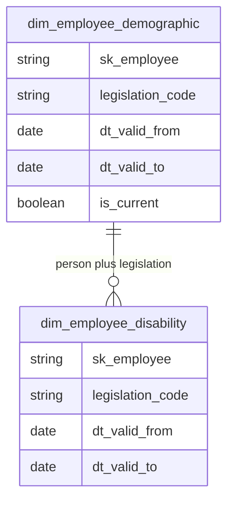

# dw_demographics — data model (GitHub)

This file is the **technical companion** to [`dw_demographics.md`](dw_demographics.md). It is meant to be read on **GitHub**, where relationship diagrams display as intended.

**Schema:** `dw_demographics` · **Pipeline:** `bietlejuice.dw_demographics`

**Columns:** Full column lists, types, and definitions are in **DataHub** (fed from repo metadata). This file focuses on **entity grain**, **relationships**, and **join patterns**.

---

## Entity overview

| Object | Grain (primary) |
|--------|------------------|
| `dim_employee_demographic` | One row per employee per legislation per **period** where the DE&I attribute set stayed the same; when something changes, a new period opens and prior periods stay for reporting as-of past dates. |
| `dim_employee_disability` | One row per **documented disability record** per employee per legislation over its validity window; a person can have zero, one, or many rows. |

---

## Relationships (within schema)

Link **`dim_employee_demographic`** to **`dim_employee_disability`** on **`sk_employee`** and **`legislation_code`**, and constrain rows so **validity intervals overlap** when you need disability detail aligned to a demographic window.

---

## Cross-schema relationships

| Consumer | Join pattern |
|----------|----------------|
| `dw_people.fact_employees` | Join on **`sk_employee`**. For a **monthly** fact row, ensure the demographic row’s validity window **covers** **`fact_employees.dt_reference`** (or filter **`dim_employee_demographic`** to **`is_current = true`** when you only need today’s profile against the latest fact). |
| `dw_organization.*` | Org and job context usually come **through** **`fact_employees`** (cost center, business unit, job keys), not directly from this schema. |

---

## Join cheatsheet (typical)

- **Current profile + optional disability:** `dim_employee_demographic` with **`is_current = true`** **LEFT JOIN** `dim_employee_disability` on **`sk_employee`**, **`legislation_code`**, and overlapping **`dt_valid_from` / `dt_valid_to`** with the demographic row.
- **Headcount or composition by org slice:** start from **`dw_people.fact_employees`** for the month and activity rules, then join **`dim_employee_demographic`** on **`sk_employee`** and date alignment as above — this schema does **not** store headcount; it enriches people with DE&I attributes.
