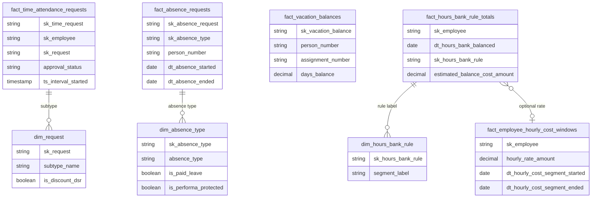

# dw_time — data model (GitHub)

This file is the **technical companion** to [`dw_time.md`](dw_time.md). It is meant to be read on **GitHub**, where relationship diagrams display as intended.

**Schema:** `dw_time` · **Pipeline:** `bietlejuice.dw_time`

**Columns:** Full column lists, types, and definitions are in **DataHub** (fed from repo metadata). This file focuses on **entity grain**, **relationships**, and **join patterns**.

---

## Entity overview

| Object | Grain (primary) |
|--------|------------------|
| `fact_time_attendance_requests` | One row per workforce time **request** after mapping the employee to **PIN**; includes approval fields and interval timestamps. |
| `dim_request` | One row per **request subtype** from the time product (labels, paid default, DSR-related default). |
| `dim_absence_type` | One row per **Oracle HCM absence type** (name, max duration, paid-leave and performance-protection flags). |
| `fact_absence_requests` | One row per **PIN absence request** for employees in scope (approval and validity flags, date range). |
| `fact_vacation_balances` | One row per **employee assignment per vacation period** (accrued, taken, balance). |
| `fact_employee_hourly_cost_windows` | One row per **hourly salary segment** from the time integration (valid between segment dates). |
| `fact_hours_bank_rule_totals` | One row per employee per **balance date** per **hours-bank rule key**; optional **estimated cost** when a rate window applies. |
| `dim_hours_bank_rule` | One row per **rule segment** reference for labeling hours-bank lines. |

---

## Relationships (within `dw_time`)

---

## Cross-schema relationships

| Consumer | Join pattern |
|----------|----------------|
| `dw_people.dim_employee` | **`sk_employee`** (or **`person_number`**) for display name and work email. |
| `dw_people.dim_management_hierarchy` | **`fact_time_attendance_requests.person_number`** → **`dim_management_hierarchy.person_number`** for direct manager and **L0–L9** chain. |
| `dw_people.fact_employees` | **`sk_employee`** and **`dt_reference =`** **month-end** of the calendar month containing **`ts_interval_started`** (primary assignment snapshot); carries **`sk_cost_center_version`**, **`sk_job`**, **`sk_business_unit`**, **`sk_manager_hierarchy`**. |
| `dw_organization.dim_cost_center` | From **`fact_employees.sk_cost_center_version`** → **`dim_cost_center.sk_cost_center_version`** (attributes such as **`vertical`**, **`cost_center_name`**). |
| `dw_organization.dim_job` | From **`fact_employees.sk_job`** → **`dim_job.sk_job`** (**`job_name`**, **`job_family`**). |
| `dw_organization.dim_business_unit` | From **`fact_employees.sk_business_unit`** → **`dim_business_unit.sk_business_unit`**. |

---

## Join cheatsheet (typical)

- **Approvals with org slice for the request month:** `fact_time_attendance_requests` → **`dw_people.fact_employees`** on **`sk_employee`** and **`dt_reference = LAST_DAY(TO_DATE(ts_interval_started))`** → **`dw_organization.dim_cost_center`** on **`sk_cost_center_version`**.
- **Approvals with direct manager:** `fact_time_attendance_requests` → **`dw_people.dim_management_hierarchy`** on **`person_number`**.
- **PIN absence requests with type labels:** `fact_absence_requests` → **`dim_absence_type`** on **`sk_absence_type`**; join **`dw_people`** on **`person_number`** for employee context.
- **Vacation balance by assignment:** `fact_vacation_balances` on **`person_number`** and **`assignment_number`**; filter **`is_latest_period = TRUE`** for current period.
- **Order-of-magnitude payroll risk from bank balances:** `fact_hours_bank_rule_totals` **LEFT JOIN** **`dim_hours_bank_rule`** on **`sk_hours_bank_rule`**; use **`estimated_balance_cost_amount`** and subtype flags from **`dim_request`** only when the analysis is explicitly tied to **request lines**, not as a substitute for payroll.

---

## Notes for approval dashboards

- **Payroll close date** and **countdown** are usually modeled **outside** `dw_time` (HR calendar or parameters in Looker Studio). Join by **company** and **calendar month** when a calendar exists.
- **`approval_status`** follows **English** values from the integration (**`pending`**, **`approved`**, **`declined`**, **`ignored`**). Map to localized labels in the presentation layer.
- **`dw_compensation`** is generally **not** required for approval backlog views; sensitive **hourly** amounts for rough impact already live in **`fact_employee_hourly_cost_windows`**. **Payroll** remains authoritative for pay.
