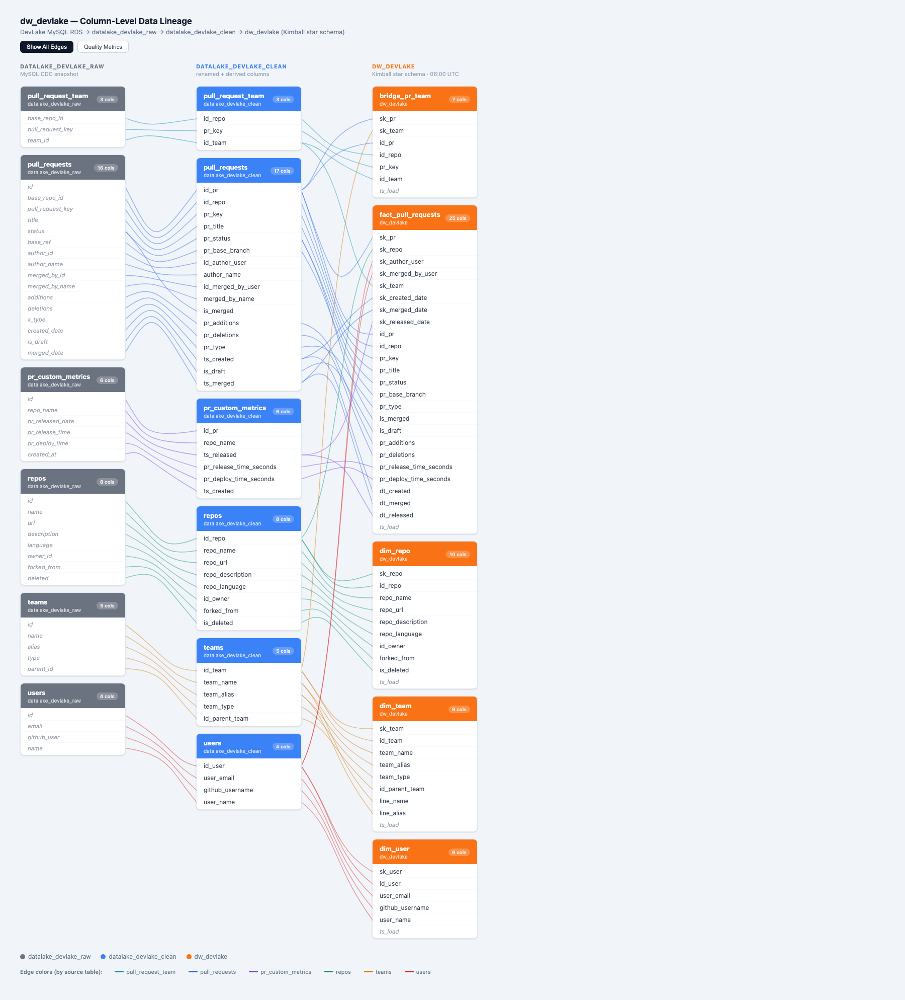

# dw_devlake — Engineering Metrics Dimensional Model

## Overview

Kimball dimensional model on top of DevLake clean data. Exposes engineering velocity and quality metrics in the `dw_devlake` schema, ready for cross-domain analysis alongside business data in Databricks.

## Data Lineage

Interactive column-level lineage across all three pipeline layers (raw → clean → dw).

[](lineage_diagram.html)

> **[Open interactive lineage diagram](https://htmlpreview.github.io/?https://github.com/quintoandar/bi-etl-ejuice/blob/feat/dw-devlake-engineering-metrics/dags/tech_platform/dw_devlake/lineage_diagram.html)** — renders directly in the browser, no download needed.
>
> Or open [`lineage_diagram.html`](lineage_diagram.html) locally after cloning.

**Interactive features:**

- **Dim-by-default** — edges are faint until you hover, eliminating visual clutter
- **Hover highlighting** — hover a column to see its full lineage path; hover a table header to see all its connections
- **Color-coded edges** — each source table has a unique color (click the edge legend to filter)
- **Transformation labels** — hover shows what each mapping does (passthrough, rename, SHA2→SK, ts→dt, derive, etc.)
- **Quality Metrics** — click the button to see edge crossing counts and validation metrics
- **Show All Edges** — toggle to display all connections at once (useful for screenshots)

**Algorithms used:**

- **Sugiyama barycenter heuristic** — tables within each layer are ordered to minimize edge crossings
- **Edge bundling** — edges between the same table pair converge into a "cable" in the gap, reducing visual overlap

To regenerate after schema changes (requires `playwright install chromium` for the PNG):

```bash
python dags/tech_platform/dw_devlake/tools/generate_lineage_diagram.py
```

## Upstream

`datalake_devlake_clean.*` produced by the `devlake` DAG (runs at 04:00 UTC). This DAG runs at 06:00 UTC.

## Schema: dw_devlake

### Dimensions

| Table | Grain | Description |
|-------|-------|-------------|
| `dim_repo` | 1 row/repository | Repository identity and attributes |
| `dim_team` | 1 row/team | Org hierarchy (LINE + TEAM flattened) |
| `dim_user` | 1 row/engineer | Engineer identity; role-playing for author/merger |

### Bridge

| Table | Description |
|-------|-------------|
| `bridge_pr_team` | M:M bridge between PRs and teams. Use for team-level PR analysis. |

### Facts

| Table | Grain | Key DORA Coverage |
|-------|-------|-------------------|
| `fact_pull_requests` | 1 row/PR | Lead Time for Changes (`pr_release_time_seconds`) |

## Future Tables (Bus Matrix)

| Table | Process | Depends On |
|-------|---------|-----------|
| `fact_deployments` | Deployment Frequency | `dim_repo`, `dim_team`, `dim_date` |
| `fact_issues` | Story/Issue Delivery | `dim_team`, `dim_user`, `dim_date` |
| `fact_incidents` | Incident / MTTR | `dim_team`, `dim_user`, `dim_date` |
| `fact_deployment_daily` | Deployment Daily Aggregate | `dim_repo`, `dim_date` |

## Conformed Dimensions (shared with future facts)

- `dim_repo`, `dim_team`, `dim_user` are designed to serve ALL future business processes without schema changes.
- `dw_public.dim_date` (from `dw_date` DAG) is the shared date dimension; join via `CAST(DATE_FORMAT(date_col, 'yyyyMMdd') AS INT)`.

## Key Joins

```sql
-- PR volume by team (uses bridge)
SELECT t.team_name, t.line_name, COUNT(DISTINCT f.id_pr) AS pr_count
FROM dw_devlake.fact_pull_requests AS f
JOIN dw_devlake.bridge_pr_team AS b ON f.id_pr = b.id_pr
JOIN dw_devlake.dim_team AS t ON b.sk_team = t.sk_team
WHERE f.pr_status = 'MERGED'
GROUP BY 1, 2;

-- Lead time by team (uses sk_team shortcut on fact)
SELECT t.team_name, AVG(f.pr_release_time_seconds) / 3600 AS avg_lead_time_hours
FROM dw_devlake.fact_pull_requests AS f
JOIN dw_devlake.dim_team AS t ON f.sk_team = t.sk_team
WHERE f.pr_status = 'MERGED' AND f.pr_release_time_seconds IS NOT NULL
GROUP BY 1;
```
