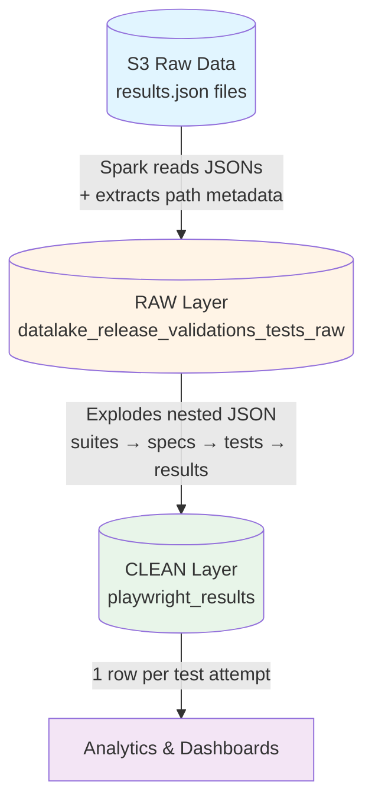
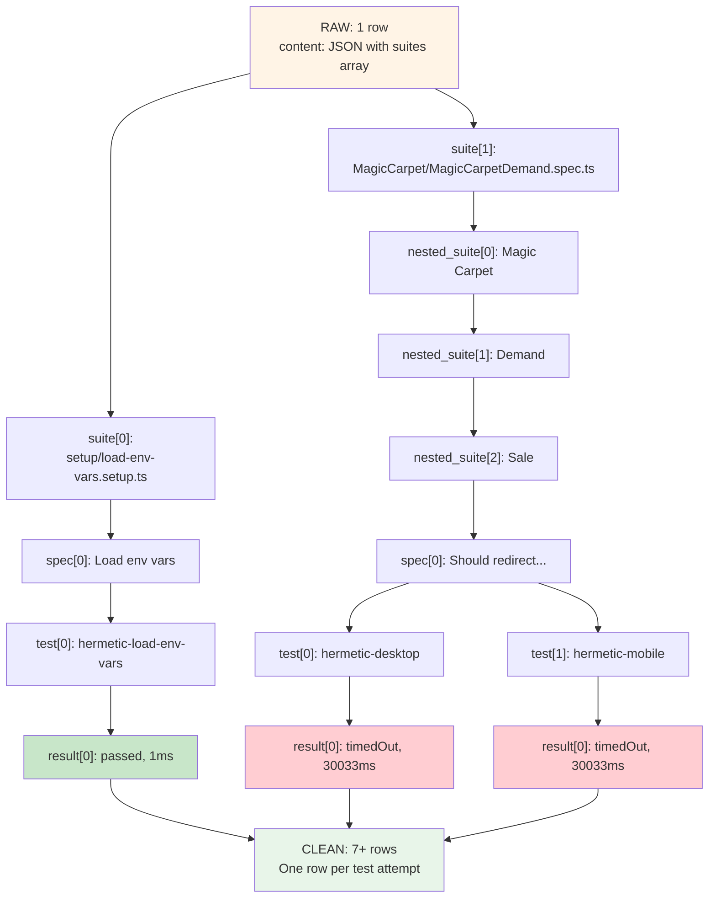

# Release Validations Tests

Pipeline for ingestion and processing of Playwright test results (E2E, hermetic, etc.) executed in CI/CD.

**Owner**: Tech Platform Engineering Productivity
**Workflow**: Raw Custom Ingestion

---

## Quick Start

```bash
# Generate DAG file
make create-dag-files dag_name=release_validations_tests

# Run local Airflow
make run-local-environment
```

---

## Architecture Overview



---

## Data Layers

### RAW Layer

**Purpose**: Store the complete JSON from Playwright + metadata extracted from the S3 file path.

**Job**: `spark_jobs/load_release_validations_tests_raw.py`

**Table**: `datalake_release_validations_tests_raw.release_validations_tests`

**How it works**:
1. Reads all `results.json` files recursively from S3 (text format)
2. Extracts metadata from the file path using regex
3. Stores the full JSON + extracted fields

**S3 Path Patterns** (both supported):
- `s3://{bucket}/{test_type}/{repository}/{deploy_group}/{run_date}/{ci_build_id}/{service}/artifacts/playwright/reporter/results.json`
- `s3://{bucket}/{test_type}/{repository}/{deploy_group}/{run_date}/{ci_build_id}/playwright-report/results.json`

**Example RAW data** (1 row = 1 `results.json` file):

| file_path | content | test_type | repository | deploy_group | run_date | ci_build_id | service | year | month | day |
|-----------|---------|-----------|------------|--------------|----------|-------------|---------|------|-------|-----|
| `s3://.../e2e/frontend-webapps/main/2025-09-09/1/home-webapp/playwright-report/results.json` | `{full JSON...}` | `e2e` | `frontend-webapps` | `main` | `2025-09-09` | `1` | `home-webapp` | `2025` | `9` | `9` |

**JSON Structure** (stored in `content` column):
```json
{
  "config": {...},
  "suites": [
    {
      "title": "setup/load-env-vars.setup.ts",
      "file": "setup/load-env-vars.setup.ts",
      "specs": [
        {
          "title": "Load env vars",
          "tests": [
            {
              "projectId": "hermetic-load-env-vars",
              "results": [
                {
                  "status": "passed",
                  "duration": 1,
                  "retry": 0,
                  "startTime": "2025-09-03T17:14:10.191Z"
                }
              ]
            }
          ]
        }
      ],
      "suites": [...]  // Nested suites (arbitrary depth)
    }
  ]
}
```

---

### CLEAN Layer

**Purpose**: Flatten the nested JSON into a queryable format with 1 row per test attempt.

**Job**: Uses SQL transformation (not PySpark anymore)

**Table**: `datalake_release_validations_tests_clean.playwright_results`

**How it works**:
1. Reads RAW table
2. Parses JSON using Spark SQL functions
3. Explodes nested arrays: `suites → specs → tests → results` (attempts)
4. Handles nested suites with recursive CTEs (BFS traversal)
5. Enriches with tags, error messages, project info

**Data Transformation**:



**Example CLEAN data** (1 row = 1 test attempt):

| test_type | repository | deploy_group | run_date | ci_build_id | service | spec_file | spec_title | project_name | attempt | attempt_status | duration_ms | start_time_utc | error_message | tags | year | month | day |
|-----------|------------|--------------|----------|-------------|---------|-----------|------------|--------------|---------|----------------|-------------|----------------|---------------|------|------|-------|-----|
| `e2e` | `frontend-webapps` | `main` | `2025-09-09` | `1` | `home-webapp` | `setup/load-env-vars.setup.ts` | `Load env vars` | `hermetic-load-env-vars` | `0` | `passed` | `1` | `2025-09-03T17:14:10.191Z` | `NULL` | `[]` | `2025` | `9` | `9` |
| `e2e` | `frontend-webapps` | `main` | `2025-09-09` | `1` | `home-webapp` | `MagicCarpet/MagicCarpetDemand.spec.ts` | `Should redirect to Profiling...` | `hermetic-desktop` | `0` | `timedOut` | `30033` | `2025-09-03T17:14:10.618Z` | `Test timeout of 30000ms exceeded.` | `["type-hermetic", "type-e2e", "device-desktop"]` | `2025` | `9` | `9` |
| `e2e` | `frontend-webapps` | `main` | `2025-09-09` | `1` | `home-webapp` | `MagicCarpet/MagicCarpetDemand.spec.ts` | `Should redirect to Profiling...` | `hermetic-mobile` | `0` | `timedOut` | `30033` | `2025-09-03T17:14:25.272Z` | `Test timeout of 30000ms exceeded.` | `["type-hermetic", "type-e2e", "device-mobile"]` | `2025` | `9` | `9` |

**Key Fields**:
- **Context**: `test_type`, `repository`, `deploy_group`, `run_date`, `ci_build_id`, `service`
- **Test Info**: `spec_file`, `spec_title`, `project_id`, `project_name`, `tags`
- **Execution**: `attempt` (retry number), `attempt_status`, `duration_ms`, `start_time_utc`
- **Errors**: `error_message`, `error_stack`, `error_location_file`, `error_location_line`

---

## Visual Flow: RAW → CLEAN

**Real Example** from `sample/results.json`:

```mermaid
flowchart TD
    subgraph RAW["RAW TABLE: 1 row"]
        R1["file_path: s3://.../e2e/frontend-webapps/main/2025-09-09/1/home-webapp/..."]
        R2["content: 4 suites with nested structure"]
        R3["test_type: e2e | repository: frontend-webapps"]
        R4["run_date: 2025-09-09 | ci_build_id: 1 | service: home-webapp"]
    end

    EXPLOSION["JSON Explosion SQL<br/>Explodes suites → specs → tests → results"]

    subgraph CLEAN["CLEAN TABLE: 35+ rows from single JSON"]
        C1["✅ Row 1: setup/load-env-vars → hermetic-load-env-vars → passed 1ms"]
        C2["✅ Row 2: MagicCarpet/Demand → hermetic-desktop → passed 3161ms"]
        C3["✅ Row 3: MagicCarpet/Demand → hermetic-mobile → passed 1177ms"]
        C4["❌ Row 4: MagicCarpet/Sale → hermetic-desktop → timedOut 30033ms"]
        C5["❌ Row 5: MagicCarpet/Sale → hermetic-mobile → timedOut 30033ms"]
        C6["❌ Row 6: MagicCarpet/Supply/House → hermetic-desktop → timedOut 30057ms"]
        C7["❌ Row 7: MagicCarpet/Supply/House → hermetic-mobile → timedOut 30027ms"]
        C8["✅ Row 8: SEO/SSR → hermetic-desktop → passed 3881ms"]
        C9["✅ Row 9: SEO/SSR → hermetic-mobile → passed 1804ms"]
        C10["❌ Row 10: SEO/SSR/Mobile → hermetic-mobile → failed 6826ms"]
        C11["... 25 more rows ..."]
        C12["✅ Row 35: AppBar → hermetic-mobile → passed 1917ms"]
    end

    RAW --> EXPLOSION
    EXPLOSION --> CLEAN

    style RAW fill:#fff4e6
    style EXPLOSION fill:#e3f2fd
    style CLEAN fill:#e8f5e9
    style C1 fill:#c8e6c9
    style C2 fill:#c8e6c9
    style C3 fill:#c8e6c9
    style C4 fill:#ffcdd2
    style C5 fill:#ffcdd2
    style C6 fill:#ffcdd2
    style C7 fill:#ffcdd2
    style C8 fill:#c8e6c9
    style C9 fill:#c8e6c9
    style C10 fill:#ffcdd2
    style C12 fill:#c8e6c9
```



**Key Transformation**:
- 1 JSON file → ~35 test attempts
- Each test can run on multiple projects (desktop/mobile) → separate rows
- Failed tests include error messages and stack traces
- Tags are extracted and stored as arrays

---

## Configuration

**DAG Config**: `release_validations_tests_declaration.yml`
```yaml
custom_schema: release_validations_tests
default_partitions: [year, month, day]
tables_customization:
  playwright_results:
    clean_table_name: playwright_results
    clean_partitions: [year, month, day]
load_spark_job: load_release_validations_tests_raw
```

**Metadata**: `metadata/clean/playwright_results.yml`
