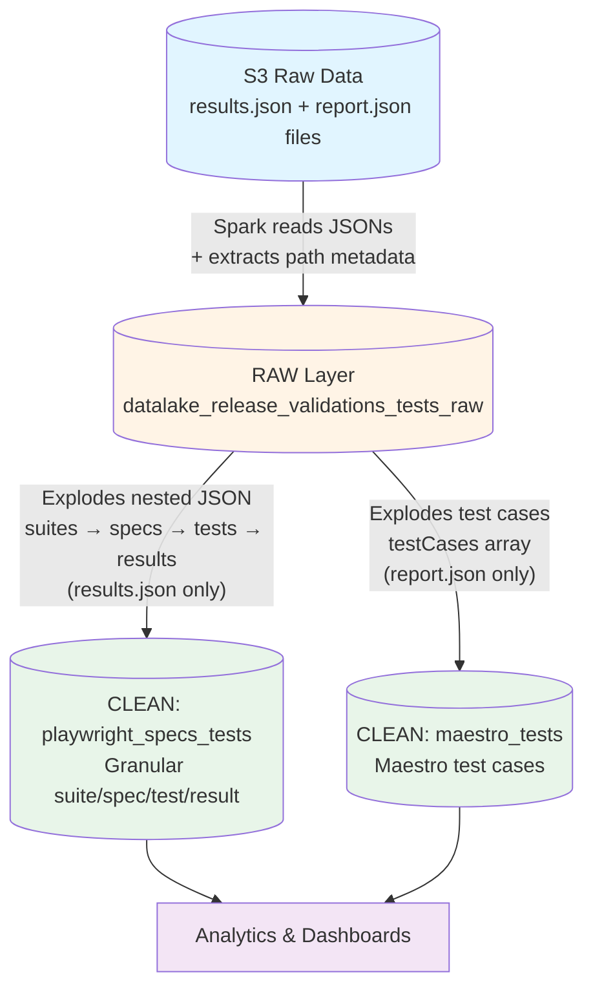
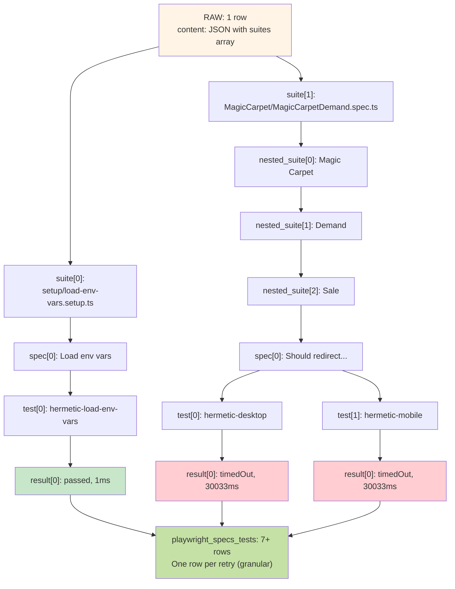
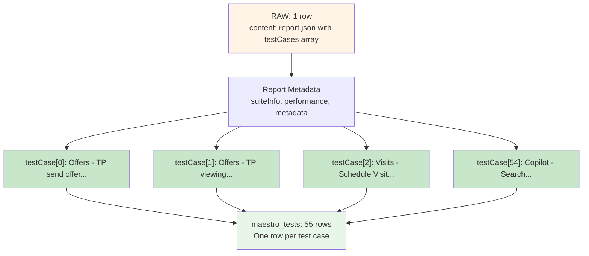
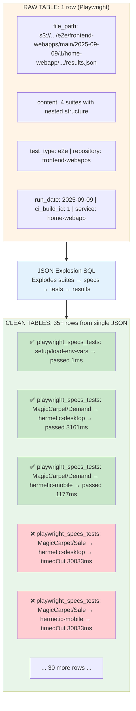
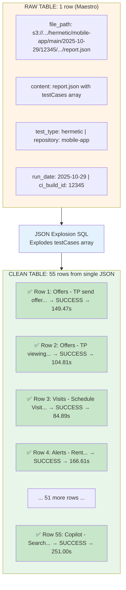

# Release Validations Tests

Pipeline for ingestion and processing of Playwright and Maestro test results (E2E, hermetic, etc.) executed in CI/CD.

**Owner**: Tech Platform Engineering Productivity
**Workflow**: Raw Custom Ingestion

---

## Quick Start

```bash
# Generate DAG file
make create-dag-files dag_name=release_validations_tests

# Run local Airflow
make run-local-environment
```

---

## Architecture Overview



---

## Data Layers

### RAW Layer

**Purpose**: Store the complete JSON from Playwright + metadata extracted from the S3 file path.

**Job**: `spark_jobs/load_release_validations_tests_raw.py`

**Table**: `datalake_release_validations_tests_raw.release_validations_tests`

**How it works**:

1. Reads all `results.json` and `report.json` files recursively from S3 (text format)
2. Extracts metadata from the file path using regex
3. Stores the full JSON + extracted fields

**S3 Path Patterns** (both supported for Playwright):

- `s3://{bucket}/{test_type}/{repository}/{deploy_group}/{run_date}/{ci_build_id}/{service}/artifacts/playwright/reporter/results.json`
- `s3://{bucket}/{test_type}/{repository}/{deploy_group}/{run_date}/{ci_build_id}/playwright-report/results.json`

**S3 Path Patterns** (for Maestro):

- `s3://{bucket}/{test_type}/{repository}/{deploy_group}/{run_date}/{ci_build_id}/{service}/artifacts/report.json`
- `s3://{bucket}/{test_type}/{repository}/{deploy_group}/{run_date}/{ci_build_id}/artifacts/report.json`

**Example RAW data** (1 row = 1 `results.json` file):

| file_path | content | test_type | repository | deploy_group | run_date | ci_build_id | service | year | month | day |
|-----------|---------|-----------|------------|--------------|----------|-------------|---------|------|-------|-----|
| `s3://.../e2e/frontend-webapps/main/2025-09-09/1/home-webapp/playwright-report/results.json` | `{full JSON...}` | `e2e` | `frontend-webapps` | `main` | `2025-09-09` | `1` | `home-webapp` | `2025` | `9` | `9` |

**JSON Structure** (stored in `content` column):

**Playwright** (`results.json`):

```json
{
  "config": {...},
  "suites": [
    {
      "title": "setup/load-env-vars.setup.ts",
      "file": "setup/load-env-vars.setup.ts",
      "specs": [
        {
          "title": "Load env vars",
          "tests": [
            {
              "projectId": "hermetic-load-env-vars",
              "results": [
                {
                  "status": "passed",
                  "duration": 1,
                  "retry": 0,
                  "startTime": "2025-09-03T17:14:10.191Z"
                }
              ]
            }
          ]
        }
      ],
      "suites": [...]  // Nested suites (arbitrary depth)
    }
  ]
}
```

**Maestro** (`report.json`):

```json
{
  "totalFlows": 55,
  "failedFlows": 0,
  "successfulFlows": 55,
  "suiteInfo": {
    "name": "Test Suite",
    "totalTimeInSeconds": 8329.844,
    "timestamp": "2025-10-29T10:35:11.492"
  },
  "testCases": [
    {
      "id": "Offers - TP send offer...",
      "name": "Offers - TP send offer...",
      "status": "SUCCESS",
      "timeInSeconds": 149.47,
      "ownershipInfo": {
        "team": {"name": "Transact for Rent", "alias": "transact-for-rent"},
        "ownerEmail": "remerson.carvalho@quintoandar.com.br",
        "tags": ["flow-offers", "tier-0", "hermetic"]
      }
    }
  ],
  "performance": {...},
  "metadata": {...}
}
```

---

### CLEAN Layer

The CLEAN layer contains two tables that process different test frameworks:

#### `playwright_specs_tests` (Granular)

**Purpose**: Granular Playwright executions with suite/spec/test metadata expanded to one row per retry.

**SQL**: `queries/clean/playwright_specs_tests.sql`

**Table**: `datalake_release_validations_tests_clean.playwright_specs_tests`

**How it works**:

1. Reads RAW table (filters `results.json` files)
2. Parses JSON using Spark SQL `from_json` functions
3. Handles nested suites with recursive aggregation (BFS traversal up to 20 levels)
4. Explodes: `suites → specs → tests → results` (attempts)
5. Preserves suite hierarchy with `suite_path` and `suite_depth`
6. Enriches with full metadata: errors, attachments, stdout, stderr

**Key Features**:

- **Suite Hierarchy**: Tracks nested suites with depth and path
- **Full Metadata**: Includes all error details, attachments, stdout/stderr
- **Comprehensive**: One row per retry attempt with all context preserved

**Data Transformation**:



**Example `playwright_specs_tests` data** (1 row = 1 retry attempt - granular):

| test_type | repository | suite_title | suite_path | suite_depth | spec_title | id_spec | test_project_name | result_status | result_retry_attempt | result_duration_ms | first_error_message | result_errors | result_attachments | is_passed | is_failed | year | month | day |
|-----------|------------|-------------|------------|-------------|------------|---------|-------------------|---------------|---------------------|-------------------|-------------------|--------------|-------------------|-----------|-----------|------|-------|-----|
| `e2e` | `frontend-webapps` | `MagicCarpet` | `["MagicCarpet"]` | `1` | `Should redirect...` | `spec-123` | `hermetic-desktop` | `timedOut` | `0` | `30033` | `Test timeout...` | `[{message, stack}]` | `[{name, path}]` | `false` | `false` | `2025` | `9` | `9` |

**Key Fields** (`playwright_specs_tests`):

- **IDs**: `id_ci_build`, `id_spec`, `id_test_project`, `id_unique_test_result`
- **Suite Hierarchy**: `suite_title`, `suite_file`, `suite_path`, `suite_depth`
- **Spec Info**: `spec_title`, `spec_file`, `spec_tags`, `is_spec_ok`
- **Test Info**: `test_project_name`, `test_timeout`, `test_expected_status`
- **Result Details**: `result_status`, `result_retry_attempt`, `result_duration_ms`, `result_errors`, `result_attachments`, `result_stdout`, `result_stderr`
- **Run Metadata**: `git_commit_hash`, `git_branch`, `playwright_version`, `run_total_expected`, `run_total_unexpected`

---

#### `maestro_tests` (Maestro Test Cases)

**Purpose**: Granular Maestro test executions with test case metadata expanded to one row per test case.

**SQL**: `queries/clean/maestro_tests.sql`

**Table**: `datalake_release_validations_tests_clean.maestro_tests`

**How it works**:

1. Reads RAW table (filters `report.json` files)
2. Parses JSON using Spark SQL `from_json` functions
3. Explodes `testCases` array into individual rows
4. Preserves all suite-level and performance metadata
5. Includes ownership information and tags

**Data Transformation**:



**Example `maestro_tests` data** (1 row = 1 test case):

| test_type | repository | platform | environment | test_case_id | test_case_name | test_case_status | test_case_time_seconds | ownership_team_name | ownership_tags | run_total_flows | run_failed_flows | suite_name | performance_total_execution_time_seconds | year | month | day |
|-----------|------------|----------|-------------|--------------|----------------|------------------|----------------------|---------------------|----------------|-----------------|------------------|------------|------------------------------------------|------|-------|-----|
| `hermetic` | `mobile-app` | `android` | `hermetic` | `Offers - TP send offer...` | `Offers - TP send offer...` | `SUCCESS` | `149.47` | `Transact for Rent` | `["flow-offers", "tier-0", "hermetic"]` | `55` | `0` | `Test Suite` | `8329.844` | `2025` | `10` | `29` |

**Key Fields** (`maestro_tests`):

- **IDs**: `id_ci_build`, `id_test_case`, `id_unique_test_result`
- **Test Case Info**: `test_case_id`, `test_case_name`, `test_case_classname`, `test_case_status`, `test_case_time_seconds`, `test_case_failed`
- **Ownership**: `ownership_team_name`, `ownership_team_alias`, `ownership_owner_email`, `ownership_tags`
- **Run Metadata**: `run_total_flows`, `run_failed_flows`, `run_successful_flows`, `run_has_failures`
- **Suite Info**: `suite_name`, `suite_total_time_seconds`, `suite_timestamp`
- **Performance**: `performance_avg_execution_time_seconds`, `performance_total_execution_time_seconds`
- **Platform**: `platform`, `environment`, `maestro_url`, `report_name`

---

## Visual Flow: RAW → CLEAN

**Real Example** from `sample/results.json` (Playwright):



**Real Example** from `sample/report.json` (Maestro):



**Key Transformations**:

**Playwright**:

- 1 `results.json` file → ~35 test attempts
- Each test can run on multiple projects (desktop/mobile) → separate rows
- Failed tests include error messages and stack traces
- Tags are extracted and stored as arrays
- `playwright_specs_tests` preserves full suite hierarchy and metadata

**Maestro**:

- 1 `report.json` file → ~55 test cases (one per test case)
- Each test case includes ownership info (team, owner email, tags)
- Suite-level metadata preserved on every row
- Performance metrics and run metadata included

---

## Configuration

**DAG Config**: `release_validations_tests_declaration.yml`

```yaml
custom_schema: release_validations_tests
default_partitions: [year, month, day]
tables_customization:
  playwright_specs_tests:
    clean_table_name: playwright_specs_tests
    clean_partitions: [year, month, day]
load_spark_job: load_release_validations_tests_raw
```

**Metadata Files**:

- `metadata/clean/playwright_specs_tests.yml` - Granular Playwright results with suite hierarchy
- `metadata/clean/maestro_tests.yml` - Maestro test cases

## Table Comparison

| Feature | `playwright_specs_tests` | `maestro_tests` |
|---------|-------------------------|----------------|
| **Source Files** | `results.json` | `report.json` |
| **Granularity** | 1 row per retry attempt | 1 row per test case |
| **Suite Hierarchy** | ✅ Preserved (depth, path) | N/A (no suites) |
| **Error Details** | Full (errors array, attachments, stdout, stderr) | Failure message only |
| **Use Case** | Detailed debugging, comprehensive analysis | Maestro test tracking, ownership |
| **Complexity** | Complex (recursive suite handling) | Simple (array explosion) |
