# Cursor AI Guide — Rules, Skills & Subagents

> How the AI coding assistant in this repo knows what to do, and how you can get the most out of it.

---

## Table of Contents

1. [What are Rules, Skills, and Subagents?](#1-what-are-rules-skills-and-subagents)
2. [Rules in this repo](#2-rules-in-this-repo)
3. [Skills in this repo](#3-skills-in-this-repo)
4. [Subagents in this repo](#4-subagents-in-this-repo)
5. [End-to-end DAG creation walkthrough](#5-end-to-end-dag-creation-walkthrough)

Skills: [create-dag](#create-dag--scaffold-a-complete-new-dag) · [create-qube-spec](#create-qube-spec--scaffold-a-qube-semantic-layer-spec) · [run-dag-locally](#run-dag-locally--run-and-test-a-dag-on-local-airflow-and-forno) · [impact-analysis](#impact-analysis--trace-downstream-impact-of-a-rename-or-removal) · [map-table-usage](#map-table-usage--map-production-usage-for-deprecation) · [review-pr](#review-pr--full-pre-push-code-review) · [generate-unit-test](#generate-unit-test--write-correctly-patterned-unit-tests) · [fix-ci-failure](#fix-ci-failure--diagnose-and-fix-a-woodpecker-ci-failure) · [setup-local-environment](#setup-local-environment--set-up-or-restore-the-local-dev-environment)

---

## 1. What are Rules, Skills, and Subagents?

Cursor's AI assistant can be guided by three layers of persistent context. Together they form a hierarchy from background knowledge to active execution:

```mermaid
flowchart LR
    subgraph always_on ["🟢 Always Active — injected into every prompt"]
        direction TB
        R1["🏠 core.mdc\nrepo identity · architecture\nDAG Builder · folder structure"]
        R2["🏷️ naming_conventions.mdc\ncolumn · table · schema · DAG\nnaming patterns"]
    end

    subgraph on_demand ["🔵 Loaded On Demand — when glob matches"]
        direction TB
        R3["📋 governance_metadata.mdc\nLGPD / PII classification\nmetadata YAML schema"]
        R4["🐍 python_conventions.mdc\nRuff · imports\nQuintoAndarLogger · Pydantic v2"]
        R5["🗄️ sql_conventions.mdc\nSQL style · no SELECT *\npartition filters · Person Data Model"]
        R6["🧪 testing_conventions.mdc\nTDD Red→Green→Refactor\nPattern A vs Pattern B"]
        R7["⚙️ dag_build.mdc\ncluster presets · workflow types\nfolder structure"]
        R8["🔷 databricks_conventions.mdc\nDelta syntax\nbracket vs Jinja templating"]
        R9["📝 pr_template.mdc\nPR description template\nWhy · What · How tested"]
        R10["🔮 qube_specs.mdc\ndimension · measure\nmetric declaration schemas"]
        R11["🏗️ core_models_generation.mdc\nCore Model file structure\nSpark job · schema · tests"]
        R12["✅ data_quality_tests.mdc\nInmetro validation catalog\nhas_size · is_complete · custom"]
        R13["👥 people/people_domain.mdc\nDW 2.0 schemas · SCD Type 2\nOracle HCM · deprecated DAGs"]
    end

    subgraph skills ["⚡ Skills — Step-by-step Playbooks"]
        direction TB
        S1["create-dag"]
        S2["create-qube-spec"]
        S3["run-dag-locally"]
        S4["impact-analysis"]
        S5["review-pr"]
        S6["generate-unit-test"]
        S7["fix-ci-failure"]
        S8["setup-local-environment"]
    end

    subgraph subagents ["🧠 Subagents — Domain Experts"]
        direction TB
        A1["🏛️ data_engineer_architect\nall layers · workflow types\ncross-layer rules · CDC"]
        A2["⚡ reliability_engineer\ncluster sizing · Delta opts\nbackfills · timeouts"]
        A3["🔒 governance_officer\nSQL conventions · LGPD\nmetadata · Kimball modeling"]
    end

    always_on -->|"injected into every prompt"| skills
    on_demand -->|"injected when glob matches"| skills
    skills -->|"orchestrates"| subagents
    subagents -->|"specialized judgment"| skills
```



### Rules

**Location**: `.cursor/rules/*.mdc`

Rules are persistent instructions injected into the AI's context window. They come in two modes:

- **`alwaysApply: true`** — injected into every single prompt in this repo. The AI always knows these conventions without you having to repeat them.
- **`alwaysApply: false`** — loaded on demand when the topic matches (e.g., when you ask about DAG declarations or Qube specs).

Rules encode *what the project expects* — naming conventions, cluster presets, layer-specific patterns, coding standards. They are the foundation that all skills and subagents build upon.

### Skills

**Location**: `.cursor/skills/*/SKILL.md`

Skills are step-by-step playbooks that the AI reads and executes when a matching task is requested. They describe a concrete sequence of actions: which files to create, which commands to run, which subagents to spawn. When you trigger a skill, the AI reads the `SKILL.md` file first, then follows its instructions exactly.

Think of skills as **runbooks** — they capture the "how" for recurring tasks so you never have to re-explain the process.

### Subagents

**Location**: `.cursor/subagents/*.md`

Subagents are domain-specialist roles the AI adopts for specific types of judgment. They are not invoked with a command — instead the AI reads the relevant subagent file when the task clearly falls into that domain's specialty. Each subagent encodes deep expertise: acceptable patterns, red flags to block, and which skills to invoke.

---

## 2. Rules in this repo

| Rule file | Activation | Purpose |
|---|---|---|
| `core.mdc` | always | Repo identity, five-layer architecture, DAG Builder overview, folder structure, CI commands, `ConfigurationService` |
| `naming_conventions.mdc` | always | Column/table/schema/DAG naming conventions — prefixes, snake_case, DW vs lake patterns |
| `governance_metadata.mdc` | glob `**/metadata/**/*.yml` | Governance metadata YAML schema, LGPD/privacy classification rules, validation commands |
| `python_conventions.mdc` | glob `**/*.py` | Ruff (format + lint), absolute imports, `QuintoAndarLogger`, ABCs, Enums, Pydantic v2, TDD rules |
| `sql_conventions.mdc` | glob `**/*.sql` | SQL style guide, `SELECT *` prohibition, partition filtering, Person Data Model / PII rules |
| `testing_conventions.mdc` | glob `packages/*/test/**` | Pattern A (Qube `unittest.TestCase`) vs Pattern B (pytest class), Spark session fixture, mocking |
| `dag_build.mdc` | on demand | Full DAG Builder reference: all cluster presets, workflow types, folder structure, advanced parameters |
| `databricks_conventions.mdc` | on demand | Databricks SQL addendum: `{bracket}` vs `{{ Jinja }}` templating, Delta-specific syntax |
| `pr_template.mdc` | on demand | PR description template with Why/What/How tested/Checklist sections |
| `qube_specs.mdc` | glob `dags/qube/*` | Qube semantic layer conventions: dimension, measure, and metric declaration schemas |
| `core_models_generation.mdc` | on demand | Core Data Model generation: mandatory file structure, declaration standards, Spark job patterns, schema validation, and test conventions |
| `data_quality_tests.mdc` | glob `dags/**/data_quality/**/*.yml` | Inmetro (Great Expectations) validation catalog: `has_size`, `is_complete`, `is_unique`, `has_null_count`, `has_size_variation`, `custom`; DW dimension `-1` unknown row handling; `alert_channel` routing |
| `people/people_domain.mdc` | glob `dags/people/**/*` | People DW 2.0 schema structure (11 schemas), SCD Type 2 pattern, Oracle HCM `4712-12-31` normalization, deprecated DAG list, enrich domain-driven naming |

### How "always on" rules save you from repeating yourself

`core.mdc` and `naming_conventions.mdc` are injected into every prompt. This means the AI always knows the five-layer architecture, DAG Builder conventions, and column/table naming patterns without you having to repeat them.

`naming_conventions.mdc` means the AI automatically applies `id_`, `ts_`, `dt_`, `is_`, `sk_` prefixes, and knows which metastore schema belongs to each layer.

### How glob-triggered rules activate

Six rules activate automatically when you open or edit a matching file type:

- **`governance_metadata.mdc`** activates for any `metadata/**/*.yml` file — **Phase 1:** PII catalog + `validate-pii-privacy` CI exist as infra; **do not** add or suggest `privacy` on routine PRs. Rejects `personal_data_classification`. LGPD controls (`table_privileges`, `k_anonymity`) stay in declaration/SQL/review as today.
- **`sql_conventions.mdc`** activates for any `.sql` file — it blocks `SELECT *`, enforces partition filters, and applies Person Data Model rules.
- **`testing_conventions.mdc`** activates for any file under `packages/*/test/` — it enforces the TDD Red → Green → Refactor workflow and selects the correct test pattern (Pattern A vs Pattern B).
- **`python_conventions.mdc`** activates for any `.py` file — it enforces Ruff style, `QuintoAndarLogger`, and Pydantic v2 APIs.
- **`data_quality_tests.mdc`** activates for any `data_quality/**/*.yml` file — it provides the full Inmetro validation catalog, including the DW dimension `-1` unknown row rule.
- **`people/people_domain.mdc`** activates for any file under `dags/people/` — it applies People DW 2.0 schema structure, SCD Type 2 conventions, Oracle HCM source system rules, and the list of deprecated DAGs to avoid.

### How other on-demand rules activate

When you ask "create a DAG for this new table", the AI recognises the DAG-building topic and loads `dag_build.mdc`, which tells it:

- The workflow type must be `query_delta` (not the deprecated `query`)
- `custom_schema` must strip the `dw_` prefix → e.g. `banking_collections`
- The cluster connection ID is `databricks_new_env` for the DW layer
- The folder structure is `dags/{line}/{dag_name}/queries/dw/` and `metadata/dw/`
- Task count must stay under 100 (job cluster limitation)

When SQL files on Databricks are involved, `databricks_conventions.mdc` activates and adds Databricks-specific rules on top of the base SQL guide — for example, never mixing `{load_start_date}` (bracket substitution done by the Spark job) with `{{ ds }}` (Jinja rendered by Airflow) in the same expression.

---

## 3. Skills in this repo

### `create-dag` — Scaffold a complete new DAG

**Trigger phrases**: "create a new DAG", "add a new pipeline", "set up table ingestion"

**What it does** (6 steps):

1. Determine the layer and workflow type from your description
2. Create `dags/{line}/{dag_name}/{dag_name}_declaration.yml`
3. Create SQL query skeletons at `queries/{layer}/{table_name}.sql`
4. Create governance metadata YAMLs at `metadata/{layer}/{table_name}.yml`
5. Classify any personal data columns (LGPD compliance)
6. Run `make validate-dag-declaration-files` and `make validate-metadata-files-content`

**Example — DW DAG for banking collections**

Prompt:
```
Create a DW DAG called dw_banking_collections in the fintech line.
It should have two tables: fraud_events and chargeback_summary.
```

The skill creates:

```
dags/fintech/dw_banking_collections/
├── dw_banking_collections_declaration.yml
├── queries/
│   └── dw/
│       ├── fraud_events.sql
│       └── chargeback_summary.sql
└── metadata/
    └── dw/
        ├── fraud_events.yml
        └── chargeback_summary.yml
```

`dw_banking_collections_declaration.yml` produced by the skill:

```yaml
dag:
  name: dw_banking_collections
  owner: Data Fintech
  schedule_interval: "0 6 * * *"
  schedule_start_date: "2025, 1, 1"

workflow:
  layer: dw
  type: query_delta
  custom_schema: banking_collections
  has_hive_sync: true
  extra_query_template_params:
    load_start_date: "{{ get_date_param(dag_run, macros.ds_add(data_interval_start | ds, -1), 'load_start_date') }}"
    load_end_date: "{{ get_date_param(dag_run, data_interval_start | ds, 'load_end_date') }}"

cluster:
  type: databricks_16_4_med_general_cluster
  databricks_conn_id: databricks_new_env
```

Note the automatic derivations: `custom_schema: banking_collections` (stripped `dw_` prefix), `databricks_conn_id: databricks_new_env` (DW layer rule), `type: query_delta` (recommended workflow).

---

### `create-qube-spec` — Scaffold a Qube semantic layer spec

**Trigger phrases**: "create a Qube dimension/measure/metric", "add a qube spec"

**What it does** (5 steps):

1. Gather inputs: spec type, entity, name, windows
2. Determine the folder and DAG name from the spec type
3. Write the declaration YAML with the correct schedule
4. Validate with `make validate-dag-declaration-files`

**Schedule timing** (automatically set):
- Dimensions → `0 5 * * *`
- Measures → `0 6 * * *`
- Metrics → `0 7 * * *` (1 hour after their dependencies)

**Example — Measure for contract total**

Prompt:
```
Create a Qube measure for the total number of active contracts.
Entity: contract, name: contract_total, windows: 1, 7, 28.
```

Result at `dags/qube/measures_contract_total/qube_measure_contract_total_declaration.yml`:

```yaml
dag:
  name: qube_measure_contract_total
  schedule_interval: "0 6 * * *"
  schedule_start_date: "2025, 1, 1"
  owner: Data Engineering

workflow:
  type: qube_measure
  layer: qube
  has_hive_sync: true
  custom_schema: "measures"
  qube_specs:
    entity: contract
    name: contract_total
    source:
      date_expr: "unix_timestamp(dt_event, 'yyyy-MM-dd')"
    logic:
      filter_sql: "TRUE"
      windows:
        - 1
        - 7
        - 28

cluster:
  type: databricks_16_4_rfleet_instance_cluster
  databricks_conn_id: databricks_new
```

---

### `run-dag-locally` — Run and test a DAG on local Airflow and Forno

**Trigger phrases**: "run my DAG locally", "test this DAG", "trigger the DAG", "upload to forno", "test on staging", "upload my changes to Databricks"

**What it does** (8 steps):

1. **Unit tests** — run the relevant test file first (`packages/bietlejuice-runtime/src/bietlejuice/foo/bar.py` → `packages/bietlejuice-runtime/test/unit/foo/test_bar.py`); fix failures before proceeding
2. **Prerequisites check** — verify Docker is running, Astro containers are up, and `GITHUB_TOKEN` / `DATABRICKS_TOKEN` / `DATABRICKS_USERNAME` are set
3. **Upload artifacts to Forno S3** — upload only what changed (decision matrix below); `make upload-forno-release` for a full clean sync
4. **Live code** — DAGs and bietlejuice source are bind-mounted into the Airflow containers; changes are reflected live (scheduler re-parses within 15–30s). Restart only when pip dependencies change
5. **Verify via REST API** — poll `has_import_errors` and confirm all expected tasks are listed
6. **Trigger** — POST to the Airflow API with `run_type: test_run` and a date range that matches available Forno data
7. **Monitor** — poll DAG run and task states with exponential backoff (15 s → 60 s → 120 s)
8. **Inspect failures** — pull logs from Airflow API; for `Workload failed` errors, query the Databricks runs API with the run ID from Airflow logs

**Artifact upload decision matrix**:

| Changed path | Make target |
|---|---|
| `packages/bietlejuice-runtime/src/bietlejuice/qube/jobs/**/*.py` | `make upload-local-qube-jobs` |
| `packages/*/src/bietlejuice/**/*.py` (non-qube) | `make upload-local-package` |
| `dags/**/spark_jobs/**/*.py` | `make upload-local-spark-jobs` |
| `dags/**/queries/**/*.sql` | `make upload-local-queries` |
| `dags/**/data_quality/**/*.yml` | `make upload-local-data-quality` |
| `dags/**/schemas/**/*.json` | `make upload-local-schemas` |
| Multiple / unsure | `make upload-forno-release` |

**Key caveats**:

- **Core model DAGs**: `make upload-local-spark-jobs` uploads to a personal S3 path; core model DAGs resolve from the shared forno path. Use `aws s3 cp` directly to `github-repos/bi-etl-ejuice/spark_jobs/{dag_name}/` (see the skill for details).
- **AWS credentials**: verify with `aws sts get-caller-identity` before every upload; renew via Weep if expired.
- **Bind mounts**: DAGs and source code are live-mounted — only restart when pip dependencies change.

---

### `impact-analysis` — Trace downstream impact of a rename or removal

**Trigger phrases**: "what breaks if I rename X", "what depends on this table", "impact of changing column Y"

**What it does**: Launches 3 parallel explore subagents scanning ~772 DAGs:

| Subagent | Searches | Returns |
|---|---|---|
| A — SQL consumers | All `.sql` files under `dags/` | File paths, line numbers, DAG name |
| B — Metadata lineage | All `.yml` under `dags/*/metadata/` | `lineage:` entries matching the identifier |
| C — Declaration deps | All `*_declaration.yml` files | `inner_dependencies`, `tables_customization` matches |

**Example**

Prompt:
```
What breaks if I rename the column `status` to `contract_status`
in enrich_contract.contract_status_history?
```

Result:

```
DIRECT SQL CONSUMERS (12 files):
  dags/fintech/dw_banking_collections/queries/dw/fraud_events.sql:34
  dags/collections/dw_collections_risk/queries/dw/risk_score.sql:17
  ... (10 more)

METADATA LINEAGE ENTRIES (8 files):
  dags/fintech/dw_banking_collections/metadata/dw/fraud_events.yml
    → column status: lineage: enrich_contract.contract_status_history.status

CHANGE PLAN:
  1. Rename column in source enrich table
  2. Update 12 SQL files (column reference on SELECT and JOIN clauses)
  3. Update 8 metadata lineage entries to the new column name
  4. Run: make validate-lineage-consistency
```

---

### `map-table-usage` — Map production usage for deprecation

**Trigger phrases**: `Map the usage of table X` · `Map the usage of table X and its replacement by Y`

**What it does** (8 steps):

| Step | Scope | Source |
|---|---|---|
| 1 | Pipeline SQL consumers | `rg` on `dags/**/*.sql` + `extract_pipeline_columns.py` |
| 1b | Replacement equivalence (optional) | Define grain from metadata → generic diff/overlap SQL on Databricks; optional period, value map, near-miss |
| 2 | Superset catalog dependency | Databricks → `datalake_superset.lake_tables_usage` |
| 3 | Trino runtime executions | Databricks → `query_information` + `query_usage_information` (+ Metabase cards) |
| 4 | Databricks direct reads | Databricks → `daily_table_usage_per_user` |
| 5 | Deprecation contacts | CSVs by channel (pipeline, Superset, Metabase, Databricks) |
| 6 | Report + queries doc | `report-template.md` + `export_queries_md.py` |
| 7 | CSV raw data | `run_governance_batch.py` → `{slug}_raw_data/*.csv` (+ `postprocess_csvs.py` for derived files) |

**Replacement grain (step 1b):** read metadata + producer SQL for both tables → document `{join_cols}` and `{compare_cols}` → run generic templates in `reference/queries.md` §1b (examples A–D are patterns, not fixed schemas).

**Execution:** report sections 2–4 run via `scripts/run_governance_batch.py` on a user-supplied
Databricks all-purpose cluster (Commands API — **6 SQL queries** + Python post-processing).
**Do not** use Trino MCP for governance tables (`PERMISSION_DENIED`).

**Queries doc** (`{slug}_usage_queries.md`): generated by `export_queries_md.py` — full SQL inline,
index query → CSV → report section. Pipeline (repo scan) appears in the index only (no SQL block).
Never use "Companion" or a `§` column header. No reproduction appendix.

**Replacement mode** is gated on the exact phrase *"and its replacement by Y"*. Without it, skip
equivalence tests, gate 6, and **any** comparison with sibling/canonical tables (e.g. no automatic
`dw_rent` volumetry when mapping `dw_public`).

**Example**

```
Map the usage of table dw_public.dim_house_listing and its replacement by dw_rent.dim_house_listing
```

**Deliverables:** deprecation analysis markdown · queries doc (full SQL) · `{slug}_raw_data/*.csv`
(no `_index.csv` / `_run_meta.csv`).

Skill path: `.cursor/skills/map-table-usage/SKILL.md`

---

### `review-pr` — Full pre-push code review

**Trigger phrases**: "review my changes", "prepare a PR", "is this ready to push"

**What it does**: Runs 7 checks in parallel before generating the PR description:

| Check | What it catches |
|---|---|
| Style (`make check-style`) | Ruff formatting and lint violations |
| Declaration validation | Invalid workflow type, missing required fields, wrong cluster conn_id |
| Metadata pairs | `.sql` without matching `.yml`, description < 10 chars, missing lineage |
| Python conventions | `logging.getLogger` instead of `QuintoAndarLogger`, relative imports, bare `NotImplementedError` |
| LGPD controls | Raw PII stored in enrich/DW, special-category/financially-sensitive data without `table_privileges`, or a `personal_data_classification` key in metadata (CI rejects — remove it) |
| Test coverage | Missing test files for changed modules, coverage below 80% threshold |
| Lint | Additional lint checks beyond style (`make check-style`) |

Blocking issues must be fixed before the PR description is generated.

---

### `generate-unit-test` — Write correctly-patterned unit tests

**Trigger phrases**: "write tests for my Spark job", "generate unit tests", "add tests for this module"

**What it does**: Reads the source module, selects the correct test pattern, mirrors the file path, and writes the test file.

**Step 0 — TDD mode** (applied before writing any test):
- If the implementation does **not exist yet**: generate `xfail` stub tests first (Red phase), then implement, then make tests pass (Green → Refactor).
- If fixing a **bug**: add a parametrized regression test case that reproduces the bug before fixing it.

**Pattern selection** (automatic, based on source path):

| Source path prefix | Test pattern | Framework |
|---|---|---|
| `packages/bietlejuice-runtime/src/bietlejuice/qube/` | Pattern A | `unittest.TestCase` + `@patch` at import location |
| All other paths | Pattern B | `pytest` class + `@mock.patch.object` fixtures |

**Example — Qube job test (Pattern A)**

Source: `packages/bietlejuice-runtime/src/bietlejuice/qube/jobs/contract_total.py`
Test file: `packages/bietlejuice-runtime/test/unit/qube/jobs/test_contract_total.py`

```python
import unittest
from unittest.mock import patch, MagicMock

class TestContractTotalJob(unittest.TestCase):

    @patch("bietlejuice.qube.jobs.contract_total.F.col")
    @patch("bietlejuice.qube.jobs.contract_total.F.sum")
    def test_execute_returns_aggregated_dataframe(self, mock_sum, mock_col):
        # Arrange
        mock_sum.return_value = MagicMock()
        mock_col.return_value = MagicMock()
        # Act / Assert ...
```

**Example — DAG builder Spark job test (Pattern B)**

Source: `packages/bietlejuice-runtime/src/bietlejuice/base/spark/some_job.py`
Test file: `packages/bietlejuice-runtime/test/unit/base/spark/test_some_job.py`

```python
import pytest
from unittest import mock

class TestSomeJob:

    @pytest.fixture
    def job(self):
        return SomeJob(...)

    def test_execute_happy_path(self, job):
        # Arrange / Act / Assert ...

    @pytest.mark.parametrize("input,expected", [...])
    def test_execute_parametrized(self, job, input, expected):
        ...
```

---

### `fix-ci-failure` — Diagnose and fix a Woodpecker CI failure

**Trigger phrases**: "CI is failing", "my PR is red", "fix this CI error", "Woodpecker step failed"

**What it does** (5 steps):

1. **Identify** the failing Woodpecker step (from the step name or error message)
2. **Reproduce** locally using the equivalent `make` target
3. **Diagnose** by matching the error message against a known pattern table
4. **Fix** the targeted file (metadata YAML, declaration YAML, SQL, or `dependencies.yaml`)
5. **Confirm** by re-running the failing check, then optionally running all checks in parallel before merge

**Woodpecker step → local `make` target mapping**:

| Woodpecker step | Local equivalent | Category |
|---|---|---|
| `validate-dag-declaration-files` | `make validate-dag-declaration-files level=debug` | Declaration |
| `validate-dags-up-to-standard` | `make validate-dags-up-to-standard` | Declaration |
| `validate-dags-dependencies-forno` | `ENVIRONMENT=forno make validate-dags-dependencies` | Dependencies |
| `validate-dags-dependencies-prod` | `ENVIRONMENT=prod make validate-dags-dependencies` | Dependencies |
| `validate-dependency-file-correctness` | `make validate-dependency-file-correctness` | Dependencies |
| `validate-metadata-files-content` | `make validate-metadata-files-content` | Metadata |
| `validate-metadata-files-exist` | `make validate-metadata-files-exist` | Metadata |
| `validate-lineage-consistency` | `make validate-lineage-consistency` | Metadata |
| `validate-core-model-schemas` | `make validate-core-model-schemas` | Core model |
| `validate-core-model-schema-content` | `make validate-core-model-schema-content` | Core model |
| `validate-cross-layer-joins` | `make validate-cross-layer-joins` | Governance (warning only) |

**Common "I added a new table" failure sequence**:

Most CI failures for new tables follow this order — fix them in sequence:
1. `validate-metadata-files-exist` → metadata YAML missing → create it
2. `validate-metadata-files-content` → description too short or missing fields → fix it
3. `validate-lineage-consistency` → metadata columns don't match SQL → align them
4. `validate-dag-declaration-files` → new table not in `tables_customization` → add it

**"Passes locally but fails in CI"**: CI compares against `origin/master`. Run `git fetch --no-tags origin +refs/heads/master` before reproducing locally.

Note: `validate-cross-layer-joins` **always exits 0** — it is a warning-only check. Add justified entries to `packages/bietlejuice-compiler/scripts/governance_metadata_validation/skip_list.yml` if the violation is intentional.

---

### `setup-local-environment` — Set up or restore the local dev environment

**Trigger phrases**: "set up local", "my environment is broken", "onboarding", "start fresh"

**What it does** (6 steps):

1. **Check prerequisites** — `uv`, `astro` CLI, Docker Desktop, Python 3.12
2. **Set environment variables** — `make setup-local-variables` writes `GITHUB_TOKEN`, `DATABRICKS_TOKEN`, `DATABRICKS_USERNAME` to `~/.zshrc`
3. **Install dependencies** — `make install` (runs `uv sync` for all workspace packages)
4. **Generate DAG Python files** — `make create-dag-files` (must run before Airflow sees any DAGs)
5. **Start the local Airflow stack** — `make run-local-environment` (builds Docker image via Astro, seeds variables/connections — takes 3–8 min on first run)

Airflow UI will be available at http://localhost:8080 (`admin` / `admin`).

**Quick-restart for returning developers** (after pulling new changes):

```bash
make create-dag-files
make restart-local-environment
```

**Other lifecycle commands**:

```bash
make stop-local-environment   # stop containers without deleting
make kill-local-environment   # delete all containers and volumes
```

**To test a specific plugin branch**:

```bash
make run-local-environment branch=your-branch-name
```

**Setup checklist**:
- `GITHUB_TOKEN`, `DATABRICKS_TOKEN`, `DATABRICKS_USERNAME` set and exported
- `make install` completed without errors
- `make create-dag-files` completed without errors
- Three Astro containers running (`webserver`, `scheduler`, `postgres`)
- Airflow UI accessible at http://localhost:8080

---

## 4. Subagents in this repo

Subagents are domain-expert roles the AI adopts automatically when a task clearly falls into their specialty. You do not call them directly — the AI reads the relevant subagent file when it recognises the domain.

| Subagent | File | Specialty | Activates when... |
|---|---|---|---|
| Data Engineer Architect | `data_engineer_architect.md` | Pipeline design across all layers: raw, clean, enrich, dw, metric, qube, and core | Creating or reviewing a DAG on any layer, workflow type selection, cross-layer join rules, CDC prerequisites |
| Reliability Engineer | `reliability_engineer.md` | Cluster sizing, Delta optimizations, backfills | Performance questions, cluster config, large backfills |
| Governance Officer | `governance_officer.md` | SQL conventions, metadata, LGPD (Person model, table_privileges), Kimball modeling | Metadata review, SQL naming — **does not** suggest metadata PII classification in Phase 1 |

### Data Engineer Architect

Owns pipeline design decisions across **all layers** — raw, clean, enrich, dw, metric, qube, and core. It enforces the correct workflow type, `custom_schema` derivation, and `databricks_conn_id` for every layer, and blocks common cross-layer join violations.

For raw/CDC work, its most important contribution is enforcing the **5-step CDC prerequisite order** — a common source of errors when people skip ahead:

1. Deploy the Debezium connector via Backstage
2. Deploy the S3-Sink connector via Backstage
3. Confirm data is visible in S3 `5a-datalake-incoming-{env}`
4. Create the DAG declaration
5. Run and verify on Forno Airflow before merging

**Example trigger**:
```
I need to add 3 tables to our existing retsuko CDC DAG.
```

The Data Engineer Architect will instruct you to update the Kafka connector via Backstage's `kafka-connect-add-tables` workflow *first*, and only then update `retsuko_declaration.yml`. It will also catch common mistakes: table names must match source DB casing exactly, and `debezium_signal` must never appear in `tables_customization`.

**CDC `source_schema` vs `source_database`** (a frequent trap caught by this subagent):

| Database type | `source_schema` | `source_database` |
|---|---|---|
| Postgres | PostgreSQL schema name (usually `"public"`) | Database name (e.g. `"ebdb"`) |
| MySQL | Database name (same as `source_database`) | Database name (e.g. `"retsuko"`) |

**`databricks_conn_id` quick-reference by layer** (enforced by this subagent):

| Layers | `databricks_conn_id` |
|---|---|
| raw (CDC / custom), clean, enrich, dw | `databricks_new_env` |
| metric, qube, reverse | `databricks_new` |
| core | `databricks_new` |

For core layer DAGs, the subagent reads `core_models_generation.mdc` before generating any files — it enforces the mandatory file structure (`spark_jobs/`, `schemas/`, `metadata/`, `data_quality/`, and matching unit tests committed in the same diff).

---

### Reliability Engineer

Owns performance and compute decisions. It prevents over-provisioning and catches under-provisioning before it causes SLA failures.

**Example trigger**:
```
My enrich job for contract events is timing out after 3 hours.
```

The Reliability Engineer will:
1. Ask about join patterns and data volume
2. Recommend upgrading from `med_general_cluster` to `med_memory_cluster` for memory-heavy joins
3. Suggest adding `z_order_by` on the most common filter columns
4. Set `execution_timeout_hours: 4.0` with appropriate `vacuum_retention_hours: 48`
5. Flag if `collect_metrics: true` is enabled (expensive JDBC queries against source DB)

**Quick cluster selection guide** (from the Reliability Engineer's rulebook):

| Workload | Recommended preset |
|---|---|
| Standard enrich/DW table | `databricks_16_4_med_general_cluster` |
| Memory-heavy joins/aggregations | `databricks_16_4_med_memory_cluster` |
| Metric layer, high throughput | `databricks_16_4_med_io-general_cluster` |
| Vectorized / SQL-heavy queries | `databricks_16_4_med_general_photon_cluster` |
| Qube semantic layer | `databricks_16_4_rfleet_instance_cluster` |

---

### Governance Officer

Owns data quality, LGPD compliance, and SQL correctness. It blocks raw PII in upper layers and declaration gaps — **not** missing `privacy` in metadata during Phase 1 rollout.

**Example trigger**:
```
Does this metadata YAML for my new DW table pass CI?
```

The Governance Officer checks:
- Valid `domain` from the 15-item list (e.g. `For Rent`, `Platform`, `Growth`, `People`)
- `owner` is a `@quintoandar.com.br` email
- All enrich/DW columns have `lineage: database.table.column`
- No raw PII stored in enrich/DW columns (join `dim_person` instead)
- enrich/dw tables with `sensitive` or `highly_personal` data have `table_privileges` in the declaration (infer tier from column semantics or domain rules — not from a metadata field)
- metric/qube outputs derived from `sensitive` data require `k_anonymity >= 5`
- No `personal_data_classification` key in metadata — CI rejects it; remove if present. **Do not** suggest adding `privacy` on routine PRs.

**Person Data Model enforcement** — the Governance Officer blocks any SQL that stores raw PII (name, CPF, email, address) in enrich or DW tables. The correct pattern is:

```sql
-- BAD: storing raw PII in DW
SELECT id_contract, customer_name, customer_cpf FROM ...

-- GOOD: use sk_person as a foreign key, join dim_person at query time
SELECT id_contract, sk_person FROM ...
-- consumers join: dw_public.dim_person ON sk_person
```

Reverse DAGs must always filter `has_right_to_be_forgotten = false` before exporting.

---

## 5. End-to-end DAG creation walkthrough

This walkthrough shows a realistic conversation — "Create a DW DAG for banking fraud metrics" — and how rules, skills, and subagents work together invisibly behind a single request.

```mermaid
sequenceDiagram
    participant U as User
    participant AI as Cursor AI
    participant R as dag_build.mdc Rule
    participant SK as create-dag Skill
    participant GO as Governance Officer
    participant RE as Reliability Engineer
    participant V as local_CI_checks
    participant PR as review-pr Skill

    U->>AI: "Create a DW DAG dw_fraud_metrics in fintech line with tables fraud_alerts and risk_scores"
    AI->>R: reads rule (always active)
    R-->>AI: layer=dw, workflow=query_delta, conn_id=databricks_new_env, strip dw_ prefix
    AI->>SK: invoke create-dag skill
    SK-->>AI: creates declaration + SQL skeletons + metadata YAMLs
    AI->>GO: fraud_alerts has column cpf — how to handle?
    GO-->>AI: set table_privileges if needed; do NOT add privacy metadata in Phase 1
    AI->>RE: which cluster for join-heavy fraud SQL?
    RE-->>AI: upgrade to med_memory_cluster
    AI->>V: run make validate-* checks
    V-->>AI: all checks pass
    AI->>PR: invoke review-pr skill
    PR-->>U: PR description draft + no blocking issues
```

### Step-by-step breakdown

**Step 1 — Rule provides structure (automatic)**

Before you finish typing, `dag_build.mdc` has already told the AI:
- Use `query_delta` workflow (not deprecated `query`)
- Derive `custom_schema: fraud_metrics` (strip `dw_` prefix)
- Use `databricks_new_env` as the cluster connection ID
- Place files under `dags/fintech/dw_fraud_metrics/`

**Step 2 — Skill scaffolds the files**

The `create-dag` skill runs its 6-step sequence and creates:

```
dags/fintech/dw_fraud_metrics/
├── dw_fraud_metrics_declaration.yml
├── queries/dw/
│   ├── fraud_alerts.sql
│   └── risk_scores.sql
└── metadata/dw/
    ├── fraud_alerts.yml
    └── risk_scores.yml
```

**Step 3 — Governance Officer flags a PII column**

The skill reads `fraud_alerts.sql` and notices a `cpf` column. In **Phase 1** it documents the column functionally and sets **`table_privileges`** in the declaration if required — it does **not** add `privacy` to metadata or suggest classification:

```yaml
# In metadata/dw/fraud_alerts.yml
columns:
  cpf:
    description: "CPF do cliente associado ao alerta de fraude."
    lineage: ebdb.fraud_events.cpf
```

Instead, it adopts the Governance Officer role: CPF is `personal`-tier data in a fintech context, so it adds `table_privileges` in the **declaration** (the enforced control) — without classifying anything in metadata:

```yaml
# In dw_fraud_metrics_declaration.yml
tables_customization:
  fraud_alerts:
    table_privileges:
      fintech-analysts: ["SELECT"]
```

**Step 4 — Reliability Engineer recommends a cluster upgrade**

The SQL for `risk_scores.sql` involves a multi-table join across 500M+ rows. The Reliability Engineer reads the query pattern and updates the declaration:

```yaml
# Before (default)
cluster:
  type: databricks_16_4_med_general_cluster

# After (Reliability Engineer recommendation)
cluster:
  type: databricks_16_4_med_memory_cluster
  databricks_conn_id: databricks_new_env
```

It also suggests adding `z_order_by: [id_contract, dt_event]` in `tables_customization` for the most common query patterns.

**Step 5 — local CI checks confirm everything passes**

```
make validate-dag-declaration-files dag_name=dw_fraud_metrics  ✓
make validate-metadata-files-content                           ✓
make validate-lineage-consistency                              ✓
```

**Step 6 — review-pr skill generates the PR description**

```markdown
## Why?
Add DW DAG for banking fraud metrics to support the Fintech risk dashboard.

## What?
- New DAG `dw_fraud_metrics` with two tables: `fraud_alerts` and `risk_scores`
- Personal data classification applied to `cpf` column in `fraud_alerts`
- Cluster upgraded to `med_memory_cluster` for join-heavy risk score computation

## How everything was tested?
- [ ] DAG ran successfully on Forno Airflow (screenshot below)
- [ ] `fraud_alerts` row count matches source after full load
- [ ] All CI checks pass locally

## !Attention Points!
- `fraud_alerts.cpf` is classified as `personal` data — reviewers should verify lineage
```

---

## Quick reference

### Prompts that activate each skill

| What you want | Prompt example |
|---|---|
| Create a new DAG | "Create a DW DAG dw_payments in the fintech line" |
| Create a Qube spec | "Create a Qube measure for visit_total with windows 1, 7, 28" |
| Run or test a DAG locally | "Run my DAG dw_payments locally" · "Test this DAG on forno" · "Upload my changes to Databricks" |
| Impact of a rename | "What breaks if I rename enrich_contract.id_status?" |
| Pre-push code review | "Review my changes and prepare the PR description" |
| Generate unit tests | "Write unit tests for packages/bietlejuice-runtime/src/bietlejuice/qube/jobs/visit_total.py" |
| Fix a CI failure | "validate-metadata-files-content is failing on my PR" |
| Set up local env | "Set up my local environment from scratch" |

### Prompts that activate each subagent

| What you want | Prompt example |
|---|---|
| DAG creation / review on any layer | "I need to add a CDC DAG for a new Postgres database" · "Create a DW DAG for contract metrics" · "Review this core model declaration" |
| Cluster or performance advice | "My enrich job keeps timing out — which cluster should I use?" |
| Metadata / LGPD / SQL naming | "Does this metadata YAML pass CI? Does my SQL follow conventions?" |

### Validation commands (run locally at any time)

```bash
# Validate a specific DAG declaration
make validate-dag-declaration-files dag_name=<dag_name>

# Validate all metadata content (descriptions, lineage, domains)
make validate-metadata-files-content

# Validate lineage consistency across all DAGs
make validate-lineage-consistency

# Lint Python files
make check-style

# Transcribe all DAG declarations into Airflow Python files (for local test)
make create-dag-files

# Transcribe a specific DAG
make create-dag-files dag_name=<dag_name>
```
