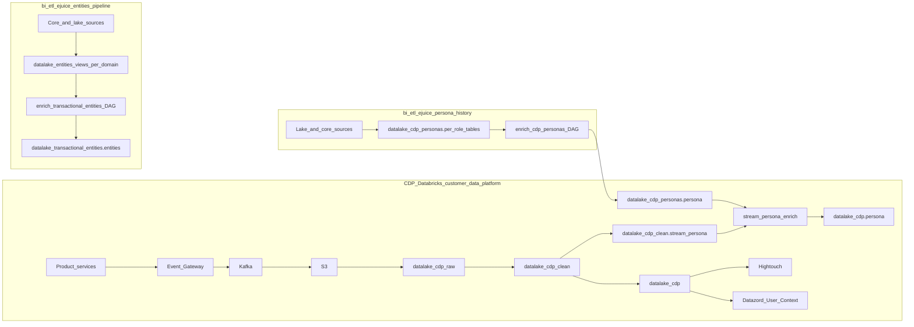

# Customer Data Platform (CDP)

## Overview

The **Customer Data Platform (CDP)** is QuintoAndar's behavioral event and customer-identity platform. It ingests governed events from product services, materializes them in Delta tables, and feeds downstream activation (HighTouch), real-time APIs (Datazord `/user-context`), and analytics.

**CDP spans three delivery paths:**

- **Real-time / near-real-time (through Databricks workflows)** — repo `customer-data-platform`: EGW → S3 → `datalake_cdp_raw` → `datalake_cdp_clean` → `datalake_cdp`
- **Lake consolidation — business objects (batch, Airflow)** — repo `bi-etl-ejuice`: domain `enrich_*_entities_views` materialized views → DAG `enrich_transactional_entities` → `datalake_transactional_entities.entities`
- **Lake consolidation — historical personas (batch, Airflow)** — repo `bi-etl-ejuice`: lake/core sources → DAG `enrich_cdp_personas` → `datalake_cdp_personas.persona` → consumed by CDP workflow `stream_persona_enrich` together with `datalake_cdp_clean.stream_persona` → `datalake_cdp.persona`

**Event governance:** Only events declared in **governance-as-code** in the `backend-services` repo are accepted by EGW and ingested into CDP. Ungoverned events are discarded at ingestion, remaining only in Kafka topics — they never reach `datalake_cdp_clean`.



## Glossary and Synonyms

- **CDP / Customer Data Platform** → behavioral event and identity platform; `customer-data-platform` owns EGW→lake tables (`datalake_cdp_*`, `stream_persona_enrich`); `bi-etl-ejuice` owns `enrich_transactional_entities` → `datalake_transactional_entities.entities` and `enrich_cdp_personas` → `datalake_cdp_personas.persona`
- **EGW / Event Gateway** → central ingestion for transactional, tracking, comms, and derived events; governed traffic to Kafka → S3
- **Persona** → user **role** in our platform (owner, tenant, agent variants, etc.) — **who / what role**; active: `datalake_cdp.persona` (one row per `(id_user, persona)`, active only)
- **Historical persona (lake)** → past roles and multi-period owner/tenant history in `datalake_cdp_personas.persona` (DAG `enrich_cdp_personas`); feeds `stream_persona_enrich` with `datalake_cdp_clean.stream_persona`; `id_user` may repeat across inactive periods — not for current-only segmentation
- **Business Object** → journey **entity** in `datalake_transactional_entities.entities` — **what / when / where** in `properties`; distinct from Persona; built for **AI** (Domi, chatbots); only **14 curated `entity` values** (see Supported `entity` values under `### datalake_transactional_entities.entities`)
- **HighTouch / HT** → reverse-ETL from CDP tables to Braze, Google Ads, Amplitude, and other activation destinations. Queries must be written in Trino syntax.
- **Derived events** → EGW events **registered in governance-as-code for enrichment**; land in `datalake_cdp_clean.derived_events` with an extra `enrichments` JSON field. **Every row in `derived_events` also exists** in its native category table (`transactional`, `comms`, or `user_tracking`); the **reverse is not true** — most category-table events are never published to `derived_events`
- **Datazord / User Context** → real-time API (`/user-context`) serving CDP attributes to Domi, Tiles, AI initiatives

## Pipeline layers and catalogs

| Catalog | Layer | Repo | Use for |
|---------|-------|------|---------|
| `datalake_cdp_raw` | raw | `customer-data-platform` | EGW governance audit only — **not for analytical queries** |
| `datalake_cdp_clean` | clean | `customer-data-platform` | **Event-grain** analysis: one row per ingested event |
| `datalake_cdp` | enrich | `customer-data-platform` | **Persona-grain** materialized table: `persona` |
| `datalake_transactional_entities` | enrich | `bi-etl-ejuice` | **Business-object-grain** consolidated journey entities: `entities` |
| `datalake_cdp_personas` | enrich | `bi-etl-ejuice` | **Historical persona** consolidation (`persona` UNION of per-role tables); upstream input to CDP `stream_persona_enrich` |

**Default routing rule:** Event-level questions → `datalake_cdp_clean.*` (including **tracking attribution** on `datalake_cdp_clean.user_tracking` at event grain). **Current active persona** → `datalake_cdp.persona`. **Historical persona** → `datalake_cdp_personas.persona`. **Cross-entity user journey / AI context** → `datalake_transactional_entities.entities`. **Entity analytics** (metrics, funnels, dimensional slices) → DW facts and dims for that entity type.

## Tables

| You need… | Use this table |
|-----------|----------------|
| Individual **transactional** behavioral events (event_name, JSON properties) | `datalake_cdp_clean.transactional` — 1 row per event; merge/dedup on `(id_event, event_name, year, month, day)` |
| Individual **user tracking** events (UTM, click IDs, device, geo) | `datalake_cdp_clean.user_tracking` — same event grain and merge pattern |
| Individual **communication** events (channel, status, template) | `datalake_cdp_clean.comms` — 1 row per comms event; filter by `comms_status`, `channel`, `event_name` |
| Near-real-time persona **signals** (staging only) | `datalake_cdp_clean.stream_persona` — always prefer `datalake_cdp.persona` for analytics |
| **Derived** EGW events with `enrichments` (enrichment-registered subset) | `datalake_cdp_clean.derived_events` — 1 row per event; also present in `transactional` / `comms` / `user_tracking` |
| **Historical persona** segments (multi-period owner/tenant) | `datalake_cdp_personas.persona` — lake batch consolidation; may have multiple rows per `id_user` |
| **Unified active persona state** per user × role | `datalake_cdp.persona` — batch (`datalake_cdp_personas.persona`) + stream (`stream_persona`); active only; PK `id_persona_event` |
| **Cross-entity business objects** (AI / user journey context) | `datalake_transactional_entities.entities` — 1 row per `sk_entity`; `properties` = what/when/where; **not** the default for DW-style analytics |

**Critical rules:**

- Always filter `year`, `month`, `day` (from `ts_event`) on large `datalake_cdp_clean.*` tables and on partitioned `datalake_cdp` tables.
- Event grain dedup: `(id_event, event_name, year, month, day)` on `transactional`, `user_tracking`, `comms`, `derived_events`.
- Persona grain: PK `id_persona_event` on `datalake_cdp.persona`; active personas only — historical multi-period rows → `datalake_cdp_personas.persona`.
- Use `ts_event` for business-time windows; use `ts_egw` for ingestion/dedup ordering — do not mix without stating which clock applies.
- Persona analytics: `datalake_cdp.persona` (current) or `datalake_cdp_personas.persona` (history) — not `datalake_cdp_clean.stream_persona`.
- Visit/offer/contract/listing **metrics and funnels** → DW facts/dims, not `datalake_transactional_entities.entities`.

### `datalake_cdp_clean.transactional`

Transactional-category EGW hub events. Grain: **one row per event**.

| Topic | Fields |
|-------|--------|
| Keys | `id_event` (PK component), `id_user` (EBDB.Usuario.id), `id_person` (Person.Person.uuid_person), `id_entity`, `id_house` (EBDB.Imovel.id) |
| Event | `event_name` (Z-Order by), `journey_step`, `application`, `event_properties` (JSON), `user_properties` (JSON)|
| Timestamps | `ts_event` (client), `ts_egw` (EGW ingestion — used for merge dedup), `ts_kafka`, `ts_load` |
| Partitions | `year`, `month`, `day` (from `ts_event`) |

Use for event-level behavioral analysis (funnel events, journey steps). Join to DW facts on `id_user` / `id_house` when the question needs business context beyond the raw event payload.

### `datalake_cdp_clean.user_tracking`

User-tracking-category EGW events. Same grain and partition pattern as `transactional`.

| Topic | Fields |
|-------|--------|
| Identity | `id_user`, `id_person` (uuid_person), `id_anonymous` |
| Attribution | `egw_initial_*` / `egw_*` UTM fields, `egw_gclid`, `egw_fbclid`, `egw_msclkid`, `egw_rdt_cid`, `egw_apps_flyer_id`, attribution timestamps |
| Context | `platform`, `application`, `country`, `city`, `region`, `ip_address`, `latitude`, `longitude`, `device_info`, `app_type` |
| Raw JSON | `event_properties`, `user_properties` |

Use for **UTM, click IDs, device, and geo** at event grain; aggregate per `id_user` in SQL when the question needs user-level attribution. Not interchangeable with `transactional` or `comms`.

### `datalake_cdp_clean.comms`

Communication-category EGW events. Same grain and partition/Z-Order by pattern as `transactional` and `user_tracking`.

| Topic | Fields |
|-------|--------|
| Keys | `id_event`, `id_user`, `id_person` (uuid_person), `id_anonymous`, `id_dispatch` |
| Comms dims | `channel`, `comms_type`, `comms_typology`, `comms_status`, `comms_name`, `comms_rule`, `comms_action`, `comms_template`, `comms_source`, `comms_journey_step`, `user_type` |
| Event | `event_name`, `event_properties`, `user_properties` |
| Timestamps | `ts_event`, `ts_egw`, `ts_kafka`, `ts_load` |

Count and filter **events** (e.g. rows where `comms_status = 'sent'`). Do not treat row volume as a pre-built sent→delivered→opened funnel without explicit status filters.

### `datalake_cdp_clean.stream_persona`

Near-real-time persona signals from EGW transactional visit/offer/lead events. Input to CDP `stream_persona_enrich` (merged with `datalake_cdp_personas.persona`). **Do not use for persona analytics** — use `datalake_cdp.persona` for active state, or `datalake_cdp_personas.persona` for historical lake view (id_user might get duplicated).

### `datalake_cdp_clean.derived_events`

Derived-category EGW hub events for event types **registered in governance-as-code to receive enrichment**. Grain: **one row per event** (merge/dedup on `id_event`).

| Topic | Fields |
|-------|--------|
| Keys | `id_event` (PK), `id_user`, `id_person` (uuid_person), `id_entity`, `id_house` |
| Event | `event_name`, `journey_step`, `application`, `event_properties` (JSON), `user_properties` (JSON) |
| Enrichment | `enrichments` (JSON) — **only on this table** among the four clean event tables; populated for governed enrichment payloads |
| Timestamps | `ts_event`, `ts_egw`, `ts_kafka`, `ts_load` |
| Partitions | `year`, `month`, `day` (from `ts_event`) |

**Relationship to category tables:** EGW routes each governed event to **one** native category table (`transactional`, `comms`, or `user_tracking`) **and**, when the event is registered for enrichment, **also** to `derived_events`. So **every row in `derived_events` has a matching event in its category table**; the **reciprocal is false** — most events in `transactional` / `comms` / `user_tracking` never appear here.

Use when the question needs **`enrichments`** or the enrichment-registered event subset. For general behavioral, comms, or tracking analysis without enrichments, use the native category table.

### `datalake_cdp_personas.persona`

Historical **persona consolidation** produced by the Airflow DAG `enrich_cdp_personas` in bi-etl-ejuice (batch, runs once every night). Per-role enrich tables (`tenant`, `owner`, `buyer_prospect`, `tenant_prospect`, `agent_broker`, `agent_inspector`, `agent_photographer`, `partner_ciq`) are UNIONed into this table.

Grain: **historical persona segments** — `(id_user, persona)` with period boundaries. **`id_user` may appear more than once** for OWNER/TENANT when the user was active, left, and returned; demand-side prospects (`TENANT_PROSPECT`, `BUYER_PROSPECT`) do not use that multi-period pattern.

| Topic | Fields |
|-------|--------|
| Identity | `id_user`, `uuid_person`, `persona` |
| Journey | `journey_step`, `is_active` |
| Period | `ts_first_event`, `ts_last_event` (segment start/end from lake logic) |

Common `persona` values (lake): `TENANT`, `OWNER`, `TENANT_PROSPECT`, `BUYER_PROSPECT`, `AGENT_BROKER`, `AGENT_INSPECTOR`, `AGENT_PHOTOGRAPHER`, `PARTNER_CIQ`.

**Downstream:** CDP workflow `stream_persona_enrich` reads this table as the batch/historical side of the merge. Read-only analytics alias: `datalake_cdp.batch_persona` (view over the same source via `batch_views` in `customer-data-platform`. Never use `datalake_cdp.batch_persona` for analytical needs).

**When to use:** “Was this user a tenant before?”, owner/tenant period counts, or any question needing **full historical persona history**. For **current active roles only**, use `datalake_cdp.persona`.

### `datalake_cdp.persona`

Unified **active** persona table produced by CDP workflow `stream_persona_enrich` in `customer-data-platform`:

- **Batch input:** `datalake_cdp_personas.persona` (historical lake consolidation)
- **Stream input:** `datalake_cdp_clean.stream_persona` (near-real-time signals from EGW transactional events)

The merge reconciles journey step and activity per `(id_user, persona)` and publishes **active personas only**. Grain: **one row per `(id_user, persona)`**.

| Topic | Fields |
|-------|--------|
| PK | `id_persona_event` = SHA-512(`id_user` \|\| `persona`) |
| Persona | `persona`, `last_journey_step`, `is_active` |
| Identity | `id_user`, `uuid_person` |
| Timestamps | `ts_started`, `ts_updated`, `ts_ended`, `ts_load` |
| Partitions | `year`, `month`, `day` |

Common `persona` values: the same set as the lake table above (`TENANT`, `OWNER`, `TENANT_PROSPECT`, `BUYER_PROSPECT`, `AGENT_BROKER`, `AGENT_INSPECTOR`, `AGENT_PHOTOGRAPHER`, `PARTNER_CIQ`), plus `OWNER_PROSPECT` — exclusive to the stream path (`datalake_cdp_clean.stream_persona`) and **never** computed in `datalake_cdp_personas.persona`. In this table, `is_active` is always `TRUE` — deactivated personas (e.g. a former tenant with no new active contract) are not published here.

**When to use:** "Is this user currently an owner?”, "how many tenants QuintoAndar has?". For **historical roles**, use `datalake_cdp_personas.persona`. Not every persona role might exist yet in this table (for example, buyer).

### `datalake_transactional_entities.entities`

Consolidated **business objects** produced by the Airflow DAG `enrich_transactional_entities` in bi-etl-ejuice (not a `customer-data-platform` workflow). The DAG UNIONs domain materialized views (`datalake_entities_views.visit`, `datalake_entities_views.offer`, `datalake_entities_views.contract`, `datalake_entities_views.listing`, and others) into a **single, heterogeneous table**.

**Primary purpose:** serve **AI initiatives** — Domi, chatbots, and similar products that need a compact, cross-entity snapshot of what a user is involved in. The schema and `properties` layout were designed for **labeling and context retrieval**, not as a general-purpose analytical mart.

**Supported `entity` values (curated, not exhaustive for the company):** the lake table only contains types wired in DAG `enrich_transactional_entities` ([`entities.sql`](dags/growth/enrich_transactional_entities/queries/enrich/entities.sql)). New business objects require a pipeline change — **do not infer** other `entity` strings (e.g. `FS_OFFER`, `TICKET`, `FR_SALE_OFFER`). Source of truth for `properties` fields per type: [`entities.yml`](dags/growth/enrich_transactional_entities/metadata/enrich/entities.yml).

| `entity` | Domain (summary) | Typical `business_context` | Analytics (prefer DW / entity doc) |
|----------|------------------|----------------------------|-------------------------------------|
| `VISIT` | Scheduled or completed property visit | RENT / SALE | `dw_visit.*` — `business_entities/visits.md` |
| `FR_OFFER` | ForRent offer (Rental Transact) | RENT | `dw_rent.dim_offer` / offer dims |
| `FR_CONTRACT` | Rental contract | RENT | `dw_rent.dim_contract`, facts |
| `FR_TERMINATION` | Contract termination | RENT | terminator / rent DW |
| `LISTING` | Property listing (rent or sale) | RENT / SALE | listing / house DW by context |
| `FR_INSPECTION` | Property inspection | RENT | inspection domain tables |
| `FR_ONBOARDING` | Contract onboarding | RENT | onboarding enrich / rent |
| `FR_CREDIT_EVALUATION` | Credit evaluation | RENT | credit evaluation core |
| `FR_RESERVATION` | Reservation (Kill Queue) | RENT | reservation clean |
| `FR_REPAIR_ONGOING` | Repair in progress | RENT | repairs clean |
| `FR_REPAIR_OFFBOARDING` | Repair offboarding | RENT | repairs / inspection services |
| `FR_INVOICE` | Invoice (Retsuko) | RENT | collections / invoice domain |
| `PHOTO_SESSION` | Photographer job / photo session | RENT / SALE (may be NULL in source) | photo session views |
| `HOUSE_DRAFT` | Owner self-service house draft (BOB) | per view | supply / listing draft flows |

**Not in this table (use other models):** dedicated for-sale offer entity; 3P supply leads; support tickets; chatbot sessions; EGW `event_name` streams (`datalake_cdp_clean.transactional`, `datalake_cdp_clean.user_tracking`, `datalake_cdp_clean.comms`); personas (`datalake_cdp.persona`). Sale-side journey often appears as `LISTING` or `VISIT` with `business_context = 'SALE'`.

Grain: **one row per `sk_entity`** = SHA-256(`entity` \|\| `id_entity` \|\| `persona` \|\| `id_user`).

| Topic | Fields |
|-------|--------|
| Keys | `sk_entity` (PK), `id_entity` — the natural key of the domain entity itself (e.g. `id_visit` when `entity = 'VISIT'`, `id_offer` when `entity = 'FR_OFFER'` or `'FS_OFFER'`); use it to join back to the canonical DW table for that entity type, `id_user`, `uuid_person`, `id_house`, `id_contract` |
| Entity | `entity` — only the **14 values** in the table above |
| Role / context | `persona`, `business_context` (RENT / SALE) |
| Journey payload | `properties` — JSON struct encoding **what / when / where** per entity type (see below) |
| Lifecycle | `is_active`, `ts_created`, `ts_updated` |

**What / when / where in `properties`:** each row summarizes the business object in a small JSON payload so downstream consumers (especially LLMs) do not join many domain tables. Examples from metadata:

| `entity` | Typical `properties` meaning |
|----------|------------------------------|
| VISIT | **What:** `computed_status` (e.g. DONE, CANCELED). **When:** `ts_visit`. **Where:** property address, implied via `id_house` on the row. |
| FR_OFFER | **What:** `status`. **When:** `ts_expiration` (and related offer timestamps in source views). **Where:** property address, implied via `id_house` on the row. |
| FR_CONTRACT | **What:** `status`. **When:** `dt_started`. **Where:** property address, implied via `id_house` on the row. |

Other supported `entity` types use different `properties` shapes — see `properties` descriptions per category in [`entities.yml`](dags/growth/enrich_transactional_entities/metadata/enrich/entities.yml) (do not assume VISIT-style fields on every row).

Parse `properties` with `GET_JSON_OBJECT` / struct access when filtering; field names vary by `entity` — there is no single universal column for “status” or “event time” across all entity types.

**Retention (table load policy):** all rows with `is_active = TRUE` regardless of date; inactive entities only if `ts_updated` is within the last 3 months.

**When to use `entities`:**

- “List everything this user is tied to” across visit, offer, contract, listing, etc. (especially for **AI / Domi / chatbot** context).
- Lightweight cross-entity exploration when joining many DW tables is unnecessary.

**When to prefer DW (or domain enrich) instead:**

- **Analytics:** conversion funnels, cohorts, KPIs, aggregations by region/modality, or any question that needs rich dimensions, slowly changing attributes, or fact-grain metrics.
- **Entity-deep dives:** use the canonical model for that object — e.g. `dw_visit.dim_visit` / `dw_visit.fact_visits`, `dw_sale.dim_offer`, `dw_rent.dim_contract`, `dw_house.dim_house` — not `entities`, which flattens and abbreviates fields for AI consumption.


**Not the same as:** `datalake_cdp_clean.transactional` — raw governed EGW events (one row per event), not consolidated business objects.

## Key Metrics

- **Governed event volume** (`COUNT(*)` grouped by `event_name`) — `datalake_cdp_clean.transactional`, `datalake_cdp_clean.user_tracking`, or `datalake_cdp_clean.comms`
- **Tracking events with UTM** (`COUNT(*)` where `egw_initial_utm_source IS NOT NULL`) — `datalake_cdp_clean.user_tracking.egw_initial_utm_source` (and `egw_initial_utm_medium`, `egw_initial_utm_campaign`, …)
- **Distinct users with tracking activity** (`COUNT(DISTINCT id_user)` on `user_tracking` with partition filters) — `datalake_cdp_clean.user_tracking.id_user`
- **Active persona distribution** (`COUNT(*)` by `persona`, `last_journey_step`) — `datalake_cdp.persona`
- **Communication event volume** (`COUNT(*)` by `channel`, `comms_status`, `comms_template`) — `datalake_cdp_clean.comms` (one row = one event, not a pre-built funnel)
- **Business objects per user** (`COUNT(*)` or list by `entity`) — `datalake_transactional_entities.entities` filtered on `id_user`, `is_active`

## Relationships with Other Entities

### User / DW (N:1 via `id_user`)

- CDP clean/enrich tables expose `id_user` (BIGINT) when the user is logged in; tracking rows may have only `id_anonymous` until identity is resolved.
- Join to warehouse user dimension: `datalake_cdp.*.id_user = dw_public.dim_user.sk_user` (same convention as `dw_collection_ai_agents` and other domains using EBDB user id).
- `uuid_person` / `id_person` on CDP tables align with person-level keys when the question is person-scoped rather than user-scoped.

### Visits (event grain vs analytics grain)

- **EGW visit events** (e.g. filters on `event_name` like `visit_*`) → `datalake_cdp_clean.transactional` on `id_user`, `id_house`, `ts_event`.
- **Visit KPIs** (VB2VC, completion, cancellations, entrance model) → `dw_visits.fact_visits`, `dw_visits.dim_visit` — see `business_entities/visits.md`.
- **AI cross-entity visit context** → `datalake_transactional_entities.entities` with `entity = 'VISIT'` and `properties` parsed for status/time — not for reporting funnels.
- Follows the same rules for different entities (offer, contract, etc.)

### Houses (N:1 via `id_house`)

- Property-scoped events and entities: `datalake_cdp_clean.transactional.id_house`, `datalake_transactional_entities.entities.id_house`.
- Join to `dw_house.dim_house` on the house key used in that DW model (confirm type — CDP often stores `id_house` as STRING).

### Matthew / chatbots (session grain vs user journey)

- Chatbot **session** metrics stay in `datalake_chatbot.sessions` / `business_entities/chatbot_sessions.md` and `business_entities/matthew.md`.
- **Cross-entity user state** for Domi/Matthew (visits, offers, contracts in one slice) → `datalake_transactional_entities.entities` on `id_user`, or Datazord `/user-context` — see `### datalake_transactional_entities.entities` below.
- Active role at interaction time → `datalake_cdp.persona` on `id_user` (not persona history from `datalake_cdp_personas.persona` unless the question is explicitly historical).

### Recs / Search (attribution vs impression grain)

- **UTM and click IDs at event grain** → `datalake_cdp_clean.user_tracking` (`egw_initial_utm_*`, `egw_gclid`, `egw_fbclid`, …); aggregate per `id_user` in SQL when needed.
- **Recommendation or search impression metrics** → `datalake_search.recs_impressions_processed` / `business_entities/recs.md` and `business_entities/search.md` — join on `ids.id_user` / `ids.id_house` from those tables, not from CDP event tables.

## Identity model

| Identifier | Type | When present | Notes |
|------------|------|--------------|-------|
| `id_user` | BIGINT | After login / resolved user | Join key to EBDB's Usuario / User table and DW `dim_user` (sk_user); absent on purely anonymous tracking |
| `id_person` / `uuid_person` | STRING | When EGW sends `person_uuid` or EBDB resolves via `datalake_ebdb_clean.user` | Prefer `id_person` from clean tables over raw hub UUID when both exist |
| `id_anonymous` | STRING | Tracking / comms events | Device/session id on event rows; link anonymous → logged user via `id_user` on later `user_tracking` events |
| `id_event` | STRING | All clean event tables | Event-level primary key component |
| `id_house` | STRING | Transactional events with `houseId` in properties; also on `entities` | Property-scoped events/entities. Join key to EBDB's House / Imovel table and DW `dim_house` |
| `sk_entity` | STRING | `datalake_transactional_entities.entities` only | Surrogate for business-object grain |

Join patterns to DW and related entities are in **Relationships with Other Entities** above. Timestamp rules are in **Critical rules** under Tables.

## Personas

Two tables — pick by time horizon:

| Question | Table |
|----------|--------|
| What role is the user in **right now**, and at what journey step? | `datalake_cdp.persona` |
| What roles did the user have **historically** (including past tenant/owner periods)? | `datalake_cdp_personas.persona` |

## Dos and Don'ts

**Do:**

- Use `datalake_cdp_clean.*` for **event-grain** questions (count events, filter by `event_name`, parse `event_properties`).
- Apply partition filters on `year`, `month`, `day` (derived from `ts_event`) on large event tables.
- Use `datalake_cdp_clean.user_tracking` for **tracking attribution** (UTM, click IDs, device/geo) at event grain; roll up per `id_user` in SQL when needed.
- Use `datalake_cdp_clean.derived_events` when the question needs the **`enrichments`** payload or the enrichment-registered event subset — not as a replacement for `transactional` / `comms` / `user_tracking` volume counts.
- Use `datalake_cdp.persona` for **current role and journey-step** segmentation (active personas only).
- Use `datalake_cdp_personas.persona` for **historical persona** questions (multi-period owner/tenant, “was tenant before”).
- Use `datalake_transactional_entities.entities` for **cross-entity user journey context** and AI-facing use cases (Domi, chatbots) — parse `properties` for what/when/where per `entity` type.
- Filter `entity` with only the **14 supported values** listed under `### datalake_transactional_entities.entities` (see Query 6 to list what is in the table).
- Use **DW** (`dw_visit.*`, `dw_sale.*`, `dw_rent.*`, etc.) for **analytics** on visits, offers, contracts, listings, and other single-entity metrics.

**Don't:**

- Don't use `datalake_transactional_entities.entities` as the default for **reporting, funnels, or conversion analytics** when a DW fact/dim exists for that entity — the table is optimized for AI, not for analytical grain or completeness.
- Don't assume a business concept exists as an `entity` value without checking the supported list (e.g. tickets, 3P leads, for-sale offers as `FS_*`) — use the DW or domain entity doc instead.
- Don't query `datalake_cdp_clean.stream_persona` for persona distributions — use `datalake_cdp.persona`.
- Don't use `datalake_cdp.persona` for deactivated or past persona periods — use `datalake_cdp_personas.persona`.
- Don't assume `enrich_cdp_personas` or `enrich_transactional_entities` runs in `customer-data-platform` — both are Airflow DAGs in bi-etl-ejuice.
- Don't treat `datalake_cdp_clean.comms` row counts as a built-in sent→delivered→opened funnel; each row is one event — define statuses explicitly.
- Don't mix `ts_event` and `ts_egw` filters without stating which timestamp defines the analysis window.
- Don't route visit/offer/contract/listing questions to CDP clean tables or `datalake_cdp_clean.transactional`. For multi-entity AI context, use `datalake_transactional_entities.entities` or Datazord; for analytics, use DW.
- Don't assume `derived_events` is a superset of all CDP events — it is a subset of `transactional` / `comms` / `user_tracking` (enrichment-registered only); category tables hold events that never land in `derived_events`.
- Don't query `datalake_cdp_raw` for analytics.

## Golden Queries

> **Before writing any CDP query:** each row in `transactional`, `user_tracking`, `comms`, and `derived_events` is **one event** — one user can produce dozens of rows. Always decide up front whether you need **event volume** (`COUNT(*)`) or **unique users** (`COUNT(DISTINCT id_user)`). Always apply **partition filters** (`year`, `month`, `day`) — omitting them triggers full-table scans on billion-row Delta tables.

### Query 1 — Unique users per event step (fundamental dedup pattern)

Use `COUNT(DISTINCT id_user)` when the question is about people, `COUNT(*)` when it is about events. Both numbers are shown here to make the difference explicit. Adjust `event_name` and date window as needed.

```sql
SELECT
    event_name,
    COUNT(DISTINCT id_user) AS unique_users,   -- people who performed the action
    COUNT(*)                AS total_events     -- events fired (1 user can trigger many)
FROM datalake_cdp_clean.transactional
WHERE
    event_name IN ('visit_requested', 'visit_scheduled', 'visit_done')
    AND year  = 2025
    AND month = 5
    AND day   BETWEEN 1 AND 7
GROUP BY event_name
ORDER BY unique_users DESC;
```

### Query 2 — First-touch UTM attribution (cross-CDP: user_tracking + transactional)

Joins two event tables from different categories: `user_tracking` for attribution, `transactional` for conversion. Apply partition filters on **both** sides. `ROW_NUMBER` picks the single earliest tracking row per user; `DISTINCT` in the converter CTE avoids duplicating the join when the user fired the target event multiple times.

```sql
WITH first_touch AS (
    SELECT
        id_user,
        egw_initial_utm_source                                             AS utm_source,
        ROW_NUMBER() OVER (PARTITION BY id_user ORDER BY ts_event ASC)    AS rn
    FROM datalake_cdp_clean.user_tracking
    WHERE
        id_user                IS NOT NULL
        AND egw_initial_utm_source IS NOT NULL
        AND year  = 2025
        AND month = 5
),
converters AS (
    SELECT DISTINCT id_user
    FROM datalake_cdp_clean.transactional
    WHERE
        event_name = 'contract_activated'
        AND year  = 2025
        AND month = 5
)
SELECT
    ft.utm_source,
    COUNT(DISTINCT ft.id_user) AS converting_users
FROM first_touch        AS ft
INNER JOIN converters   AS c ON ft.id_user = c.id_user
WHERE ft.rn = 1
GROUP BY ft.utm_source
ORDER BY converting_users DESC;
```

### Query 3 — Comms funnel: sent → delivered → opened (event-by-event pivot)

The `comms` table has **no pre-built funnel** — each status transition is a separate row. Use `CASE WHEN` to build the funnel explicitly. For user-level rates, wrap in an outer `COUNT(DISTINCT id_user)` per status instead.

```sql
SELECT
    channel,
    comms_template,
    COUNT(CASE WHEN comms_status = 'sent'      THEN 1 END) AS sent,
    COUNT(CASE WHEN comms_status = 'delivered' THEN 1 END) AS delivered,
    COUNT(CASE WHEN comms_status = 'opened'    THEN 1 END) AS opened,
    ROUND(
        100.0 * COUNT(CASE WHEN comms_status = 'opened' THEN 1 END)
              / NULLIF(COUNT(CASE WHEN comms_status = 'delivered' THEN 1 END), 0),
        1
    )                                                       AS open_rate_pct
FROM datalake_cdp_clean.comms
WHERE
    year  = 2025
    AND month = 5
GROUP BY channel, comms_template
ORDER BY sent DESC;
```

### Query 4 — Event volume by active role (transactional + persona)

Joins the event table with the **current active persona** to break down behavior by user role. This reflects the user's role **at query time**, not at the moment the event fired. For role at event time, use `datalake_cdp_personas.persona` with `ts_event BETWEEN ts_first_event AND ts_last_event` instead.

```sql
SELECT
    p.persona,
    t.event_name,
    COUNT(*)                  AS total_events,
    COUNT(DISTINCT t.id_user) AS unique_users
FROM datalake_cdp_clean.transactional   AS t
INNER JOIN datalake_cdp.persona         AS p ON t.id_user = p.id_user
WHERE
    t.year  = 2025
    AND t.month = 5
    AND t.event_name IN ('visit_requested', 'visit_completed', 'offer_submitted')
GROUP BY p.persona, t.event_name
ORDER BY total_events DESC;
```

### Query 5 — Derived events: scope discovery + enrichments access

`derived_events` is a **subset** of the category tables — only events registered for enrichment. Use it **only** when you need the `enrichments` payload; for volume counts, use `transactional` / `comms` / `user_tracking` directly. This query shows which event types land in `derived_events` and how many carry an actual enrichments payload.

```sql
SELECT
    event_name,
    COUNT(*)                                                        AS derived_event_count,
    COUNT(CASE WHEN enrichments IS NOT NULL THEN 1 END)             AS with_enrichments,
    -- To access a specific enrichment field:
    -- GET_JSON_OBJECT(enrichments, '$.your_key') AS your_field
    ROUND(
        100.0 * COUNT(CASE WHEN enrichments IS NOT NULL THEN 1 END)
              / NULLIF(COUNT(*), 0),
        1
    )                                                               AS enrichment_coverage_pct
FROM datalake_cdp_clean.derived_events
WHERE
    year  = 2025
    AND month = 5
GROUP BY event_name
ORDER BY derived_event_count DESC
LIMIT 20;
```

## DataHub catalog

- **Data Product:** [urn:li:dataProduct:cdp](https://datahub.apps.data-prd.habitat.zone/dataProducts/urn%3Ali%3AdataProduct%3Acdp)
