# Supply

## Ownership

**Data Owner:**
- alexandre.gimenez@quintoandar.com.br

**Data Steward:**
- alexandre.gimenez@quintoandar.com.br

## Overview

Supply represents all channels and products QuintoAndar uses to acquire property owners and generate new listings on the platform, covering both for-rent and for-sale contexts. It tracks the owner journey from initial lead capture through a six-stage funnel to the creation of the first active listing.

> **Supply Revamp (WIP):** Rene Descartes is rolling out a contact-centric model (`contact_info`, `intent`, `opportunity_event` — lake tables `contact_info`, `lead_intent`, `opportunity_event` today). That slice is documented separately in [`supply_revamp.md`](supply_revamp.md). **This file remains the source of truth for production funnel analysis** (`obt_supply`, `fact_supply_events`) — do not mix revamp clean tables with legacy funnel metrics until the full revamp DW is in prod. `opportunity_event` is an append-only event log, not a substitute for `obt_supply.cd_funnel_step = 'opportunity'`.

The lifecycle has six stages:
1. **Lead** — owner contact is registered (`cd_funnel_step = 'lead'`)
2. **Prospect** — lead is validated and prospecting begins (`cd_funnel_step = 'prospect'`)
3. **Qualified** — property is evaluated and considered eligible (`cd_funnel_step = 'qualified'`)
4. **AV Qualified** — property availability is confirmed (`cd_funnel_step = 'av_qualified'`)
5. **Opportunity** — lead is ready for listing activation (`cd_funnel_step = 'opportunity'`)
6. **First Listing** — the first property listing is created (`cd_funnel_step = 'first_listing'`)

Not all leads follow every stage. Leads may be discarded at any step, reprocessed through recovery flows, or accelerated by operations. RENT and SALE flows are tracked separately under the same model via `nm_business_context`.

### How to route a question through this document

This document has two halves. Pick the right one before writing SQL — they use **different tables, at different grains, with different and non-interchangeable status vocabularies**.

| If the question is about... | Go to | Primary tables | Golden Queries |
|---|---|---|---|
| The **current operational state** of a lead/prospect: who is being dialed, who was discarded and why, who can be reactivated, who is in the portfolio (carteira), which company/team is working a lead | **Operational Layer** (next section) | `hive.datalake_wololo_clean.prospect`, `.context_discard`, `.prospect_aud`, `.round`, `.contact`; `hive.datalake_rene_descartes_clean.house_lead`, `.lead_rejection` | **5–10** (plus **11** for the ops channel handling each funnel stage, which reads `obt_supply`) |
| **Funnel volumes, conversion rates, channel/product performance, Isaias/chatbot metrics** | Glossary → Tables → Key Metrics → Golden Queries | `hive.dw_growth.obt_supply`, `fact_supply_events`, `datalake_supply_flows.isaias_session_attribution`, `datalake_sauron_clean.session` | **1–4** |
| **Official** conversion rates (L2P/P2Q/Q2O/O2L, Isaias D2O/D2L, FL, carteirização rate) | [Related Metric Entities](#related-metric-entities) — do not rebuild the calculation here | — | — |

**The single most common source of wrong queries is crossing the first two halves.** `hive.datalake_wololo_clean.prospect.status` (7 operational values) and `hive.dw_growth.obt_supply.status` (4 coarse funnel values) are unrelated columns — see [Operational critical rules](#operational-critical-rules).

## Related Metric Entities

- [FL (First Listings)](../metric_entities/first_listings_1p.md) — first-time published inventory (FL, First Listings 1P/3P) by supply source and business context.
- [Supply Funnel Conversions](../metric_entities/funnel_conversions_supply.md) — official adjacent-stage conversion rates (L2P, P2Q, Q2O, O2L) and non-adjacent funnel transitions on `obt_supply`. Also the home of the official **carteirização** flag `is_carteirizacao`, which is derived from the prospect having ever reached `PORTFOLIO` status in Wololo (`datalake_wololo_clean.prospect_aud`, bridged via `prospect.id_reference = obt_supply.sk_lead`) plus `planning_operation = 'Outbound'` and `country_code = 'BR'` — use that metric entity for carteirização *rates*, and the operational status sections here for who is in the portfolio *now*.
- [Isaias Conversions](../metric_entities/isaias_conversions.md) — official Isaias session→opportunity (D2O) and session→first-listing (D2L) conversion rates (Total / Autonomous) and % escalation to Inside Sales, on the session-supply ledger.

## Operational Layer — Prospect Status, Routing, and Discards

> **Answer every operational question — "who is being worked / who was discarded and why / which team owns this / who is in the carteira" — from this section.** It is self-contained: table names, complete value lists, join keys, and disambiguation rules are all here, and the matching Golden Queries are **5–10** (plus **11**, the one operational question answered on the `obt_supply` side: which ops channel handles each funnel stage). Do not fall through to `obt_supply` for the questions below: `obt_supply` is a funnel-event model and does not carry the operational prospect state.

### Services and Systems in the QuintoAndar Supply Flow

The supply funnel is powered by a set of microservices, each responsible for a distinct stage. The DW supply model (`fact_supply_events`, `obt_supply`) aggregates events from all of them via the `datalake_supply_flows` orchestration schema.

- **Rene Descartes** *(a.k.a. Rene)* — lead management service for first-party (1P) leads. Rene registers the moment an owner expresses interest and stores all acquisition-side metadata: marketing attribution (UTM, origin, affiliate type), property address, and business context (RENT / SALE). It also records lead-level disqualifications that happen before the prospect stage. Schema: `datalake_rene_descartes_clean`. Funnel stage: **lead entry and lead → prospect transition**. Full detail: ["Lead (pre-prospect) and `lead_rejection`"](#lead-pre-prospect-and-lead_rejection--rene-descartes) below. Key tables:
  - `house_lead` — one row per 1P lead; `id` (UUID primary key), `id_lead_ebdb` (the cross-service numeric lead ID; called `new_id` in Rene's own Postgres schema), `status` (the `HouseLeadStatus` enum), `ts_created`, `id_address`, `id_referred_by`
  - `house_lead_aud` — audit log of status changes; used to derive the lead's status history
  - `acquisition_misc_data` — JSON blob with UTM fields, campaign origin, affiliate type, and house_info (forRent / forSale flags)
  - `lead_rejection` — lead-stage discard decisions. **Join on the UUID primary key: `lead_rejection.id_house_lead = house_lead.id`.** ⚠️ Do **not** join it to `id_lead` / `id_lead_ebdb` (= `house_lead.new_id`) — that is a different column from the FK target. ⚠️ `lead_rejection` also contains **mirrored prospect-stage discards** (`origin = 'PROSPECT'`); only `origin IN ('LEAD', 'MANUAL')` are genuine pre-prospect discards.

- **Wololo** — prospect orchestration service. Once a 1P lead converts to prospect, Wololo takes ownership: it manages the outbound contact lifecycle by tracking each contact round (attempts, call channel, call output) and the ops company responsible (`sales_company`). When `sales_company = 'OLOS'`, the actual dialing is delegated to the OLOS dialer (see below). Wololo is also the source for prospect-level disqualification. Schema: `datalake_wololo_clean`. Funnel stage: **prospect**. Key tables:
  - `prospect` — one row per prospect (**current state**); `id`, `id_reference` (= `id_lead_ebdb`), `id_external` (= Rene lead ID), `status` (the 7-value `ProspectStatus` enum), `sales_company`, `ts_created`, `ts_updated`
  - `contact` — individual contact attempts per prospect; `id_prospect_reference`, `channel`, `phone_output`, `duration_in_seconds`, `ts_contacted` (⚠️ also `phone_number` / `analyst_email` — PII, never surface). ⚠️ **Join it as `contact.id_prospect_reference = prospect.id_reference`, NOT to `prospect.id`** — despite the column name, joining it to `prospect.id` matches **zero** rows. This is the one Wololo child table that does *not* key on `prospect.id`.
  - `round` — grouping of contact attempts into rounds; `id_prospect`, `id_reference`, `round_number`, `round_max_tries`, `ts_created`. Carries **both** keys, and both resolve: `round.id_prospect = prospect.id` and `round.id_reference = prospect.id_reference`. Use it with `contact` to reconstruct the attempt counters described below.
  - `context_discard` — one row per prospect **discard event** (append-only history); `id_prospect`, `reason`, `is_automatically_discarded`, `sales_company`, `business_context`, `attendance_info`, `ts_created`, `ts_updated`
  - `prospect_aud` — **audit history** of `prospect` (Hibernate Envers, one row per revision: `rev`, `revtype`); the source of a prospect's `status` / `sales_company` history. ⚠️ Never interchangeable with `prospect` — see ["`prospect_aud` vs `prospect`"](#prospect_aud-vs-prospect--ever-in-the-portfolio-vs-in-it-now) below.
  - Join to supply: `prospect.id_reference = id_lead_ebdb = obt_supply.sk_lead`

- **OLOS Dialer** — outbound telephony system used by the IS Outbound team. When Wololo assigns a prospect to `sales_company = 'OLOS'`, OLOS executes and logs the actual calls. In `obt_supply`, the first call timestamp from `outbound_contact_attempts` determines whether a lead has `status = 'started prospecting'`. Schema: `datalake_olos_dialer`. Funnel stage: **prospect** (outbound contact tracking). Key tables:
  - `outbound_contact_attempts` — one row per call attempt; `id_lead`, `ts_call_started`; joined via `id_lead = id_lead_ebdb`
  - `outbound_mailing` — mailing assignment; `id_lead`, `sales_company`, `ts_created`
  - `outbound_last_contact` — latest contact snapshot per lead

- **Bob (Bob o Construtor)** — house draft management service. During the qualification stage, the ops agent (or Isaias) fills in the property details — pricing, blueprint, availability, owner and administrator info — which are stored as a draft in Bob. The draft carries a reference back to the original lead (`id_original_lead`). The draft identifier can also appear with the name of `id_house_draft`. When the lead converts to opportunity, Bob's draft data is promoted to create the actual house record on the main platform, generating the `id_house` used throughout the supply model. Schema: `datalake_bob_clean`. Funnel stage: **qualified → opportunity**. Key tables:
  - `house_draft` — one row per draft; `id`, `id_client_side`, `id_original_lead`, pricing JSON (rent, sale, condo), blueprint JSON (bedrooms, bathrooms, area), `status`, `ts_created`, `ts_updated`
  - `house_draft_aud` — audit log of draft changes
  - Join to supply: `bob.id_original_lead = id_lead` (via `datalake_supply_flows.conversion_lookup`)
  - `attribution_progress` — tracks owner confirmation progress during Bob lead attribution. To identify houses with pending confirmation from the owner use `status= 'WAITING_CONFIRMATION'`.
  - `location` — location information of house drafts. A house's address usually consists of the fields `address`, `number` and `complement` combined. Additional fields are also available.
  - Join to supply: `bob.id_house_draft = sk_lead` (via `dw_growth.obt_supply`)
  - ⚠️ Bob has **no** integration with Wololo's prospect domain: a prospect reaching `CONVERTED` does not create a house draft, and Bob holds no prospect identifier. Bob is reached only through Rene.

- **Photojob** *(Photographer Job)* — records the photography session that is the operational event converting a qualified lead into an opportunity. When a photojob is scheduled for a property, the supply event transitions from `qualified` to `opportunity`. The table tracks photographer assignment, scheduled date, session lifecycle (accepted → started → photos uploaded → completed), and cancellation or problem events. Tables are in `datalake_ebdb_clean`. Funnel stage: **qualified → opportunity**. Key tables:
  - `photographer_job` — current snapshot; `id`, `id_house`, `status`, `ts_scheduled`, `ts_session_started`, `ts_photos_uploaded`
  - `photographer_job_aud` — full audit trail with revision tracking (`rev`, `revtype`); used for status transition analysis
  - Join to supply: `photographer_job.id_house = fse.sk_house`

- **Listing** *(listing_business_context)* — records the publication of a property listing, completing the supply funnel (opportunity → first_listing). A listing is created per house × business context (RENT or SALE) and has a lifecycle of statuses: `EDITING`, `PUBLISHED`, `UNPUBLISHED`. The transition to `PUBLISHED` is what the supply funnel counts as `cd_funnel_step = 'first_listing'`. Tables are in `datalake_ebdb_clean`. Funnel stage: **first_listing**. Key tables:
  - `listing_business_context` — current listing state; `id_house`, `business_context`, `status`, `ts_first_listing`
  - `listing_business_context_aud` — audit log of status changes over time
  - Join to supply: `listing_business_context.id_house = fse.sk_house`

- **supply_flows** *(datalake_supply_flows)* — the central orchestration schema that acts as the glue layer between all source systems and the DW supply model. It normalises events from Rene, Wololo, Bob, and EBDB into a single canonical event log consumed by `fact_supply_events` and `obt_supply`. Key tables:
  - `supply_events_tracking` — canonical event log; one row per supply event; columns: `funnel_step`, `business_event`, `ops_objective`, `ops_agent`, `ops_partner`, `ops_contact_medium`, `ts_event_adjusted`. The OPPORTUNITY timestamp from this table anchors the Isaias human-conversion 24 h window (see Critical Rules).
  - `leads_sks` — surrogate key registry for all leads across sources (1P / CIQ / 3P); `sk_supply_lead`, `id_lead`, `source`
  - `conversion_lookup` — maps each lead to its conversion outcome; `id_lead`, `business_context`, `id_house`, `has_listing`, `has_draft`, `supply_source`
  - `leads_1p` — enriched 1P lead base derived from Rene Descartes; used as input to prospect and qualified event pipelines

**Routing of ops questions across services:** Rene owns the lead **before** a prospect exists (acquisition metadata + lead-stage discards); Wololo owns the prospect's contact lifecycle and is the single source of truth for the operational prospect `status`; OLOS is the execution arm of Wololo's dialing (it holds call attempts, never status); Bob owns the draft between qualified and opportunity. There is no service that owns "the lead" end to end — pick the service by the stage the question is about.

### Prospect status — the `ProspectStatus` enum (Wololo)

**Ground-truth column:** `hive.datalake_wololo_clean.prospect.status`.
**Enum source (code):** `ProspectStatus.java` in `backend-services/applications/wololo` (`core/.../prospect/enums/ProspectStatus.java`).
**Exactly 7 values exist — no others are valid:** `NEW`, `PROSPECTING`, `PROSPECTING_EXTERNALLY`, `ONGOING`, `CONVERTED`, `DISCARDED`, `PORTFOLIO`.

Row counts below are from `hive.datalake_wololo_clean.prospect`, **prospects created since 2026-01-01** (not all-time), measured 2026-08-18, aggregated across all `sales_company` values (`OLOS` ~99.99%). They are a **live population** — use them as order of magnitude and relative weight, never as fixed values.

| `status` | Rows (since 2026-01-01) | % of window | Startable? | Dialed by OLOS? | Can convert? | Can be discarded? |
|---|---:|---:|---|---|---|---|
| `DISCARDED` | ~706,000 | ~82.9% | No | No | **Yes** (not terminal) | n/a (already discarded) |
| `CONVERTED` | ~76,000 | ~9.0% | No | No | n/a (already converted) | **No** (protected/terminal) |
| `PROSPECTING` | ~34,000 | ~4.0% | **No** (already active — `start` errors) | **Yes** | Yes | Yes |
| `PORTFOLIO` | ~16,000 | ~1.9% | No | No | Yes | Yes |
| `PROSPECTING_EXTERNALLY` | ~9,200 | ~1.1% | **Yes** | **No** | Yes | Yes |
| `ONGOING` | ~6,400 | ~0.7% | No | No | Yes | Yes |
| `NEW` | ~3,900 | ~0.5% | **Yes** | No | Yes | Yes |

**Per-value operational meaning:**

- **`NEW`** — prospect just created from a converted lead; has never entered dialing. Startable immediately (`canBeStarted()` returns `true`).
- **`PROSPECTING`** — **the only status the OLOS dialer pulls from to place calls.** While in this status, contact attempts are counted (both the per-round counter and the global cumulative counter — see "The two attempt counters" below). Calling `start` on a prospect already in `PROSPECTING` throws `ProspectCantBeStartedExeption` — **it is not startable**, because it is already being worked.
- **`PROSPECTING_EXTERNALLY`** — ⚠️ **counter-intuitive: this means the prospect is NOT being dialed.** It has left the OLOS queue and is being worked through external channels (WhatsApp, Braze, voice-to-chat). Entering this status makes Wololo call `thirdPartyAdapter.stopProspect()` (tells OLOS to stop calling) and notifies Braze. It is still "alive": startable again (reactivation), which tells OLOS to resume dialing (`thirdPartyAdapter.startProspect()` when `status != NEW`).
- **`ONGOING`** — the lead is progressing through a specific flow outside the normal dialing cycle (e.g. conversion via the owner's PWA). Not dialed, not restartable (`canBeStarted()` is `false`), but can still be converted or discarded. Set explicitly via `ProspectServiceBean` `withStatus(ONGOING)` by that flow — the exact prior status it transitions from is **not confirmed in the reviewed source (TODO)**.
- **`CONVERTED`** — became a deal (opportunity). **The only truly terminal/protected status**: `canBeDiscarded()` returns `false` when `status == CONVERTED`, and `markAsDiscarded()` throws `ProspectCannotBeDiscardedException` if attempted. No status can leave `CONVERTED`.
- **`DISCARDED`** — discarded manually, automatically (owner didn't answer / hit the attempts cap), or by the lead flow's decision. ⚠️ **Counter-intuitive: `DISCARDED` is NOT terminal.** No code guard blocks converting a discarded prospect — only `CONVERTED` is protected from further transitions. A discarded prospect can still convert later if a conversion event reaches it.
- **`PORTFOLIO`** — ⚠️ **not a "parking" status — it is an active handoff to a different team.** When a prospect moves to `PORTFOLIO`, Wololo emits a business event (`ProspectBusinessEventType.PORTFOLIO`, informally the `new_portfolio` event — the enum mirrors `ProspectStatus` 1:1) and the prospect is pushed to **Salesforce Marketing Cloud (SFMC)**, where it is worked by **Navent** — the company QuintoAndar acquired, now operating internally as the **"carteirizados"** (portfolio account managers) team. Not dialed, not restartable, but (like `ONGOING`) it can still be converted or discarded. Set via `portfolioProspect()` → `withStatus(PORTFOLIO)`. Full detail: ["Navent / carteirizados"](#navent--carteirizados--two-ways-to-identify-the-same-team) below — including the **second** way the team appears, `operation_channel = 'is_outbound_carteirizado'` on the DW side.
  ⚠️ **Do not confuse this status with the `Portfolio` scoring enum** (`prospect/scoringinfo/enums/Portfolio.java`, values `PROFESSIONAL` / `AMATEUR`) — that is an unrelated **scoring** concept (classifying an owner as a professional vs. amateur investor), not the prospect status. Same word, two different enums in two different packages — never conflate a `PORTFOLIO` status filter with a `Portfolio` scoring filter.

### Prospect status transition diagram

```mermaid
stateDiagram-v2
    [*] --> NEW : lead converts to prospect (default entry)
    [*] --> PROSPECTING : lead converts already in active dialing (direct entry path)

    NEW --> PROSPECTING : start(tries > 0)
    NEW --> PROSPECTING_EXTERNALLY : start(tries = 0) or snooze

    PROSPECTING_EXTERNALLY --> PROSPECTING : start (reactivation, tries > 0) — tells OLOS to resume dialing
    PROSPECTING_EXTERNALLY --> PROSPECTING_EXTERNALLY : start(tries = 0) or snooze

    PROSPECTING --> PROSPECTING_EXTERNALLY : round tries exhausted AND cumulative total attempts < 16
    PROSPECTING --> DISCARDED : cumulative total attempts reaches 16 (AUTOMATIC; reason = OWNER_DIDNT_ANSWER_PHONE, is_automatically_discarded = true)

    NEW --> CONVERTED : finalized as converted (ops or lead flow)
    PROSPECTING --> CONVERTED : finalized as converted (ops or lead flow)
    PROSPECTING_EXTERNALLY --> CONVERTED : finalized as converted (ops or lead flow)
    ONGOING --> CONVERTED : finalized as converted (ops or lead flow)
    PORTFOLIO --> CONVERTED : finalized as converted (ops or lead flow)
    DISCARDED --> CONVERTED : finalized as converted (ops or lead flow) — DISCARDED is NOT terminal

    NEW --> DISCARDED : manual or lead-flow discard
    PROSPECTING --> DISCARDED : manual or lead-flow discard (independent of the automatic 16-cap path above)
    PROSPECTING_EXTERNALLY --> DISCARDED : manual or lead-flow discard
    ONGOING --> DISCARDED : manual or lead-flow discard
    PORTFOLIO --> DISCARDED : manual or lead-flow discard

    NEW --> PORTFOLIO : handoff to Navent/carteirizados (new_portfolio event → SFMC)
    PROSPECTING --> PORTFOLIO : handoff to Navent/carteirizados (new_portfolio event → SFMC)
    PROSPECTING_EXTERNALLY --> PORTFOLIO : handoff to Navent/carteirizados (new_portfolio event → SFMC)
    ONGOING --> PORTFOLIO : handoff to Navent/carteirizados (new_portfolio event → SFMC)

    CONVERTED --> [*] : terminal and protected — canBeDiscarded() = false, no further transitions

    note right of ONGOING
        Entered via a specific flow (e.g. owner-PWA
        conversion), ProspectServiceBean.withStatus(ONGOING).
        Prior status not confirmed in source — TODO.
    end note

    note right of PORTFOLIO
        NOT a parking state. Wololo emits the
        new_portfolio business event, and a downstream
        consumer pushes the prospect to Salesforce
        Marketing Cloud, where the Navent/carteirizados
        team works it. Measured outcome: ~76% end
        DISCARDED, ~16% CONVERTED, and practically
        nobody returns to dialing.
    end note
```



Notes on reading this diagram:
- Only `NEW` and `PROSPECTING_EXTERNALLY` have outgoing "start" transitions — this matches `canBeStarted()`, which returns `true` only for those two statuses.
- `PROSPECTING → DISCARDED` has **two independent triggers** that land on the same status: the automatic 16-cap path (labelled above) and a manual/lead-flow discard while still `PROSPECTING`. Don't assume every `PROSPECTING → DISCARDED` transition is automatic — see "Automatic discard by exhausted attempts" below for how to tell them apart.
- `ONGOING` and `PORTFOLIO` never appear as a "start" source or target — they are not dialed and not restartable. `PORTFOLIO` can only move on to `CONVERTED` or `DISCARDED`; `ONGOING` can also be handed off to `PORTFOLIO` (any active status can).

### The two attempt counters — do not conflate them

There are **two distinct, independently-tracked counters** governing whether a `PROSPECTING` prospect stays in dialing, drops to `PROSPECTING_EXTERNALLY`, or gets auto-discarded. Ops language ("esgotar as tentativas") compresses them into one phrase, but the code checks them separately, in this order (`registerContactOnAvailableProspect`):

```
round tries exhausted?
├─ yes → no real round existed (DEFAULT_ROUND)? ─ yes → DISCARD
│                                               └─ no  → total ≥ 16 ? DISCARD : PROSPECTING_EXTERNALLY
└─ no  → total ≥ 16 ? DISCARD : stay PROSPECTING (just record the attempt)
```

1. **Per-round counter** (`reachedRoundMaxContactAttempts()`) — counts attempts made **since that round's `createdAt`**, against **that round's own `maxTries`** (the value passed in the `start` command for that round). Table: `hive.datalake_wololo_clean.round` (`round_number`, `round_max_tries`). Exhausting this counter moves the prospect out of dialing (`PROSPECTING → PROSPECTING_EXTERNALLY`) — **unless** the global cap below is also hit in the same check, in which case it goes straight to `DISCARDED` instead.
2. **Global cumulative cap = 16** (`reachedContactAttemptsLimit()`) — counts **all attempts ever** made for the prospect (`countByProspectReferenceId`, **no date filter, no round filter**), compared against `Round.DEFAULT_ROUND.maxTries` = **16** (hardcoded in `round/Round.java`). Reaching 16 triggers **automatic discard** with `DiscardReason.reasonForNumberOfAttemptsExceeded()` = `OWNER_DIDNT_ANSWER_PHONE` and the automatic-discard flag set.

⚠️ **Critical mechanics that a query or analysis must not get wrong:**
- **The 16-cap is cumulative across the prospect's entire history and never resets** — not on a new `start`, not when `start` is called with `tries = 0`. There is no "fresh round bonus": a new round only resets the *per-round* counter, never the global one.
- **The 16-cap can fire mid-round.** A prospect never "escapes" it by starting a new round — the global check runs on every contact registration, independent of round boundaries.
- **Sending `tries = 0` in a `start` command does not zero any counter.** It only means "don't let OLOS dial right now", which routes the prospect to `PROSPECTING_EXTERNALLY` immediately (no dialing attempt is made or counted).
- **Sending 16 tries in a single round "burns" the prospect in one shot**: it stays `PROSPECTING` through the round, and on exhaustion goes **directly to `DISCARDED`**, skipping `PROSPECTING_EXTERNALLY` entirely and forfeiting the reactivation window.
- **`Round.DEFAULT_ROUND`** has `createdAt = 2000-01-01`, so when no real round exists the per-round check effectively counts *all* attempts ever — which is why the "no real round" branch in the decision tree above always routes to `DISCARDED` rather than `PROSPECTING_EXTERNALLY`.
- **Rounds are numbered and queryable**: `createRound()` sets `round_number = 1 + lastRound.round_number`, so round history per prospect is available in `hive.datalake_wololo_clean.round`.

### Counter-intuitive status facts — the most common source of wrong queries

These six facts contradict what the status *names* suggest. Apply them to every question about prospect state:

1. **`PROSPECTING_EXTERNALLY` means the prospect is NOT being dialed.** Despite the name sounding like an active-prospecting variant, it is the opposite: the prospect has left the OLOS dialing queue and is being worked through external channels. Do not use it to answer "who is being dialed" — use `status = 'PROSPECTING'` for that.
2. **`DISCARDED` is NOT a terminal/final status.** A discarded prospect can still convert later — nothing in the code blocks a `CONVERTED` transition from `DISCARDED`. Do not treat `DISCARDED` as an exclusion filter for "will this lead ever become a deal" analyses without checking for a later `CONVERTED` transition.
3. **`CONVERTED` is the only truly protected/terminal status.** Once a prospect is `CONVERTED` it cannot be discarded (the code throws if attempted). It is the only status guarded against *discard* — the other hard guard in the code is on `start`, which only `NEW` and `PROSPECTING_EXTERNALLY` pass (fact 4).
4. **Only `NEW` and `PROSPECTING_EXTERNALLY` accept a `start` command.** Attempting to `start` a prospect in any other status (including `PROSPECTING` itself) errors out (`ProspectCantBeStartedExeption`). "Reactivatable" prospects are exactly those two statuses.
5. **`PROSPECTING` is the only status the OLOS dialer pulls from.** It is the single, unambiguous filter for "who is being called right now": `status = 'PROSPECTING'`. No other status implies active dialing, regardless of how "active-sounding" its name is (see fact 1).
6. **`PORTFOLIO` is NOT a passive "parking" bucket — it is an active handoff to a different team working through a different system.** Moving to `PORTFOLIO` fires the `new_portfolio` business event, which routes the prospect to Salesforce Marketing Cloud where the Navent/"carteirizados" team works it. Do not treat `PORTFOLIO` prospects as idle or unworked — they are being worked, just outside Wololo/OLOS. Also **do not confuse this status with the unrelated `Portfolio` scoring enum** (`PROFESSIONAL` / `AMATEUR`).

### Automatic discard by exhausted attempts, and where discard reasons live

**Where prospect discard reasons land:** `hive.datalake_wololo_clean.context_discard`. Columns: `id`, `id_prospect` (FK to `prospect.id`), `id_user`, `business_context`, `reason` (the `DiscardReason` enum value, e.g. `OWNER_DIDNT_ANSWER_PHONE`), `is_automatically_discarded` (boolean), `sales_company`, `attendance_info`, `ts_created`, `ts_updated`. The `prospect` table itself has **no** discard-reason or automatic-discard column — always join `context_discard`.

**Identifying the automatic discard for exhausting attempts**:
- Trigger: cumulative total contact attempts reaches **16** (the global cap above).
- Discard reason: **exactly one value**, `OWNER_DIDNT_ANSWER_PHONE` (PT-BR label: *"Contato indisponível - telefone nunca atende"*), from the `DiscardReason` enum (`prospect/enums/DiscardReason.java`, ~45 values).
- Flag: `is_automatically_discarded = TRUE`.
- ⚠️ **Both conditions are required together.** `is_automatically_discarded = TRUE` also appears with other reasons (e.g. `CONTACT_DIDNT_EXIST`, a different automatic path unrelated to attempt exhaustion), and `reason = 'OWNER_DIDNT_ANSWER_PHONE'` also appears with `is_automatically_discarded = FALSE` (a human agent tabulating the same outcome — in fact the manual variant is the larger of the two, ~307,600 vs. ~184,400 prospects). Filtering on either condition alone gives the wrong population. See Query 6.

⚠️ **`context_discard` is an append-only history table — never `COUNT(*)` it directly for "current state" questions.** It holds **~2.3 rows per prospect** (~1,837,000 rows vs. ~792,300 distinct `id_prospect` for `ts_created >= 2026-01-01`), because `DISCARDED` is not terminal: the same prospect can be discarded, reactivated, and discarded again. Measured consequence: naively counting `reason = 'OWNER_DIDNT_ANSWER_PHONE' AND is_automatically_discarded = TRUE` rows returns **~399,000**, while the number of prospects **currently** sitting in `DISCARDED` for that exact reason is **~184,400** — less than half.

**Rule.** Any question about "how many prospects are discarded for reason X" (a *current-state* question) must:
1. Deduplicate `context_discard` to the **latest row per `id_prospect`** with `ROW_NUMBER() OVER (PARTITION BY id_prospect ORDER BY ts_created DESC)` in a CTE (Trino has no `QUALIFY`). See Queries 6 and 8.
2. **Join to `prospect` and filter `status = 'DISCARDED'`** — this is what excludes prospects whose discard was later reversed by a conversion.

A question about "how many discard *events* happened" (a historical/volume question) is the only case where the raw, non-deduplicated count is correct — and that distinction should be stated explicitly in the answer.

**Three different discard sources — pick by funnel stage, never mix them:**

| The question is about... | Use | Notes |
|---|---|---|
| Why a **prospect** was discarded (Wololo / dialing stage) | `hive.datalake_wololo_clean.context_discard` (+ `prospect.status = 'DISCARDED'`) | Append-only; dedupe per `id_prospect`. `reason` = Wololo's `DiscardReason` enum. |
| Why a **lead** was discarded **before** it became a prospect (Rene) | `hive.datalake_rene_descartes_clean.lead_rejection` with `origin IN ('LEAD', 'MANUAL')` | `origin = 'PROSPECT'` rows are mirrored Wololo discards, not lead-stage decisions. See the Rene section below. |
| The human-readable label of a **DW funnel discard code** | `hive.dw_growth.dim_supply_discards` joined from `obt_supply.cd_discard_reason` / `discard_funnel_step` | DW-side funnel concept. **Not** the same vocabulary as `context_discard.reason` — do not join or compare the two. |

### Routing — the four routing fields and what each one answers

Four fields answer four **different** routing questions. They live in two different systems (Wololo source vs. the `obt_supply` DW model) and **do not map 1:1 onto each other**. Never use one to answer a question that needs another.

| Field | Table.column | Layer | Answers | Grain |
|---|---|---|---|---|
| `sales_company` | `hive.datalake_wololo_clean.prospect.sales_company` | Wololo (source) | **Which company/team is contractually responsible for dialing this prospect right now** — OLOS (outsourced dialer vendor) vs. QuintoAndar-internal vs. Mensageria. | One row per prospect (current value; history in `prospect_aud`) |
| `operation_channel` | `hive.dw_growth.obt_supply.operation_channel` | DW (`obt_supply`) | **Which internal ops team/flow touched this specific supply event** (acquisition or conversion), as self-reported by the analyst's tool at the moment of that touch (`attendance_info.team` in Wololo/Bob). NULL for the ~92% of events with no ops touch. | One row per supply event × funnel step |
| `planning_operation` | `hive.dw_growth.obt_supply.planning_operation` | DW (`obt_supply`) | **Which operational team gets capacity-planning credit for the supply**, computed from `operation_channel` + `full_conversion_origin` (the lead's *final* converting team, not just this event's). This is the field for "who owns this lead's outcome" questions. | One row per supply event × funnel step (but reflects the lead's *final* team via `LAST_VALUE`) |
| `acquisition_origin` | `hive.dw_growth.obt_supply.acquisition_origin` | DW (`obt_supply`) | **How the lead entered the funnel** (channel/product at top of funnel) — full value list in the Glossary. Listed here only for contrast. | One row per supply event × funnel step |

**Anti-conflation rules:**
- **Don't use `sales_company` to answer DW/funnel questions, and don't use `operation_channel` / `planning_operation` to answer "is OLOS dialing this prospect" questions.** `sales_company` is a Wololo-internal field about *dialer vendor assignment*; it is **not surfaced as its own column in `obt_supply`**. To answer "who is OLOS dialing right now", use `hive.datalake_wololo_clean.prospect.status = 'PROSPECTING'` — `sales_company` alone doesn't tell you dialing is *active*, only which vendor *would* dial if the prospect is in `PROSPECTING`.
- **`sales_company` does exist in one DW table, but not `obt_supply`:** `hive.dw_lead.dim_lead.sales_company` (sourced from `datalake_wololo_lead.lead_sales_company`, itself built from `prospect_aud` revision history — the latest value before/at lead close). If a question needs `sales_company` joined to other lead attributes in the DW, `dim_lead` is the place — **not** `obt_supply`, which has no such column.
- **`operation_channel` is about the *specific event/touch*; `planning_operation` is about the *lead's overall team credit*.** A lead can have `operation_channel = 'is_inbound'` on its acquisition row and a different (or NULL) `operation_channel` on its conversion row; `planning_operation` resolves this by using `full_conversion_origin` (a `LAST_VALUE` window over all the lead's funnel steps) so the whole lead consistently rolls up to one team. **Use `operation_channel` for event-level/step-level analysis**; **use `planning_operation` for team-level capacity/ownership reporting** (matches management dashboards, like `company_report_origin`).
- **`operation_channel` is NULL for most rows on purpose** — it is only populated when an ops analyst's tool recorded an `attendance_info` (Wololo `context_discard`) or `ops_team` (Bob `house_draft` / `house_draft_aud`) touch, or when the event is inherently ops-owned (OLOS calls are hardcoded `IS_OUTBOUND`). Self-service, price-calculator, and Isaias-autonomous events legitimately have `operation_channel IS NULL`. Don't treat NULL as "unknown" — for most of the funnel it means "no human ops touch happened here". Any breakdown by `operation_channel` should therefore add `operation_channel IS NOT NULL` — see **Query 11**.

### `sales_company` — full value list

**Column:** `hive.datalake_wololo_clean.prospect.sales_company`. **Only 3 values exist in production** (prospects created since 2026-01-01):

| Value | Rows (since 2026-01-01) | Meaning |
|---|---:|---|
| `OLOS` | ~851,100 (~99.99%) | The prospect is assigned to the **OLOS outsourced dialer**. Overwhelmingly dominant — for practical purposes, "prospecting" ≈ "OLOS". |
| `QUINTO_ANDAR` | ~106 | The prospect is worked by a QuintoAndar-internal team directly (not delegated to OLOS). Marginal volume. |
| `MENSAGERIA` | 1 | Assigned to the Mensageria partner. Effectively negligible in `sales_company` terms — the far larger Mensageria signal lives in `obt_supply.planning_operation = 'Mensageria'` / `nm_assigned_partner = 'mensageria'`, a **different, DW-side mechanism**. Don't assume the two "Mensageria" signals share the same volume or the same underlying field. |

The values are **uppercase**. `sales_company` is set and read by Wololo's prospect service (`ProspectServiceBean`) and is the field the OLOS integration reads to decide whether a given prospect is its responsibility. Its history is in `hive.datalake_wololo_clean.prospect_aud`.

**There is no literal `Navent` value in `sales_company`, `operation_channel`, or `acquisition_origin`** — but the team *is* represented, under its Portuguese name: **`operation_channel = 'is_outbound_carteirizado'` is the Navent / "carteirizados" team**. Searching the routing fields for the string "navent" finds nothing and is misleading. See ["Navent / carteirizados"](#navent--carteirizados--two-ways-to-identify-the-same-team) below for the two different ways the team shows up and when to use each.

### `operation_channel` — full value list, lineage, and unconfirmed values

**Column:** `hive.dw_growth.obt_supply.operation_channel`. Full value list from Trino (supply events since 2026-01-01):

| Value | Rows | Meaning confirmed? |
|---|---:|:--:|
| `is_inbound` | ~733,600 | ✅ IS Inbound (rolls up to `planning_operation = 'Inbound'`) |
| `ciq` | ~397,100 | ✅ CIQ in-house broker agents |
| `is_outbound` | ~221,700 | ✅ IS Outbound / OLOS-sourced (`planning_operation = 'Outbound'`) |
| `is_outbound_carteirizado` | ~106,100 | ✅ **the Navent / "carteirizados" team** (rolls up to `planning_operation = 'Outbound'`) — see below |
| `capta_ai` | ~83,900 | ✅ Capta Aí |
| `account_manager_pp_multi` | ~14,300 | ✅ PP Multi |
| `3p_fr` | ~5,300 | ⚠️ **partially confirmed** — see below |
| `primary_market_bh` | ~3,300 | ✅ Mercado Primário BH |
| `ciq_pj` | ~475 | ⚠️ **partially confirmed** — see below |
| `agent_indicacao_completa` | ~85 | ⚠️ **hypothesis only** — see below |
| `fup_photos` | ~49 | ⚠️ **hypothesis only** — see below |
| `asp` | ~21 | ✅ grouped into PP Multi |
| *(NULL)* | ~6,615,400 | — no ops touch on this event (see the NULL rule above) |

⚠️ **Two further values exist in the column but are retired — they return zero rows for any current-year filter**. Do not use them to size a live channel; use them only for historical analysis, with an explicit pre-2026 date range:

| Value | Rows (all time) | Active range | Meaning |
|---|---:|---|---|
| `is_mexico` | ~17,300 | 2014-06-20 → **2024-09-16** | The Mexico operation. Discontinued — nothing since Sep 2024. |
| `is_expert` | ~13,900 | 2023-07-14 → **2025-09-11** | IS Expert, a dedicated IS sub-team (`planning_operation = 'IS Expert'`). Dormant — nothing since Sep 2025. |

⚠️ **`prime` is NOT an `operation_channel` value** — it has **zero rows, all time**. It is a `tp_origin` *input*: the `CASE` below rewrites `tp_origin = 'prime'` into `operation_channel = 'account_manager_pp_multi'`. Filtering `operation_channel = 'prime'` silently returns nothing; filter `account_manager_pp_multi` instead.

**Lineage (why some values have no formal definition).** `operation_channel` is **not** a single source column — it is a `CASE` in `dags/growth/dw_supply/queries/dw/obt_supply.sql` that mostly passes through `dim_supply_operation_flow.nm_agent`, with a few DW-side overrides:

```sql
CASE
    WHEN dsupc.tp_origin IN ('inbound', 'isaias') THEN 'is_inbound'
    WHEN dsupa.tp_origin IN ('inbound', 'isaias') THEN 'is_inbound'
    WHEN dsupc.tp_origin = 'admin_confirmation' THEN 'ciq'
    WHEN dsupc.tp_origin = 'portfolio_manager' THEN 'ciq'
    WHEN dsof.nm_agent IS NULL AND dsupc.tp_origin = 'prime' THEN 'account_manager_pp_multi'
    WHEN dsof.nm_agent IS NULL AND dsupc.tp_origin = 'referral' THEN 'agent_indicacao_completa'
    ELSE dsof.nm_agent
END AS operation_channel
```

`dim_supply_operation_flow.nm_agent` is a passthrough of `datalake_supply_flows.supply_events_tracking.ops_agent`, which is `SF_NORMALIZE_STRING(team)`, where `team` is a **free-form string an ops analyst's own tool records at the moment of contact/discard/conversion**, from one of:
- `datalake_wololo_clean.context_discard.attendance_info` (JSON field `$.team`),
- `datalake_bob_clean.house_draft_aud.attendance_info` (JSON field `$.team`, only when `UPPER(team) = 'CIQ'`) or `datalake_bob.house_draft.ops_team`,
- the literal `'IS_OUTBOUND'`, hardcoded for every OLOS-sourced conversion — i.e. OLOS itself never reports `is_outbound_carteirizado` / `3p_fr` / `ciq_pj` / `fup_photos`; those come from a human or tool writing into `attendance_info.team`.

These values are literal team labels, not a documented enum. **`is_outbound_carteirizado` is confirmed** (below); **the remaining four are still hypotheses — present them as such, never as settled fact:**

- **`is_outbound_carteirizado`** — ✅ **CONFIRMED: this is the Navent / "carteirizados" team**, the same team described in ["Navent / carteirizados"](#navent--carteirizados--two-ways-to-identify-the-same-team) below. This value is the `attendance_info.team` label that the team's tooling writes when it touches a funnel event, so it is the **DW-side** way to see the team's activity; `prospect.status = 'PORTFOLIO'` is the **Wololo-side** way to see which prospects are assigned to it right now. Corroboration in the pipeline: it rolls up to `planning_operation = 'Outbound'`, which is exactly the second condition the official `is_carteirizacao` metric combines with `prospect_aud.status = 'PORTFOLIO'` — the metric already treats both facets as one team.
  ⚠️ **The two identifiers do not reconcile numerically, and that is expected — not a contradiction.** Of the leads that ever reached `PORTFOLIO`, only ~6.5% carry an `is_outbound_carteirizado` touch, and ~98% of `PORTFOLIO` prospects have no `operation_channel` touch at all. Reason: the team works these prospects in **Salesforce Marketing Cloud**, which does not write `attendance_info` back into Wololo — and it also touches funnel events for leads that never entered `PORTFOLIO`. So pick the identifier that matches the question (see the subsection below); never expect one to be a subset of the other.
- **`3p_fr`** and **`ciq_pj`** — confirmed **paired** in `supply_tof_aggregated.sql`'s `is_3p_fr_test` flag (`obt.date >= DATE '2025-09-01' AND obt.nm_business_context = 'RENT' AND lower(obt.nm_agent) IN ('ciq_pj', '3p_fr')`), documented there as the *"3P FR test cohort"*. So both are `operation_channel` values tied to a named **test cohort active since 2025-09-01 and filtered to `nm_business_context = 'RENT'`**, associated with the 3P (Rede) / CIQ channels. **TODO — the meanings of the "FR" and "PJ" suffixes are NOT confirmed anywhere in the codebase. Do not guess** (e.g. "PJ = Pessoa Jurídica" is plausible-sounding but unverified).
- **`agent_indicacao_completa`** — **not** a raw `attendance_info.team` value; a **synthetic DW label** from the `CASE` above (no `dsof.nm_agent` **and** conversion-side `tp_origin = 'referral'`). Working interpretation: a referral ("Indica Aí") lead converted end to end with no ops-team intervention. **TODO — inference from the code path, not a documented business rule.**
- **`fup_photos`** (smallest channel) — a Wololo/Bob `attendance_info.team` literal. Circumstantially echoes the unrelated **"FupFoto"** follow-up-photos task concept (`datalake_crm_tasks.task_status.type = 'FupFoto'`, surfaced as `has_fup_photo_task` in the listing-flow DW models). Working hypothesis: the tiny IS ops channel for contacts about pending photo scheduling. **TODO — the naming overlap alone is not proof; the two pipelines are structurally unrelated.**

### The OLOS dialer's role in routing

**OLOS only dials prospects with `hive.datalake_wololo_clean.prospect.status = 'PROSPECTING'`.** This is the single status that represents "actively in the outbound calling queue":

- **Start signal:** when a prospect transitions into `PROSPECTING` (a `start` command with `maxTries > 0`), Wololo's `startProspect()` puts it in OLOS's queue.
- **Stop signal:** when a prospect exits dialing into `PROSPECTING_EXTERNALLY` (round exhausted but under the 16-attempt global cap, or an explicit `maxTries = 0` / snooze start), Wololo's `prospectExternally()` calls `thirdPartyAdapter.stopProspect()` — the code-level "tell OLOS to stop calling" signal. **`PROSPECTING_EXTERNALLY` does NOT mean OLOS is dialing** — it means the opposite.
- **Resume signal:** re-starting a prospect from `PROSPECTING_EXTERNALLY` calls `thirdPartyAdapter.startProspect(prospect)` again. `NEW` is the only other startable status.
- **Staleness removal:** if a prospect becomes stale (`prospect.stale.time.in.days` config) while `DISCARDED` or `CONVERTED`, it is removed from the OLOS integration entirely.

**Routing consequence:** "who is being dialed right now" is answerable purely from `prospect.status = 'PROSPECTING'`. You do **not** need `sales_company = 'OLOS'` as an additional filter for correctness (since `PROSPECTING` prospects are ~99.99% `OLOS` anyway), but the *status* is the operationally correct filter, not the *company* field. Use `sales_company` only when the question is specifically about vendor/company assignment.

### Teams and acronyms glossary (self-contained)

> Every entry below is self-contained: cross-references to `obt_supply` fields are included for convenience, but the *definition* of each term does not depend on them.

- **OLOS** — the outsourced call-center vendor QuintoAndar contracts to make outbound calls to prospects. In Wololo, a prospect is OLOS's responsibility when `sales_company = 'OLOS'` (~99.99% of prospects). OLOS only dials prospects in `status = 'PROSPECTING'`; it is signaled to stop when a prospect exits to `PROSPECTING_EXTERNALLY` and to resume on a new `start`. Source tables: `datalake_olos_dialer.outbound_contact_attempts`, `outbound_mailing`, `outbound_last_contact`. In the DW, OLOS-sourced conversions surface as `operation_channel = 'is_outbound'` (hardcoded `'IS_OUTBOUND'` team label), rolling up to `planning_operation = 'Outbound'`.
- **CIQ** — QuintoAndar's in-house broker-agent channel (as opposed to the outsourced Rede/3P network). `acquisition_origin = 'ciq'` (lead came via a CIQ agent) or `conversion_origin = 'ciq'` / `operation_channel = 'ciq'` (a CIQ agent closed the deal). Also has a `ciq_pj` operation-channel variant tied to the 2025-09-01 test cohort (meaning of the "PJ" suffix unconfirmed). Source: `datalake_ebdb_agents.ciq_users`; DW rollup: `planning_operation = 'CIQ'`.
- **Rede / 3P** (third-party broker network) — external partner brokers who submit leads through the **BSP (Broker Supply Processor / Portal do Parceiro)**. `acquisition_origin = 'rede'` (`nm_supply_source = '3P'` or `tp_origin = 'supplyprocessor'`). Rede leads have their own granular sub-funnel model, `dw_3p_supply` (see `domain_entities/3p_supply.md`), bridged to `obt_supply` via `sk_house`. DW rollup: `planning_operation = 'Rede'`. **Do not confuse with the `ciq_pj` / `3p_fr` test-cohort channel values** — those are `operation_channel` labels for a specific test, not synonyms for the Rede channel as a whole.
- **IS / Inside Sales** — QuintoAndar's internal phone/chat sales-and-qualification team, split into three sub-teams distinguished by `operation_channel` / `planning_operation`:
  - **IS Inbound** — `operation_channel = 'is_inbound'` (also matches `tp_origin IN ('inbound', 'isaias')` on either the acquisition or conversion side — meaning Isaias-driven inbound conversions are grouped into IS Inbound at the `operation_channel` level, distinct from the Isaias-specific `tp_origin_acquisition` / `tp_origin_conversion = 'isaias'` fields documented in the Glossary). Rolls up to `planning_operation = 'Inbound'`.
  - **IS Outbound** — `operation_channel = 'is_outbound'` (OLOS-sourced) or `is_outbound_carteirizado` (**the Navent / "carteirizados" team** — confirmed; see its own subsection below). Both roll up to `planning_operation = 'Outbound'`. Also the catch-all: any Reprocessamento (`tp_reprocessing != '-1'`) or unmatched operations fallback rolls up to Outbound.
  - **IS Expert** — `operation_channel = 'is_expert'`, `planning_operation = 'IS Expert'`. A dedicated IS sub-team; no finer granularity is documented. ⚠️ **Dormant: no rows since 2025-09-11**, so a current-year query returns zero — say so rather than reporting "IS Expert did no volume this year" as a performance finding.
- **PP Multi** — the multi-property-owner program (owners with several properties). Signalled by `obt_supply.is_pp_multi_active` / `pp_multi_conversion_flag`, and by `operation_channel IN ('asp', 'account_manager_pp_multi')`. Rolls up to `planning_operation = 'PP Multi'`. ⚠️ Do **not** add `'prime'` to that `IN` list — it is a `tp_origin` value that the DW rewrites into `account_manager_pp_multi`, and has zero rows as an `operation_channel`. (The expansion of the "asp" acronym is not documented.)
- **Capta Aí** — an AI-assisted outbound acquisition channel. `operation_channel = 'capta_ai'`, with `ops_objective = 'acquisition'` specifically for this team. Rolls up to `planning_operation = 'Capta Aí'`.
- **Mensageria** — a partner channel. Two independent signals exist for it and **must not be conflated**: (a) `hive.datalake_wololo_clean.prospect.sales_company = 'MENSAGERIA'` — 1 row total, Wololo-side dialer-vendor assignment; (b) `hive.dw_growth.obt_supply.planning_operation = 'Mensageria'`, driven by `nm_assigned_partner = 'mensageria'` — a DW-side signal with materially more volume. **When asked about "Mensageria volume", use `planning_operation = 'Mensageria'` (or `nm_assigned_partner = 'mensageria'`), not `sales_company = 'MENSAGERIA'`** — the latter is nearly always 0 rows for any realistic date filter.
- **FSS (Full Self-Service)** — leads where the owner completes the entire flow with zero ops involvement. `planning_operation = 'FSS'`, set when `full_conversion_origin = 'ownerpwa'` **and** no `operation_channel` override matched. Conceptually the "no-team" bucket for owner-PWA self-conversions — broader than Isaias's autonomous-conversion concept: it includes any self-service owner-PWA conversion, not only Isaias-driven ones.
- **Navent / carteirizados** — the acquired company, now the portfolio account-management team. Identified **two ways**: `operation_channel = 'is_outbound_carteirizado'` (its funnel-event touches, DW side, rolling up to `planning_operation = 'Outbound'`) and `prospect.status = 'PORTFOLIO'` (the prospects assigned to it right now, Wololo side). See the next subsection for which to use when.

**Cross-reference table (for quick lookup when reading `obt_supply` CASE logic):**

| Team/acronym | `operation_channel` value(s) | `planning_operation` value |
|---|---|---|
| OLOS / IS Outbound | `is_outbound` | `Outbound` |
| IS Inbound | `is_inbound` | `Inbound` |
| IS Expert | `is_expert` (retired — no rows since 2025-09) | `IS Expert` |
| CIQ | `ciq`, `ciq_pj`* | `CIQ` |
| Rede / 3P | *(acquisition/conversion origin, not an `operation_channel` value)*; `3p_fr`* is the exception — a test-cohort channel value, not the general Rede signal | `Rede` |
| PP Multi | `asp`, `account_manager_pp_multi` (**not** `prime` — zero rows) | `PP Multi` |
| Capta Aí | `capta_ai` | `Capta Aí` |
| Mercado Primário BH | `primary_market_bh` | `Mercado Primário BH` |
| Mensageria | *(none — driven by `nm_assigned_partner`, not `operation_channel`)* | `Mensageria` |
| FSS | *(none — driven by absence of an `operation_channel` override)* | `FSS` |
| *(agent-only referral, no ops team)* | `agent_indicacao_completa`* | *(not separately broken out)* |
| *(photo follow-up, hypothesis)* | `fup_photos`* | *(not separately broken out)* |
| Navent / carteirizados | `is_outbound_carteirizado` (funnel-event touches) — **and** `prospect.status = 'PORTFOLIO'` for who is assigned now (Wololo side, not an `operation_channel`) | `Outbound` |

\* = hypothesis/TODO, not confirmed fact (see the `operation_channel` section above).

### Navent / "carteirizados" — two ways to identify the same team

**Navent is the company QuintoAndar acquired; today it operates internally as the "carteirizados" team** (portfolio account managers). It works prospects whose `hive.datalake_wololo_clean.prospect.status` is **`PORTFOLIO`** (order of magnitude: ~16,000 prospects at any given time — a live, growing population).

⚠️ **The team shows up in two different places, and the right one depends on the question. They are the same team, confirmed by Larissa Menezes Scussiato (2026-08-20).**

| The question is about... | Use | Side |
|---|---|---|
| Who is **in the carteira right now** (assigned to the team) | `prospect.status = 'PORTFOLIO'` (Query 9) | Wololo — prospect state |
| Who was **ever** carteirizado | `prospect_aud.status = 'PORTFOLIO'`, `COUNT(DISTINCT id)` (Query 10) | Wololo — audit history |
| The team's **activity on funnel events** (volume by funnel stage, channel mix, DW reporting) | `obt_supply.operation_channel = 'is_outbound_carteirizado'` (Query 11) | DW — recorded ops touch |
| Official carteirização **rates** | [`funnel_conversions_supply.md`](../metric_entities/funnel_conversions_supply.md) — do not rebuild | DW — metric entity |

⚠️ **The two identifiers will not reconcile numerically, and that is expected.** Of the leads that ever reached `PORTFOLIO`, only ~6.5% carry an `is_outbound_carteirizado` touch, and ~98% of current `PORTFOLIO` prospects have no `operation_channel` touch at all (measured 2026-08-20). The reason is structural, not a data defect: the team works these prospects in **Salesforce Marketing Cloud**, which does not write `attendance_info` back into Wololo — that JSON field is what ultimately becomes `operation_channel` (see the lineage above). The team also touches funnel events for leads that never entered `PORTFOLIO`. **Never treat one as a subset of the other, and never sum them.**

Corroboration that both are the same team: `is_outbound_carteirizado` rolls up to `planning_operation = 'Outbound'`, and the official `is_carteirizacao` flag is precisely `prospect_aud.status = 'PORTFOLIO'` **combined with** `planning_operation = 'Outbound'` — the metric already treats the two facets as one team.

**The mechanism:**
1. A prospect transitions to `status = 'PORTFOLIO'` via `ProspectServiceBean.portfolioProspect()` → `withStatus(PORTFOLIO)`.
2. This emits a business event: `ProspectBusinessEventType` mirrors the `ProspectStatus` enum 1:1 and includes a `PORTFOLIO` value — referred to internally as the **`new_portfolio` event**.
3. That event routes the lead to **Salesforce Marketing Cloud (SFMC)** — the system where the Navent/carteirizados team actually works the prospect. SFMC, not any Wololo screen or `sales_company` value, is Navent's working surface for these prospects.
4. Wololo's own codebase contains **no `salesforce` / `marketingcloud` string** — it only *emits* the event. The SFMC push is done by a downstream consumer (**TODO** — that service has not been located; it is not required to query the status correctly).

**How to query it:** use the table above to pick the identifier. `prospect.status = 'PORTFOLIO'` for who is in the carteira **now** (Query 9), `prospect_aud` for who was **ever** carteirizado (Query 10), and `operation_channel = 'is_outbound_carteirizado'` for the team's funnel-event activity in the DW (Query 11). There is **no literal `Navent` string** in `sales_company`, `operation_channel`, or `acquisition_origin` — searching for it finds nothing; the team appears under its Portuguese name, `is_outbound_carteirizado`.

⚠️ **Two anti-conflation rules for the word "Navent" / "carteirizado":**
1. **Not the `Portfolio` scoring enum** (`prospect/scoringinfo/enums/Portfolio.java`, `PROFESSIONAL` / `AMATEUR`) — an owner-scoring concept, unrelated to the `PORTFOLIO` status.
2. **Not the `alias` service's `NaventPort.kt`** — that is a **listings/inventory publishing integration with the ImovelWeb portal** (part of the Navent Group, hence the shared brand name): `resolveFromImovelWebId`, `getPublisherId(cnpj)`, `hasActiveListings`, `getPublisherBranchIds`. If a question mentions "Navent", first decide whether it is about *listings on ImovelWeb* (→ the `alias` service, out of scope for lead/prospect routing) or about *the carteirizados team working prospects* (→ the table above).

### `prospect_aud` vs `prospect` — "ever in the portfolio" vs. "in it now"

⚠️ **The same value `'PORTFOLIO'` exists on two different tables and selects two very different populations. This is the highest-impact conflation trap in the operational layer.**

| Table + filter | What it means | Grain | Use it for |
|---|---|---|---|
| `hive.datalake_wololo_clean.prospect.status = 'PORTFOLIO'` | **Current state** — the prospect is in the carteira **right now**, being worked by the Navent/carteirizados team in SFMC. | One row per prospect | "Quem está na carteira hoje?", "how many prospects are the carteirizados working?", any operational/queue question. |
| `hive.datalake_wololo_clean.prospect_aud.status = 'PORTFOLIO'` | **History** — the prospect **passed through** the carteira at some point (Hibernate Envers audit table, one row per revision). | One row per **revision** | "Quantos leads já foram carteirizados?", cohort/lifetime questions, and **anything that must reconcile with the official `is_carteirizacao` metric** (which is built from this table). |

**Measured contrast (2026-08-20 — treat as order of magnitude, not fixed values):** ~207,500 distinct prospects have **ever** reached `PORTFOLIO` (from ~222,800 audit revisions), against ~16,300 **currently** in it — a **~12.7× gap**; only ~7.9% of everyone who passed through the carteira is still there. Conflating the two answers a question wrong by more than an order of magnitude.

**Where the "ever carteirizado" population ends up** (current `prospect.status` of the ever-PORTFOLIO set, 2026-08-20):

| Current `prospect.status` | Share of ever-carteirizado |
|---|---:|
| `DISCARDED` | ~76% |
| `CONVERTED` | ~16% |
| `PORTFOLIO` (still there) | ~8% |
| `PROSPECTING_EXTERNALLY` + `PROSPECTING` | ~20 prospects in total (≈0%) |

Two operational readings that follow from this: **roughly three quarters of carteirizados end up discarded and about one in six converts**; and **practically nobody returns to the dialer** — the portfolio handoff is terminal-or-converted, not a round trip through OLOS. Do not model `PORTFOLIO` as a temporary detour that feeds prospects back into `PROSPECTING`.

⚠️ **Query rules for `prospect_aud`:**
- **Always `COUNT(DISTINCT id)`** — it is an Envers audit table with one row per revision, so `COUNT(*)` inflates the population (~7% at the measured scale). To use it as a membership test, reduce it first: `SELECT DISTINCT id FROM ... WHERE status = 'PORTFOLIO'`.
- **`prospect_aud` needs no date filter** (verified: unbounded aggregations complete). `prospect`, by contrast, **does** — it has no partition columns and an unbounded `GROUP BY` times out.
- **`prospect_aud.id` = `prospect.id`** (the internal PK) — that is the join. To reach the DW from there, go through `prospect.id_reference` (see the next subsection).
- The same audit-vs-current distinction applies to **every** status, not only `PORTFOLIO`: `prospect_aud` answers "did this prospect ever pass through status X", `prospect` answers "is it in status X now".

### Joining Wololo to the DW funnel — the `sk_lead` bridge

**The single join that connects the operational prospect state to the funnel model:**

```
hive.dw_growth.obt_supply.sk_lead  =  hive.datalake_wololo_clean.prospect.id_reference
```

`obt_supply.sk_lead` is the same identifier as `id_lead_ebdb` in the source systems, and `prospect.id_reference` is Wololo's copy of it. Use this bridge whenever a question mixes the two halves of this document — e.g. "of the leads that came from Capta Aí (`obt_supply`), how many are currently being dialed (`prospect`)?". Related keys:

- `prospect.id_external` = `house_lead.id` (Rene's UUID PK) — the Rene ↔ Wololo link.
- `house_lead.id_lead_ebdb` (a.k.a. `new_id` in Rene's Postgres schema) = `prospect.id_reference` = `obt_supply.sk_lead`.
- `context_discard.id_prospect` = `prospect.id`; `prospect_aud.id` = `prospect.id`; `round.id_prospect` = `prospect.id`.
- ⚠️ **`contact.id_prospect_reference` = `prospect.id_reference`** — the one exception. It does **not** join to `prospect.id`; doing so returns zero rows silently. `round` accepts either key (`id_prospect` → `prospect.id`, `id_reference` → `prospect.id_reference`).
- `datalake_olos_dialer.outbound_contact_attempts.id_lead` = `id_lead_ebdb` = `obt_supply.sk_lead`.

⚠️ This bridge is exactly the join the official carteirização metric uses (`prospect.id_reference = obt.sk_lead`) — see below. ⚠️ It is a **1P-lead** bridge: CIQ and 3P (rede) leads have no Wololo prospect, so an `INNER JOIN` silently drops them. Bound `prospect` on `ts_created` / `ts_updated` on its side of the join (no partition columns).

### How carteirização appears in the DW

The **official** carteirização flag is `is_carteirizacao`, and it lives in the metric entity [`funnel_conversions_supply.md`](../metric_entities/funnel_conversions_supply.md) — **not here**. What matters for the operational reader is its provenance, because it closes the loop between the Wololo status enum and the DW metric:

- It is derived from the prospect having **ever** reached `PORTFOLIO` (`datalake_wololo_clean.prospect_aud`, reduced to distinct prospect IDs), bridged into the funnel via `prospect.id_reference = obt_supply.sk_lead`, and additionally requires `planning_operation = 'Outbound'` and `country_code = 'BR'`. A set of user-ID and date-window **exclusions** narrows it further; a separate flag, `is_exec_carteirizacao`, is the user-ID-derived one.
- Consequences for query routing: **carteirização *rates* → the metric entity** (never rebuild the calculation, and never hardcode the user-ID lists it excludes — the metric entity says so explicitly). **"Who is in the carteira now" → `prospect.status = 'PORTFOLIO'`** (Query 9). **"How many were ever carteirizado" → `prospect_aud`** (Query 10), which is the population the official flag is built on.
- ⚠️ It is **not** derived from `operation_channel = 'is_outbound_carteirizado'`, even though that value is the same team. The flag combines `prospect_aud` PORTFOLIO with `planning_operation = 'Outbound'`; substituting the `operation_channel` value selects a different population and will not reproduce the official number. To match the metric, go through `prospect_aud` + `planning_operation`.

### Lead (pre-prospect) and `lead_rejection` — Rene Descartes

> ⚠️ **Lower confidence than the Wololo sections above.** This subsection is derived from Rene's application source (`backend-services/applications/rene-descartes/core`), not from the lake: **no row counts or distributions here have been checked against Trino**, and the `datalake_rene_descartes_clean` column names may differ from Rene's Postgres schema (both are given below where the difference is known). Verify names and volumes before relying on a number from this section.

**What a "lead" is, before it becomes a prospect:** a lead is the raw owner-contact record created the moment an owner expresses interest through any acquisition channel (Price Calculator, Indica Aí, OwnerPWA/landing pages, Inbound/CRM, Isaias chat, affiliate/3P partners, owner-conversion flows). **Rene Descartes owns this stage exclusively** — schema `datalake_rene_descartes_clean` — and is responsible for three things before a prospect ever exists: (1) registering marketing/acquisition attribution (UTM, origin channel, affiliate, campaign), (2) registering the property address, and (3) registering the business-context intent (RENT / SALE, as booleans `forRent` / `forSale`). Only after Rene marks a lead `PROCESSED` does Wololo create the corresponding prospect (`prospect` row, `status = 'NEW'`).

**Key tables (`hive.datalake_rene_descartes_clean`):**

| Table | Grain | Key columns |
|---|---|---|
| `house_lead` | One row per 1P lead | `id` (UUID, internal PK), `new_id` / `id_lead_ebdb` (BIGINT — **the cross-service lead ID**, also called `id_reference` on `prospect`), `status` (`HouseLeadStatus`, see below), `address_id`, `acquisition_id`, `house_owner_id` (⚠️ PII — name/phone; never surface raw), `referred_by`, `created_at` / `ts_created`, `updated_at` |
| `house_lead_aud` | Audit history of `house_lead` (Hibernate Envers) | Same columns + `rev`, `revtype`; use for status-transition timelines |
| `acquisition_misc_data` | One row per lead's acquisition metadata, FK'd from `house_lead.acquisition_id` | `house_info` (JSON: `forRent` / `forSale` intent flags), `acquisition_campaign` (JSON: `origin`, `type`, `detailedRoute`, `utmCampaign`, `utmSource`, `utmMedium`, plus `affiliateId` / `affiliateType` / `team` / `company` / `contactType` / `contactChannel`) |
| `lead_rejection` | One row per (lead × business_context) discard decision — **fans out to 2 rows if both RENT and SALE are rejected together** | `id` (UUID), `house_lead_id` / `id_house_lead` (**FK → `house_lead.id`**, the UUID — *not* `new_id`), `business_context` (`RENT` \| `SALE`), `reason` (varchar — vocabulary depends on `origin`, see below), `origin` (`LEAD` \| `PROSPECT` \| `MANUAL`), `created_at`, `updated_at` |
| `lead_rejection_aud` | Audit history of `lead_rejection` | Same columns + `rev` / `revtype`. **TODO: confirm this audit table is actually landed in the datalake before relying on it.** |

**`house_lead.status` (`HouseLeadStatus`) — 7 values:**

| Value | Meaning |
|---|---|
| `NEW` | Lead created, not yet run through the Discard Algorithm. |
| `PROCESSED` | Passed the Discard Algorithm — **triggers prospect creation in Wololo.** |
| `DISCARDED` | Rejected — see `lead_rejection` below for why and by whom. |
| `CONVERTED` | Became a real House record (property). |
| `ERROR`, `DUPLICATED`, `HANDLING` | Present in the enum; no confirmed business rule found in source — **TODO**, do not assert a meaning for these. |

⚠️ **Do not confuse `house_lead.status` with `prospect.status`.** They are different enums on different tables for different funnel stages. They share three names by coincidence (`NEW`, `CONVERTED`, `DISCARDED`) — a lead reaching `house_lead.status = 'PROCESSED'` is what *creates* a prospect at `prospect.status = 'NEW'`; they never refer to the same row.

**`lead_rejection.origin` — disambiguating LEAD discards from PROSPECT discards (read before writing any lead-discard query).** `lead_rejection` looks like a pure "pre-prospect discard" table but also contains **mirrored prospect-stage discards**. `origin` has exactly 3 values:

| `origin` | What it means | Where the real decision was made |
|---|---|---|
| `LEAD` | The Discard Algorithm (Rene's own rules engine — blocklist, duplicate, out-of-area, contact-history lookback rules, ~23 rule classes) rejected the lead **before it ever became a prospect**. | Rene, at lead-creation time. **This is the genuine pre-prospect discard.** |
| `PROSPECT` | Wololo discarded the **prospect** (`prospect.status = 'DISCARDED'`) during or after a contact round, and Rene **mirrors** that event back into `lead_rejection` for lead-level completeness. | **Wololo**, at prospect stage — not a lead-time decision at all. |
| `MANUAL` | An Inside Sales / CRM analyst manually discarded an Inbound-created lead at creation time, with a free-text reason. | A human, at lead-creation time (via the CRM's Inbound lead screen). |

**Disambiguation rules:**
- **Pre-prospect / lead-stage discards** (what "o descarte do Rene" usually means operationally) = `origin IN ('LEAD', 'MANUAL')`.
- **`origin = 'PROSPECT'` rows are NOT lead-stage discards** — they duplicate information that primarily lives in Wololo (`prospect.status = 'DISCARDED'` + `context_discard.reason`). For prospect-discard analysis query `context_discard` / `prospect` directly (Queries 6 and 8); use `lead_rejection WHERE origin = 'PROSPECT'` only when you specifically need the lead-level view that also includes prospect outcomes.
- **Never `GROUP BY reason` across all three origins without also grouping or filtering by `origin`** — the vocabularies differ, see below.

**`lead_rejection.reason` — same column, two different enum vocabularies plus free text.** The value's meaning depends entirely on `origin`:

- **`origin = 'LEAD'`** → one of Rene's own **58** `DiscardReason` values (`br.com.quintoandar.rene.core.discardalgorithm.DiscardReason` — a distinct Java type from Wololo's prospect-side enum of almost the same name):
  `ForaArea`, `HOUSE_WAS_A_BUSINESS_REAL_ESTATE`, `OWNER_NEED_SCHEDULE_PHOTOS`, `OWNER_EVALUATING`, `OWNER_FINISHING_SELFSERVICE`, `OWNER_WONT_ANSWER_PHONE`, `HOUSE_UNDER_RENOVATION`, `HOUSE_UNDER_MAJOR_RENOVATION`, `HOUSE_WITH_BAD_CONDITIONS`, `OWNER_DIDNT_ANSWER_PHONE`, `HOUSE_UNDER_EXCLUSIVITY_CONTRACT`, `HOUSE_ALREADY_RENTED`, `HOUSE_ALREADY_SOLD`, `HOUSE_ONLY_FOR_SELLING`, `HOUSE_ALREADY_PUBLISHED`, `DUPLICATED_LEAD`, `OWNER_DIDNT_LISTEN_TO_PITCH`, `ISSUES_WITH_HOUSE_ENTRANCE_CONDITIONS`, `ISSUES_WITH_HOUSE_DOCUMENTATION`, `OWNER_CONSIDERED_ADMINISTRATION_FEE_TOO_HIGH`, `OWNER_CONSIDERED_BROKERAGE_FEE_TOO_HIGH`, `OWNER_DIDNT_WANT_ADMINISTRATION`, `OWNER_GAVE_UP_RENTING`, `OWNER_DISAGREE_CHARGES_PAYMENTS`, `CONTACT_WASNT_THE_HOUSE_OWNER`, `CONTACT_DIDNT_EXIST`, `CONTACT_KNOW_OWNER`, `CONTACT_ON_BLOCK_LIST`, `OWNER_DIDNT_WANT_RECEIVE_CALL`, `ONLY_PART_OF_THE_HOUSE_WAS_AVAILABLE_FOR_RENTING`, `SEASONAL_RENT`, `HOUSE_WAS_OUT_OF_HOUSE_RENTING_REGIONS`, `HOUSE_WAS_OUT_OF_HOUSE_SALES_REGIONS`, `HOUSE_WAS_OUT_OF_HOUSE_RENTING_REGIONS_HOUSE_WAS_OUT_OF_HOUSE_SALES_REGIONS`, `HOUSE_PRICE_WAS_OUT_OF_BOUNDS`, `OWNER_UNAVAILABLE`, `DUPLICATED_LEAD_IN_PROCESS`, `OWNER_WITH_PRIME_PROFILE`, `OWNER_GAVE_UP_SELLING`, `PROPERTY_IN_OFFPLANT`, `PROPERTY_IN_JUDICIAL_INVENTORY`, `OWNER_DISAGREE_PAYMENT_TIMING`, `OWNER_DIDNT_SELECT_CONTEXT`, `OWNER_CONSIDERED_SALE_FEE_TOO_HIGH`, `PARTNER_LISTING_DUPLICATED`, `OWNER_REFUSED_TERMS`, `AFFILIATE_LEAD_DISTINCT_COUNTRY`, `CONTACT_WAS_FROM_REAL_ESTATE_BROKER_OR_AGENT`, `HOUSE_ALREADY_RENTED_AVAILABLE_IN_1_MONTH`, `HOUSE_ALREADY_RENTED_AVAILABLE_IN_3_MONTHS`, `HOUSE_ALREADY_RENTED_AVAILABLE_IN_6_MONTHS`, `HOUSE_ALREADY_RENTED_AVAILABLE_IN_MORE_THAN_6_MONTHS`, `HOUSE_ALREADY_RENTED_FOR_MORE_THAN_3_MONTHS`, `OWNER_UNAVAILABLE_SCHEDULE`, `DISCARDED_DUE_TO_REFERRAL_FSS`, `CONTACT_IS_A_REAL_ESTATE_BROKER`, `CONTACT_IS_A_REAL_ESTATE_AGENT`.
- **`origin = 'PROSPECT'`** → an enum-name string, but always collapsed through Wololo's coarser **36-value** `LeadDiscardReason` grouping before being sent to Rene (Wololo's finer 42-value prospect-side `DiscardReason` is normalized down first). Practical effect: the four `HOUSE_ALREADY_RENTED_AVAILABLE_IN_{1,3,6,MORE_THAN_6}_MONTHS` sub-variants **never appear** for `origin = 'PROSPECT'` rows — they always collapse to plain `HOUSE_ALREADY_RENTED`. (They *can* appear for `origin = 'LEAD'` rows.)
- **`origin = 'MANUAL'`** → **free text**, typed by a CRM analyst, not backed by any enum. Do not join or filter it against either value list above; treat it as an open string (`LIKE` / manual review, not `IN (...)`).

**Non-obvious consequence:** the literal string `HOUSE_ALREADY_RENTED` can legitimately appear with `origin = 'LEAD'` (Rene's own duplicate/history-lookback rule fired at lead creation, before any contact) **and** with `origin = 'PROSPECT'` (an IS agent tabulated the outcome during an actual call, later, at prospect stage) — two different real-world events, not a data-quality issue. Any question like "how many owners said the house was already rented" must state whether it means the lead-time version, the prospect-time version, or both, and filter `origin` accordingly. **Rule of thumb: always break `reason` counts down by `origin`; never collapse them.**

**Cardinality note:** `lead_rejection` can have **2 rows for the same lead** when a rejection applies to both `business_context = 'RENT'` and `'SALE'` in the same decision. Don't assume `1 lead_rejection row = 1 discarded lead` without also considering `business_context`.

**Open TODOs for this subsection (do not treat as resolved facts):** Trino row counts / distributions of `origin`, `reason`, and `house_lead.status`; the business meaning of `house_lead.status` values `ERROR` / `DUPLICATED` / `HANDLING`; whether `lead_rejection_aud` is landed in the datalake.

### Operational critical rules

- **Three different `status` columns exist across the supply domain. They are unrelated enumerations — never substitute one for another:**
  1. `hive.datalake_wololo_clean.prospect.status` — the 7-value `ProspectStatus` enum (`NEW`, `PROSPECTING`, `PROSPECTING_EXTERNALLY`, `ONGOING`, `CONVERTED`, `DISCARDED`, `PORTFOLIO`). **This is the operational prospect state.**
  2. `hive.datalake_rene_descartes_clean.house_lead.status` — the 7-value `HouseLeadStatus` enum (`NEW`, `PROCESSED`, `DISCARDED`, `CONVERTED`, `ERROR`, `DUPLICATED`, `HANDLING`). Lead stage, before a prospect exists.
  3. `hive.dw_growth.obt_supply.status` — a **coarse 4-value DW funnel label**: `new lead`, `started prospecting`, `converted opp`, `discarded`. It has **no** `PROSPECTING_EXTERNALLY` / `ONGOING` / `PORTFOLIO` values at all.
  Any question phrased around the Wololo prospect statuses **must** use (1). Satisfying it with (3) silently returns wrong or empty results.
- **"Who is being dialed right now" = `prospect.status = 'PROSPECTING'`** — nothing else. Not `PROSPECTING_EXTERNALLY` (that means OLOS was told to stop), not `sales_company = 'OLOS'` (that is vendor assignment, not activity).
- **"Who can be reactivated" = `prospect.status IN ('NEW', 'PROSPECTING_EXTERNALLY')`** — the only two startable statuses.
- **Current state vs. history: `prospect` vs. `prospect_aud`.** `prospect.status = X` means "is X now"; `prospect_aud.status = X` means "was ever X". Always `COUNT(DISTINCT id)` on `prospect_aud`. Reconciling with the official `is_carteirizacao` metric requires `prospect_aud`, not `prospect`.
- **`context_discard` is append-only (~2.3 rows/prospect).** For current-state discard questions, dedupe with `ROW_NUMBER() OVER (PARTITION BY id_prospect ORDER BY ts_created DESC)` in a CTE **and** join `prospect.status = 'DISCARDED'`. Trino has no `QUALIFY`.
- **Auto-discard by exhausted attempts requires both `reason = 'OWNER_DIDNT_ANSWER_PHONE'` AND `is_automatically_discarded = TRUE`** — either condition alone selects the wrong population.
- **`hive.datalake_wololo_clean.prospect` and `context_discard` have no partition columns.** Always bound them on `ts_created` / `ts_updated` to avoid timeouts. Use `ts_updated` for current-state questions ("who is being dialed") and `ts_created` for cohort/event questions. `prospect_aud` is the exception — it needs no date bound.
- **`obt_supply` has no `sales_company` column.** For `sales_company` in the DW, use `hive.dw_lead.dim_lead.sales_company`.
- **`lead_rejection` is not a pure lead-stage table** — filter `origin IN ('LEAD', 'MANUAL')` for genuine pre-prospect discards.
- **Wololo ↔ DW bridge:** `obt_supply.sk_lead = prospect.id_reference` (1P leads only — CIQ/3P leads have no prospect row).
- **PII:** `prospect` carries `name` / `email` / `phone*`, and `house_lead.house_owner_id` resolves to owner contact data. These must never be surfaced in results. Operational answers are counts and aggregates over `status`, `reason`, `sales_company`, `operation_channel`, and dates.

### Operational question → Golden Query index

| Ops question | Golden Query | Core filter |
|---|---|---|
| "Quem está sendo discado agora?" / who is being dialed | **Query 5** | `prospect.status = 'PROSPECTING'` |
| "Quais prospects foram descartados automaticamente por esgotar tentativas?" | **Query 6** | deduped `context_discard.reason = 'OWNER_DIDNT_ANSWER_PHONE' AND is_automatically_discarded = TRUE` |
| "Quem está em prospecção externa / pode ser reativado?" | **Query 7** | `prospect.status IN ('NEW', 'PROSPECTING_EXTERNALLY')` |
| "Por que os prospects são descartados?" (distribution) | **Query 8** | deduped `context_discard` + `prospect.status = 'DISCARDED'` |
| "Quantos prospects em cada status, por empresa responsável?" · "Quem está na carteira hoje (Navent/carteirizados)?" | **Query 9** | `prospect` grouped by `status` × `sales_company`; carteira = the `PORTFOLIO` row |
| "Quantos leads já foram carteirizados, e onde eles estão hoje?" | **Query 10** | `prospect_aud.status = 'PORTFOLIO'` (distinct ids) joined to current `prospect.status` |
| "Qual time de operação atua em cada etapa do funil?" · "Qual o mix de canais por etapa?" | **Query 11** | `obt_supply` grouped by `cd_funnel_step` × `operation_channel`, `IS NOT NULL`, sorted by `funnel_order` |
| "Qual a taxa de carteirização / conversão do funil?" | *(none — use [Related Metric Entities](#related-metric-entities))* | official metrics live in `metric_entities/` |

## Glossary and Synonyms

- **Supply**, **captação**, **aquisição de proprietários** → the supply entity; use `dw_growth.obt_supply`
- **Lead** → an owner who expressed interest; earliest funnel stage (`cd_funnel_step = 'lead'`)
- **Prospect** → a lead under active qualification (`cd_funnel_step = 'prospect'`)
- **Oportunidade** (opportunity) → a qualified lead ready to list (`cd_funnel_step = 'opportunity'`)
- **Primeira captação**, **first listing** → moment the first listing is created (`cd_funnel_step = 'first_listing'`)
- **Descarte**, **discard** → a lead dropped from the funnel; reason in `dim_supply_discards.cd_discard_reason`. ⚠️ For *why* a prospect or a lead was actually discarded (operational reason vocabulary), use `datalake_wololo_clean.context_discard` or `datalake_rene_descartes_clean.lead_rejection` instead — three different discard sources, see the Operational Layer.
- **Reprocessamento**, **recovery** → a discarded lead re-entered into the funnel (`dim_supply_recovery_flow.tp_reprocessing`)
- **Status do prospect**, **prospect status** → the **operational** 7-value `ProspectStatus` enum on `datalake_wololo_clean.prospect.status` (`NEW`, `PROSPECTING`, `PROSPECTING_EXTERNALLY`, `ONGOING`, `CONVERTED`, `DISCARDED`, `PORTFOLIO`). **Not** `obt_supply.status` (4 coarse funnel values) — see the Operational Layer.
- **Discador**, **OLOS** → the outsourced outbound dialer. "Being dialed right now" = `datalake_wololo_clean.prospect.status = 'PROSPECTING'`; vendor assignment = `prospect.sales_company = 'OLOS'`
- **Prospecção externa** → `prospect.status = 'PROSPECTING_EXTERNALLY'` — counter-intuitively means the prospect is **not** being dialed (OLOS was told to stop) and can be reactivated
- **Carteira**, **carteirizados**, **Navent** → the portfolio account-management team; in the carteira **now** = `prospect.status = 'PORTFOLIO'`, **ever** carteirizado = `prospect_aud.status = 'PORTFOLIO'`. For the carteirização *rate*, use [`funnel_conversions_supply.md`](../metric_entities/funnel_conversions_supply.md)
- **Rede**, **3P** → third-party acquisition channel (`nm_supply_source = '3P'`; `acquisition_origin = 'rede'`)
- **1P** → first-party acquisition (QuintoAndar-owned channels; `nm_supply_source = '1P'`)
- **CIQ** → in-house broker agent channel (`nm_supply_source = 'CIQ'`; `acquisition_origin = 'ciq'`)
- **IS**, **Inside Sales** → inside sales team; split into IS Outbound, IS Inbound, IS Expert in `acquisition_origin` and `planning_operation`
- **Capta Aí** → AI-assisted outbound acquisition channel (visible in `planning_operation`)
- **PP Multi** → multi-property owner program (`obt_supply.is_pp_multi_active`; `acquisition_origin` contains pp_multi variants)
- **Indica Aí**, **afiliado**, **referral** → affiliate referral program (`acquisition_origin = 'referrals'`)
- **Isaías**, **bot do proprietário** → agentic WhatsApp chatbot that qualifies and converts property owners from lead to opportunity (later published as first listings), running **end-to-end for every session**. In-scope Isaias sessions are isolated in the preprocessed table `datalake_supply_flows.isaias_session_attribution` (one row per session) — the primary entry point for all Isaias analysis. Raw session data lives in `datalake_sauron_clean.session`; Langfuse (`datalake_langfuse_clean`, tag `isaias_react`) is retained for **ad-hoc session-behaviour analysis only, never for conversion metrics**.
- **Isaias host / bot** → `isaias_session_attribution.bot` identifies the host: the standalone **Isaias** number or **Isaias inside Wall-E / Mora** (QuintoAndar's main WhatsApp number). Segment by `bot` when host-level breakdowns are needed.
- **Isaias-created lead** → a lead whose acquisition origin was Isaias itself; precise filter: `obt_supply.tp_origin_acquisition = 'isaias'` (equivalently `isaias_session_attribution.lead_acquisition_type = 'created_in_session'`). Note: `acquisition_origin` maps this to `'operations'` (grouped with other ops channels) — use `tp_origin_acquisition` for Isaias-specific analysis.
- **Isaias-retrieved lead** → a lead that existed before and was re-engaged by Isaias in a session, regardless of its acquisition origin; identified by `isaias_session_attribution.lead_acquisition_type = 'retrieved_lead'` (the resolved lead is in `resolved_lead_id`). A retrieved lead can have any `tp_origin_acquisition` value, including `'isaias'` (a lead Isaias originally created and later retrieved again).
- **Isaias touchpoint lead** → the union of created and retrieved: any lead that Isaias either originated or engaged at any point. A created lead can also be retrieved in a later session; the `isaias_session_attribution` ledger resolves the created / retrieved / touchpoint distinction through `lead_acquisition_type`.
- **Isaias Autonomous Conversion** → a conversion (opportunity or first_listing) that Isaias completed end-to-end with no human involvement. Filter: `obt_supply.tp_origin_conversion = 'isaias'`; in the ledger, the supply-level flag `isaias_autonomous_conversion = TRUE`.
- **Isaias Human Conversion** → a conversion where Isaias handled the session but an inbound human analyst closed it within 24 h of the session start. Ledger pattern: `tp_origin_conversion <> 'isaias' AND planning_operation = 'Inbound'` and the OPPORTUNITY event falls in `[ts_session_start, ts_session_start + INTERVAL '24' HOUR)`; autonomous takes priority (a supply is Human only if it is not Autonomous). In the ledger, the supply-level flag `isaias_human_conversion = TRUE`.
- **Total Isaias Conversion** → the sum of Autonomous + Human conversions, reported for both the opportunity and first_listing steps.
- **Transbordo**, **escalation** → handoff of a session to a human queue. Derived from the `department` field (Sauron / support-services join to `isaias_session_attribution`): a session is **escalated** when `department IS NOT NULL`, and **escalated to Inside Sales** specifically when `LOWER(department) LIKE '%is%'`.
- **RENT / SALE**, **aluguel / venda** → `nm_business_context` values; always filter when the question is modality-specific
- **acquisition_origin** → classifies HOW the lead entered the funnel (channel/product). Built from `nm_supply_source` and the acquisition-side user path (`dim_supply_user_path`, `id_level = 1`). Use for top-of-funnel breakdowns. **Never use this field to identify Isaias leads** — `'operations'` groups Isaias with other ops channels; use `tp_origin_acquisition = 'isaias'` instead.

#### acquisition_origin values

| Value | When |
|---|---|
| `rede` | `nm_supply_source = '3P'` or `tp_origin = 'supplyprocessor'` — third-party broker network |
| `ciq` | `nm_supply_source = 'CIQ'` or `tp_origin = 'consultantpwa'` — QuintoAndar in-house broker agents |
| `referrals` | Affiliate user attached (`sk_user_affiliate > -1`, excluding CIQ/rede paths) or `tp_origin = 'app'` — Indica Aí referral program |
| `ownerlanding` | `tp_origin IN ('facebookleads','ownerpwa','landingproowners','landing','facebook','i24','ios')` — owner-facing landing pages |
| `homelanding` | `tp_origin = 'home'` — QuintoAndar home page owner entry point |
| `ownerpropertyregistration` | `tp_origin IN ('ownerpropertyregistration','ownerhomeloggedin')` — logged-in owner property registration flows |
| `operations` | `tp_origin IN ('inbound','ownerconversionpwa','isaias')` — IS team or Isaias bot originated the lead |
| `crawler` | `tp_origin = 'humancrawler'` — manual web crawler prospection |
| `pricesuggestion` | `tp_origin = 'pricesuggestion'` — rent price calculator (generic) |
| `pricesuggestionhome` | `tp_origin = 'pricesuggestionhome'` — rent price calculator accessed from home page |
| `pricesuggestionsale` | `tp_origin = 'pricesuggestionsale'` — sale price calculator |
| `test` | `tp_origin = 'whatsapp'` — WhatsApp test channel (non-production) |
| `notmapped-*` | Catch-all for unmapped `tp_origin` values |

- **conversion_origin** → classifies HOW the lead converted to opportunity or first listing. Built from the conversion-side user path (`dim_supply_user_path` joined via `sk_conversion_user_path`). Answers "which team or channel closed this lead?" Use in combination with `operation_channel` for finer attribution.

#### conversion_origin values

| Value | When |
|---|---|
| `ciq` | `tp_origin IN ('admin_confirmation','portfolio_manager','consultantpwa')` — CIQ agent performed the conversion |
| `rede` | `tp_origin = 'supplyprocessor'` — third-party broker network closed the listing |
| `operations` | `nm_agent IS NOT NULL` (ops team assigned), or `tp_origin IN ('prime','owner_conversion','isaias')` — IS team or Isaias bot completed the conversion |
| `ownerpwa` | `tp_origin IN ('full_self_service','referral','ios')` — owner converted via self-service PWA with no ops involvement |
| `notmapped-*` | Catch-all for unmapped `tp_origin` values |

Note: `conversion_origin = 'operations'` includes Isaias-closed conversions. Use `tp_origin_conversion = 'isaias'` to isolate Isaias autonomous conversions.

- **company_report_origin** → the canonical channel label used in management dashboards. A CASE expression over `acquisition_origin`, `conversion_origin`, `operation_channel`, and media attributes (`medium`, `behavior_type`, `source`). The primary signal switches by funnel depth: for lead/prospect (`funnel_order < 3`) it reads `acquisition_origin`; for qualified+ (`funnel_order > 2`) it reads `conversion_origin`. This is the right field for channel-level reporting — prefer it over `acquisition_origin` or `conversion_origin` alone. Use `planning_cluster` when finer sub-segmentation is needed.

#### company_report_origin values

| Value | Conditions (representative; full logic in the obt_supply.sql report_origin CTE) |
|---|---|
| `Rede` | Conversion or acquisition origin is `rede` |
| `CIQ` | Conversion or acquisition origin is `ciq`, or ops with `operation_channel = 'ciq'` |
| `Inbound` | Ops conversion/acquisition with `operation_channel = 'is_inbound'` |
| `IS Expert` | Ops with `operation_channel = 'is_expert'` (dormant — no rows since 2025-09) |
| `Capta Aí` | Ops with `operation_channel = 'capta_ai'` |
| `PP Multi` | Ops with `operation_channel IN ('asp','account_manager_pp_multi')`, or organic owner PWA with active PP Multi flag |
| `Backend` | Operations fallback (no specific `operation_channel` matched) |
| `Reprocessamento` | `tp_reprocessing != '-1'` — lead was re-entered after discard |
| `Owner PWA - Organic` | `acquisition_origin IN ('homelanding','ownerlanding','ownerpropertyregistration')` + SEO non-branded or organic behavior |
| `Owner PWA - CRM/Notification` | Same origins + `source = 'braze'` |
| `Owner PWA - Paid` | Same origins + non-organic paid behavior |
| `Owner PWA - Not Mapped` | Same origins, no media signal matched |
| `Price Calculator` | `acquisition_origin IN ('pricesuggestion','pricesuggestionhome')` |
| `Price Calculator - Sale` | `acquisition_origin = 'pricesuggestionsale'` |
| `Indica Aí - Agents` | `acquisition_origin = 'referrals'` + `affiliate_type = 'agent'` |
| `Indica Aí - General` | `acquisition_origin = 'referrals'` (non-agent affiliates) |
| `Doorman/B2B` | `acquisition_origin = 'referrals'` + `affiliate_type IN ('doorman','B2B Partner')` |
| `Partners` | `acquisition_origin = 'referrals'` + `affiliate_type = 'partner'` |
| `Other` | Catch-all |

- **planning_cluster** → a finer sub-segmentation of `company_report_origin` that splits Indica Aí affiliates by volumetry tier and Owner PWA / Price Calculator leads by paid media sub-channel. Computed in the final `SELECT` of `obt_supply` by enriching `company_report_origin` with `affiliate_volumetry` (from `affiliates_clusters` / `affiliate_volumetry_cluster`) and the `medium` field. Use `planning_cluster` for granular planning and cost allocation; use `company_report_origin` for aggregate dashboards.

#### planning_cluster sub-splits

| company_report_origin value | Sub-split added by planning_cluster |
|---|---|
| `Indica Aí - General` / `Indica Aí - Agents` | `_Novo Afiliado`, `_Top Afiliados`, `_Afiliados_Alto_Volume`, `_Afiliados Risco Fraude`, `_Baixo Volume` (by `affiliate_volumetry` tier) |
| `Owner PWA - Paid` | `_Display`, `_SEM non-branded`, `_Performance_Max`, `_Other Paid` (by `medium`) |
| `Price Calculator` / `Price Calculator - Sale` | `_CRM/Notification`, `_Organic`, `_Display`, `_SEM non-branded`, `_Performance_Max`, `_Other Paid` |
| All other values | Identical to `company_report_origin` |

- **planning_operation** → operational team grouping used for capacity planning. Built from `full_conversion_origin` (the `LAST_VALUE` of `conversion_origin` across all funnel steps for the supply, so it always reflects the final converting team) combined with `operation_channel`. The IS team is split into three distinct values here (Inbound, Outbound, IS Expert). Use for detailed IS sub-team breakdowns.

#### planning_operation values

| Value | When |
|---|---|
| `Inbound` | `full_conversion_origin = 'operations'` + `operation_channel = 'is_inbound'`, or `acquisition_origin = 'operations'` + `operation_channel = 'is_inbound'` |
| `Outbound` | Reprocessamento (`tp_reprocessing != '-1'`), `operation_channel = 'is_outbound'`, `nm_assigned_partner IS NOT NULL`, or operations fallback |
| `IS Expert` | `operation_channel = 'is_expert'` (dormant — no rows since 2025-09) |
| `Capta Aí` | `operation_channel = 'capta_ai'` |
| `PP Multi` | `operation_channel IN ('asp','account_manager_pp_multi')`, or organic owner PWA with active PP Multi flag. (The DW's own `IN` list also carries `'prime'`, but it never matches — `prime` is a `tp_origin` input, rewritten into `account_manager_pp_multi`, with zero rows as an `operation_channel`. Don't filter on it.) |
| `CIQ` | `operation_channel = 'ciq'`, `full_conversion_origin = 'ciq'`, or `acquisition_origin = 'ciq'` |
| `Rede` | `full_conversion_origin = 'rede'` or `acquisition_origin = 'rede'` |
| `FSS` | `full_conversion_origin = 'ownerpwa'` with no ops override — full self-service |
| `Mercado Primário BH` | `operation_channel = 'primary_market_bh'` |
| `Mensageria` | `nm_assigned_partner = 'mensageria'` |
| `Not Mapped` | Catch-all |

- **planning_conversion** → same operational grouping as `planning_operation` but collapses all IS sub-teams (Inbound, Outbound, IS Expert) and Reprocessamento into a single `'IS'` bucket. Use when you need IS as a whole team without sub-team breakdowns.

#### planning_conversion values

| Value | Difference from planning_operation |
|---|---|
| `IS` | Replaces `Inbound`, `Outbound`, `IS Expert`, and Reprocessamento |
| `Capta Aí` | Identical |
| `PP Multi` | Identical |
| `CIQ` | Identical |
| `Rede` | Identical |
| `FSS` | Identical |
| `Mercado Primário BH` | Identical |
| `Mensageria` | Identical |
| `Not Mapped` | Identical |

- **Services and systems** (Rene, Wololo, OLOS, Bob, Photojob, Listing, supply_flows) → documented once, in the [Operational Layer](#operational-layer--prospect-status-routing-and-discards) above, together with the prospect status machine and the routing fields.

### Date anchoring

- **Coincident date conversion** *(default for all analyses)* → conversion metric anchored on the **date the conversion event occurred**, regardless of when the lead or session was created. A single day's conversion count aggregates all conversions that happened on that day, even if the underlying leads were born on different days. This is QuintoAndar's standard method — use it unless cohort is explicitly requested.
  - *Regular leads*: filter `obt.date` to the analysis window on the conversion-step rows (`cd_funnel_step IN ('opportunity', 'first_listing')`). Lead creation dates are not constrained.
  - *Isaias demand conversions*: anchor on `event_date` (the day the conversion occurred) in the ledger (Query 2 / Query 3). Conversions are attributed to the day they happened, regardless of when the session started.

- **Cohort conversion** *(use only when explicitly requested)* → conversion metric anchored on the **date the lead (or session) was created**. For a given cohort date, counts how many leads/sessions born on that date eventually converted — irrespective of when the conversion happened.
  - *Regular leads*: anchor on `obt.date` filtered to `cd_funnel_step = 'lead'`; join each lead's conversion rows without constraining `obt.date` on the conversion side. Rate = conversions from that cohort ÷ leads created on that date.
  - *Isaias*: anchor on `session_date` (= `DATE(ts_session_start)`) in the ledger. For each session-creation date, count how many of those sessions produced a conversion (valid attribution = the last session each lead appears in). Rate = conversions ÷ sessions created on that date.

## Tables

| You need... | Use this table |
|-------------|----------------|
| End-to-end funnel analysis with all dimensions pre-joined | `dw_growth.obt_supply` (`obt`) — one row per lead × funnel step × business context. Start here for most analyses. Full refresh daily. |
| Grain-level events joined to raw dimensions | `dw_growth.fact_supply_events` (`fse`) — one row per supply event. Surrogate keys (`sk_*`) link to all dim tables. |
| Lead acquisition metadata (IDs, UTM attribution, lead type) | `dw_growth.dim_acquisition_lead` (`dal`) — one row per lead × source × business context, deduped to latest event. |
| Funnel step labels and type classification | `dw_growth.dim_funnel_step` (`dfs`) — lookup mapping `bk_funnel_step` to `cd_funnel_step`, `tp_business_event`, `funnel_order`. |
| Operations context (agent, partner, contact medium) | `dw_growth.dim_supply_operation_flow` (`dsof`) — deduped ops metadata per business key. |
| Discard reason descriptions (DW funnel side) | `dw_growth.dim_supply_discards` (`dsd`) — maps discard reason codes to human-readable descriptions. Not the same vocabulary as `datalake_wololo_clean.context_discard.reason`. |
| **Current operational status of a prospect** (being dialed, external, portfolio, discarded) | `datalake_wololo_clean.prospect` (`p`) — one row per prospect; `status` is the 7-value `ProspectStatus` enum. **No partition columns** — bound on `ts_updated` (current state) or `ts_created` (cohort). See [Operational Layer](#operational-layer--prospect-status-routing-and-discards). |
| **Why a prospect was discarded** (reason + automatic flag) | `datalake_wololo_clean.context_discard` (`cd`) — one row per discard **event** (append-only, ~2.3 rows per prospect); `id_prospect`, `reason`, `is_automatically_discarded`, `sales_company`. Dedupe per `id_prospect` for current-state questions. |
| **Whether a prospect was *ever* in a given status** (incl. ever carteirizado) | `datalake_wololo_clean.prospect_aud` — Hibernate Envers audit history (`rev`, `revtype`); one row per revision, so always `COUNT(DISTINCT id)`. Needs no date filter. |
| Contact attempts and dialing rounds per prospect | `datalake_wololo_clean.contact` (`channel`, `phone_output`, `ts_contacted` — there is **no** `call_output` column) and `datalake_wololo_clean.round` (`round_number`, `round_max_tries`). ⚠️ Join `contact` as `contact.id_prospect_reference = prospect.id_reference`, **not** to `prospect.id` (zero rows — see [Operational Layer](#operational-layer--prospect-status-routing-and-discards)). |
| **Pre-prospect (lead-stage) records and discards** | `datalake_rene_descartes_clean.house_lead` (`status` = `HouseLeadStatus`) and `datalake_rene_descartes_clean.lead_rejection` (`origin`, `reason`, `business_context`). Filter `origin IN ('LEAD','MANUAL')` for genuine lead-stage discards. |
| `sales_company` joined to other DW lead attributes | `dw_lead.dim_lead` (`sales_company`) — `obt_supply` has no `sales_company` column. |
| Isaias in-scope sessions + attribution (primary entry point) | `datalake_supply_flows.isaias_session_attribution` (`isa`) — one preprocessed row per in-scope Isaias session (both hosts). Columns: `id_sauron_session`, `id_langfuse_session`, `id_sss_session`, `resolved_lead_id`, `lead_acquisition_type`, `bot`, `has_reschedule_event`, `ts_session_start`. Isolates all Isaias sessions and resolves lead attribution — **start here for every Isaias analysis**. Join to supply via `resolved_lead_id` and the `sk_chat_session` session path (see ledger, Query 2). |
| Isaias raw session data (source_environment, department) | `datalake_sauron_clean.session` (`sau`) — one row per Sauron session; source of `source_environment` (a descriptive attribute, not an Isaias identifier) and `department` (used for escalation). Join: `CAST(sau.id AS VARCHAR) = isa.id_sauron_session`. `datalake_chatbot.sessions` is an enriched view over the same session data; both work — prefer `isaias_session_attribution` as the backbone. |
| Isaias session behaviour (Langfuse — ad-hoc only) | `datalake_langfuse_clean.traces` (`t`) / `datalake_langfuse_clean.observations` (`o`) — session traces and node-level events. **Ad-hoc session-behaviour analysis only — never used for conversion, funnel, or escalation metrics.** Filter `CONTAINS(t.tags, 'isaias_react')` and `t.environment = 'prod'`; bridge to sessions via `isa.id_langfuse_session = t.id_session`. Observations have integer `year` / `month` partitions (always apply both). |

**Critical rules:**
- **`datalake_supply_flows.isaias_session_attribution` is the backbone for all Isaias metrics.** It is a preprocessed table (one row per in-scope session) that isolates every Isaias session across both hosts and resolves lead attribution — do not re-derive session scoping from `source_environment` or from Langfuse. `source_environment` (from `datalake_sauron_clean.session`) is now a descriptive attribute only, **not** an Isaias identifier; never filter Isaias sessions with a `source_environment` list or `LIKE '%isaias%'`.
- **Langfuse is ad-hoc only.** `datalake_langfuse_clean.traces` / `observations` are used for session-behaviour exploration only — **never for conversion, funnel, or escalation metrics**. There are no per-session feature flags to extract and no node-based step detection in the metric path. When exploring behaviour, filter `CONTAINS(t.tags, 'isaias_react')` (the current host tag) and `t.environment = 'prod'`, and always apply the integer `year` / `month` partitions on `observations`. Bridge to sessions via `isaias_session_attribution.id_langfuse_session = t.id_session`.
- **`sk_chat_session` in `obt_supply` is VARCHAR** (built from `COALESCE(id_chat_session, '-1')`); the sentinel `'-1'` means no session. The ledger links supply events to sessions by two keys, both resolved through `isaias_session_attribution`: the **session path** (`obt.sk_chat_session = isa.id_sauron_session`) and the **resolved-lead path** (`isa.resolved_lead_id`). Both are unioned before attribution.
- **Three Isaias lead populations — never conflate them.** They are resolved by `isaias_session_attribution.lead_acquisition_type`:
  - *Created*: `tp_origin_acquisition = 'isaias'` / `lead_acquisition_type = 'created_in_session'` (bot originated the lead). These also appear as `acquisition_origin = 'operations'` — that field is too broad for Isaias-specific queries.
  - *Retrieved*: `lead_acquisition_type = 'retrieved_lead'` (bot re-engaged a pre-existing lead, regardless of origin). For conversion-side attribution: `tp_origin_conversion = 'isaias'`.
  - *Touchpoint* (union): a lead is "touched" by Isaias if it was created **or** retrieved in a session. A created lead can be retrieved again later — the populations overlap.
- **Session-based metrics use the UNION ALL event-ledger pattern.** Queries that compute `sessions → conversions` rates union two event types per session: `session_start` (one row per session, the denominator) and `conversao` (one row per session × converted supply, the numerator). See Golden Query 2.
- **Valid attribution = the last session each lead appears in.** Build the lead → session candidate set from both attribution keys (`resolved_lead_id` and the `sk_chat_session` session path), then keep only the most recent session per lead via `ROW_NUMBER() OVER (PARTITION BY lead_id ORDER BY ts_session_start DESC) = 1`. This prevents a single conversion being credited across multiple sessions that touched the same lead.
- **Two conversion types — Autonomous and Human.** For each attributed supply at `opportunity` / `first_listing`:
  - *Autonomous*: `tp_origin_conversion = 'isaias'` → supply-level flag `isaias_autonomous_conversion`.
  - *Human*: `tp_origin_conversion <> 'isaias' AND planning_operation = 'Inbound'` and the OPPORTUNITY event falls within 24 h of the session start → supply-level flag `isaias_human_conversion`. Autonomous takes priority: a supply is Human only when it is not Autonomous (`BOOL_OR(is_human) AND NOT BOOL_OR(is_autonomous)`).
  - *Total* = Autonomous + Human.
- **The conversion-time anchor is the OPPORTUNITY event from `supply_events_tracking`, not `obt.ts_event`.** CTE: `SELECT id_lead_ebdb, business_context, MIN(ts_event_adjusted) FROM datalake_supply_flows.supply_events_tracking WHERE funnel_step = 'OPPORTUNITY' GROUP BY 1, 2`. Human-conversion window: `ct.ts_event_adjusted >= isa.ts_session_start AND ct.ts_event_adjusted < isa.ts_session_start + INTERVAL '24' HOUR`.
- **Escalation is derived from `department`.** Join `isaias_session_attribution` to `datalake_sauron_clean.session` (support-services routing) and read `department`: a session is escalated when `department IS NOT NULL`, and escalated **to Inside Sales** when `LOWER(department) LIKE '%is%'`.
- **`obt_supply.sk_lead` equals `id_lead_ebdb` in source systems.** When joining `obt_supply` to raw source tables (Wololo via `id_reference`, OLOS via `id_lead`, `supply_events_tracking` via `id_lead_ebdb`, Rene via `id_lead_ebdb`), use `sk_lead` as the equivalent of `id_lead_ebdb`. This equivalence is used explicitly in `conversion_time` joins: `ct.id_lead_ebdb = obt.sk_lead`.
- **Isaias conversion deduplication key is `(sk_supply, nm_business_context)` — never include `cd_funnel_step`.** A single supply can appear at both `opportunity` and `first_listing` funnel steps; including `cd_funnel_step` in a `COUNT(DISTINCT ...)` key double-counts it. Always use `CONCAT(CAST(sk_supply AS VARCHAR), '_', nm_business_context)` as the composite key when counting converted supplies in Isaias ledger queries.
- `obt_supply` has no partition columns — filter on `obt.date` (a `DATE` column) for time-bounded queries (table is full-refresh daily). Use `DATE '...'` literals, e.g. `obt.date >= DATE '2026-01-01'`.
- **The Wololo / Rene operational tables have their own mandatory rules** — `prospect` and `context_discard` have no partition columns and must be bounded on `ts_created` / `ts_updated`; `context_discard` is append-only and needs `ROW_NUMBER()` dedup; `prospect_aud` is an audit table requiring `COUNT(DISTINCT id)`; and `prospect.status` must never be answered with `obt_supply.status`. All of them are in [Operational critical rules](#operational-critical-rules).

## Key Metrics

Use [Related Metric Entities](#related-metric-entities) for **official** first-listing volume and supply-funnel conversion rates. The bullets below are **component** metrics for ad-hoc analysis on `obt_supply` and Isaias sessions.

### Official metrics (metric entities)

| When you need… | Metric entity |
|----------------|---------------|
| FL, First Listings 1P/3P | [FL (First Listings)](../metric_entities/first_listings_1p.md) |
| L2P, P2Q, Q2O, O2L and non-adjacent supply funnel conversions | [Supply Funnel Conversions](../metric_entities/funnel_conversions_supply.md) |
| Isaias D2O / D2L conversion rates (Total / Autonomous) and % escalation to IS | [Isaias Conversions](../metric_entities/isaias_conversions.md) |

### Component / exploratory metrics

- **Lead volume** (`COUNT(DISTINCT obt.sk_supply)` where `cd_funnel_step = 'lead'`, by `nm_business_context`)
- **Lead → Opportunity conversion rate** (`COUNT_IF(cd_funnel_step = 'opportunity') / NULLIF(COUNT_IF(cd_funnel_step = 'lead'), 0)`)
- **Lead → First Listing conversion rate** (`COUNT_IF(cd_funnel_step = 'first_listing') / NULLIF(COUNT_IF(cd_funnel_step = 'lead'), 0)`)
- **Active leads by channel** (grouped by `acquisition_origin` or `company_report_origin`)
- **Discard rate by funnel step** (rows with a discard key joined to `dim_supply_discards`, by `cd_funnel_step`)
- **Recovery volume** (`COUNT` of leads with non-sentinel `sk_recovery` in `fact_supply_events`)
- **Isaias-created lead volume** (`COUNT(DISTINCT sk_supply)` where `tp_origin_acquisition = 'isaias'` and `cd_funnel_step = 'lead'`)
- **Isaias-retrieved lead volume** (`COUNT(DISTINCT sk_supply)` for leads with `isaias_session_attribution.lead_acquisition_type = 'retrieved_lead'`, resolved via `resolved_lead_id`)
- **Isaias touchpoint lead volume** (union of created + retrieved; deduplicate on `sk_supply`)
- **Isaias Sessions Volume** — count of distinct in-scope Isaias sessions: `COUNT(DISTINCT id_langfuse_session)` over `session_start` events in the ledger. Every session is end-to-end. Segment by `bot` for host-level breakdowns.
- **Isaias Autonomous Conversion volume** — supplies Isaias converted end-to-end. Ledger: `event_type = 'conversao' AND isaias_autonomous_conversion` (i.e. `tp_origin_conversion = 'isaias'`), counting `opportunity` / `first_listing`; deduplicate on `CONCAT(CAST(sk_supply AS VARCHAR), '_', nm_business_context)`.
- **Isaias Human Conversion volume** — supplies Isaias handled but an inbound analyst closed within 24 h. Ledger: `event_type = 'conversao' AND isaias_human_conversion` (i.e. `tp_origin_conversion <> 'isaias' AND planning_operation = 'Inbound'` and OPPORTUNITY within 24 h of session start, and not Autonomous); same dedup key.
- **Total Isaias Conversion volume** — Autonomous + Human, for both opportunity and first_listing.
- **Isaias Autonomous / Human / Total conversion rate** — the corresponding conversion volume ÷ Isaias Sessions Volume. Compute per `event_date` (coincident, default) — see Query 3.
- **Escalation to Inside Sales volume** (transbordo para IS) — sessions where `LOWER(department) LIKE '%is%'`.
- **Escalation to Inside Sales rate** (taxa de transbordo para IS) — Escalation to Inside Sales volume ÷ Isaias Sessions Volume.
- **Total Escalation volume / rate** (transbordo total) — sessions where `department IS NOT NULL`, ÷ Isaias Sessions Volume. See Query 4.

### Operational counts (current state, not funnel metrics)

These are current-state counts over the Wololo prospect tables, **not** `obt_supply` funnel metrics — the rules behind each are in the [Operational Layer](#operational-layer--prospect-status-routing-and-discards).

- **Prospects being dialed** (`COUNT(*)` on `datalake_wololo_clean.prospect` where `status = 'PROSPECTING'` — Query 5)
- **Auto-discarded for exhausted attempts** (deduped `context_discard` with `reason = 'OWNER_DIDNT_ANSWER_PHONE' AND is_automatically_discarded = TRUE`, joined to `prospect.status = 'DISCARDED'` — Query 6)
- **Reactivatable prospects** (`status IN ('NEW', 'PROSPECTING_EXTERNALLY')` — Query 7)
- **Discard-reason mix** (deduped `context_discard.reason` × `is_automatically_discarded` over currently-discarded prospects — Query 8)
- **Prospects currently in the carteira** (`status = 'PORTFOLIO'` — Query 9)
- **Prospects ever carteirizado** (`COUNT(DISTINCT id)` on `prospect_aud` where `status = 'PORTFOLIO'` — Query 10). For the carteirização **rate**, use [`funnel_conversions_supply.md`](../metric_entities/funnel_conversions_supply.md) instead.

## Relationships with Other Entities

### Prospect (Wololo) ↔ Supply funnel (1:1 per 1P lead)

- `dw_growth.obt_supply.sk_lead = datalake_wololo_clean.prospect.id_reference` (both are `id_lead_ebdb`) — the bridge between the operational prospect state and the funnel model
- `datalake_wololo_clean.context_discard.id_prospect = prospect.id`
- `datalake_wololo_clean.prospect_aud.id = prospect.id` (audit history; one row per revision)
- `datalake_wololo_clean.round.id_prospect` and `datalake_wololo_clean.contact` → contact-attempt history per prospect
- ⚠️ 1P leads only — CIQ and 3P (rede) leads have no prospect row, so an `INNER JOIN` drops them
- ⚠️ `prospect.status` (operational, 7 values) is unrelated to `obt_supply.status` (funnel, 4 values)

### Lead (Rene Descartes) ↔ Prospect (Wololo) (1:1)

- `datalake_rene_descartes_clean.house_lead.id_lead_ebdb` (= `new_id` in Rene's Postgres schema) `= prospect.id_reference`
- `house_lead.id` (UUID) `= prospect.id_external`
- `lead_rejection.id_house_lead = house_lead.id` (the UUID) — **not** `id_lead_ebdb`
- A lead only produces a prospect once it reaches `house_lead.status = 'PROCESSED'`

### Chatbot Sessions (N:1 — many supply events may share one Isaias session)

- Backbone: `datalake_supply_flows.isaias_session_attribution` (`isa`) — one row per in-scope Isaias session, already scoping both hosts and resolving lead attribution.
- Session path (leads created by Isaias): `obt_supply.sk_chat_session = isa.id_sauron_session` where `sk_chat_session != '-1'`
- Resolved-lead path (leads retrieved by Isaias): `isa.resolved_lead_id` with `isa.lead_acquisition_type = 'retrieved_lead'`
- Raw session attributes: join to `datalake_sauron_clean.session` via `CAST(sau.id AS VARCHAR) = isa.id_sauron_session` for `source_environment` (descriptive) and `department` (escalation)
- Langfuse (ad-hoc only): `isa.id_langfuse_session = t.id_session`, tag `isaias_react`

### 3P Supply (sub-funnel — drill-in for `acquisition_origin = 'rede'`)

- The `dw_3p_supply` schema is the granular model for the rede (third-party broker) channel — partner-submitted leads ingested via the BSP. See `domain_entities/3p_supply.md`.
- Bridge via `obt_supply.sk_house = dw_3p_supply.fact_lead_3p_flows.sk_house` (filter `<> -1` on both sides).
- Use `obt_supply` for cross-channel funnel (1P / CIQ / 3P) and `dw_3p_supply` for partner / broker / BSP-reason analysis on rede leads.

### Region (N:1)

- `obt_supply.sk_region = dw_region.dim_region.sk_region`
- Geographic breakdown (city, neighborhood) of supply funnel

### House / Listing (N:1)

- `obt_supply.sk_house` links to the house entity; populated from QUALIFIED stage onward (`-1` before that)
- For house grain, listing versions, publication status, and first-listing filters, see [`domain_entities/house_and_listing.md`](house_and_listing.md)
- For price changes during or after acquisition, see [`domain_entities/pricing.md`](pricing.md)

## Dos and Don'ts

**Do:**
- **Default date horizon: current year to date.** When no date range is specified, always filter from `DATE '{{current_year}}-01-01'` to the current date (e.g. `obt.date >= DATE '2026-01-01'` for the year 2026). Only use a different horizon when the user explicitly provides a specific date, period, or range.
- **For operational questions about prospect state (being dialed, reactivation, discard reason, carteira), use `datalake_wololo_clean.prospect` / `context_discard` / `prospect_aud` — not `obt_supply`.** See the [Operational Layer](#operational-layer--prospect-status-routing-and-discards) and Queries 5–10.
- Bound `datalake_wololo_clean.prospect` and `context_discard` on `ts_updated` (current-state questions) or `ts_created` (cohort/event questions) — neither has partition columns. `prospect_aud` needs no date bound.
- Use `prospect_aud` (with `COUNT(DISTINCT id)`) when the question is "was this prospect **ever** in status X" or must reconcile with the official `is_carteirizacao` metric; use `prospect` when it is "is it in status X **now**".
- **Default to coincident date for all conversion analyses** — both regular lead conversions and Isaias demand conversions. Only switch to cohort when the user explicitly asks for a cohort view.
- For **Isaias coincident date** conversions, anchor on `event_date` (the day the conversion occurred) in the ledger (Query 2 / Query 3). This is the standard date axis for Isaias session-level conversion reporting.
- For **Isaias cohort** conversions (only when explicitly requested), anchor on `session_date` (= `DATE(ts_session_start)`) instead, grouping sessions by creation date and measuring which of those sessions eventually produced a conversion — rather than attributing conversions to the day they occurred.
- For **regular lead coincident date** conversions, filter `obt.date` to the analysis window on conversion-step rows (`cd_funnel_step IN ('opportunity', 'first_listing')`), without constraining the lead creation date.
- For **regular lead cohort** conversions (only when explicitly requested), anchor on `obt.date` filtered to `cd_funnel_step = 'lead'` and join each lead's conversion rows without constraining `obt.date` on the conversion side.
- Use `dw_growth.obt_supply` as the primary table — it has all dimensions pre-joined and business logic computed (`acquisition_origin`, `conversion_origin`, `company_report_origin`, `planning_operation`)
- Always filter `nm_business_context` when the question is modality-specific (`'RENT'` or `'SALE'`)
- Use `company_report_origin` or `planning_operation` for channel/product breakdowns that match management dashboards — these are the canonical channel labels
- Use `funnel_order` (integer 1–6) to sort or compare funnel stages; do not rely on alphabetical ordering of `cd_funnel_step`
- Start every Isaias analysis from `datalake_supply_flows.isaias_session_attribution` — it already scopes in-scope sessions across both hosts and resolves lead attribution. Do not scope Isaias via `source_environment` or Langfuse.
- To measure Isaias as an **acquisition channel** (leads it created), filter `obt_supply.tp_origin_acquisition = 'isaias'` (equivalently `lead_acquisition_type = 'created_in_session'`)
- To measure Isaias **conversion attribution**, filter `obt_supply.tp_origin_conversion = 'isaias'` for autonomous conversions, or use `planning_operation = 'Inbound'` (within 24 h of session start) for human conversions
- To measure Isaias as a **re-engagement channel** (leads from other sources it recovered), use `isaias_session_attribution.lead_acquisition_type = 'retrieved_lead'` (resolved via `resolved_lead_id`)
- To measure **total Isaias influence** (touchpoint), union the created and retrieved populations and deduplicate on `sk_supply` before aggregating
- When computing session-to-conversion rates, use the UNION ALL event-ledger pattern (see Query 2); valid attribution is the last session each lead appears in — no lead is counted across multiple sessions
- Report Isaias conversion impact with the two conversion types: **Autonomous** (`tp_origin_conversion = 'isaias'`) and **Human** (`tp_origin_conversion <> 'isaias' AND planning_operation = 'Inbound'` within 24 h; not Autonomous), and their sum **Total** — for both opportunity and first_listing. See Query 3 for the full computation
- Use Langfuse (`datalake_langfuse_clean`, tag `isaias_react`) only for ad-hoc session-behaviour exploration — never for conversion, funnel, or escalation metrics

**Don't:**

- Don't classify a table as **just rent** or **just sale** unless the linked domain entity **explicitly** documents that scope for that `schema.table` — do not infer from `dw_rent` / `dw_sale` / `nm_business_context` column names. Do not use **“RENT only” / “SALE only”** for table scope.
- **Don't answer a prospect-status question with `obt_supply.status`** — it has only 4 coarse values (`new lead`, `started prospecting`, `converted opp`, `discarded`) and no `PROSPECTING_EXTERNALLY` / `ONGOING` / `PORTFOLIO`. Use `datalake_wololo_clean.prospect.status`.
- **Don't read `PROSPECTING_EXTERNALLY` as "actively prospected"** — it means OLOS was told to stop dialing. "Being dialed" is `status = 'PROSPECTING'` only.
- **Don't treat `DISCARDED` as terminal** — a discarded prospect can still convert later; only `CONVERTED` is protected.
- **Don't `COUNT(*)` `context_discard` for current-state discard questions** — it is append-only (~2.3 rows per prospect) and overcounts roughly 2×. Dedupe per `id_prospect` with `ROW_NUMBER()` and join `prospect.status = 'DISCARDED'`.
- **Don't confuse `prospect_aud.status = 'PORTFOLIO'` (ever carteirizado, ~200k prospects) with `prospect.status = 'PORTFOLIO'` (in the carteira now, ~16k)** — same value name, populations more than an order of magnitude apart. And never `COUNT(*)` `prospect_aud`; it has one row per revision.
- **Don't use `operation_channel = 'is_outbound_carteirizado'` and `prospect.status = 'PORTFOLIO'` interchangeably** — both point at the Navent/"carteirizados" team, but they answer different questions and their counts do not reconcile: the `operation_channel` value counts **funnel events the team touched** (DW side), while the status lists **prospects assigned to it right now** (Wololo side). Never sum them or treat one as a subset of the other. For "quem está na carteira", use the status.
- **Don't `GROUP BY lead_rejection.reason` without `origin`** — the reason vocabulary differs by origin (Rene's 58-value enum, Wololo's collapsed 36-value enum, or free text).
- **Don't surface PII** from `datalake_wololo_clean.prospect` (`name`, `email`, `phone*`) or the Rene owner-contact fields — operational answers are counts and aggregates only.
- Don't use cohort date anchoring unless the user explicitly asks for it — coincident date is the default for all supply conversion analyses (both regular leads and Isaias).
- Don't mix cohort and coincident anchors within the same analysis — doing so produces lead/conversion counts from different time bases that are not comparable.
- Don't conflate Isaias-created leads (`tp_origin_acquisition = 'isaias'`), Isaias-retrieved leads (`lead_acquisition_type = 'retrieved_lead'`), and Isaias touchpoint leads (union of both) — each answers a different question
- Don't use `acquisition_origin = 'operations'` to identify Isaias leads — it groups Isaias with other operations channels; use `tp_origin_acquisition = 'isaias'` for precision
- Don't confuse `acquisition_origin` (how the lead entered the funnel) with `conversion_origin` (how it converted) — they answer different questions
- Don't join on `sk_chat_session` without first excluding the `'-1'` sentinel — it will create false matches across all unmatched leads
- Don't use `QUALIFY` syntax in Trino — it is a Spark-only construct; rewrite deduplication as a subquery with `ROW_NUMBER()` in a CTE
- Don't join `fact_supply_events` rows directly to `obt_supply` rows without awareness of grain — `fact_supply_events` has one row per event while `obt_supply` is full-refresh and pre-aggregated; mixing them can fan out counts

## Golden Queries

**Queries 1–4 are funnel and Isaias metrics** (`dw_growth.obt_supply`, the Isaias session-supply ledger).
**Queries 5–10 are operational** — prospect status, routing, discards and the carteira (`datalake_wololo_clean.*`). **Query 11 is the funnel-side view of the same operational question** ("which ops channel handles each stage"), and therefore reads `obt_supply` rather than the Wololo tables. Each one states its expected result, so you can check your own output against it. These are current-state queries over live tables, so treat the counts as order-of-magnitude references, not fixed expectations.

### Query 1 — Funnel breakdown by channel and business context

**Date anchor: coincident date (default).** Filters `obt.date` to the analysis window on all funnel steps — a given day's counts reflect whatever events occurred on that day, regardless of when the lead was originally created. For cohort analysis (only when explicitly requested), filter `obt.date` only on the `cd_funnel_step = 'lead'` rows to define the cohort, then remove the date filter on conversion-step rows to capture all subsequent conversions for those leads.

```sql
SELECT
    obt.nm_business_context,
    obt.acquisition_origin,
    obt.cd_funnel_step,
    obt.funnel_order,
    COUNT(DISTINCT obt.sk_supply) AS total_leads
FROM dw_growth.obt_supply AS obt
WHERE
    obt.date >= DATE '{start_date}'
    AND obt.date < DATE {end_date}
GROUP BY
    obt.nm_business_context,
    obt.acquisition_origin,
    obt.cd_funnel_step,
    obt.funnel_order
ORDER BY
    obt.nm_business_context,
    obt.acquisition_origin,
    obt.funnel_order
```

### Query 2 — Isaias session-supply ledger (full construction)

**Date anchor: coincident date (default).** The ledger exposes two date axes: `event_date` — the day a conversion occurred (the coincident axis, default) — and `session_date = DATE(ts_session_start)` — the day the session started (the cohort axis). For coincident-date reporting, group by `event_date`. For cohort reporting (only when explicitly requested), group by `session_date` and count which sessions born on each day eventually converted.

This is a query pattern built on the preprocessed table `datalake_supply_flows.isaias_session_attribution`. The final UNION ALL produces two event types per session: `session_start` (one row per session, the denominator for rates) and `conversao` (one row per session × converted supply, the numerator). Valid attribution is the last session each lead appears in. Two supply-level conversion flags are emitted: `isaias_autonomous_conversion` (`tp_origin_conversion = 'isaias'`) and `isaias_human_conversion` (inbound human closed within 24 h of session start; only when not autonomous).

> `{start_date}` is the session-window start (e.g. `2026-08-01`). The `obt_supply` lower bound (`{obt_start_date}`) is set a few days earlier to capture leads created shortly before their attributing session. **`isaias_session_attribution` has no historical backfill — data begins in August 2026, so `{start_date}` cannot be earlier than `2026-08-01`.**

```sql
WITH
-- Step 1: One row per in-scope session + Sauron source_environment / department
session_dim AS (
    SELECT
        d.id_sauron_session,
        d.id_langfuse_session,
        d.id_sss_session,
        d.resolved_lead_id,
        COALESCE(d.lead_acquisition_type, 'no_lead') AS lead_acquisition_type,
        d.bot,
        d.has_reschedule_event,
        ss.source_environment,
        ss.department,
        d.ts_session_start
    FROM datalake_supply_flows.isaias_session_attribution d
    LEFT JOIN datalake_sauron_clean.session ss
        ON CAST(ss.id AS VARCHAR) = d.id_sauron_session
    WHERE d.id_sauron_session IS NOT NULL
        AND d.ts_session_start >= from_iso8601_timestamp('{start_date}T00:00:00Z')
),

-- Step 2: Every lead-to-session appearance, from BOTH attribution keys
lead_session_candidates AS (
    SELECT resolved_lead_id AS lead_id, id_sauron_session AS id_session, ts_session_start
    FROM session_dim
    WHERE resolved_lead_id IS NOT NULL

    UNION

    SELECT
        CAST(o.sk_lead AS VARCHAR) AS lead_id,
        s.id_sauron_session AS id_session,
        s.ts_session_start
    FROM dw_growth.obt_supply o
    JOIN session_dim s
        ON o.sk_chat_session = s.id_sauron_session
    WHERE o.sk_chat_session IS NOT NULL
        AND o.sk_lead IS NOT NULL
        AND o."date" >= DATE {obt_start_date}   -- a few days before {start_date}
),

-- Step 3: Valid attribution = the LAST session each lead appears in
valid_attribution AS (
    SELECT lead_id, id_session
    FROM (
        SELECT
            lead_id, id_session,
            ROW_NUMBER() OVER (PARTITION BY lead_id ORDER BY ts_session_start DESC) AS rn
        FROM lead_session_candidates
    )
    WHERE rn = 1
),

-- Step 4: Opportunity registration time per lead + business context
conversion_time AS (
    SELECT
        id_lead_ebdb,
        business_context,
        MIN(ts_event_adjusted) AS ts_event_adjusted
    FROM datalake_supply_flows.supply_events_tracking
    WHERE funnel_step = 'OPPORTUNITY'
        AND id_lead_ebdb IS NOT NULL
    GROUP BY 1, 2
),

-- Step 5: Attributed opportunity / first-listing rows (one per funnel step / context) + OBT attributes
conv_rows AS (
    SELECT
        sd.id_sauron_session, sd.id_langfuse_session, sd.id_sss_session,
        sd.lead_acquisition_type, sd.bot, sd.has_reschedule_event, sd.source_environment, sd.department, sd.ts_session_start,
        CAST(o.sk_lead AS VARCHAR) AS lead_id,
        o.sk_supply,
        o.nm_business_context,
        o.cd_funnel_step,
        o."date" AS event_date,
        o.city_group,
        o.cd_discard_reason,
        o.discard_funnel_step,
        o.operation_channel,
        o.company_report_origin,
        o.planning_cluster,
        o.tp_origin_acquisition,
        o.tp_origin_conversion,
        o.planning_operation,
        (o.tp_origin_conversion = 'isaias') AS is_autonomous,
        (
            o.tp_origin_conversion <> 'isaias'
            AND o.planning_operation = 'Inbound'
            AND ct.ts_event_adjusted >= sd.ts_session_start
            AND ct.ts_event_adjusted <  sd.ts_session_start + INTERVAL '24' HOUR
        ) AS is_human
    FROM dw_growth.obt_supply o
    JOIN valid_attribution va
        ON CAST(o.sk_lead AS VARCHAR) = va.lead_id
    JOIN session_dim sd
        ON va.id_session = sd.id_sauron_session
    LEFT JOIN conversion_time ct
        ON o.sk_lead = ct.id_lead_ebdb
        AND o.nm_business_context = ct.business_context
    WHERE o.cd_funnel_step IN ('opportunity', 'first_listing')
        AND o."date" >= DATE {obt_start_date}
),

-- Step 6: Supply-level validity: a supply is a valid conversion if any of its rows qualifies
valid_supply AS (
    SELECT
        id_sauron_session, sk_supply, nm_business_context,
        BOOL_OR(is_autonomous) AS supply_autonomous,
        (BOOL_OR(is_human) AND NOT BOOL_OR(is_autonomous)) AS supply_human
    FROM conv_rows
    GROUP BY id_sauron_session, sk_supply, nm_business_context
),

-- Step 7: Union the two event types
events AS (
    -- session_start: one per session (denominator)
    SELECT
        'session_start' AS event_type,
        CAST(ts_session_start AS DATE) AS event_date,
        id_sauron_session, id_langfuse_session, id_sss_session,
        CAST(ts_session_start AS DATE) AS session_date,
        source_environment,
        department,
        bot,
        has_reschedule_event,
        lead_acquisition_type,
        resolved_lead_id AS lead_id,
        CAST(NULL AS VARCHAR)  AS nm_business_context,
        CAST(NULL AS VARCHAR)  AS funnel_step,
        CAST(NULL AS VARCHAR)  AS sk_supply,
        CAST(NULL AS VARCHAR)  AS city_group,
        CAST(NULL AS VARCHAR)  AS cd_discard_reason,
        CAST(NULL AS VARCHAR)  AS discard_funnel_step,
        CAST(NULL AS VARCHAR)  AS operation_channel,
        CAST(NULL AS VARCHAR)  AS company_report_origin,
        CAST(NULL AS VARCHAR)  AS planning_cluster,
        CAST(NULL AS VARCHAR)  AS tp_origin_acquisition,
        CAST(NULL AS VARCHAR)  AS tp_origin_conversion,
        CAST(NULL AS VARCHAR)  AS planning_operation,
        CAST(NULL AS BOOLEAN)  AS isaias_autonomous_conversion,
        CAST(NULL AS BOOLEAN)  AS isaias_human_conversion
    FROM session_dim

    UNION ALL

    -- conversao: one per opportunity / first listing of a valid conversion (numerator)
    SELECT
        'conversao' AS event_type,
        cr.event_date,
        cr.id_sauron_session, cr.id_langfuse_session, cr.id_sss_session,
        CAST(cr.ts_session_start AS DATE) AS session_date,
        cr.source_environment,
        cr.department,
        cr.bot,
        cr.has_reschedule_event,
        cr.lead_acquisition_type,
        cr.lead_id,
        cr.nm_business_context,
        cr.cd_funnel_step AS funnel_step,
        cr.sk_supply,
        cr.city_group,
        cr.cd_discard_reason,
        cr.discard_funnel_step,
        cr.operation_channel,
        cr.company_report_origin,
        cr.planning_cluster,
        cr.tp_origin_acquisition,
        cr.tp_origin_conversion,
        cr.planning_operation,
        vs.supply_autonomous AS isaias_autonomous_conversion,
        vs.supply_human       AS isaias_human_conversion
    FROM conv_rows cr
    JOIN valid_supply vs
        ON cr.id_sauron_session = vs.id_sauron_session
        AND cr.sk_supply = vs.sk_supply
        AND cr.nm_business_context = vs.nm_business_context
    WHERE vs.supply_autonomous OR vs.supply_human
)

SELECT *
FROM events
```

**Key columns in the ledger:**
- **`event_type`**: `'session_start'` (one per in-scope session — the rate denominator) or `'conversao'` (one per session × valid converted supply — the numerator).
- **`lead_acquisition_type`**: `'created_in_session'`, `'retrieved_lead'`, or `'no_lead'` — resolved by `isaias_session_attribution`.
- **`bot`**: host (standalone Isaias vs Isaias inside Wall-E / Mora).
- **`isaias_autonomous_conversion`** / **`isaias_human_conversion`**: supply-level conversion flags (autonomous takes priority — a supply is Human only if not Autonomous).
- **`event_date`** vs **`session_date`**: conversion day vs session-start day. Coincident-date reporting (default) groups by `event_date`; cohort reporting groups by `session_date`.

### Query 3 — Isaias conversion types by day (Autonomous / Human / Total)

**Date anchor: coincident date (default).** Groups by `event_date` — each row aggregates conversions that occurred on that day. For cohort reporting (only when explicitly requested), group by `session_date` instead. Build all CTEs from Query 2 through `events`, then aggregate. Rates use the in-scope session count (all sessions are end-to-end).

```sql
-- (Include all CTEs from Query 2 through `events`, then:)

SELECT
    event_date AS data_referencia,   -- coincident (default); use session_date for cohort
    COUNT(DISTINCT CASE WHEN event_type = 'session_start' THEN id_langfuse_session END) AS total_sessions,

    -- Autonomous: Isaias completed the conversion end-to-end (tp_origin_conversion = 'isaias')
    COUNT(DISTINCT CASE
        WHEN event_type = 'conversao' AND isaias_autonomous_conversion
        THEN CONCAT(CAST(sk_supply AS VARCHAR), '_', nm_business_context)
    END) AS autonomous_conversions,

    -- Human: inbound analyst closed within 24 h of session start (not autonomous)
    COUNT(DISTINCT CASE
        WHEN event_type = 'conversao' AND isaias_human_conversion
        THEN CONCAT(CAST(sk_supply AS VARCHAR), '_', nm_business_context)
    END) AS human_conversions,

    -- Total = autonomous + human
    COUNT(DISTINCT CASE
        WHEN event_type = 'conversao' AND (isaias_autonomous_conversion OR isaias_human_conversion)
        THEN CONCAT(CAST(sk_supply AS VARCHAR), '_', nm_business_context)
    END) AS total_conversions,

    ROUND(CAST(COUNT(DISTINCT CASE WHEN event_type = 'conversao' AND isaias_autonomous_conversion
        THEN CONCAT(CAST(sk_supply AS VARCHAR), '_', nm_business_context) END) AS DOUBLE)
        / NULLIF(COUNT(DISTINCT CASE WHEN event_type = 'session_start' THEN id_langfuse_session END), 0), 4) AS autonomous_rate,
    ROUND(CAST(COUNT(DISTINCT CASE WHEN event_type = 'conversao' AND isaias_human_conversion
        THEN CONCAT(CAST(sk_supply AS VARCHAR), '_', nm_business_context) END) AS DOUBLE)
        / NULLIF(COUNT(DISTINCT CASE WHEN event_type = 'session_start' THEN id_langfuse_session END), 0), 4) AS human_rate,
    ROUND(CAST(COUNT(DISTINCT CASE WHEN event_type = 'conversao' AND (isaias_autonomous_conversion OR isaias_human_conversion)
        THEN CONCAT(CAST(sk_supply AS VARCHAR), '_', nm_business_context) END) AS DOUBLE)
        / NULLIF(COUNT(DISTINCT CASE WHEN event_type = 'session_start' THEN id_langfuse_session END), 0), 4) AS total_rate
FROM events
GROUP BY event_date
ORDER BY data_referencia DESC
```

> Filter the `conversao` branch by `funnel_step` (`'opportunity'` or `'first_listing'`) for step-specific conversion counts, or by `bot` for host-level breakdowns.

### Query 4 — Isaias escalation (transbordos) by day

**Escalation is derived from the `department` field**, joining `isaias_session_attribution` to `datalake_sauron_clean.session` (support-services routing). A session is escalated when `department IS NOT NULL`, and escalated **to Inside Sales** when `LOWER(department) LIKE '%is%'`. Denominator is total in-scope sessions.

```sql
SELECT
    DATE(isa.ts_session_start) AS data_referencia,
    isa.bot,
    COUNT(DISTINCT isa.id_langfuse_session) AS total_sessions,
    COUNT(DISTINCT CASE WHEN ss.department IS NOT NULL THEN isa.id_langfuse_session END)          AS escalated_sessions,
    COUNT(DISTINCT CASE WHEN LOWER(ss.department) LIKE '%is%' THEN isa.id_langfuse_session END)   AS escalated_inside_sales,
    ROUND(CAST(COUNT(DISTINCT CASE WHEN ss.department IS NOT NULL THEN isa.id_langfuse_session END) AS DOUBLE)
        / NULLIF(COUNT(DISTINCT isa.id_langfuse_session), 0), 4)                                  AS escalation_rate,
    ROUND(CAST(COUNT(DISTINCT CASE WHEN LOWER(ss.department) LIKE '%is%' THEN isa.id_langfuse_session END) AS DOUBLE)
        / NULLIF(COUNT(DISTINCT isa.id_langfuse_session), 0), 4)                                  AS escalation_is_rate
FROM datalake_supply_flows.isaias_session_attribution isa
LEFT JOIN datalake_sauron_clean.session ss
    ON CAST(ss.id AS VARCHAR) = isa.id_sauron_session
WHERE isa.ts_session_start >= from_iso8601_timestamp('{start_date}T00:00:00Z')
GROUP BY 1, 2
ORDER BY 1 DESC
```

### Query 5 — Prospects currently being dialed by OLOS (`status = 'PROSPECTING'`)

**Date anchor: `ts_updated` (recency of state), not `ts_created`.** This is a *current-state* question ("who is being dialed right now"), not an event-window report. Anchoring on `ts_created` would wrongly exclude prospects created long ago that are still actively being dialed today, and wrongly include prospects created recently that already moved out of `PROSPECTING`. `ts_updated` reflects the last time the row changed (e.g. each new contact attempt), so a 30-day bound is a safe proxy for "still live" while satisfying the mandatory anti-timeout filter (`prospect` has no partition column). Widen the window if the real dialing cadence turns out to exceed 30 days between updates.

`PROSPECTING` is the **only** `ProspectStatus` value the OLOS dialer pulls from. A prospect in this status cannot receive a new `start` command (it errors) because it is already being worked.

```sql
SELECT
    p.status,
    p.sales_company,
    COUNT(*) AS total_prospects_being_dialed
FROM hive.datalake_wololo_clean.prospect AS p
WHERE
    p.ts_updated >= CURRENT_TIMESTAMP - INTERVAL '30' DAY
    AND p.status = 'PROSPECTING'
GROUP BY
    p.status,
    p.sales_company
ORDER BY
    total_prospects_being_dialed DESC
```

**Expected result:** 1 row — `PROSPECTING / OLOS`, order of magnitude ~24,000. All `PROSPECTING` prospects are `sales_company = 'OLOS'` in this window; `QUINTO_ANDAR`'s handful of `PROSPECTING` rows fell outside the 30-day recency window.

⚠️ **The 30-day bound makes this a floor, not a total.** A further ~11,300 prospects are currently `PROSPECTING` but were last updated more than 30 days ago — nominally in the queue, not actively worked. That is the entire discrepancy against Query 9's `PROSPECTING` row (~35,300), which bounds on `ts_created` instead. Widen the interval if the question means "everyone flagged as in the dialer" rather than "everyone actually being worked", and say which reading was used.

### Query 6 — Prospects auto-discarded for exhausting contact attempts (16-attempt cumulative cap)

**Date anchor: `ts_created` on `context_discard` (the discard-event table), bounded to the current year; `prospect.ts_created` is bounded a year wider purely as the mandatory anti-timeout filter for the join, not as an analytical window** — the query answers "who is *currently* discarded for this reason", so it does not otherwise constrain how old the prospect is.

The automatic discard for exhausting attempts is the **only** path that sets both `reason = 'OWNER_DIDNT_ANSWER_PHONE'` **and** `is_automatically_discarded = TRUE` simultaneously — it fires when the cumulative attempt counter (all attempts ever, never reset by a new `start`) reaches **16**. `is_automatically_discarded = TRUE` also appears with other reasons (e.g. `CONTACT_DIDNT_EXIST`, a different automatic path unrelated to attempt exhaustion), so **both conditions together are required**.

The `ROW_NUMBER()` CTE is mandatory: without it this query returns ~399,000 raw event rows instead of the ~184,400 prospects actually sitting in `DISCARDED` for this reason.

```sql
WITH last_discard AS (
    SELECT
        cd.id_prospect,
        cd.reason,
        cd.is_automatically_discarded,
        cd.sales_company,
        ROW_NUMBER() OVER (
            PARTITION BY cd.id_prospect
            ORDER BY cd.ts_created DESC
        ) AS rn
    FROM hive.datalake_wololo_clean.context_discard AS cd
    WHERE cd.ts_created >= TIMESTAMP '2026-01-01 00:00:00 UTC'
)
SELECT
    ld.sales_company,
    COUNT(*) AS total_auto_discarded_attempts_exhausted
FROM last_discard AS ld
INNER JOIN hive.datalake_wololo_clean.prospect AS p
    ON p.id = ld.id_prospect
WHERE
    ld.rn = 1
    AND ld.reason = 'OWNER_DIDNT_ANSWER_PHONE'
    AND ld.is_automatically_discarded = TRUE
    AND p.status = 'DISCARDED'
    AND p.ts_created >= TIMESTAMP '2025-01-01 00:00:00 UTC'
GROUP BY
    ld.sales_company
ORDER BY
    total_auto_discarded_attempts_exhausted DESC
```

**Expected result:** 1 row — `OLOS / ~184,400`.

### Query 7 — Prospects in external prospecting (and other reactivatable prospects)

**Date anchor: `ts_updated`, 90-day window** (same current-state reasoning as Query 5; a longer window because a `PROSPECTING_EXTERNALLY` prospect can sit un-reactivated for longer before ops or Braze acts on it).

**Only `NEW` and `PROSPECTING_EXTERNALLY` can receive a new `start` command** — any other status (including `PROSPECTING` itself) errors. Counter-intuitively, `PROSPECTING_EXTERNALLY` means the prospect is **NOT** being dialed: it left the OLOS queue for external channels (WhatsApp / Braze / voice-to-chat) and OLOS was told to stop calling. It remains reactivatable via a new `start`. This query surfaces both startable statuses, labelled, so "who is in external prospecting" and "who is startable" can both be read off it.

```sql
SELECT
    p.status,
    p.sales_company,
    COUNT(*) AS total_startable_prospects
FROM hive.datalake_wololo_clean.prospect AS p
WHERE
    p.ts_updated >= CURRENT_TIMESTAMP - INTERVAL '90' DAY
    AND p.status IN ('NEW', 'PROSPECTING_EXTERNALLY')
GROUP BY
    p.status,
    p.sales_company
ORDER BY
    p.status,
    total_startable_prospects DESC
```

**Expected result:** 2 rows — `NEW / OLOS` and `PROSPECTING_EXTERNALLY / OLOS`, order of magnitude ~4,500 and ~9,400. To answer "external prospecting" alone, filter to `status = 'PROSPECTING_EXTERNALLY'` only.

**The 90-day window loses nothing** (checked 2026-08-20): **zero** prospects in either status have a `ts_updated` older than 90 days — the oldest is ~7 weeks. Unlike Query 5's `PROSPECTING` population (where ~11,300 rows are stale beyond 30 days), the reactivatable set is fully covered by this bound, so the count is a true total rather than a floor.

### Query 8 — Distribution of prospect discard reasons (current state, deduplicated)

**Date anchor: `ts_created` on `context_discard`, current year, bounded per the mandatory anti-timeout rule.** `DISCARDED` is the dominant prospect status (~83% of prospects created since 2026-01-01), so "why are prospects discarded" is the single most likely ops question. Uses the same `ROW_NUMBER()` dedup + `prospect.status = 'DISCARDED'` join as Query 6, for the same reason: a raw `GROUP BY reason` on `context_discard` overcounts prospects that were discarded more than once.

```sql
WITH last_discard AS (
    SELECT
        cd.id_prospect,
        cd.reason,
        cd.is_automatically_discarded,
        ROW_NUMBER() OVER (
            PARTITION BY cd.id_prospect
            ORDER BY cd.ts_created DESC
        ) AS rn
    FROM hive.datalake_wololo_clean.context_discard AS cd
    WHERE cd.ts_created >= TIMESTAMP '2026-01-01 00:00:00 UTC'
),
currently_discarded AS (
    SELECT
        ld.reason,
        ld.is_automatically_discarded
    FROM last_discard AS ld
    INNER JOIN hive.datalake_wololo_clean.prospect AS p
        ON p.id = ld.id_prospect
    WHERE
        ld.rn = 1
        AND p.status = 'DISCARDED'
        AND p.ts_created >= TIMESTAMP '2025-01-01 00:00:00 UTC'
)
SELECT
    reason,
    is_automatically_discarded,
    COUNT(*) AS total_prospects,
    ROUND(CAST(COUNT(*) AS DOUBLE) / SUM(COUNT(*)) OVER (), 4) AS pct_of_currently_discarded
FROM currently_discarded
GROUP BY
    reason,
    is_automatically_discarded
ORDER BY
    total_prospects DESC
```

**Expected result:** **34 `(reason, is_automatically_discarded)` combinations**, summing to ~733,600 currently-discarded prospects. Top of the distribution: `OWNER_DIDNT_ANSWER_PHONE` manual (`is_automatically_discarded = FALSE`) ~307,600 · `OWNER_DIDNT_ANSWER_PHONE` automatic ~184,400 · `CONTACT_DIDNT_EXIST` automatic ~52,900 · `CONTACT_WASNT_THE_HOUSE_OWNER` ~44,800 · `HOUSE_WAS_OUT_OF_HOUSE_SALES_REGIONS` ~37,300 · `OWNER_GAVE_UP_SELLING` ~33,100 · `OWNER_DIDNT_LISTEN_TO_PITCH` ~19,200 · `HOUSE_ALREADY_PUBLISHED` ~16,400 · `OWNER_DIDNT_WANT_RECEIVE_CALL` ~10,300, with a long tail (the `DiscardReason` enum has ~45 values; only 34 appear as a prospect's *current* reason in this window). **"Owner didn't answer the phone" (manual + automatic combined) is by far the largest single reason — roughly two thirds of all currently-discarded prospects.**

### Query 9 — Prospect status × `sales_company` (who is where right now, including the carteira)

**Date anchor: `ts_created >= 2026-01-01`** (current year), matching the per-status counts in the Operational Layer so the two are directly comparable. This is the one query that renders the whole `ProspectStatus` enum at once, and the **`PORTFOLIO` row answers "who is in the carteira / with the Navent (carteirizados) team right now"**.

⚠️ **Its `PROSPECTING` row is a cohort count, not the "being dialed right now" answer — use Query 5 for that.** The two are anchored differently and do not agree: this query counts every prospect *created* this year that is currently `PROSPECTING` (~35,300), while Query 5 counts those *updated* in the last 30 days (~24,000). The ~11,300-prospect difference is real — prospects still labelled `PROSPECTING` whose row has not been touched in over a month, i.e. nominally in the queue but not actively worked. Report Query 5's number for "quem está em discagem agora"; report this one for "distribuição de status da safra do ano".

`sales_company` is in the `GROUP BY` because it records which vendor owns (or owned, for non-dialed statuses) the prospect — it is a vendor-assignment field, never a "who is calling" signal.

```sql
SELECT
    p.sales_company,
    p.status,
    COUNT(*) AS total_prospects
FROM hive.datalake_wololo_clean.prospect AS p
WHERE
    p.ts_created >= TIMESTAMP '2026-01-01 00:00:00 UTC'
GROUP BY
    p.sales_company,
    p.status
ORDER BY
    p.sales_company,
    total_prospects DESC
```

**Expected result:** 12 rows — `OLOS/DISCARDED` ~706,000 · `OLOS/CONVERTED` ~76,200 · `OLOS/PROSPECTING` ~33,700 · `OLOS/PORTFOLIO` ~15,800 · `OLOS/PROSPECTING_EXTERNALLY` ~9,200 · `OLOS/ONGOING` ~6,400 · `OLOS/NEW` ~3,900 · `QUINTO_ANDAR/DISCARDED` 84 · `QUINTO_ANDAR/CONVERTED` 13 · `QUINTO_ANDAR/PROSPECTING` 7 · `QUINTO_ANDAR/ONGOING` 2 · `MENSAGERIA/DISCARDED` 1.

### Query 10 — Ever carteirizado vs. in the carteira now (`prospect_aud` × `prospect`)

**This query exists to encode the audit-vs-current anti-conflation rule.** `prospect_aud.status = 'PORTFOLIO'` selects every prospect that **ever** passed through the carteira (the population the official `is_carteirizacao` flag is built on); `prospect.status = 'PORTFOLIO'` selects those **still** in it. The output is the current-status breakdown of the "ever" population, so the total is the ever-count and the `PORTFOLIO` row is the now-count.

**No date anchor on `prospect_aud`** — it is the one operational table that does not need one (verified: unbounded aggregations complete). `SELECT DISTINCT id` is mandatory: Envers writes one row per revision, so a raw `COUNT(*)` inflates the population.

```sql
WITH ever_portfolio AS (
    SELECT DISTINCT pa.id
    FROM hive.datalake_wololo_clean.prospect_aud AS pa
    WHERE pa.status = 'PORTFOLIO'
)
SELECT
    p.status AS current_status,
    COUNT(*) AS prospects_ever_carteirizado,
    ROUND(CAST(COUNT(*) AS DOUBLE) / SUM(COUNT(*)) OVER (), 4) AS pct_of_ever_carteirizado
FROM ever_portfolio AS ep
INNER JOIN hive.datalake_wololo_clean.prospect AS p
    ON p.id = ep.id
GROUP BY
    p.status
ORDER BY
    prospects_ever_carteirizado DESC
```

**Expected result:** 5 rows summing to ~207,500 prospects ever carteirizado (from ~222,800 audit revisions) — `DISCARDED` ~76% · `CONVERTED` ~16% · `PORTFOLIO` ~8% (~16,300, the "now" population) · `PROSPECTING_EXTERNALLY` 17 · `PROSPECTING` 3. The ever-vs-now gap is roughly **12.7×**. Two readings: about three quarters of carteirizados end discarded and about one in six converts, and **practically nobody returns to the dialer** — the portfolio handoff is terminal-or-converted, not a round trip through OLOS.

> For carteirização **rates** (not populations), use [`funnel_conversions_supply.md`](../metric_entities/funnel_conversions_supply.md) — it owns the official `is_carteirizacao` flag, which combines this `prospect_aud` population with `planning_operation = 'Outbound'` and `country_code = 'BR'`. Do not rebuild that calculation here, and do not hardcode the user IDs it excludes.

### Query 11 — Funnel stage × ops channel (`operation_channel` on `obt_supply`)

**The funnel-level companion to Queries 5–10.** Those answer *"what state is this prospect in"* on the Wololo side; this one answers *"which ops team/channel is handling each stage of the funnel"* on the DW side. Use it for "quem atende cada etapa do funil", channel-mix and ops-coverage questions.

**Date anchor: coincident date (default), current year to date.** `operation_channel IS NOT NULL` is mandatory rather than cosmetic: the column is only populated when a human ops touch was recorded, so most funnel rows are legitimately `NULL` and omitting the filter buries the answer under them (see the routing-field section above). Sort by `funnel_order`, never by `cd_funnel_step` — the latter is alphabetical and scrambles the funnel order.

```sql
SELECT
    obt.cd_funnel_step,
    obt.funnel_order,
    obt.operation_channel,
    COUNT(DISTINCT obt.sk_supply) AS total_leads
FROM hive.dw_growth.obt_supply AS obt
WHERE
    obt.date >= DATE '2026-01-01'
    AND obt.operation_channel IS NOT NULL
GROUP BY
    obt.cd_funnel_step,
    obt.funnel_order,
    obt.operation_channel
ORDER BY
    obt.funnel_order,
    total_leads DESC
```

**Expected result:** 65 rows — one per `cd_funnel_step` × `operation_channel` combination present in the window. One reading worth knowing before interpreting any channel breakdown: **`is_inbound` dominates the top of the funnel** (~191k leads) while **`ciq` is almost absent there** (~600) yet leads every stage from `av_qualified` onward (~98k). CIQ does not capture leads — it takes them over after qualification. So a channel's share is only comparable *within* a funnel stage, never across the whole funnel.

> **`operation_channel = 'is_outbound_carteirizado'` is the Navent / "carteirizados" team** — this query is therefore how you see that team's activity per funnel stage. ⚠️ But it answers a *different question* from `prospect.status = 'PORTFOLIO'` (Query 9 / Query 10): this one counts **funnel events the team touched**, that one lists **prospects currently assigned to it**. The two do not reconcile — only ~6.5% of ever-carteirizado leads carry this touch, because the team works the carteira in Salesforce Marketing Cloud, which never writes back the `attendance_info` that becomes `operation_channel`. Never sum them or treat one as a subset of the other. See ["Navent / carteirizados"](#navent--carteirizados--two-ways-to-identify-the-same-team).

