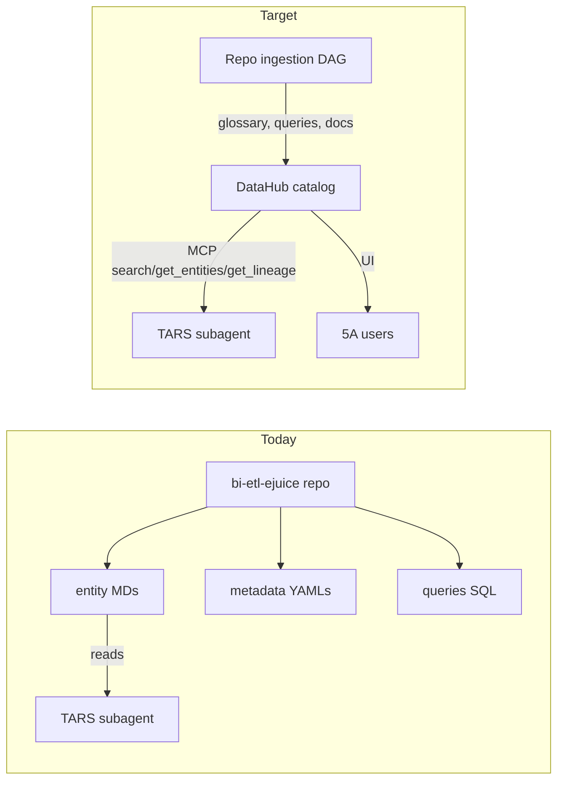

# RFC: Pivot TARS to the DataHub MCP — Pilot on Collections

| | |
|---|---|
| **Review Status** | Draft |
| **Comments until** | TBD |
| **Review until** | TBD |
| **Author** | @aurelio.nogueira |
| **Self link** | http://go.5a/rfc-tars-datahub-pivot |

## Revisions

| Date | Description |
|---|---|
| 2026-05-08 | Created |

## Approvers

| Status | Name | Date |
|---|---|---|
| Not started | Data Platform Tech Lead | |
| Not started | TARS / Data Analyst subagent owner | |
| Not started | DataHub / Catalog owner | |
| Not started | Analytics Engineering Manager (Data & AI) | |
| Not started | Fintech Data Squad Lead (pilot domain owner) | |

---

## Overview

We propose pivoting the TARS data analyst subagent from its current repo-bound
context (16 hand-curated entity markdowns under
[docs/llm_context/business_entities/](../../llm_context/business_entities/) plus
ad-hoc reads of `dags/**/metadata/*.yml` and `dags/**/queries/*.sql`) to a
DataHub-first context, served via the existing DataHub MCP server
(`user-datahub`). The pilot scope is the **collections** entity, end-to-end:
push the curated knowledge that today lives in
[collections.md](../../llm_context/business_entities/collections.md) into
DataHub as first-class assets (Domain, Glossary, Data Product, schemaField docs,
Query entities), and rewire TARS to consume only those assets via MCP for any
collections question.

The medium-term target is to retire `docs/llm_context/business_entities/`
entirely. DataHub becomes the single source of truth for both 5A users (UI) and
TARS (MCP), aligned with FAIR. The pilot is the proof point that lets us move
the remaining 15 entities on the same template.

---

## Goals & Non-Goals

### Goals

- Establish DataHub as the canonical source of business context for the
  collections entity, replacing
  [collections.md](../../llm_context/business_entities/collections.md).
- Rewire TARS (rules + subagent) to read collections context exclusively via the
  DataHub MCP (`search`, `get_entities`, `list_schema_fields`,
  `get_dataset_queries`).
- Reduce per-question token spend by replacing markdown ingestion with scoped
  JSON responses from the MCP.
- Make the same business knowledge directly visible to 5A users in the DataHub
  UI without a separate "documentation" workflow.
- Define a repeatable migration template (push artifacts + TARS routing) for the
  remaining 15 entities.

### Non-Goals

- Migrating the other 15 entities in this RFC (deferred to phased rollout).
- Replacing the `.cursor/skills/trino/` execution skill — TARS still executes
  Trino SQL the same way; only context routing changes.
- Re-architecting metadata ingestion into DataHub — column descriptions and
  lineage already flow from `dags/**/metadata/*.yml` via existing pipelines.
- Changing the `tars_track_record.jsonl` schema beyond the additions strictly
  needed to log MCP usage.
- Modifying contribution-mode behaviour (rules outside `data_exploration.mdc`
  and `data_analyst.md`).

---

## Background & Motivation

### Current state

TARS today is stitched together from four parallel knowledge surfaces, all
repo-bound:

- **16 hand-curated entity files** in
  [docs/llm_context/business_entities/](../../llm_context/business_entities/) —
  narrative, glossary, golden queries, dos/don'ts.
- **Per-table metadata YAMLs** in `dags/**/metadata/{layer}/*.yml` —
  descriptions, lineage, owner, PII classification.
- **Raw SQL** in `dags/**/queries/` — actual transformation logic.
- **Cross-DAG `dags/dependencies.yaml`** — implicit lineage at the DAG level.

[.cursor/rules/data_exploration.mdc](../../../.cursor/rules/data_exploration.mdc)
routes TARS through the entity files first, then falls back to grepping the
repo for column verification. The
[.cursor/subagents/data_analyst.md](../../../.cursor/subagents/data_analyst.md)
loop logs `entity_files_consulted` per turn.

### Why change

**5A users do not read the repo.** They open DataHub. The entity MDs are
invisible to them, drift from the YAMLs they describe, and duplicate knowledge
that the catalog already partially holds. The same domain glossary lives in
three places (entity MD, metadata YAML descriptions, dataset names) and is
authoritative in none of them.

**The repo is gated by a paid GitHub license.** Today, only engineers with a
GitHub seat can read or improve TARS' business context — the analysts, PMs,
ops leads, finance, and growth folks who actually consume the data are
locked out of the curation surface. DataHub is reachable by **every 5A user
with no extra license**. Pivoting the substrate from repo to catalog is what
unlocks company-wide curation; it is not just a routing change.

**Knowledge fragmentation breaks FAIR.** Findability depends on the user
guessing the right entity MD; accessibility depends on repo access;
interoperability is impossible because URNs only exist in DataHub; reusability
requires copy-pasting Golden Queries out of markdown files.

**There is also a cost dimension that has been silent so far.** TARS today pays
LLM tokens on every single question to re-derive structure that DataHub
already holds: it loads entity MDs, greps `dags/`, reads multiple metadata
YAMLs, and scans SQL files just to rebuild the same routing the catalog gives
back as a typed JSON response. We are using a probabilistic engine (the LLM)
to do deterministic catalog lookups — and paying a high per-query token bill
for the privilege.

### Key terms

- **DataHub** — QuintoAndar's data catalog. Already populated with all
  `dw_*`, `enrich_*`, `clean_*` datasets via existing metadata-YAML ingestion;
  served to humans via UI and to agents via the `user-datahub` MCP server.
- **DataHub MCP** — Read-only catalog access exposing 8 tools (`search`,
  `get_entities`, `list_schema_fields`, `get_lineage`,
  `get_lineage_paths_between`, `get_dataset_queries`, `search_documents`,
  `grep_documents`). Identifies entities by stable URNs (e.g.
  `urn:li:dataset:(urn:li:dataPlatform:hive,dw_collection_recovery_quintoandar.fact_collection,PROD)`).
- **TARS** — The Data Analyst subagent activated by `@tars`
  ([.cursor/subagents/data_analyst.md](../../../.cursor/subagents/data_analyst.md)).
  Generates Trino SQL from natural-language questions and executes via the
  Trino skill.
- **Entity MD** — A markdown file in
  [docs/llm_context/business_entities/](../../llm_context/business_entities/)
  carrying narrative, glossary, table catalogue, and golden queries for one
  business domain.
- **MDM** — Master Data Management. The principle that a given fact lives in
  exactly one authoritative place, with all consumers reading from there.
- **5A** — Internal abbreviation for QuintoAndar staff with company-wide
  catalog access.

---

## Target state — DataHub as the MDM layer

FAIR mapping that frames the talk:

- **Findable** — glossary terms + search index + domain hierarchy (replaces
  "Synonyms" sections).
- **Accessible** — one entry point for humans (UI) and agents (MCP) — replaces
  16 scattered MDs.
- **Interoperable** — stable URNs for datasets, columns, queries, glossary
  terms — joinable to lineage.
- **Reusable** — `schemaField` docs + `get_dataset_queries(MANUAL)` give
  consumers JOIN patterns and golden queries on demand.

---

## Cost and determinism — the silent argument

DataHub was designed exactly for the lookups TARS performs every turn. The
catalog is already populated, already indexed, and already served by an MCP
that returns scoped JSON. Pivoting TARS to it is not just a quality
improvement — it converts a recurring LLM cost into a one-time engineering
cost.

**Today's TARS turn (typical question on a known entity):**

- Loads [intro.md](../../llm_context/intro.md) (~57 lines) plus the relevant
  entity MD ([collections.md](../../llm_context/business_entities/collections.md)
  is ~250 lines) into context, every time.
- If the column needs verification, additionally `Grep`s `dags/`, `Read`s the
  SQL file, and `Read`s the metadata YAML — three more files materialized in
  the prompt.
- All of that is repeatedly tokenized so the LLM can extract a few specific
  facts: which table, which columns, which JOIN key.

**DataHub-routed turn (same question after the pivot):**

- `search` returns 1–3 dataset URNs ranked by relevance.
- `get_entities` on the chosen URN returns description, tags, glossary terms,
  owners — already structured.
- `list_schema_fields(keywords=[...])` returns only the columns asked about,
  paginated.
- `get_dataset_queries(source="MANUAL")` returns the JOIN patterns directly.

**What changes economically:**

- The per-question payload shrinks from "two markdown files plus several
  YAMLs" to "the JSON the agent actually consumes". Token spend per question
  drops by an order of magnitude consistent with that ratio.
- The LLM stops doing string-matching against MD tables (cheap-looking but
  expensive at scale) and starts doing real reasoning on small, typed
  responses.
- Deterministic responses also reduce iteration: today TARS sometimes
  mis-routes because the MD's "Where to query what" table missed an edge
  case; MCP filters cannot mis-route — they either return the right URN or
  return nothing, and the latter is debuggable.
- The work to keep the catalog correct is paid **once** per change (CI on
  metadata YAML, glossary recipe), not **once per question** (LLM re-reading
  the MD to derive what the YAML already says).

**Framing for the team:** we already invested in DataHub as the deterministic
substrate. TARS today is a probabilistic re-implementation of it on top of
repo files. The pivot is about stopping the duplication and letting each
layer do what it is good at — DataHub for structure, the LLM for SQL
composition.

---

## Mapping — `collections.md` to DataHub assets

This is the core mapping the team needs to internalize. Every section in an
entity MD has a native home in DataHub.

### Narrative

- **Overview / pipeline narrative** → `Domain` entity + dataset `description`
  aspect on each table. Proposed URN:
  `urn:li:domain:fintech-collections`.
- **Synonyms table** (Cobrança, Acordo, FPD, SSN…) → `GlossaryTerm` entities
  under a `Collections` term group. Linked to datasets via the
  term-association aspect. Discoverable via
  `search(filter="glossary_term = urn:li:glossaryTerm:fpd")`.
- **"Where to query what" table** → `DataProduct`
  (`urn:li:dataProduct:collections-recovery`) grouping the canonical datasets,
  plus a `tier` tag (`urn:li:tag:tier-dw`) so layer priority becomes a filter,
  not a doc rule.
- **Per-table sections** (`fact_collection`, `fact_debt`, …) → already exist
  as `Dataset` URNs ingested from the metastore. Enrich with editorial
  documentation, glossary term links, owners, deprecation flags.
- **Field tables** (Topic / Fields per dataset) → `schemaField` description
  aspect. The metadata YAMLs in
  [dags/fintech/dw_collection_recovery_quintoandar/metadata/dw/](../../../dags/fintech/dw_collection_recovery_quintoandar/metadata/dw/)
  already carry these — they reach DataHub via existing ingestion. Gap is
  enrichment quality, not pipeline.
- **Relationships section** (Invoice ↔ contract, Overdue ↔ AR…) → DataHub
  `Lineage` graph (already populated from `lineage:` blocks in YAML) +
  cross-glossary "related term" edges for business semantics.
- **Dos and Don'ts** → dataset `documentation` aspect (markdown body) AND
  `Assertion`s where the rule is mechanical (e.g. "always filter
  `is_most_recent_record_month = true`" can become a documented warning
  aspect, not just prose).
- **Golden Queries** → `Query` entities accessed via
  `get_dataset_queries(urn=..., source="MANUAL")`. **This is the single
  biggest unlock** — TARS no longer ships golden queries inside its rules;
  it pulls them live from DataHub at query time.

### Migration checklist (table)

| MD section | DataHub asset | MCP tool TARS uses | Push mechanism |
|---|---|---|---|
| Overview | `Domain` + dataset description aspect | `get_entities` | Metadata YAML `description` (already ingested) + Domain recipe |
| Synonyms | `GlossaryTerm` (under term group) | `search(filter="glossary_term=...")` + `get_entities` | Glossary recipe (new) |
| Where to query what | `DataProduct` + `tier` tag | `search(filter="domain=... AND tag=tier-dw")` | DataProduct recipe (new) |
| Per-table description | Dataset doc aspect | `get_entities` | Metadata YAML (already) |
| Field tables | `schemaField` doc aspect | `list_schema_fields` | Metadata YAML (already) |
| Relationships | Lineage + related-term edges | `get_lineage` / `get_lineage_paths_between` | Already from YAML lineage |
| Dos and Don'ts | Dataset doc aspect + `Assertion` | `get_entities` | Editorial push (new) |
| Golden Queries | `Query` entities | `get_dataset_queries(source=MANUAL)` | Query recipe (new) |

---

## Pilot scope — collections entity end-to-end

One entity, both tracks proven, before scaling to the other 15.

### Track A — Push collections knowledge to DataHub

1. Define new ingestion artifacts in `dags/governance/` (leverages existing
   [bietlejuice/governance/fairness_assessment/datahub_graphql/](../../../bietlejuice/governance/fairness_assessment/datahub_graphql/)
   client and the `enrich_datahub_metrics` pattern already in production).
2. Author a glossary YAML for the 6 collections terms (Cobrança, Assessoria,
   Acordo, Promessa, FPD, SSN/BOSSN), grouped under `Collections`.
3. Register the `fintech-collections` Domain and assign all
   `dw_collection_recovery_quintoandar.*`, `dw_collections_landlord.*`,
   `dw_collections_segmentation.*`, `dw_evictions.*` datasets to it.
4. Register a `collections-recovery` DataProduct with the dataset list from
   the "Where to query what" table.
5. Promote each Dos/Don't into the dataset documentation aspect on the
   relevant table (e.g. `is_most_recent_record_month` rule lands on
   `fact_overdue_portfolio_timeline`).
6. Push the AR Recovery Rate golden query (currently the SQL block at the
   bottom of [collections.md](../../llm_context/business_entities/collections.md))
   as a `Query` entity attached to its three subjects
   (`fact_accounts_receivable`, `fact_overdue_portfolio_timeline`,
   `fact_delay`).

### Track B — Rewire TARS to read collections from MCP

Two file edits, scoped to collections only during the pilot so we can measure
regression cleanly.

7. Update [.cursor/rules/data_exploration.mdc](../../../.cursor/rules/data_exploration.mdc):
   - Replace the "Entity File Routing" section with **"DataHub Routing"**:
     for any user question, first call `search` with the question terms; if
     results return a glossary term URN, hydrate it via `get_entities` to
     discover its data product and datasets.
   - Replace "Column Verification" section: instead of "Grep for the table
     name in `dags/`", call `list_schema_fields(urn=..., keywords=[...])`.
   - Add a **"Golden Query Reuse"** subsection: before composing a
     multi-table query, call
     `get_dataset_queries(urn=..., source="MANUAL", count=5)` and adapt.
8. Update [.cursor/subagents/data_analyst.md](../../../.cursor/subagents/data_analyst.md):
   - Rename the track-record field `entity_files_consulted` →
     `datahub_urns_consulted` (keep both during transition, deprecate after
     pilot).
   - Add the four MCP tool names TARS will actually use (`search`,
     `get_entities`, `list_schema_fields`, `get_dataset_queries`) to the
     canonical list logged under `mcp_tools_called`.
   - Add a routing fallback: if MCP returns nothing, use the entity MD for
     that domain (gives a clean rollback path if DataHub coverage is
     insufficient).
9. Mark
   [docs/llm_context/business_entities/collections.md](../../llm_context/business_entities/collections.md)
   with a `STATUS: deprecated — see DataHub domain
   urn:li:domain:fintech-collections` banner at the top, but keep the file
   during the pilot so fallback works.

### Pilot exit criteria

The pilot is complete — and the rollout to the other 15 entities can begin —
when **all** of the following are true:

- TARS answers the **10 most recent collections questions** logged in
  `tars_track_record.jsonl` using only MCP routing (no fallback to
  `collections.md`), and produces SQL of equal or better quality than the
  historical answer (judged by the data analyst on call).
- All 6 glossary terms, 1 domain, 1 data product, and 1 golden query are
  visible to a 5A user in the DataHub UI **and** retrievable via the MCP
  (verified by a query: `search(filter="domain = urn:li:domain:fintech-collections")`
  returns the expected dataset list).
- A **new** collections question that requires data **not present** in
  `collections.md` (e.g. asks about a column documented only in the metadata
  YAML) is answered correctly using `list_schema_fields` and
  `get_dataset_queries`.
- The TARS track-record entries from the pilot period show
  `datahub_urns_consulted` populated and `entity_files_consulted` empty for
  collections questions.
- Per-question token spend on collections turns drops measurably vs. the
  pre-pilot baseline (captured by comparing track-record entries before and
  after the cutover).

If any criterion fails, the pilot stops at this entity and a follow-up RFC
addresses the gap before rollout continues.

---

## Phased rollout after pilot

- **Stage 1 (this RFC):** collections pilot proves both tracks.
- **Stage 2:** migrate the remaining 15 entities one PR per entity, reusing
  the ingestion artifacts from stage 1. Each migration follows the same
  9-step recipe and is validated against the same exit criteria.
- **Stage 3:** flip
  [.cursor/rules/data_exploration.mdc](../../../.cursor/rules/data_exploration.mdc)
  to DataHub-only routing, delete
  [docs/llm_context/business_entities/](../../llm_context/business_entities/),
  retire the `entity_files_consulted` field, and add a CI rule that any new
  business context lands as DataHub assets (not MDs).

---

## Deliverables for the pilot

- This RFC at `docs/rfc/datahub/tars_pivot.md` — alignment artifact for the
  TARS team review.
- Engineering tickets per Track A item (1 ticket per ingestion artifact: 1
  glossary, 1 domain, 1 data product, 1 dos/don'ts editorial push, 1 golden
  query push).
- Engineering tickets per Track B item (1 ticket per rules-file edit: rule
  change, subagent change, MD deprecation banner).
- A short follow-up "lessons learned" note appended to this RFC after the
  pilot exits, used as input to stage 2.

---

## Open questions to flag in the RFC review (not blockers)

- **Glossary curation ownership:** Who is the data steward per domain
  responsible for keeping glossary terms accurate (proposed: domain owner
  listed in the metadata YAML `owner` field)?
- **Ingestion DAG location:** Does the new push DAG live as a standalone
  `dags/governance/datahub_business_context/` or as an extension of
  `enrich_datahub_metrics`?
- **Golden query authoring:** Should golden queries be auto-generated from
  representative `dags/**/queries/` SQL, or stay editorially curated to
  preserve "this is the *recommended* query for the question" semantics?
- **Soft-deprecation period for entity MDs:** How long do we keep the MDs as
  fallback after each entity migrates (proposed: one full sprint per entity,
  then deletion)?
- **MCP coverage for bilingual questions:** TARS handles Portuguese and
  English; do we need glossary terms in both languages, or does
  `search` handle the cross-language match well enough on QuintoAndar's
  current DataHub deployment?

These are intentionally left open and will be resolved during the RFC review
by the TARS team.

---

## Appendix A — Worked example: same question, old flow vs new flow

To make the pivot concrete, here is the same TARS question answered through
both flows. Question chosen because it exercises every part of an entity
MD — synonyms, table routing, column verification, and a golden query.

**User question (in Portuguese, as a real 5A user would ask):**

> Qual a taxa de recuperação de AR para os últimos 12 meses, separada por
> bucket OKR (0-90 dias vs 90+ dias)?

### Old flow (current, MD-based)

| Step | Action | Files materialized in context | Approx. tokens loaded |
|---|---|---|---|
| 1 | Load entity index | [intro.md](../../llm_context/intro.md) | ~1.5 K |
| 2 | Map "AR / recuperação / OKR" → `collections` entity via Synonyms | (still in `intro.md`) | — |
| 3 | Load entity context | [collections.md](../../llm_context/business_entities/collections.md) | ~10 K |
| 4 | Locate the AR Recovery Rate Golden Query inside the MD | (still in `collections.md`) | — |
| 5 | Verify `delay_contamined_range` on `fact_overdue_portfolio_timeline`: `Grep` `dags/` | grep results | ~0.5 K |
| 6 | `Read` SQL file | `dags/fintech/dw_collection_recovery_quintoandar/queries/dw/fact_overdue_portfolio_timeline.sql` | ~2 K |
| 7 | `Read` metadata YAML for column descriptions | `dags/fintech/dw_collection_recovery_quintoandar/metadata/dw/fact_overdue_portfolio_timeline.yml` | ~3 K |
| 8 | Compose final Trino SQL adapting the golden query | (in-prompt reasoning) | — |
| 9 | Execute via [.cursor/skills/trino/SKILL.md](../../../.cursor/skills/trino/SKILL.md) | (skill content) | ~1 K |
| | **Approximate context payload before SQL composition** | | **~18 K input tokens** |

### New flow (post-pivot, MCP-based)

| Step | Action | MCP tool call | Approx. tokens returned |
|---|---|---|---|
| 1 | Map "recuperação AR" → glossary term | `search(query="/q AR+recovery+rate", filter="entity_type IN (dataset, glossaryTerm)", num_results=5)` | ~0.5 K |
| 2 | Hydrate the matched glossary term to find its domain and data product | `get_entities(urns=["urn:li:glossaryTerm:ar-recovery-rate"])` | ~0.3 K |
| 3 | Discover canonical datasets for the domain | `search(filter="domain = urn:li:domain:fintech-collections AND tag = urn:li:tag:tier-dw")` | ~0.5 K |
| 4 | Pull the golden query for AR recovery rate | `get_dataset_queries(urn="urn:li:dataset:(...,fact_accounts_receivable,PROD)", source="MANUAL", count=3)` | ~1.5 K |
| 5 | Verify the OKR bucket column on the overdue table | `list_schema_fields(urn="urn:li:dataset:(...,fact_overdue_portfolio_timeline,PROD)", keywords=["delay_contamined_range", "delay_range"])` | ~0.4 K |
| 6 | Adapt the golden query with the requested 12-month window | (in-prompt reasoning) | — |
| 7 | Execute via [.cursor/skills/trino/SKILL.md](../../../.cursor/skills/trino/SKILL.md) | (skill content) | ~1 K |
| | **Approximate context payload before SQL composition** | | **~4 K input tokens** |

### What this comparison shows

- The MCP flow loads roughly **4× less context** for the same question, with
  no loss of fidelity — every fact the MD provided is also returned by the
  MCP, but scoped to what the agent actually needed.
- The MCP flow has **no string-matching step**: the synonym match becomes a
  real glossary lookup, the table routing becomes a real domain filter, and
  the golden query is a real Query entity rather than a markdown code block
  the LLM has to find inside ~250 lines.
- The MCP flow has **explicit URNs** at every step, so the track-record
  entry can log exactly which catalog assets were used — versus today's
  implicit "consulted `collections.md`" which is too coarse to debug
  routing mistakes.
- Both flows still execute SQL through the **same Trino skill**. The pivot
  changes context routing only; the execution loop is unchanged.

---

## Appendix B — File touchpoints summary

Files this RFC plans to **change** during the pilot:

- [.cursor/rules/data_exploration.mdc](../../../.cursor/rules/data_exploration.mdc)
  — replace Entity File Routing + Column Verification sections; add Golden
  Query Reuse subsection.
- [.cursor/subagents/data_analyst.md](../../../.cursor/subagents/data_analyst.md)
  — add `datahub_urns_consulted` field; expand `mcp_tools_called` canonical
  list; add MCP-first routing with MD fallback.
- [docs/llm_context/business_entities/collections.md](../../llm_context/business_entities/collections.md)
  — prepend deprecation banner only; keep content during pilot.

Files this RFC plans to **create** during the pilot (separate engineering
tickets):

- New ingestion DAG / glossary recipe / domain recipe / data product recipe
  / query push (location TBD per Open Questions above).

Files this RFC explicitly **leaves unchanged**:

- [.cursor/skills/trino/](../../../.cursor/skills/trino/) — execution skill is
  untouched.
- `dags/**/metadata/**/*.yml` and `dags/**/queries/**/*.sql` — already feed
  DataHub via existing ingestion; the pilot does not change them.
