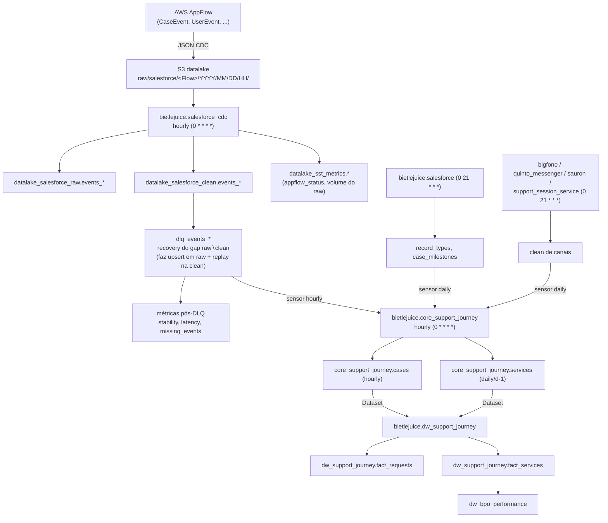

# Runbook — Pipeline Support Journey (SST / DAGs flexíveis)

> **Público-alvo:** plantonistas de Data Engineering.
> **Objetivo:** dar contexto suficiente para diagnosticar e atuar em falhas do
> pipeline **Support Journey** durante o plantão, sem depender do time dono
> (owner `Data SS`).

---

## 1. Contexto e objetivo

O **Support Journey** é o novo modelo de dados de atendimento (Single Station /
SST), construído a partir dos **Change Data Capture (CDC) do Salesforce** e de
fontes de canais de atendimento (Bigfone, Quinto Messenger, Sauron, Support
Session Service).

Ele é implementado por um **framework de DAGs flexíveis** — DAGs Python *fora do
padrão* do DAG Builder (não têm `_declaration.yml`; usam `prod_conf.yml` /
`forno_conf.yml` e código Python custom). Esse framework foi desenhado com dois
pilares:

- **Geração de métricas de observabilidade** do próprio pipeline (volume,
  latência, gaps de CDC, saúde do AppFlow, schema drift, contratos de
  qualidade) — todas em `datalake_sst_metrics`.
- **Validações/guardas** que garantem qualidade e reexecução segura
  (idempotência por partição, contratos de qualidade raw/clean, versionamento
  SCD Type 2 no core model).

Este runbook cobre **onde estão as coisas**, **como o dado flui**, **por que
partições podem "sumir" ou demorar** e **como reprocessar com segurança**.

---

## 2. DAGs do framework e fluxo de dependência

### 2.1 DAGs flexíveis (fora do padrão — Python custom)

| DAG (Airflow ID)                   | Caminho                                                     | Schedule             | Papel                                               |
| ---------------------------------- | ----------------------------------------------------------- | -------------------- | --------------------------------------------------- |
| `bietlejuice.salesforce_cdc`       | `dags/support_and_service/salesforce_cdc/salesforce_cdc.py` | `0 * * * *` (hourly) | Ingestão CDC do Salesforce (raw → clean + métricas) |
| `bietlejuice.core_support_journey` | `dags/core/core_support_journey/core_support_journey.py`    | `0 * * * *` (hourly) | Core model (`cases` + `services`)                   |

Ambas:
- **não** têm `_declaration.yml` (são custom, estão na `skip_list` da validação
  padrão de DAGs e em `dags_out_of_pattern`);
- têm `max_active_runs=1`, `catchup=True`, `retries=3` e **`depends_on_past=True`**;
- alertam falhas via Google Chat (`GchatCallback`, variável
  `WEBHOOK_SALESFORCE_CDC_PROD`).

> ⚠️ **`depends_on_past=True`**: se uma partição horária falha e fica vermelha,
> **todas as horas seguintes ficam bloqueadas** até a falha ser resolvida (ou a
> run marcada como sucesso). Essa é a causa nº 1 de "o pipeline parou".

### 2.2 DAGs a jusante / upstream (DAG Builder padrão)

| DAG                                                                               | Caminho                                             | Trigger           | Papel                                                       |
| --------------------------------------------------------------------------------- | --------------------------------------------------- | ----------------- | ----------------------------------------------------------- |
| `bietlejuice.dw_support_journey`                                                  | `dags/support_and_service/dw_support_journey/`      | **Datasets**      | Facts do novo modelo (`fact_requests`, `fact_services`)     |
| `bietlejuice.salesforce`                                                          | `dags/support_and_service/salesforce/`              | cron `0 21 * * *` | Dimensões auxiliares (`record_types`, `case_milestones`, …) |
| `bietlejuice.bigfone` / `quinto_messenger` / `sauron` / `support_session_service` | `dags/support_and_service/…`                        | cron `0 21 * * *` | Fontes clean de canais (consumidas por `services`)          |
| `bietlejuice.dw_bpo_performance`                                                  | `dags/planning_and_performance/dw_bpo_performance/` | Datasets          | Datamart que consome `dw_support_journey.fact_services`     |

### 2.3 Fluxo ponta a ponta



**Ordem efetiva:**
1. AppFlow grava a partição horária do CDC no S3.
2. `salesforce_cdc` transforma raw → clean, roda o **DLQ** (recovery +
   reprocess da clean) e só então gera a métrica de missing events.
3. `core_support_journey` espera os **sensores** (CDC **DLQ** hourly de Case +
   clean hourly de User + fontes diárias) e carrega `cases` (por hora) e
   `services` (efetivamente 1×/dia).
4. `dw_support_journey` sobe via **Datasets** quando `cases` **e** `services`
   emitem seus datasets.
5. Datamarts a jusante (ex.: `dw_bpo_performance`).

### 2.4 Onde ficam definidas as dependências entre as DAGs

- **Sensores do core model** (`core_support_journey` esperando upstreams):
  `dags/core/core_support_journey/prod_conf.yml`, chave `dependencies:`. Cada
  entrada vira um `SStExternalTaskSensor` no task group `start_sensors`.
  - `is_daily: true` + `execution_hour` → o sensor aponta para a run diária do
    upstream (via `get_daily_target_logical_date`).
  - `is_daily: false` (caso do `salesforce_cdc`) → mesma `logical_date` da run
    horária atual.
- **Trigger do DW** (`dw_support_journey`): via **Datasets** em
  `dags/dependencies.yaml` (+ exceção manual em
  `dags/dependency_exceptions/manual_modifications.yaml`). Depende dos dois
  datasets do core (`…:load_core_support_journey_cases` e `…_services`).

---

## 3. `salesforce_cdc` + AppFlow → S3

O dado do Salesforce **não** é lido diretamente pela DAG: ele é entregue no S3
pelo **AWS AppFlow** (serviço gerenciado, **fora do repositório**).

- Há **um flow AppFlow por evento/tabela** (`events_*`). O mapeamento é 1:1.
- O AppFlow grava JSON de CDC no layout horário esperado pela DAG:
  ```
  s3://5a-datalake-prod/raw/salesforce/<FlowName>/YYYY/MM/DD/HH/
  # ex.: s3://5a-datalake-prod/raw/salesforce/CaseEvent/2026/07/20/14/
  ```
  O `<FlowName>` é o último segmento de `event_path` no
  `dags/support_and_service/salesforce_cdc/prod_conf.yml` (ex.: `CaseEvent`).
- A DAG `salesforce_cdc` então lê esse S3 e faz `raw` → `quality_contract_raw`
  → `clean` → `quality_contract_clean` → **DLQ** → `missing_events`, por
  evento. Todas as métricas (stability, latency, missing_events) rodam
  **depois** do DLQ, para não lerem uma partição meio recuperada.

### AppFlow status e recovery automático

- A saúde do connector é registrada em `datalake_sst_metrics.appflow_status`.
- **Qualquer status ≠ `Active` é um incidente operacional** (`Draft`,
  `Suspended`, `Errored`, `Deleted`, `Deprecated`).
- Quando o status ≠ `Active`, o pipeline aciona **recovery automático**: passa a
  buscar os dados **em batch via API do Salesforce**, evitando perda de dados.
  Durante o recovery, picos de volume (`z_score`) são **esperados** e não são um
  incidente separado.

**Primeira verificação em incidente de ingestão:**
```sql
SELECT * FROM datalake_sst_metrics.appflow_status
WHERE status != 'Active'
ORDER BY partition_date DESC, partition_hour DESC
LIMIT 50;
```

---

## 4. Validações de partição (idempotência / skip)

O framework foi desenhado para ser **idempotente por partição**: **não é
possível gravar a mesma partição duas vezes**. Se você reexecutar uma partição
que **já tem dados**, o job faz **skip silencioso** (loga a mensagem e retorna
sem regravar) — não dá erro, mas também **não reprocessa**.

A guarda central é `partition_has_data(...)`
(`packages/bietlejuice-runtime/src/bietlejuice/base/sst/core/observability/sensors.py`):
conta linhas da partição no destino; se já existe, o job para ali.

| Etapa           | Chave de skip                                                              | Efeito                                                        |
| --------------- | -------------------------------------------------------------------------- | ------------------------------------------------------------- |
| `cdc_raw`       | `(partition_date, partition_hour)` no raw                                  | Skip se a hora já foi ingerida                                |
| `cdc_clean`     | `(partition_date, partition_hour)` no clean                                | Skip se a hora já foi limpa                                   |
| core `cases`    | `(partition_date, partition_hour)` em `core_support_journey.cases`         | Skip se a hora já existe                                      |
| core `services` | **`partition_date - 1 dia`** (sem hora) em `core_support_journey.services` | Skip se o dia anterior já foi carregado → efetiva 1 carga/dia |

> 🔧 **Como reprocessar de fato uma partição** (o "re-run" no Airflow **não
> basta** — vai dar skip): é preciso **apagar/esvaziar a partição** no destino
> Delta antes de reexecutar.
> - `cases` / raw / clean: limpar a partição `(partition_date, partition_hour)`.
> - `services`: limpar `partition_date = d-1` (o dia que a run processa).
>
> A escrita usa `replaceWhere` na partição (overwrite previsível da partição, não
> append cego), então após limpar e reexecutar o resultado é consistente.

---

## 5. Geração de métricas e uso do TARS

### 5.1 Métricas geradas pelo pipeline (`datalake_sst_metrics`)

O `salesforce_cdc` gera métricas de observabilidade por evento e por hora. As
principais tabelas (catalog `delta`, schema `datalake_sst_metrics`):

| Tabela                                 | Para responder…                                                                                         |
| -------------------------------------- | ------------------------------------------------------------------------------------------------------- |
| `pipeline_stability`                   | Anomalias de volume (z-score, média móvel). Filtrar `environment = 'prod'` e um `window_size` (ex.: 24) |
| `events_volume` / `events_type_volume` | Contagem de linhas por tabela/hora (por `event_type`). DLQ: `event_type = 'DLQ_RECOVERY'` (`layer` raw vs clean) |
| `pipeline_events_latency`              | Latência source→target (`average_delay`, `p90`/`p95`/`p99`, `unit`) — grão por `target_table`           |
| `cdc_pipeline_missing_events`          | Gaps de CDC **residuais, depois do DLQ** (`total_events_missing > 0`) — usa coluna `env` (não `environment`) |
| `table_metadata`                       | Schema drift (`new_cols`, `new_cols_count`)                                                             |
| `contract_quality_checks`              | Freshness dos contratos de qualidade (`status`, `last_row_timestamp`)                                   |
| `appflow_status`                       | Saúde do connector AppFlow (`status != 'Active'`)                                                       |

> **Sinal-chave:** a **ausência de linha** para um `(source_table,
> partition_date, partition_hour)` significa que o pipeline **não rodou** naquela
> hora — isso já é sinal de falha, não é NULL. Antes de tratar como incidente,
> confirme em `events_type_volume` se não é um fluxo diário/`RECOVERY`.

> **Timing da DLQ:** o DLQ roda **antes** de `missing_events`, então
> `cdc_pipeline_missing_events` mostra o gap que **sobrou** depois do recovery.

> **Volume da DLQ:** o volume recuperado pela DLQ entra em `events_type_volume`
> com `event_type = 'DLQ_RECOVERY'` (`layer` raw = API; clean = replay), uma
> linha por layer em **toda** execução — `row_count = 0` quando não havia nada
> a recuperar. Linha **ausente** significa que a task `dlq_events_*` não rodou.

### 5.2 Como o TARS ajuda a investigar

O **TARS** (analista de dados sobre o Trino) pode traduzir perguntas de negócio
em SQL sobre `datalake_sst_metrics`, acelerando o diagnóstico no plantão.
Exemplos de perguntas úteis:

- "Quais tabelas do SST estão com volume anômalo (|z-score| > 2) nas últimas
  24h?"
- "Há flows do AppFlow com status diferente de `Active` agora?"
- "Quais `target_table` estão com latência acima da média na partição mais
  recente?"
- "Houve gaps de CDC (`total_events_missing > 0`) nos últimos 7 dias?"
- "Quantas linhas a DLQ recuperou em raw e reprocessou em clean nos últimos 7
  dias?"

Para consultas analíticas sobre essas métricas, instale o plugin **TARS** do marketplace ai-tools (`/tars`). A documentação de
referência das métricas (schemas, regras e *golden queries*) está em
`docs/llm_context/domain_entities/salesforce_sst_pipeline.md`.

> Cuidado ao correlacionar: um pico de `z_score` **durante recovery do AppFlow**
> é esperado — sempre cheque `appflow_status` antes de abrir um incidente de
> qualidade de dado separado.

---

## 6. Core model: job hourly vs daily

A DAG `core_support_journey` tem **um único cron** (`0 * * * *`), mas produz
**duas tabelas com frequências efetivas diferentes**:

| Tabela     | Job Spark                                  | Frequência efetiva              | Guarda de skip                       | Timeout |
| ---------- | ------------------------------------------ | ------------------------------- | ------------------------------------ | ------- |
| `cases`    | `…/core_model/support_journey/cases.py`    | **Horária** (cada partição CDC) | `(partition_date, partition_hour)`   | 2h      |
| `services` | `…/core_model/support_journey/services.py` | **Diária** (janela de d-1, 24h) | `partition_date - 1 dia` já populado | 4h      |

Como funciona na prática:
- `cases` processa a **hora corrente** do CDC — trabalho leve, roda toda hora.
- `services` monta a janela do **dia anterior inteiro** (`build_ts_filter` com
  `delta_hours=-24` ancorado em `partition_date` 00:00). Como o skip verifica se
  o **dia anterior já existe**, só a **primeira run do dia** (a de **meia-noite**)
  faz o trabalho pesado; as demais horas dão skip (no-op).

> 🕛 **Por que as partições de meia-noite demoram mais:** na virada do dia,
> `services` processa o volume completo de d-1 (por isso o timeout maior, 4h).
> Uma run de `core_support_journey` mais lenta à meia-noite é **esperada** — não
> confunda com travamento. Se estourar as 4h de forma recorrente, aí sim é
> incidente (avaliar volume/cluster).

---

## 7. Onde mora a configuração das tabelas do core model

### 7.1 Specs de tabela (uma por arquivo)

```
dags/core/core_support_journey/tables/
  ├── cases.yml
  └── services.yml
```

A DAG lista **todos os `*.yml`** em `tables/` e cria **uma task Spark por
arquivo** (`list_table_specs_from_dir`). **Adicionar um novo `.yml` aqui cria
automaticamente uma nova tabela do core.**

Cada spec define:
- `target_schema` / `target_table`, `partition_cols`, `merge_on`,
  `when_matched_update_condition` (regra de merge/upsert);
- **`sources:`** — as tabelas clean de origem (é aqui que moram as
  **dependências de dados** da tabela), com `key_cols`, `sort_col`, `cols` e
  `tracked_cols`;
- **`schema:`** — colunas esperadas + `min_columns`/`max_columns`/`strict`
  (validação de schema no job Spark).

Exemplos de fontes:
- `cases.yml` → `datalake_salesforce_clean.events_case`,
  `…record_types`, `…case_milestones`.
- `services.yml` → `datalake_support_session_service_clean.support_session`,
  `datalake_sauron_clean.session`, `datalake_bigfone_clean.event`,
  `datalake_quinto_messenger_clean.*`.

### 7.2 Como o job encontra o YAML em runtime

O YAML é enviado para o bucket de artifacts e lido pelo job via
`--table_config_relative_path` (ex.:
`core/core_support_journey/tables/cases.yml`), resolvido pelo
`config_loader.py`. A config **por ambiente** (bucket, cluster, dependências,
webhook) vem do `ConfigurationService` lendo `prod_conf.yml` / `forno_conf.yml`.

### 7.3 Dois níveis de "dependência"

1. **Dependência de dados (conteúdo):** definida em `sources:` de cada
   `tables/*.yml` — o que o job lê para montar a tabela.
2. **Dependência de orquestração (quando rodar):** definida em
   `prod_conf.yml → dependencies:` (sensores Airflow para os upstreams) e, para o
   DW a jusante, em `dags/dependencies.yaml` (Datasets).

---

## 8. Backfill / reprocessamento via configuração (SCD Type 2)

O core model foi preparado para **backfill sem replicar o job inteiro**. Não é
mais preciso criar uma DAG paralela nem uma cópia do pipeline para reprocessar um
período: o **range de datas/horas** passa a ser controlado por **configuração**.
Para fazer um backfill basta **manter a config atualizada** e **chamar as classes
`SupportJourneyCoreModelPipeline` (cases) e/ou
`SupportJourneyServicesCoreModelPipeline` (services)** numa função de `run`. O
reprocessamento já é feito **respeitando o versionamento SCD Type 2** — o job
recompõe as versões a partir do ponto pedido, sem deixar pontas soltas.

O que muda em relação à run normal:

|                | Run normal (hourly)                                       | Backfill (`is_backfill_run=True`)                                                                                           |
| -------------- | --------------------------------------------------------- | --------------------------------------------------------------------------------------------------------------------------- |
| **`cases`**    | Processa só a partição `(partition_date, partition_hour)` | Reprocessa **tudo a partir** da partição informada **para frente** (`partition_key >= "{partition_date} {partition_hour}"`) |
| **`services`** | Janela de d-1 (via `delta_hours` de cada source)          | Mesma lógica de janela, mas com `delta_hours` **estendido por source** para alcançar o período desejado                     |

### 8.1 `cases` — parametrizado por partição de início

Para o core de `cases` basta passar **`is_backfill_run=True`** e a **partição mais
antiga** que se quer reprocessar (`partition_date` + `partition_hour`). O job:

1. **Ignora a guarda de skip** de partição (não dá o skip silencioso da §4).
2. Monta o filtro `partition_key = concat(partition_date, ' ', partition_hour)` e
   mantém **todas as partições `>= "{partition_date} {partition_hour}"`** — como as
   colunas têm largura fixa e são lexicograficamente ordenáveis, isso equivale a
   "dessa data/hora em diante".
3. Recompõe o SCD Type 2 (`get_versioning_df`) considerando todo o histórico a
   partir dali — daí "sem pontas soltas".

> Ou seja: você aponta o **início** do backfill; o job varre daquela partição
> **até a mais recente** e reescreve as versões.

> 📍 **Onde a flag é lida:** o `cases` lê `is_backfill_run` dos **parâmetros de
> execução** (`cfg.is_backfill_run`), passados na run (ver §8.3). A chave
> top-level `is_backfill_run` em `cases.yml` reflete o mesmo estado na config.

### 8.2 `services` — parametrizado por `delta_hours` de cada source

O core de `services` **não** usa partição de início; a janela é definida pelo
**`delta_hours` de cada tabela source** (quantas horas para trás, ancorado em
`partition_date` 00:00 UTC — ver `build_ts_filter`, §6). Para um backfill, ligue
**`is_backfill_run: true`** na config e ajuste o `delta_hours` **de cada source**
para cobrir quantas horas para trás você quer reprocessar daquela tabela.

> 📍 **Onde a flag é lida:** o `services` lê `is_backfill_run` da **própria config
> da tabela** (`table_spec["is_backfill_run"]`, chave top-level de `services.yml`),
> não do `cfg`. Quando `true`, o job **pula o guard de skip diário** (a guarda de
> "d-1 já populado" da §4) — sem isso, um backfill de um dia já carregado daria
> skip silencioso. Com o skip desligado, toda a janela estendida por `delta_hours`
> é reprocessada e o SCD Type 2 é recomposto.

> ⚠️ `delta_hours` é **por source** (cada tabela tem o seu). Aumente o valor **em
> todas as sources relevantes** para o período; se deixar uma menor, aquela fonte
> não alcança o início da janela e o resultado fica inconsistente.

### 8.3 Como executar

Instancie as classes com um `cfg` (namespace com os parâmetros que a run espera) e
chame `.run()`. O `cfg` aceita a config da tabela como **dict** via
`table_config_json` (mesmo caminho usado nos testes unitários) — em produção a DAG
usa `table_config_relative_path` apontando para o YAML no S3, mas para um backfill
controlado o dict inline é o mais direto.

```python
from types import SimpleNamespace

from bietlejuice.base.sst.pipelines.core_model.support_journey.cases import (
    SupportJourneyCoreModelPipeline,
)
from bietlejuice.base.sst.pipelines.core_model.support_journey.services import (
    SupportJourneyServicesCoreModelPipeline,
)


def run():
    # --- cases: reprocessa da partição mais antiga para frente ---
    cases_cfg = SimpleNamespace(
        job_name="load_core_support_journey_cases",
        dag_name="core_support_journey",
        bucket="5a-datalake-prod",
        # partição MAIS ANTIGA a reprocessar (o job pega daqui para frente):
        partition_date="2026-01-01",
        partition_hour="00",
        is_backfill_run=True,
        table_config_json=CASES_CONFIG,  # dict da §8.4
    )
    SupportJourneyCoreModelPipeline(cases_cfg).run()

    # --- services: janela controlada pelo delta_hours de cada source ---
    # services lê is_backfill_run da CONFIG (table_spec), não do cfg -> ligue a
    # flag no dict e ajuste os delta_hours por source.
    services_cfg = SimpleNamespace(
        job_name="load_core_support_journey_services",
        dag_name="core_support_journey",
        bucket="5a-datalake-prod",
        partition_date="2026-01-01",
        partition_hour="00",
        table_config_json={**SERVICES_CONFIG, "is_backfill_run": True},  # §8.4
    )
    SupportJourneyServicesCoreModelPipeline(services_cfg).run()
```

> 🔧 **Resumo operacional:**
> - **`cases`** → `is_backfill_run=True` **no cfg da run** + partição de início
>   (`partition_date`, `partition_hour`).
> - **`services`** → `is_backfill_run: true` **na config** (`table_spec`) +
>   `delta_hours` de cada source ajustado para o período.

### 8.4 Configurações atuais (formato dict)

Os dicts abaixo são a config **completa** (incluindo o bloco `schema` de validação
de colunas), espelhando `dags/core/core_support_journey/tables/cases.yml` e
`services.yml`. Copie, ajuste as chaves de backfill (`is_backfill_run` e, no
`services`, os `delta_hours`) e passe em `table_config_json` — como estão, já são
utilizáveis diretamente como código Python.

```python
CASES_CONFIG = {
    "target_schema": "core_support_journey",
    "target_table": "cases",
    "partition_cols": ["partition_date", "partition_hour"],
    "merge_on": ["id_event"],
    "when_matched_update_condition": (
        "source.partition_date = target.partition_date "
        "AND source.partition_hour = target.partition_hour"
    ),
    "is_backfill_run": False,  # top-level -> True para backfill de cases
    "sources": {
        "case": {
            "table_name": "datalake_salesforce_clean.events_case",
            "key_cols": ["id_record"],
            "sort_col": ["committed_at"],
            "cols": [
                "id_case", "id_account", "id_owner", "id_created_by",
                "id_last_modified_by", "case_number", "event_type", "type",
                "status", "reason", "origin", "subject", "priority",
                "description", "is_closed", "created_date",
                "last_modified_date", "closed_date", "committed_at",
                "partition_date", "partition_hour", "ts_load",
            ],
            "tracked_cols": [
                "AccountId", "OwnerId", "CreatedById", "CaseNumber", "Type",
                "Status", "Reason", "Origin", "Subject", "Priority",
                "Description", "IsClosed", "CreatedDate", "ClosedDate",
            ],
        },
        "record_types": {
            "table_name": "datalake_salesforce_clean.record_types",
            "key_cols": ["id_record_type"],
            "sort_col": ["ts_last_modified"],
            "cols": ["record_type_name", "developer_name"],
        },
        "case_milestones": {
            "table_name": "datalake_salesforce_clean.case_milestones",
            "key_cols": ["id_case"],
            "sort_col": ["ts_last_modified"],
            "cols": [
                "id_case_milestone", "target_response_in_mins",
                "target_response_in_hrs", "target_response_in_days",
                "time_remaining_in_mins", "time_remaining_in_hrs",
                "time_remaining_in_days", "elapsed_time_in_mins",
                "elapsed_time_in_hrs", "elapsed_time_in_days",
                "time_since_target_in_mins", "time_since_target_in_hrs",
                "time_since_target_in_days", "dt_start", "dt_target",
                "dt_completion",
            ],
        },
    },
    "schema": {
        "columns": {
            "id_case": {"type": "string", "required": True},
            "id_event": {"type": "string", "required": True},
            "id_event_type": {"type": "string", "required": True},
            "id_account": {"type": "string", "required": True},
            "id_owner": {"type": "string", "required": True},
            "id_created_by": {"type": "string", "required": True},
            "id_last_modified_by": {"type": "string", "required": True},
            "commit_number": {"type": "bigint", "required": True},
            "case_number": {"type": "string", "required": True},
            "event_type": {"type": "string", "required": True},
            "type": {"type": "string", "required": True},
            "status": {"type": "string", "required": True},
            "reason": {"type": "string", "required": True},
            "origin": {"type": "string", "required": True},
            "subject": {"type": "string", "required": True},
            "priority": {"type": "string", "required": True},
            "description": {"type": "string", "required": True},
            "is_closed": {"type": "boolean", "required": True},
            "is_deleted": {"type": "boolean", "required": True},
            "created_date": {"type": "string", "required": True},
            "last_modified_date": {"type": "string", "required": True},
            "closed_date": {"type": "string", "required": True},
            "committed_at": {"type": "string", "required": True},
            "record_type_name": {"type": "string", "required": True},
            "developer_name": {"type": "string", "required": True},
            "id_case_milestone": {"type": "string", "required": True},
            "target_response_in_mins": {"type": "int", "required": True},
            "target_response_in_hrs": {"type": "int", "required": True},
            "target_response_in_days": {"type": "int", "required": True},
            "time_remaining_in_mins": {"type": "int", "required": True},
            "time_remaining_in_hrs": {"type": "int", "required": True},
            "time_remaining_in_days": {"type": "int", "required": True},
            "elapsed_time_in_mins": {"type": "int", "required": True},
            "elapsed_time_in_hrs": {"type": "int", "required": True},
            "elapsed_time_in_days": {"type": "int", "required": True},
            "time_since_target_in_mins": {"type": "int", "required": True},
            "time_since_target_in_hrs": {"type": "int", "required": True},
            "time_since_target_in_days": {"type": "int", "required": True},
            "dt_start": {"type": "date", "required": True},
            "dt_target": {"type": "date", "required": True},
            "dt_completion": {"type": "date", "required": True},
            "partition_date": {"type": "string", "required": True},
            "partition_hour": {"type": "string", "required": True},
            "_created_at": {"type": "string", "required": True},
            "_last_updated_at": {"type": "string", "required": True},
            "_effective_timestamp": {"type": "string", "required": True},
            "_expired_timestamp": {"type": "string", "required": True},
            "_is_current": {"type": "boolean", "required": True},
            "_ts_load": {"type": "string", "required": True},
        },
    },
    "min_columns": 49,
    "max_columns": 49,
    "strict": True,
}
```

```python
SERVICES_CONFIG = {
    "target_schema": "core_support_journey",
    "target_table": "services",
    "partition_cols": ["partition_date", "partition_hour"],
    "merge_on": ["id_event"],
    "when_matched_update_condition": (
        "source.partition_date = target.partition_date "
        "AND source.partition_hour = target.partition_hour"
    ),
    "is_backfill_run": False,  # -> True para backfill de services
    # delta_hours = quantas horas para trás (ancorado em partition_date 00:00 UTC).
    # Para backfill, aumente o delta_hours de CADA source o suficiente para
    # cobrir o período desejado.
    "sources": {
        "support_session": {
            "table_name": "datalake_support_session_service_clean.support_session",
            "delta_hours": 72,
        },
        "sauron_session": {
            "table_name": "datalake_sauron_clean.session",
            "delta_hours": 72,
        },
        "bigfone_event": {
            "table_name": "datalake_bigfone_clean.event",
            "delta_hours": 24,
        },
        "qm_channel": {
            "table_name": "datalake_quinto_messenger_clean.channel",
            "delta_hours": 72,
        },
        "qm_chat": {
            "table_name": "datalake_quinto_messenger_clean.chat",
            "delta_hours": 72,
        },
        "qm_task": {
            "table_name": "datalake_quinto_messenger_clean.task",
            "delta_hours": 24,
        },
        "qm_task_event": {
            "table_name": "datalake_quinto_messenger_clean.task_event",
            "delta_hours": 72,
        },
    },
    "schema": {
        "columns": {
            # Event identity (added in _build_target_df)
            "id_event": {"type": "string", "required": True},
            "id_event_type": {"type": "string", "required": True},
            # Session / task ids
            "id_session": {"type": "string", "required": True},
            "id_support_session": {"type": "string", "required": True},
            "id_task": {"type": "string", "required": True},
            "id_task_event": {"type": "string", "required": True},
            "id_channel": {"type": "string", "required": True},
            "id_reservation": {"type": "string", "required": True},
            "id_call": {"type": "string", "required": True},
            "id_user": {"type": "string", "required": True},
            "id_worker": {"type": "string", "required": True},
            "id_source_ctwa": {"type": "string", "required": True},
            # Descriptive attributes
            "database_source": {"type": "string", "required": True},
            "service_type": {"type": "string", "required": True},
            "theme": {"type": "string", "required": True},
            "theme_detail": {"type": "string", "required": True},
            "journey_step_tag": {"type": "string", "required": True},
            "customer_type_tag": {"type": "string", "required": True},
            "contact_reason_tag": {"type": "string", "required": True},
            "direction": {"type": "string", "required": True},
            "channel_type": {"type": "string", "required": True},
            "origin": {"type": "string", "required": True},
            "bpo_name": {"type": "string", "required": True},
            "bpo_selection_reason": {"type": "string", "required": True},
            "queue_name": {"type": "string", "required": True},
            "worker_email": {"type": "string", "required": True},
            "customer_email": {"type": "string", "required": True},
            "customer_phone_number": {"type": "string", "required": True},
            "twilio_phone_number": {"type": "string", "required": True},
            "from_phone_number": {"type": "string", "required": True},
            "to_phone_number": {"type": "string", "required": True},
            "task_cancelation_reason": {"type": "string", "required": True},
            "task_status": {"type": "string", "required": True},
            "task_outcome": {"type": "string", "required": True},
            "task_completion_reason": {"type": "string", "required": True},
            "url_source_ctwa": {"type": "string", "required": True},
            "type_source_ctwa": {"type": "string", "required": True},
            "task_attributes": {"type": "string", "required": True},
            # Metrics
            "waiting_time_sec": {"type": "int", "required": True},
            "seconds_to_first_response": {"type": "int", "required": True},
            "total_inactivity_time": {"type": "bigint", "required": True},
            "last_inactivity_time": {"type": "bigint", "required": True},
            # Booleans
            "is_forwarded": {"type": "boolean", "required": True},
            "is_per_team_task": {"type": "boolean", "required": True},
            "is_spoc_task": {"type": "boolean", "required": True},
            "is_isaias_session": {"type": "boolean", "required": True},
            # Event timestamps
            "ts_task_created": {"type": "string", "required": True},
            "ts_task_updated": {"type": "string", "required": True},
            # Partitions
            "partition_date": {"type": "string", "required": True},
            "partition_hour": {"type": "string", "required": True},
            # Pipeline metadata
            "_created_at": {"type": "string", "required": True},
            "_ts_load": {"type": "string", "required": True},
            # SCD Type 2 versioning (added by get_versioning_df)
            "_effective_timestamp": {"type": "string", "required": True},
            "_expired_timestamp": {"type": "string", "required": True},
            "_is_current": {"type": "boolean", "required": True},
            "_last_updated_at": {"type": "string", "required": True},
        },
    },
    "min_columns": 57,
    "max_columns": 57,
    "strict": True,
}
```

> 💡 Alternativa: em vez de manter o dict inteiro no código, aponte
> `table_config_relative_path` para o YAML já publicado no S3 e sobreponha só as
> chaves de backfill (`is_backfill_run` / `delta_hours`). O dict inline acima é
> mais autocontido para uma execução pontual de plantão.

---

## 9. Guia rápido de atuação no plantão

| Sintoma                                                                     | Onde olhar                                                                         | Ação                                                                                                                                                       |
| --------------------------------------------------------------------------- | ---------------------------------------------------------------------------------- | ---------------------------------------------------------------------------------------------------------------------------------------------------------- |
| `salesforce_cdc` / `core_support_journey` parou e horas seguintes não rodam | Airflow (grid)                                                                     | Efeito de `depends_on_past=True`: resolver a run mais antiga em falha; só então as seguintes destravam                                                     |
| Ingestão sem dados numa hora                                                | `datalake_sst_metrics.appflow_status` (`status != 'Active'`), `events_type_volume` | Se AppFlow ≠ `Active`, recovery via API já atua; validar se é gap real ou fluxo diário/RECOVERY                                                            |
| `missing_events` positivo mesmo após DLQ verde                              | `events_type_volume` com `event_type = 'DLQ_RECOVERY'`                             | Gap real: `missing_events` roda **depois** do DLQ, logo é o que o recovery não cobriu. Compare com `DLQ_RECOVERY` (`layer` raw vs clean) na mesma hora        |
| `core_support_journey` travado esperando o CDC de Case                      | Airflow (grid) — task `dlq_events_case`                                            | O sensor aguarda `dlq_events_case` (não mais `load_datalake_salesforce_clean_events_case`), para que o recovery já esteja na clean. Marque a task DLQ da hora presa como success para destravar |
| Reexecutei a partição e "não fez nada"                                      | Comportamento de skip (§4)                                                         | Limpar a partição no Delta destino antes de reexecutar (raw/clean/`cases`: `(date, hour)`; `services`: `d-1`)                                              |
| Preciso reprocessar um período grande (backfill)                            | Backfill via configuração (§8)                                                     | `cases`: `is_backfill_run=True` + partição de início; `services`: `is_backfill_run=True` + `delta_hours` por source. Ignora o skip e recompõe o SCD Type 2 |
| Run de meia-noite lenta                                                     | `services` processa d-1 (§6)                                                       | Esperado até 4h; investigar só se estourar timeout recorrentemente                                                                                         |
| `dw_support_journey` não subiu                                              | Datasets em `dependencies.yaml`                                                    | Confirmar se **ambos** os datasets (`cases` e `services`) foram emitidos pelo core                                                                         |
| Latência/volume anômalos                                                    | `pipeline_events_latency`, `pipeline_stability` (via plugin TARS)                      | Correlacionar com `appflow_status` antes de abrir incidente de qualidade                                                                                   |

---

## 10. Arquivos-chave (referência rápida)

| Tema                                                                                                                 | Caminho                                                                                                          |
| -------------------------------------------------------------------------------------------------------------------- | ---------------------------------------------------------------------------------------------------------------- |
| DAG CDC                                                                                                              | `dags/support_and_service/salesforce_cdc/salesforce_cdc.py`                                                      |
| Config CDC (prod)                                                                                                    | `dags/support_and_service/salesforce_cdc/prod_conf.yml`                                                          |
| DAG core model                                                                                                       | `dags/core/core_support_journey/core_support_journey.py`                                                         |
| Config core (deps/sensores)                                                                                          | `dags/core/core_support_journey/prod_conf.yml`                                                                   |
| Specs de tabela                                                                                                      | `dags/core/core_support_journey/tables/{cases,services}.yml`                                                     |
| Jobs Spark core (classes de backfill: `SupportJourneyCoreModelPipeline` / `SupportJourneyServicesCoreModelPipeline`) | `packages/bietlejuice-runtime/src/bietlejuice/base/sst/pipelines/core_model/support_journey/{cases,services}.py` |
| Loader da config (dict/`table_config_relative_path`)                                                                 | `packages/bietlejuice-runtime/src/bietlejuice/base/sst/domains/salesforce/core_models/config_loader.py`          |
| Jobs Spark CDC                                                                                                       | `packages/bietlejuice-runtime/src/bietlejuice/base/sst/pipelines/salesforce/{cdc_raw,cdc_clean}.py`              |
| DLQ Salesforce                                                                                                       | `packages/bietlejuice-runtime/src/bietlejuice/base/sst/pipelines/salesforce/dlq.py`                               |
| Recovery AppFlow                                                                                                     | `packages/bietlejuice-runtime/src/bietlejuice/base/sst/pipelines/salesforce/recovery_flow.py`                     |
| Guarda de partição (`partition_has_data`)                                                                            | `packages/bietlejuice-runtime/src/bietlejuice/base/sst/core/observability/sensors.py`                            |
| Deps do DW (Datasets)                                                                                                | `dags/dependencies.yaml` (+ `dags/dependency_exceptions/manual_modifications.yaml`)                              |
| Doc de métricas SST (TARS)                                                                                           | `docs/llm_context/domain_entities/salesforce_sst_pipeline.md`                                                  |
