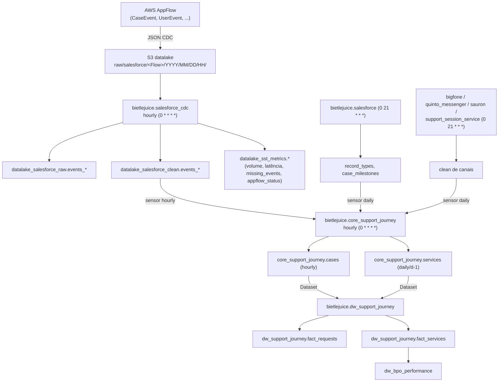

# Runbook — Pipeline Support Journey (SST / DAGs flexíveis)

> **Público-alvo:** plantonistas de Data Engineering.
> **Objetivo:** dar contexto suficiente para diagnosticar e atuar em falhas do
> pipeline **Support Journey** durante o plantão, sem depender do time dono
> (owner `Data SS`).

---

## 1. Contexto e objetivo

O **Support Journey** é o novo modelo de dados de atendimento (Single Station /
SST), construído a partir dos **Change Data Capture (CDC) do Salesforce** e de
fontes de canais de atendimento (Bigfone, Quinto Messenger, Sauron, Support
Session Service).

Ele é implementado por um **framework de DAGs flexíveis** — DAGs Python *fora do
padrão* do DAG Builder (não têm `_declaration.yml`; usam `prod_conf.yml` /
`forno_conf.yml` e código Python custom). Esse framework foi desenhado com dois
pilares:

- **Geração de métricas de observabilidade** do próprio pipeline (volume,
  latência, gaps de CDC, saúde do AppFlow, schema drift, contratos de
  qualidade) — todas em `datalake_sst_metrics`.
- **Validações/guardas** que garantem qualidade e reexecução segura
  (idempotência por partição, contratos de qualidade raw/clean, versionamento
  SCD Type 2 no core model).

Este runbook cobre **onde estão as coisas**, **como o dado flui**, **por que
partições podem "sumir" ou demorar** e **como reprocessar com segurança**.

---

## 2. DAGs do framework e fluxo de dependência

### 2.1 DAGs flexíveis (fora do padrão — Python custom)

| DAG (Airflow ID) | Caminho | Schedule | Papel |
|---|---|---|---|
| `bietlejuice.salesforce_cdc` | `dags/support_and_service/salesforce_cdc/salesforce_cdc.py` | `0 * * * *` (hourly) | Ingestão CDC do Salesforce (raw → clean + métricas) |
| `bietlejuice.core_support_journey` | `dags/core/core_support_journey/core_support_journey.py` | `0 * * * *` (hourly) | Core model (`cases` + `services`) |

Ambas:
- **não** têm `_declaration.yml` (são custom, estão na `skip_list` da validação
  padrão de DAGs e em `dags_out_of_pattern`);
- têm `max_active_runs=1`, `catchup=True`, `retries=3` e **`depends_on_past=True`**;
- alertam falhas via Google Chat (`GchatCallback`, variável
  `WEBHOOK_SALESFORCE_CDC_PROD`).

> ⚠️ **`depends_on_past=True`**: se uma partição horária falha e fica vermelha,
> **todas as horas seguintes ficam bloqueadas** até a falha ser resolvida (ou a
> run marcada como sucesso). Essa é a causa nº 1 de "o pipeline parou".

### 2.2 DAGs a jusante / upstream (DAG Builder padrão)

| DAG | Caminho | Trigger | Papel |
|---|---|---|---|
| `bietlejuice.dw_support_journey` | `dags/support_and_service/dw_support_journey/` | **Datasets** | Facts do novo modelo (`fact_requests`, `fact_services`) |
| `bietlejuice.salesforce` | `dags/support_and_service/salesforce/` | cron `0 21 * * *` | Dimensões auxiliares (`record_types`, `case_milestones`, …) |
| `bietlejuice.bigfone` / `quinto_messenger` / `sauron` / `support_session_service` | `dags/support_and_service/…` | cron `0 21 * * *` | Fontes clean de canais (consumidas por `services`) |
| `bietlejuice.dw_bpo_performance` | `dags/planning_and_performance/dw_bpo_performance/` | Datasets | Datamart que consome `dw_support_journey.fact_services` |

### 2.3 Fluxo ponta a ponta



**Ordem efetiva:**
1. AppFlow grava a partição horária do CDC no S3.
2. `salesforce_cdc` transforma raw → clean e gera métricas SST.
3. `core_support_journey` espera os **sensores** (CDC clean hourly + fontes
   diárias) e carrega `cases` (por hora) e `services` (efetivamente 1×/dia).
4. `dw_support_journey` sobe via **Datasets** quando `cases` **e** `services`
   emitem seus datasets.
5. Datamarts a jusante (ex.: `dw_bpo_performance`).

### 2.4 Onde ficam definidas as dependências entre as DAGs

- **Sensores do core model** (`core_support_journey` esperando upstreams):
  `dags/core/core_support_journey/prod_conf.yml`, chave `dependencies:`. Cada
  entrada vira um `SStExternalTaskSensor` no task group `start_sensors`.
  - `is_daily: true` + `execution_hour` → o sensor aponta para a run diária do
    upstream (via `get_daily_target_logical_date`).
  - `is_daily: false` (caso do `salesforce_cdc`) → mesma `logical_date` da run
    horária atual.
- **Trigger do DW** (`dw_support_journey`): via **Datasets** em
  `dags/dependencies.yaml` (+ exceção manual em
  `dags/dependency_exceptions/manual_modifications.yaml`). Depende dos dois
  datasets do core (`…:load_core_support_journey_cases` e `…_services`).

---

## 3. `salesforce_cdc` + AppFlow → S3

O dado do Salesforce **não** é lido diretamente pela DAG: ele é entregue no S3
pelo **AWS AppFlow** (serviço gerenciado, **fora do repositório**).

- Há **um flow AppFlow por evento/tabela** (`events_*`). O mapeamento é 1:1.
- O AppFlow grava JSON de CDC no layout horário esperado pela DAG:
  ```
  s3://5a-datalake-prod/raw/salesforce/<FlowName>/YYYY/MM/DD/HH/
  # ex.: s3://5a-datalake-prod/raw/salesforce/CaseEvent/2026/07/20/14/
  ```
  O `<FlowName>` é o último segmento de `event_path` no
  `dags/support_and_service/salesforce_cdc/prod_conf.yml` (ex.: `CaseEvent`).
- A DAG `salesforce_cdc` então lê esse S3 e faz `raw` → `quality_contract_raw`
  → `clean` → `quality_contract_clean` → `métricas`, por evento, em 2 pools de
  cluster.

### AppFlow status e recovery automático

- A saúde do connector é registrada em `datalake_sst_metrics.appflow_status`.
- **Qualquer status ≠ `Active` é um incidente operacional** (`Draft`,
  `Suspended`, `Errored`, `Deleted`, `Deprecated`).
- Quando o status ≠ `Active`, o pipeline aciona **recovery automático**: passa a
  buscar os dados **em batch via API do Salesforce**, evitando perda de dados.
  Durante o recovery, picos de volume (`z_score`) são **esperados** e não são um
  incidente separado.

**Primeira verificação em incidente de ingestão:**
```sql
SELECT * FROM datalake_sst_metrics.appflow_status
WHERE status != 'Active'
ORDER BY partition_date DESC, partition_hour DESC
LIMIT 50;
```

---

## 4. Validações de partição (idempotência / skip)

O framework foi desenhado para ser **idempotente por partição**: **não é
possível gravar a mesma partição duas vezes**. Se você reexecutar uma partição
que **já tem dados**, o job faz **skip silencioso** (loga a mensagem e retorna
sem regravar) — não dá erro, mas também **não reprocessa**.

A guarda central é `partition_has_data(...)`
(`packages/bietlejuice-runtime/src/bietlejuice/base/sst/core/observability/sensors.py`):
conta linhas da partição no destino; se já existe, o job para ali.

| Etapa | Chave de skip | Efeito |
|---|---|---|
| `cdc_raw` | `(partition_date, partition_hour)` no raw | Skip se a hora já foi ingerida |
| `cdc_clean` | `(partition_date, partition_hour)` no clean | Skip se a hora já foi limpa |
| core `cases` | `(partition_date, partition_hour)` em `core_support_journey.cases` | Skip se a hora já existe |
| core `services` | **`partition_date - 1 dia`** (sem hora) em `core_support_journey.services` | Skip se o dia anterior já foi carregado → efetiva 1 carga/dia |

> 🔧 **Como reprocessar de fato uma partição** (o "re-run" no Airflow **não
> basta** — vai dar skip): é preciso **apagar/esvaziar a partição** no destino
> Delta antes de reexecutar.
> - `cases` / raw / clean: limpar a partição `(partition_date, partition_hour)`.
> - `services`: limpar `partition_date = d-1` (o dia que a run processa).
>
> A escrita usa `replaceWhere` na partição (overwrite previsível da partição, não
> append cego), então após limpar e reexecutar o resultado é consistente.

---

## 5. Geração de métricas e uso do TARS

### 5.1 Métricas geradas pelo pipeline (`datalake_sst_metrics`)

O `salesforce_cdc` gera métricas de observabilidade por evento e por hora. As
principais tabelas (catalog `delta`, schema `datalake_sst_metrics`):

| Tabela | Para responder… |
|---|---|
| `pipeline_stability` | Anomalias de volume (z-score, média móvel). Filtrar `environment = 'prod'` e um `window_size` (ex.: 24) |
| `events_volume` / `events_type_volume` | Contagem de linhas por tabela/hora (por `event_type`) |
| `pipeline_events_latency` | Latência source→target (`average_delay`, `p90`/`p95`/`p99`, `unit`) — grão por `target_table` |
| `cdc_pipeline_missing_events` | Gaps de CDC (`total_events_missing > 0`) — usa coluna `env` (não `environment`) |
| `table_metadata` | Schema drift (`new_cols`, `new_cols_count`) |
| `contract_quality_checks` | Freshness dos contratos de qualidade (`status`, `last_row_timestamp`) |
| `appflow_status` | Saúde do connector AppFlow (`status != 'Active'`) |

> **Sinal-chave:** a **ausência de linha** para um `(source_table,
> partition_date, partition_hour)` significa que o pipeline **não rodou** naquela
> hora — isso já é sinal de falha, não é NULL. Antes de tratar como incidente,
> confirme em `events_type_volume` se não é um fluxo diário/`RECOVERY`.

### 5.2 Como o TARS ajuda a investigar

O **TARS** (analista de dados sobre o Trino) pode traduzir perguntas de negócio
em SQL sobre `datalake_sst_metrics`, acelerando o diagnóstico no plantão.
Exemplos de perguntas úteis:

- "Quais tabelas do SST estão com volume anômalo (|z-score| > 2) nas últimas
  24h?"
- "Há flows do AppFlow com status diferente de `Active` agora?"
- "Quais `target_table` estão com latência acima da média na partição mais
  recente?"
- "Houve gaps de CDC (`total_events_missing > 0`) nos últimos 7 dias?"

Para acionar o TARS, use o prefixo **`@tars`** em um chat. A documentação de
referência das métricas (schemas, regras e *golden queries*) está em
`docs/llm_context/business_entities/salesforce_sst_pipeline.md`.

> Cuidado ao correlacionar: um pico de `z_score` **durante recovery do AppFlow**
> é esperado — sempre cheque `appflow_status` antes de abrir um incidente de
> qualidade de dado separado.

---

## 6. Core model: job hourly vs daily

A DAG `core_support_journey` tem **um único cron** (`0 * * * *`), mas produz
**duas tabelas com frequências efetivas diferentes**:

| Tabela | Job Spark | Frequência efetiva | Guarda de skip | Timeout |
|---|---|---|---|---|
| `cases` | `…/core_model/support_journey/cases.py` | **Horária** (cada partição CDC) | `(partition_date, partition_hour)` | 2h |
| `services` | `…/core_model/support_journey/services.py` | **Diária** (janela de d-1, 24h) | `partition_date - 1 dia` já populado | 4h |

Como funciona na prática:
- `cases` processa a **hora corrente** do CDC — trabalho leve, roda toda hora.
- `services` monta a janela do **dia anterior inteiro** (`build_ts_filter` com
  `delta_hours=-24` ancorado em `partition_date` 00:00). Como o skip verifica se
  o **dia anterior já existe**, só a **primeira run do dia** (a de **meia-noite**)
  faz o trabalho pesado; as demais horas dão skip (no-op).

> 🕛 **Por que as partições de meia-noite demoram mais:** na virada do dia,
> `services` processa o volume completo de d-1 (por isso o timeout maior, 4h).
> Uma run de `core_support_journey` mais lenta à meia-noite é **esperada** — não
> confunda com travamento. Se estourar as 4h de forma recorrente, aí sim é
> incidente (avaliar volume/cluster).

---

## 7. Onde mora a configuração das tabelas do core model

### 7.1 Specs de tabela (uma por arquivo)

```
dags/core/core_support_journey/tables/
  ├── cases.yml
  └── services.yml
```

A DAG lista **todos os `*.yml`** em `tables/` e cria **uma task Spark por
arquivo** (`list_table_specs_from_dir`). **Adicionar um novo `.yml` aqui cria
automaticamente uma nova tabela do core.**

Cada spec define:
- `target_schema` / `target_table`, `partition_cols`, `merge_on`,
  `when_matched_update_condition` (regra de merge/upsert);
- **`sources:`** — as tabelas clean de origem (é aqui que moram as
  **dependências de dados** da tabela), com `key_cols`, `sort_col`, `cols` e
  `tracked_cols`;
- **`schema:`** — colunas esperadas + `min_columns`/`max_columns`/`strict`
  (validação de schema no job Spark).

Exemplos de fontes:
- `cases.yml` → `datalake_salesforce_clean.events_case`,
  `…record_types`, `…case_milestones`.
- `services.yml` → `datalake_support_session_service_clean.support_session`,
  `datalake_sauron_clean.session`, `datalake_bigfone_clean.event`,
  `datalake_quinto_messenger_clean.*`.

### 7.2 Como o job encontra o YAML em runtime

O YAML é enviado para o bucket de artifacts e lido pelo job via
`--table_config_relative_path` (ex.:
`core/core_support_journey/tables/cases.yml`), resolvido pelo
`config_loader.py`. A config **por ambiente** (bucket, cluster, dependências,
webhook) vem do `ConfigurationService` lendo `prod_conf.yml` / `forno_conf.yml`.

### 7.3 Dois níveis de "dependência"

1. **Dependência de dados (conteúdo):** definida em `sources:` de cada
   `tables/*.yml` — o que o job lê para montar a tabela.
2. **Dependência de orquestração (quando rodar):** definida em
   `prod_conf.yml → dependencies:` (sensores Airflow para os upstreams) e, para o
   DW a jusante, em `dags/dependencies.yaml` (Datasets).

---

## 8. Guia rápido de atuação no plantão

| Sintoma | Onde olhar | Ação |
|---|---|---|
| `salesforce_cdc` / `core_support_journey` parou e horas seguintes não rodam | Airflow (grid) | Efeito de `depends_on_past=True`: resolver a run mais antiga em falha; só então as seguintes destravam |
| Ingestão sem dados numa hora | `datalake_sst_metrics.appflow_status` (`status != 'Active'`), `events_type_volume` | Se AppFlow ≠ `Active`, recovery via API já atua; validar se é gap real ou fluxo diário/RECOVERY |
| Reexecutei a partição e "não fez nada" | Comportamento de skip (§4) | Limpar a partição no Delta destino antes de reexecutar (raw/clean/`cases`: `(date, hour)`; `services`: `d-1`) |
| Run de meia-noite lenta | `services` processa d-1 (§6) | Esperado até 4h; investigar só se estourar timeout recorrentemente |
| `dw_support_journey` não subiu | Datasets em `dependencies.yaml` | Confirmar se **ambos** os datasets (`cases` e `services`) foram emitidos pelo core |
| Latência/volume anômalos | `pipeline_events_latency`, `pipeline_stability` (via `@tars`) | Correlacionar com `appflow_status` antes de abrir incidente de qualidade |

---

## 9. Arquivos-chave (referência rápida)

| Tema | Caminho |
|---|---|
| DAG CDC | `dags/support_and_service/salesforce_cdc/salesforce_cdc.py` |
| Config CDC (prod) | `dags/support_and_service/salesforce_cdc/prod_conf.yml` |
| DAG core model | `dags/core/core_support_journey/core_support_journey.py` |
| Config core (deps/sensores) | `dags/core/core_support_journey/prod_conf.yml` |
| Specs de tabela | `dags/core/core_support_journey/tables/{cases,services}.yml` |
| Jobs Spark core | `packages/bietlejuice-runtime/src/bietlejuice/base/sst/pipelines/core_model/support_journey/{cases,services}.py` |
| Jobs Spark CDC | `packages/bietlejuice-runtime/src/bietlejuice/base/sst/pipelines/salesforce/{cdc_raw,cdc_clean}.py` |
| Guarda de partição (`partition_has_data`) | `packages/bietlejuice-runtime/src/bietlejuice/base/sst/core/observability/sensors.py` |
| Deps do DW (Datasets) | `dags/dependencies.yaml` (+ `dags/dependency_exceptions/manual_modifications.yaml`) |
| Doc de métricas SST (TARS) | `docs/llm_context/business_entities/salesforce_sst_pipeline.md` |
