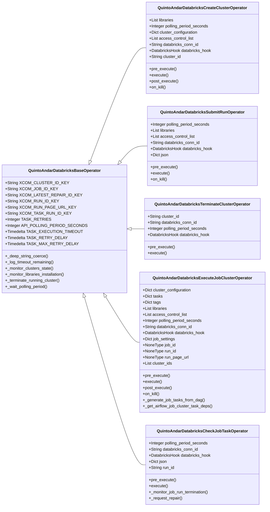

# Databricks Plugin

A package of Airflow plugins with hooks and operators that interact with Databricks APIs to handle the execution of Spark jobs.

## User Guide

### Requirements and Installation

| Requirements | Version |
|-|-|
| [](https://pypi.org/project/apache-airflow/) | 1.10.x |
| [](https://pypi.org/project/databricks-cli/) | 0.17.6 |

```bash
git clone --depth 1 https://github.com/quintoandar/airflow-plugins.git {AIRFLOW__CORE__PLUGINS_FOLDER}
```

---

### Main usage

The following sections aim to explain in detail the works of different plugin components that interact with Databricks.

In order to set the definitions straight, some important differences between platforms must be distinguished regarding naming:

||Databricks|Airflow|
|-:|:-|:-|
jobs|A way to run a data pipeline in a Databricks workspace, being single task or a group of tasks (multi-task)|Internal executions of the Airflow scheduler service
tasks|most granular component of a Databricks job, which executes a file operation inside the cluster|representation of an instantiated operator, is the basic unit of execution arranged as vertices in a DAG with dependencies set between them.

---

### Databricks hook

Service class to interact with Databricks API endpoints

<span style="color:yellow"><strong>:construction: UNDER CONSTRUCTION :construction:</strong></span>

---

### All-Purpose (interactive) cluster operators

<span style="color:yellow"><strong>:construction: UNDER CONSTRUCTION :construction:</strong></span>

### `QuintoAndarCreateClusterOperator`

<span style="color:yellow"><strong>:construction: UNDER CONSTRUCTION :construction:</strong></span>

### `QuintoAndarSubmitRunOperator`

<span style="color:yellow"><strong>:construction: UNDER CONSTRUCTION :construction:</strong></span>

### `QuintoAndarTerminateClusterOperator`

<span style="color:yellow"><strong>:construction: UNDER CONSTRUCTION :construction:</strong></span>

---

### Job cluster operators

Job Cluster, sometimes referenced in Databricks as automated clusters for workflow jobs, is the Databricks workload format of clusters where a cluster is launched in exclusive dedication to execute the tasks of a statically created Databricks job. The expected use of job clusters are mainly to run fast and robust automated jobs in a more productive scenario, while the all-purpose (interactive) clusters are meant to support collaborative data analysis using interactive notebooks, in a more experimental development scenario.

When a job is started - either by manual or scheduled trigger - Databricks job scheduler creates an automated cluster for that job, and terminates the cluster when the job is complete. This cluster cannot be restarted to be set as an available computational resource for other jobs. Instead, the job that was executed inside it is what has to be restarted, triggering the creation of a new exclusive cluster to execute it.

In QuintoAndar's Databricks plugin we have created two main abstractions to handle operations in the Databricks Job Cluster API (a.k.a. "Databricks Jobs API 2.1") that are briefly explained below, and detailed in the next sections.

- `QuintoAndarExecuteJobClusterOperator`: main operator to create, overwrite and execute jobs
- `QuintoAndarCheckJobTaskOperator`: operator to monitor task status and handle task errors

> __Note__: both classes are mutually dependent: a DAG's ExecuteJobCluster task relies on the existence of at least one CheckJobTask task on the same DAG, and vice versa.

### `QuintoAndarExecuteJobClusterOperator`

An Airflow operator that creates (or overwrites) and executes a Databricks job, based on a list of Spark job tasks generated automatically inside it from its Airflow DAG. In order to do so, the operator executes the following main steps in order:

  1. Generates a payload with the parameters and dependency graph of the job tasks, according to the same tasks parameters and dependencies of the Airflow DAG;
  2. Creates a new Databricks job with the generated payload, or overwrites an existing one;
  3. Runs the created/overwritten job;
  4. From the newly job run, gets all the cluster IDs from the tasks that have no dependencies;
  5. Monitors these clusters until they are are up and running or fail during their startup;
  6. Monitors the libraries installation in these clusters until they are all installed or at least one fails.

By default, the usage of the operator expects __only one single Databricks job being created inside an Airflow DAGRun__, with the following job naming pattern:

```python
{dag_id}_{run_id}
```

Due to this definition, it's required that a __DAG contains only one task that is an instance of the ExecuteJobCluster operator__, so the DAG does not create two or more jobs inside itself, which could cause unexpected behaviours mainly due to XCom variables sharing and job payload creation.

Example of usage of the ExcuteJobCluster operator:

```python
from databricks_plugin import QuintoAndarDatabricksExecuteJobClusterOperator

dag = DAG(
    #... DAG configs
)
execute_job_cluster_task = QuintoAndarDatabricksExecuteJobClusterOperator(
        task_id="execute_job_cluster_task_id",
        dag=dag,
        access_control_list=QuintoAndarDatabricksBaseOperator.CLUSTER_DEFAULT_PERMISSIONS,
        cluster_configuration = {
            #... Cluster configuration
        }
        libraries=None,
    )
```

#### Creating an ExecuteJobCluster Airflow task

To create an object of the ExecuteJobCluster operator (therefore an Airflow task of that type), __you must first assure that Databricks job tasks will also be created in the DAG, using the `QuintoAndarCheckJobTaskOperator` class (referred in this section simply as "CheckJobTask" tasks)__. During DAG run, arguments provided to the ExecuteJobCluster operator may be used as default values for all job's tasks, or may be overwritten by specific CheckJobTask operator arguments, according to the behaviour of each ExecuteJobCluster's argument described below:

- __`cluster_configuration`__: a required argument for the ExecuteJobCluster task, it attaches the provided cluster configuration into a list of shared clusters that are made available to be used by tasks of the created job. These clusters are only used when tasks do not have specific settings for their own clusters, as cluster configurations may also be provided as CheckJobTask's `new_cluster` field inside the `json` argument, attaching the specific cluster configuration to its task. These task's new clusters have precedence over the shared job clusters but won't be created until its task starts in the job workflow.

    > __Note__: job clusters do not expect auto-termination settings, as they are terminated as soon as the job ends. So the `autotermination_minutes` cluster parameter is automatically removed from the configuration when provided.

    > __Warning__: libraries cannot be declared in a shared job cluster. You must declare libraries with the ExecuteJobCluster's `libraries` argument.

    Example using ExecuteJobCluster operator's `cluster_configuration` argument:

    ```python
    execute_job_cluster_task = QuintoAndarDatabricksExecuteJobClusterOperator(
        task_id="execute_job_cluster_task_id",
        dag=dag,
        cluster_configuration = {
            "cluster_name": "CLUSTER_NAME",
            "autoscale": {"min_workers": 3, "max_workers": 4},
            "spark_version": "10.4.x-scala2.12",
            "aws_attributes": {
                "first_on_demand": 1,
                "availability": "SPOT_WITH_FALLBACK",
                "zone_id": "ZONE_ID",
                "instance_profile_arn": "INSTANCE_PROFILE_ARN",
                "spot_bid_price_percent": 100,
                "ebs_volume_count": 0,
            },
            "node_type_id": "i3.xlarge",
            "driver_node_type_id": "i3.xlarge",
            "spark_env_vars": {"PYSPARK_PYTHON": "/databricks/python3/bin/python3"},
            "autotermination_minutes": 10, #this parameter is automatically removed
        }
    )
    ```

    Example using CheckJobTask's `new_cluster` argument:

    ```python
    check_job_task = QuintoAndarDatabricksCheckJobTaskOperator(
        task_id="check_job_task_id",
        dag=dag,
        json={
            "spark_python_task": {
                "python_file": "path/to/my/pyspark_job.py"
            },
            "new_cluster": {
                "cluster_name": "CLUSTER_NAME",
                "autoscale": {"min_workers": 3, "max_workers": 4},
                "spark_version": "10.4.x-scala2.12",
                "aws_attributes": {
                    "first_on_demand": 1,
                    "availability": "SPOT_WITH_FALLBACK",
                    "zone_id": "ZONE_ID",
                    "instance_profile_arn": "INSTANCE_PROFILE_ARN",
                    "spot_bid_price_percent": 100,
                    "ebs_volume_count": 0,
                },
                "node_type_id": "i3.xlarge",
                "driver_node_type_id": "i3.xlarge",
                "spark_env_vars": {"PYSPARK_PYTHON": "/databricks/python3/bin/python3"},
                "autotermination_minutes": 10, #this parameter is automatically removed
            }
        }
    )
    ```

- __`libraries`__: this ExecuteJobCluster task's argument is optional and is used to set the provided list of libraries as default for all job tasks. When any of the CheckJobTask tasks contain a `libraries` field inside its `json` argument, it will define libraries to be used specifically on that task's cluster, being merged to the default libraries list into a new deduplicated list. The resulting list of "default" + "specific" libraries is attached to that task and installed when its cluster starts.

    > __Note__: when all tasks with specific libraries use a single shared cluster, all libraries will be installed at the job start in the same cluster.

- __`access_control_list`__: defines the job's access permissions for the web UI of the job's workflows and clusters and for interactions using the Jobs API. __All shared clusters and exclusive clusters of all tasks are subject to the same ACL defined for the job.__

    > __Note__: for more information regarding what abilities each permission comprehends, access the [Jobs access control docs](https://docs.databricks.com/security/auth-authz/access-control/jobs-acl.html).

#### Job tasks payload generation

The ExecuteJobCluster operator creates a job tasks list to be used as the `tasks` key of the [job creation payload JSON](https://docs.databricks.com/api/workspace/jobs/create). For that, it uses a recursive Depth-first search (DFS) method to search its Airflow DAG for all Airflow tasks that are instances of the  `QuintoAndarDatabricksCheckJobTaskOperator` operator class. Along the search, it also stores the tasks that each found task depends on, and that are also instances of the same operator, creating a dependency tree analogous to the Airflow DAG's tasks dependency.

Example of a DAG in Airflow:

<p align="left">
    <center>
    
    </center>
</p>

...and in its generated Databricks job:
<p align="left">
    <center>
    
    </center>
</p>

To compose the payload of each task, the method retrieves the `json` argument of the `QuintoAndarDatabricksCheckJobTaskOperator` tasks instances found, and the following keys are obtained from it and added into the payload according to the their precedence rule:

- `libraries`: gets the CheckJobTask's `libraries` field, if it exists inside the task's `json` argument, creating a list of distinct deduplicated libraries by merging the retrieved libraries to the default ones provided in the `libraries` argument of the ExecuteJobCluster task.
- `job_cluster_key`: this task parameter is only filled if the `json` argument of the CheckJobTask's task does not contain a `new_cluster` key, filling it with the `cluster_name` of the shared job cluster provided in the `cluster_configuration` argument of the ExecuteJobCluster task. Otherwise, this parameter is left empty and the `new_cluster` parameter of the `json` argument is used as the cluster definition only for this task.
- `json`: gets the remaining Spark task execution parameters from the CheckJobTask's task instance.

Example:

These Airflow tasks:

```python
execute_job_cluster = QuintoAndarDatabricksExecuteJobClusterOperator(
    task_id = "execute-job-cluster",
    libraries = [
        {
            "whl": "s3://artifacts_bucket/default_lib.whl"
        }
    ],
    cluster_configuration={
        cluster_name: "shared_job_cluster_example__YYYY-MM-DDTSSSSS-LLLLLL_LLLL"
        #... other cluster configs
    }
)

load_task_0 = QuintoAndarDatabricksCheckJobTaskOperator(
    task_id = "load-dw-job-cluster-example-test-table-0",
    libraries = [
        {
            "whl": "s3://artifacts_bucket/load_lib.whl"
        }
    ],
    json = {
        "spark_python_task": {
            "python_file": "s3://spark_jobs_bucket/prefix/load_table_spark_job.py",
            "parameters": [
                "dev_environment",
                "job_cluster_example",
                "test_table_0"
            ]
        }
        # No `new_cluster` key
    }
)

sync_task_0 = QuintoAndarDatabricksCheckJobTaskOperator(
    task_id = "sync-hive-metastore-structure-dw-job-cluster-example-test-table-0",
    libraries = [
        {
            "whl": "s3://artifacts_bucket/sync_lib.whl"
        }
    ],
    json = {
        "spark_python_task": {
            "python_file": "s3://spark_jobs_bucket/prefix/sync_table_spark_job.py",
            "parameters": [
                "dev_environment",
                "job_cluster_example",
                "test_table_0"
            ]
        },
        "new_cluster": {
            "cluster_name": "sync_task_exclusive_job_cluster__YYYY-MM-DDTSSSSS-LLLLLL_LLLL",
            #... other cluster configs
        }
    }
)

execute_job_cluster >> load_task_0 >> sync_task_0
```

...will be parsed as the following job creation payload:

```json
{
    "name": "shared_job_cluster_example__YYYY-MM-DDTSSSSS-LLLLLL_LLLL",
    "tasks": [
        {
            "task_key": "load-dw-job-cluster-example-test-table-0",
            "spark_python_task": {
                "python_file": "s3://spark_jobs_bucket/prefix/load_table_spark_job.py",
                "parameters": [
                    "dev_environment",
                    "job_cluster_example",
                    "test_table_0"
                ]
            },
            "libraries": [
                {
                    "whl": "s3://artifacts_bucket/default_lib.whl"
                },
                {
                    "whl": "s3://artifacts_bucket/load_lib.whl"
                },
            ],
            "job_cluster_key": "shared_job_cluster_example__YYYY-MM-DDTSSSSS-LLLLLL_LLLL",
        },
        {
            "task_key": "sync-hive-metastore-structure-dw-job-cluster-example-test-table-0",
            "depends_on": [
                {
                    "task_key": "load-dw-job-cluster-example-test-table-0"
                }
            ],
            "spark_python_task": {
                "python_file": "s3://spark_jobs_bucket/prefix/sync_table_spark_job.py",
                "parameters": [
                    "datalake_bucket",
                    "job_cluster_example",
                    "test_table_1"
                ]
            },
            "libraries": [
                {
                    "whl": "s3://artifacts_bucket/default_lib.whl"
                },
                {
                    "whl": "s3://artifacts_bucket/sync_lib.whl"
                }
            ],
            "new_cluster": {
                "cluster_name": "sync_task_exclusive_job_cluster__YYYY-MM-DDTSSSSS-LLLLLL_LLLL",
                //... Configs provided in `new_cluster` arg
            }
        },
    ],
    "job_clusters": [
        {
            "job_cluster_key": "shared_job_cluster_example__YYYY-MM-DDTSSSSS-LLLLLL_LLLL",
            "new_cluster": {
                //... Configs provided in `cluster_configuration` arg
            }
        }
    ]
}
```

#### Job creation and overwriting

A Databricks job is created inside the Databricks Workspace when a DAGRun of a DAG that contains one ExecuteJobCluster is executed for the first time. When a DAGRun previously executed is manually cleared, the ExecuteJobCluster task overwrites the existing job with the payload of its new execution (which may be the same as the previous one). This behaviour intends to grab differences of a DAG and apply them at the existing Databricks jobs, such as recently added or removed Airflow tasks, changes in dependencies or task names.

> __Note__: Once the job is created, its Run page URL is made available both at the ExecuteJobCluster's task logs and at an XCom variable named `run_page_url`.

#### Jobs API limitations

Jobs can only be created in a Data Science & Engineering workspace or a Machine Learning workspace. Besides that, there are a number of rate and resource limits from Databricks Jobs that one must pay close attention to when deploying new jobs, and they are described in the following links:

- [Databricks resources limits docs](https://docs.databricks.com/resources/limits.html)
- [API rate limits docs](https://docs.databricks.com/resources/limits.html#api-rate-limits)
- [How to increase the saved jobs limit in a workspace](https://docs.databricks.com/administration-guide/workspace/settings/enable-increased-jobs-limit.html)

### `QuintoAndarCheckJobTaskOperator`

<span style="color:yellow"><strong>:construction: UNDER CONSTRUCTION :construction:</strong></span>

---

### Troubleshooting

#### Job cluster task's error handling in Airflow UI

When a Databricks job is created successfully and has been started by a ExecuteJobCluster task, it gets monitored by the succeeding tasks, using their CheckJobTask operator's logic. During a task failure, the CheckJobTask operator's error handling steps try to recover the execution by creating, on each Airflow task retry, a repair run that reruns all failed tasks.

When the failure persists in all repair runs, an user intervention will be required to resolve the task's error and to restart the job.

But the deployment of Job cluster operators changed the default steps for maintenance (a.k.a. "runbook") of DAGs in Airflow UI. So, before an user engages on restarting a Job Cluster DAG, __there are important warnings regarding major maintenance changes on the Airflow UI, when using Job Cluster operators__:

&nbsp;&nbsp;&nbsp;__🟡 The automated retries or the "Clear" functionality on a failed CheckJobTask task will make all running tasks of the DAG stop__

&nbsp;&nbsp;&nbsp;Automated Airflow retries (for tasks in the "UP_FO_RETRY" state) or manually performing a "Clear" on a failed task will both trigger the same behaviour: the whole job will be cancelled, which causes not only all running tasks to stop but also terminates the cluster. Then, the operator will automatically create a new repair, which deploys a new cluster, in which all failed, cancelled and skipped tasks will run.

&nbsp;&nbsp;&nbsp;__🟢 "Clear" button functionality is redundant for successful CheckJobTask tasks__

&nbsp;&nbsp;&nbsp;Performing a "Clear" on a CheckJobTask's task that is already successful will not trigger a new execution: the operator works as a status checker, so it will only reflect the current Databricks task's successful status on the Airflow task, without running the Databricks task again.

&nbsp;&nbsp;&nbsp;__🔴 "Clear" button functionality will fail on a CheckJobTask task appended into an existing DAGRun__

&nbsp;&nbsp;&nbsp;As a task that has been recently appended has not been included in the creation of the Databricks job payload during the first execution of the ExecuteJobCluster task, performing a "Clear" on the new task will raise a `DatabricksNotFoundError` exception, as the task will try to retrieve the status of its latest run but will not find it in the job.

&nbsp;&nbsp;&nbsp;__🟡 "Fail" button functionality is redundant on a running CheckJobTask task__

&nbsp;&nbsp;&nbsp;Forcing the status of a running CheckJobTask's task to "Fail" will have no effect either in the Databricks task itself or its job, solely interrupting the status check and force-failing the Airflow's task, but both the Databricks task and its whole job (therefore, all parallel and downstream tasks) will continue running on Databricks until their completion or failure.

#### Handling raised exceptions

| Exception Type | Message | Cause | Handling |
|-|-|-|-|
|`AirflowNotFoundException`| No cluster ID found in DAG XCom '{xcom_cluster_id_key}' | The TerminateCluster operator was executed, but either no cluster was previously created inside its DAG or the `cluster_id` XCom was removed or not created.| Assure that the CreateCluster operator exists in the DAG and is being executed before the TerminateCluster, thus the cluster is created before its termination request. Furthermore, assure that the `cluster_id` XCom variable is being created and is not empty.|
|`DatabricksNotFoundError`| Cluster ID was not found to submit the run '{run_name}'. | The SubmitRun operator was executed, but either no cluster was previously created inside its DAG or the `cluster_id` XCom was removed or not created. This scenario may happen only when the SubmitRun operator is executed without a new cluster in its payload. | Assure that the CreateCluster operator exists in the DAG and is being executed before the SubmitRun, thus the cluster is created before the submit request. Furthermore, assure that the `cluster_id` XCom variable is being created and is not empty.
|`DatabricksNotFoundError`| Task '{task_key}' was not found for job run '{run_id}'. | The job run ID does not have a task named after the provided task key. May be due to: 1. the job did not have this task when it was created, thus the run ID also does not include it. 2. the run ID did not include this task to be ran, although the job itself has it in its definition; | Consider for 1: an Airflow task may have been recently added or had its name updated, but the Databricks job was not reset/recreated. Consider rerunning the `ExecuteJobCluster` task to recreate the job including the new task in its definition; for 2: review the method call, as it may be receiving a wrong value for either the run ID or the task key. |
|`DatabricksTerminalStateError`| {entity} failed with terminal state: {state}. Message: {message} | The entity execution returned a failure state due to the provided message. This error may occur for clusters or job runs. | Access the page URL provided in `{entity}_page_url` XCom of the task (also accessible in the Airflow task log) to debug the Databricks logs and find the errors. |
|`DatabricksTerminalStateError`| {entity} failed with terminal status: {status}. Message: {message} | The entity execution returned a failure status due to the provided message. This error may occur for a cluster library installation. | Check the logs for the error in the library installation. You may also access the page URL provided in `{cluster|run}_page_url` XCom of the task to debug the Databricks cluster libraries and find the errors. |
|`DatabricksUnexpectedStateError`| Unexpected cluster state: {state}. If the state has been introduced recently, please check the Databricks user guide for troubleshooting information. | The returned cluster state is not listed as valid inside the `ClusterState` class. Mostly due to a new unmapped state introduced by Databricks. | Consider including the new state inside the validation list, if it's the case. |
|`DatabricksUnexpectedStateError`| Unexpected library status {status} with message: {message}. If the status has been introduced recently, please check the Databricks user guide for troubleshooting information. | The returned library status is not listed as valid inside the `LibraryStatus` class. Mostly due to a new unmapped status introduced by Databricks. | Consider including the new status inside the validation list, if it's the case. |
|`DatabricksUnexpectedStateError`| Unexpected life cycle state: {life_cycle_state}. If the state has been introduced recently, please check the Databricks user guide for troubleshooting information. | The returned life cycle state is not listed as valid inside the `RunState` class. Mostly due to a new unmapped state introduced by Databricks. | Consider including the new state inside the validation list, if it's the case. |
|`HTTPError`| 400 INVALID_PARAMETER_VALUE | A maximum of 100 tasks is allowed. | This is a limitation of the Databricks Jobs API when creating a job, requiring a maximum limit of 100 tasks in the job. If none of the tasks are disposable, consider separating the job (DAG) into two or more jobs (DAGs), balancing the tasks between them.|
|`HTTPError`| 400 QUOTA_EXCEEDED | The quota for the number of jobs has been reached. The current quota is 10000. This quota is only applied to jobs created through the UI or through the /jobs/create endpoint, which are displayed in the Jobs UI. If this limit is hit, it is very likely some user programmatically created many jobs that only need to run once.| Delete those jobs either using the UI or the /jobs/delete endpoint. Also, you may consider migrating to one-time job runs instead, using the /jobs/runs/submit endpoint. There is no quota on the number of one-time job runs you can create. |
|`HTTPError`| 429 Too Many Requests | A requested run could not start immediately, probably because the job API limitation of 1000 concurrent job runs per workspace have already been reached.| Wait until some jobs get concluded or terminate jobs manually. |
|`TypeError`| Type {variable_type} used for parameter {json_path} is not a number or a string | A provided JSON parameter contains elements that cannot be coerced to a string | Check the content of the JSON parameter being provided to the operator and try replacing elements that may not be interables, integers or numbers, which can be represented as strings. |
|`ValueError`| API entity type must be one of the available API entities: [{api_entity_types}] | The provided API entity type is not valid to be used in the current endpoint. | Check the endpoint's documentation or include a new API entity type inside the validation list, if it's the case. |
|`ValueError`| API version must be one of the available versions: [{api_versions}] | The provided API version is not valid to be used inside the hook. Mostly due to a typo when instantiating the `DatabricksHook`. | Check the API's available versions. |
|`ValueError`| Jobs API version must be one of the available versions: [{api_versions}] | The provided Jobs API version is not valid to be used inside the hook. Mostly due to a typo when instantiating the `DatabricksHook`. | Check the API's available versions for Jobs endpoints. |

---

## Developer's Guide



<span style="color:yellow"><strong>:construction: UNDER CONSTRUCTION :construction:</strong></span>

### Contributing

All contributions are welcome! Feel free to open Pull Requests, following best practices __guidelines__ and the template
described in [PULL_REQUEST_TEMPLATE.md](https://github.com/quintoandar/airflow-plugins/blob/master/.github/PULL_REQUEST_TEMPLATE.md)

Made with :heart: by the __Data Engineering__ team from [QuintoAndar](https://github.com/quintoandar/)
